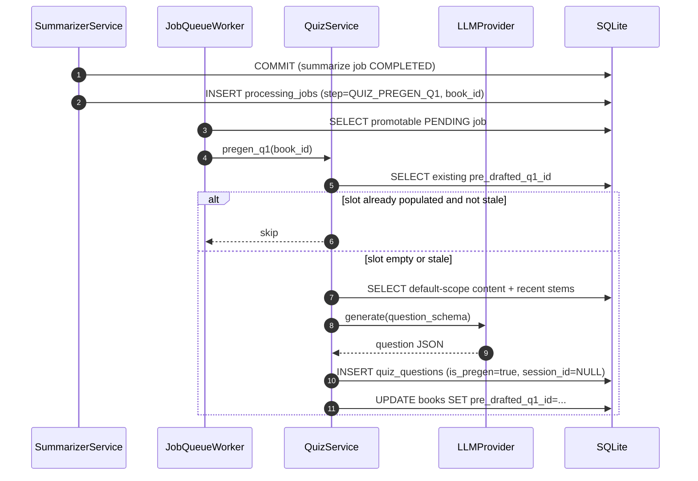
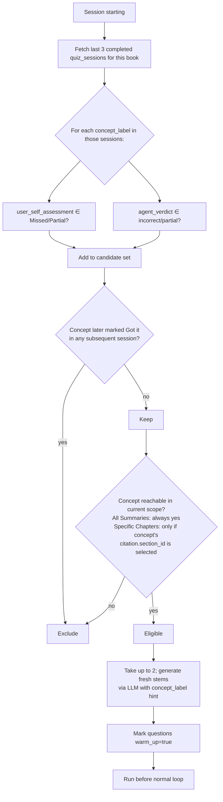

# AI Comprehension Quiz — Spec

---

## 1. Problem Statement {#problem-statement}

Book Companion produces high-quality summaries but offers no active-recall loop, leaving the library a graveyard of consumed-but-not-internalized content. This spec describes a `Quiz` tab on `BookOverviewView` that generates LLM-powered comprehension questions grounded in book summaries or full chapter content, gives qualitative feedback on answers, deduplicates against history, and surfaces compounding learning via per-session and lifetime self-assessment tallies. Primary success metric: ≥1 quiz session started per actively-read book within a week of finishing it, with non-zero `Got it` lifetime trend across multiple sessions on the same book.

---

## 2. Goals {#goals}

| # | Goal | Success Metric |
|---|------|----------------|
| G1 | User can start a quiz from any book overview | Quiz tab reachable in 1 click from `/books/:id`; session creation returns 201 in <200ms |
| G2 | Question shape varies (MCQ + open-ended + spot-the-error) and Bloom level varies | Spot-check ≥30% of generated questions above "Remember"; spot-the-error 5–25% share of agent-picked shapes |
| G3 | No duplicate question stems within a book | Stem-equality check across non-stale `quiz_questions` for any book = 0 dupes |
| G4 | Open-ended feedback is structured (correct / missing / actual) | Schema enforces 3 fields; spot-check feedback names a concept-by-name |
| G5 | Visible progress signal per session and lifetime | Session tally + lifetime tally rendered in Quiz tab header |
| G6 | Two scopes reachable in ≤2 clicks | Scope picker shows `All Summaries` and `Specific Chapters` with budget bar |
| G7 | Optional theme biases questions | Theme passed to prompt; ≥70% questions reference theme on themed sessions |
| G8 | Missed/Partial concepts revisited next session via warm-up | D29 lookback yields ≥70% qualifying-concept coverage on next session |
| G9 | First question on default-scope first session is instant | Pre-drafted Q1 served from `Book.pre_drafted_q1`; no spinner |
| G10 | Sessions exportable as Markdown | `bookcompanion export quiz-session <id>` + UI export button produce self-contained `.md` |

---

## 3. Non-Goals {#non-goals}

- **Spaced-repetition scheduler (Anki/FSRS)** — D29 warm-up is a session-bounded N=3 lookback, not a retention curve. Defer until usage signal.
- **Numeric scoring of open-ended answers** — qualitative-only per D4; LLM-judge bias.
- **Socratic / coach mode** — D8.
- **Quiz on Reader sidebar** — anchored to `BookOverviewView` only (D1).
- **Multi-user / sharing / leaderboards** — personal tool.
- **Annotation-seeded generation** — cut in Loop 4 (D33).
- **Streaming question text token-by-token** — `LLMProvider` waits for full subprocess output. Mitigated with loading copy (D16/D28), not architecture change.
- **Embedding-similarity dedup** — D6 prompt-list only; defer to v1.x if drift emerges.

---

## 4. Decision Log {#decision-log}

D1–D41 from `01_requirements.md` are carried forward as foundational; this section captures **spec-level** decisions that resolve the requirements doc's open questions and translate D-decisions into implementation shape.

| # | Decision | Options Considered | Rationale |
|---|----------|--------------------|-----------|
| S1 | Specific-Chapters token-budget cap = **60,000 tokens** (the budget bar reads 100% at this point) | (a) 40k conservative, (b) 60k balanced, (c) 100k aggressive | Leaves ~140k of the ~200k Claude/Codex CLI window for system prompt + dedup list (~3k) + thread history of feedback (~5–10k) + structured-output schema + LLM response. Typical chapter is 5–25k tokens, so 60k allows 3–8 chapters in a typical pick. Configurable via `settings.quiz.specific_chapters_token_budget`. |
| S2 | Verbatim-stem dedup cap **N = 50** stems (D13) | (a) 30 stems, (b) 50 stems, (c) 100 stems | Matches the figure already cited in D13. ~50 stems × ~50 tokens ≈ 2.5k tokens — small enough to coexist with full-chapter scope at 60k, large enough that the themed-summary fallback only kicks in for heavily-quizzed books. Configurable via `settings.quiz.dedup_verbatim_cap`. |
| S3 | Pre-drafted Q1 slot lifecycle: **consumed-on-serve; regen scheduled at next summarize-complete OR is_stale on re-import** (closes Q7) | (a) consumed + lazy on next tab visit, (b) consumed + regen-on-summarize-complete, (c) persistent until re-import | Matches D27's "no top-up logic, no queue maintainer" intent honestly. Re-import flips `is_stale` (mirrors D39 for `quiz_questions`). Slot stored on `Book.pre_drafted_q1_id` FK to a dedicated `quiz_questions` row marked `is_pregen=True`. |
| S4 | Token counting uses **`tiktoken` with `cl100k_base`** as a portable approximation for both Claude and Codex CLIs | (a) provider-specific tokenizers, (b) char-count heuristic (chars/4), (c) tiktoken cl100k | tiktoken is already pip-installable, deterministic, and within ±10% of Claude/Codex actual tokenization for prose. Char-count heuristic is too lossy for budget-bar precision. Add `tiktoken` to `pyproject.toml`. |
| S5 | Question shape selection: **agent picks per turn**, but the prompt receives a recent-shape histogram (last 5 turns) and a target distribution `{mcq: 0.4, open: 0.45, spot_error: 0.15}` | (a) random per turn, (b) round-robin, (c) agent-picks with histogram nudge | D3 says agent picks; pure agent-picks tends to lock onto MCQ. A nudge keeps spot-the-error in the 5–25% band (G2) and open-ended ≥30%. |
| S6 | LLM JSON schema for question generation is **strict** — `additionalProperties: false`, all fields required including `concept_label`, `citation`, `shape`. On schema violation, retry once with the validator error pasted into the prompt; on second failure, surface generation-failed toast | (a) lax schema + post-parse validation, (b) strict schema + 1 retry, (c) strict schema + multiple retries | Strict schema lets `LLMProvider.generate(json_schema=...)` enforce shape at the CLI layer. One retry handles transient drift; second failure is a real signal that should reach the user (not a hidden infinite loop). |
| S7 | D38 themed-summary rollup is **gated by stem-count threshold** — only computed when `count(non-stale verbatim stems) > N` (i.e., the verbatim cap from S2). Below threshold, the rollup field stays empty | (a) always compute, (b) threshold-gated, (c) only when user opens D25 panel | Computing a themes-rollup on a book with <50 stems is wasted LLM cost — the verbatim list IS the dedup signal at that scale. Threshold-gating defers the cost until it actually matters. |
| S8 | `concept_label` (D40) is an **agent-emitted free-text tag**, lower-cased and trimmed by the service, with no enum constraint | (a) constrained vocabulary (e.g., a controlled list), (b) free-text agent-emitted, (c) free-text + post-hoc clustering | A controlled list across all books is impossible. Free-text is the cheapest deterministic identity key. Light normalization prevents trivial mismatches ("Loss Aversion" vs "loss aversion"). |
| S9 | `agent_verdict` (D41) is captured but **never displayed in the UI**; only consumed by D29 warm-up source-of-truth and analytics | (a) display verdict next to user click, (b) capture but hide, (c) hide entirely | Displaying both verdicts invites tally-confusion ("the agent said Partial but I clicked Got it"). D12 makes user click authoritative; verdict stays a backend-only signal. |
| S10 | Quiz-tab is gated by `settings.quiz.enabled = True` + provider available, and degrades gracefully when either is false | (a) hard-disable, (b) settings flag + graceful banner | Matches the pattern from CLAUDE.md gotcha #6 (LLM provider may be `None`). The flag also gives a clean kill-switch if the feature regresses. |
| S11 | New Alembic revision: a **single migration** introducing all 4 new tables/columns (`quiz_sessions`, `quiz_questions`, `quiz_dedup_state`, `Book.pre_drafted_q1_id`) | (a) one migration per table, (b) single migration | Tables are introduced together; users migrate once on upgrade. Separating adds churn without value. |

---

## 5. User Personas & Journeys {#user-personas-and-journeys}

The single user persona, primary journey, alternate journeys, and error journeys are documented exhaustively in `01_requirements.md` §"User Journeys" and §"Error Journeys" — not duplicated here. The spec implements those flows verbatim.

### 5.1 End-to-end flow (architectural view) {#end-to-end-flow-architectural-view}

```mermaid
sequenceDiagram
  autonumber
  actor U as User
  participant FE as Quiz tab (Vue)
  participant API as FastAPI router
  participant Q as QuizService
  participant LLM as LLMProvider (Claude/Codex CLI)
  participant DB as SQLite

  U->>FE: Click Start Quiz (default scope, no theme)
  FE->>API: POST /api/v1/books/{id}/quiz-sessions {scope, theme}
  API->>Q: start_session(...)
  Q->>DB: SELECT Book.pre_drafted_q1_id WHERE is_stale=0
  alt Q1 slot present + default scope + no theme
    Q->>DB: SELECT * FROM quiz_questions WHERE id = pre_drafted_q1_id
    Q->>DB: UPDATE books SET pre_drafted_q1_id = NULL
    Q->>DB: INSERT quiz_session; INSERT-LINK question to session
    Q-->>API: {session, first_question, queue_hit: true}
  else Cold-start path
    Q->>DB: SELECT recent N stems + themed_summary + scope content
    Q->>LLM: generate(prompt, json_schema=question_schema)
    LLM-->>Q: structured question JSON
    Q->>DB: INSERT quiz_session + quiz_question
    Q-->>API: {session, first_question, queue_hit: false}
  end
  API-->>FE: 201 + session payload
  FE->>U: Render question (or D16 loading state if cold)

  U->>FE: Submit answer
  FE->>API: POST /api/v1/quiz-sessions/{sid}/questions/{qid}/answer
  API->>Q: grade_answer(...)
  Q->>LLM: generate(grading_prompt, json_schema=feedback_schema)
  LLM-->>Q: {correct, missing, actual, agent_verdict}
  Q->>DB: UPDATE quiz_question SET user_answer, feedback_json, agent_verdict
  Q-->>API: feedback
  API-->>FE: 200 + feedback
  FE->>U: Render feedback + self-assessment buttons (D28 loading state in flight)

  U->>FE: Click Got it / Partial / Missed
  FE->>API: PATCH /api/v1/quiz-sessions/{sid}/questions/{qid} {self_assessment}
  API->>Q: record_assessment(...)
  Q->>DB: UPDATE quiz_question SET self_assessment
  Q-->>API: 200

  U->>FE: Click Stop
  FE->>API: POST /api/v1/quiz-sessions/{sid}/stop
  API->>Q: stop_session(sid)
  Q->>DB: UPDATE quiz_session SET ended_at, status='completed'
  Q->>DB: INSERT processing_jobs (step=QUIZ_ROLLUP)
  Q-->>API: 200
  Note over Q,DB: Background worker picks up rollup job; calls LLM<br/>to summarize themes covered; writes quiz_dedup_state
```

### 5.2 Pre-drafted Q1 background job {#pre-drafted-q1-background-job}



### 5.3 D29 Warm-up selection {#d29-warm-up-selection}



---

## 6. System Design {#system-design}

### 6.1 Architecture Overview {#architecture-overview}

```
Vue 3 SPA — frontend/                                    Typer CLI
  │  Quiz tab (BookOverviewView)                            │  bookcompanion export quiz-session
  ▼                                                          ▼
FastAPI — backend/app/api/routes/quiz.py        cli/commands/quiz_export.py
  │  REST + JSON                                             │
  │  No SSE in v1 (polling on summarize-complete             │
  │   already drives Q1-slot-warm signal)                    │
  ▼                                                          ▼
                          QuizService
                          ──────────────
  • start_session(book_id, scope, theme)
  • next_question(session_id)
  • record_answer + grade_answer
  • record_assessment, override
  • stop_session  → enqueue rollup background job
  • pregen_q1(book_id)        — called by JobQueueWorker
  • compute_rollup(book_id)   — called by JobQueueWorker
                          │
                          ▼
                LLMProvider (existing ABC)
                ClaudeCodeCLIProvider | CodexCLIProvider
                          │
                          ▼
                Repository layer (thin)
                  quiz_session_repo, quiz_question_repo, quiz_dedup_state_repo
                          │
                          ▼
                SQLAlchemy 2.0 async + aiosqlite + SQLite
                Tables (new): quiz_sessions, quiz_questions, quiz_dedup_state
                Columns (new): books.pre_drafted_q1_id

ExportService (existing)
  ├── export_quiz_session(session_id, fmt='markdown') — NEW path; reuses image-URL sanitizer
  └── existing export_book / export_library unchanged

JobQueueWorker (existing)
  ├── existing steps: PARSE, SUMMARIZE, EMBED, ...
  └── NEW steps: QUIZ_PREGEN_Q1, QUIZ_ROLLUP
```

### 6.2 Service responsibilities {#service-responsibilities}

| Service | New / Existing | Responsibility |
|---------|----------------|----------------|
| `QuizService` | NEW | Orchestrates session lifecycle, prompt assembly, LLM invocation, persistence. Mirrors `AIThreadService` in shape (constructor DI, async methods). |
| `QuizPromptBuilder` | NEW (helper inside service module) | Assembles context: scope content (summaries OR full sections), recent N stems, themed-summary line from `quiz_dedup_state`, optional theme, recent-shape histogram. Token-budget enforcement via `tiktoken`. |
| `LLMProvider` | Existing | Reused unchanged. Two prompt families introduced: `quiz_question_generation` and `quiz_answer_grading`, each with its own JSON schema. |
| `JobQueueWorker` | Existing | Two new step types added to `ProcessingStep` enum: `QUIZ_PREGEN_Q1`, `QUIZ_ROLLUP`. |
| `ExportService` | Existing, extended | New method `export_quiz_session(session_id, fmt='markdown')`. New Jinja2 template at `app/templates/exports/quiz_session.md.j2`. Image URL sanitization re-used (CLAUDE.md gotcha #20). |
| `SummarizerService` | Existing, lightly extended | On `summarize_book` completion (status=COMPLETED), enqueue a `QUIZ_PREGEN_Q1` job for the book. Single line addition. |

### 6.3 Frontend module map {#frontend-module-map}

| Module | New / Existing | Responsibility |
|--------|----------------|----------------|
| `frontend/src/views/BookOverviewView.vue` | Existing, extended | Add `'quiz'` to `BookTab` union and `TAB_VALUES`; conditional-render `<QuizTab :book-id="..." />`. |
| `frontend/src/components/quiz/QuizTab.vue` | NEW | Tab root. Reads `useQuizSessionsStore`. Switches between empty / scope-picker / active-session / past-history views. |
| `frontend/src/components/quiz/ScopePicker.vue` | NEW | All-Summaries vs Specific-Chapters radio + chapter multi-select + budget bar + theme input. |
| `frontend/src/components/quiz/QuestionTurn.vue` | NEW | One question card. Loading / question / answer-input / feedback / self-assessment states. Per-shape rendering (MCQ / open / spot-error). |
| `frontend/src/components/quiz/SessionTally.vue` | NEW | Header strip showing session + lifetime tallies. |
| `frontend/src/components/quiz/PastQAPanel.vue` | NEW | Collapsible session-grouped history (D26) + Themes-covered pill row (D25). |
| `frontend/src/components/quiz/ExportSessionModal.vue` | NEW | Triggers `export_quiz_session`; downloads `.md`. |
| `frontend/src/stores/quizSessions.ts` | NEW | Pinia store mirroring `aiThreads.ts` shape. |
| `frontend/src/api/quizSessions.ts` | NEW | Typed REST client for `/api/v1/.../quiz-sessions`. |
| `frontend/src/types/index.ts` | Extended | Add `QuizSession`, `QuizQuestion`, `QuizScope`, `QuizFeedback`, `QuizSelfAssessment`, `QuizQuestionShape` types. |

---

## 7. Functional Requirements {#functional-requirements}

> Each FR is traceable to one or more D-decisions in `01_requirements.md`. The `[D#]` tags indicate provenance.

### 7.1 Tab integration & navigation {#tab-integration-and-navigation}

| ID | Requirement |
|----|-------------|
| FR-01 | The `Quiz` tab MUST be the 6th top-level tab on `BookOverviewView`, after `Annotations`. [D1] |
| FR-02 | The `BookTab` union MUST include `'quiz'`; `TAB_VALUES` MUST include `'quiz'`; `?tab=quiz` MUST sync via `router.replace()` like all other tabs. |
| FR-03 | When `detect_llm_provider()` returns `None` AND `settings.quiz.enabled === false`, the tab MUST render the standard "No LLM provider detected — install Claude Code or Codex CLI" banner; past history (if any) MUST remain viewable; scope picker MUST be disabled. [D-S10] |
| FR-04 | When `book.default_summary` is null AND no section summaries exist AND user picks `All Summaries`, the action area MUST render "Generate summaries first" with a CTA linking to the existing summarize flow. `Specific Chapters` scope MUST remain enabled. |

### 7.2 Scope selection {#scope-selection}

| ID | Requirement |
|----|-------------|
| FR-10 | The scope picker MUST offer two options with verbatim labels: `"All Summaries (book summary + every chapter summary)"` and `"Specific Chapters (full text of selected chapters)"`. Helper text MUST appear under each option per D17. |
| FR-11 | When `Specific Chapters` is selected, the chapter multi-select MUST list only `BookSection.section_type ∈ {chapter, part, section}`. [D34] |
| FR-12 | The token-budget bar MUST display "{N}% of budget used" where 100% = `settings.quiz.specific_chapters_token_budget` (default 60,000). [S1] |
| FR-13 | Adding a chapter that would push the cumulative token count over 100% MUST be blocked inline with the verbatim copy `"Would exceed budget — deselect a chapter to add."` [D20] |
| FR-14 | Token counting MUST use `tiktoken` with `cl100k_base` encoding on the chapter's `content_md`. [S4] |
| FR-15 | The optional theme input MUST be a freeform text field (max 200 characters) with placeholder `"e.g., focus on prospect theory"`. [D19] |
| FR-16 | On Quiz-tab open, the scope picker MUST default per the priority order: (1) recent reading activity within 48h → `Specific Chapters` with those chapters checked [D31]; (2) last-used scope for this book [D22]; (3) `All Summaries`. |
| FR-17 | "Recent reading activity" is defined as: for any device's `ReadingState` row where `book_id == this book` AND `updated_at >= now() - 48h`, the `section_id` referenced. Resolved client-side from a single `GET /api/v1/reading-state/by-book/{id}` response. |
| FR-18 | When `Specific Chapters` is selected with zero chapters, the `Start Quiz` button MUST be disabled with helper copy `"Pick at least one chapter."` |

### 7.3 Session lifecycle {#session-lifecycle}

| ID | Requirement |
|----|-------------|
| FR-20 | `POST /api/v1/books/{book_id}/quiz-sessions` MUST validate `scope.mode ∈ {'all_summaries', 'specific_chapters'}`, validate provided `section_ids` are all content-type sections of this book, and 400 on invalid input. |
| FR-21 | On valid session start, `QuizService.start_session()` MUST persist a `quiz_sessions` row (status='in_progress'), and (if eligible) D29 warm-up MUST insert 1–2 `quiz_questions` rows with `warm_up=true` BEFORE the first non-warm-up question. |
| FR-22 | The pre-drafted Q1 slot MUST be consumed only when **all** the following hold: (a) scope is `all_summaries`; (b) `theme` is null/empty; (c) D29 warm-up produced zero candidates; (d) `Book.pre_drafted_q1_id` references a non-stale `quiz_questions` row. On consume: link the question to the new session (`session_id` updated), flip `is_pregen=false`, set `Book.pre_drafted_q1_id=NULL`, return `queue_hit=true`. If any condition fails, the slot is **not** touched and the cold-start generation path runs; the slot persists for a future eligible session or until invalidated by re-import or overwritten by a fresh pregen job. [D27, S3] |
| FR-23 | If pre-gen slot is consumed, the response MUST omit a generation-loading state on the frontend (UI gates on `queue_hit`). |
| FR-24 | `POST /api/v1/quiz-sessions/{sid}/stop` MUST set `quiz_sessions.status='completed'` and `ended_at=now()`, AND enqueue a `processing_jobs` row with `step='QUIZ_ROLLUP'`. |
| FR-25 | A session that has zero non-skipped questions MUST be marked `status='abandoned'` on stop, NOT `completed`. Export action is disabled for abandoned sessions. |
| FR-26 | If the user closes the tab mid-question (last turn is a posed question with no answer), the unanswered question MUST NOT be persisted to dedup history. Implementation: `quiz_questions.answered_at IS NULL AND created_at < now() - 24h` rows are excluded from the dedup query. [D11] |

### 7.4 Question generation {#question-generation}

| ID | Requirement |
|----|-------------|
| FR-30 | Question generation MUST invoke `LLMProvider.generate(prompt, json_schema=question_schema)`. The strict JSON schema (S6) requires fields: `stem` (str), `concept_label` (str, lower-cased server-side), `citation` (object: `section_id`, `section_title`, `snippet`), `shape` (enum: `mcq`, `open`, `spot_error`), `bloom_level` (enum: `remember`, `understand`, `apply`, `analyze`, `evaluate`), and shape-conditional fields: `mcq_options` (array of 4 strings) when `shape='mcq'`; `intended_error` + `error_explanation` when `shape='spot_error'`. [D32, D40] |
| FR-31 | The generation prompt MUST include: (a) scope content (summaries OR full sections per scope mode); (b) recent up-to-50 verbatim non-stale stems for this book [D6, S2]; (c) themed-summary line from `quiz_dedup_state.themes_summary` if present [D13]; (d) optional theme; (e) recent-shape histogram of last 5 turns + target distribution `{mcq:0.4, open:0.45, spot_error:0.15}` [S5]; (f) Bloom-verb instruction list. |
| FR-32 | If the structured response fails JSON-schema validation OR `shape='spot_error'` but `intended_error` is empty/null, the service MUST retry generation once with the validator error pasted into the prompt. On second failure, return HTTP 502 with `{"detail": "Could not generate a question — try again."}`. The failed attempts MUST NOT be persisted as `quiz_questions`. [S6, error journey] |
| FR-33 | For `shape='spot_error'`, the service MUST additionally validate that `intended_error` does NOT match a known-correct fact in the source: a heuristic check that the stem's text differs from the citation snippet by ≥1 negation/quantitative-flip token (cheap regex; if match, treat as validation failure). |
| FR-34 | The generated `concept_label` MUST be normalized server-side: `.strip().lower()`. Stored as-emitted-then-normalized in `quiz_questions.concept_label`. [S8] |
| FR-35 | Every generated question MUST be persisted with `is_stale=false`, `is_pregen=false` (unless the pre-gen worker), `skip_count=0`, `warm_up=<bool>`, `created_at=now()`, `session_id=<id>`. |

### 7.5 Question turn UX & lifecycle {#question-turn-ux-and-lifecycle}

| ID | Requirement |
|----|-------------|
| FR-40 | While generation is in flight (no `queue_hit`), the UI MUST show the verbatim copy `"Reading the book to draft your question…"` with a spinner. [D16] |
| FR-41 | Citation visibility MUST be shape-conditional: hidden until after-answer for `mcq` and `spot_error`; shown alongside the question for `open`. [D14] |
| FR-42 | Per-turn controls MUST include: `Skip`, `Explain`, `Override`, `Already asked` (link). |
| FR-43 | `POST /api/v1/quiz-sessions/{sid}/questions/{qid}/skip` MUST: end the turn without recording an answer, increment `quiz_questions.skip_count`, NOT request self-assessment, and exclude this stem from the `recent N` dedup query going forward only when `skip_count >= 3` (S2/D37 soft-dedup). |
| FR-44 | Before each question generation, `QuizPromptBuilder` MUST query the set of `concept_label`s with at least one non-stale `quiz_questions` row at `skip_count >= 3` for this book. If non-empty, the prompt MUST include the augmentation: `"The following concepts have been repeatedly skipped — if you choose to address any, use a noticeably different angle or aspect from prior stems: {comma-separated labels}."` [D37] |
| FR-45 | `POST /api/v1/quiz-sessions/{sid}/questions/{qid}/explain` MUST invoke `LLMProvider` with the `quiz_explain` prompt (system-prompt clause: "Clarify the term, scope, or intent of the question without revealing the answer."). The response MUST be persisted to `quiz_questions.explain_history` (JSON array). |
| FR-46 | Soft cap: when `len(quiz_questions.explain_history) >= 2`, the UI MUST replace the `Explain` button with the inline copy `"Try answering or Skip"` and not call the endpoint. [D35] |
| FR-47 | The "Already asked" link, when clicked, MUST: (a) call `POST /api/v1/quiz-sessions/{sid}/questions/{qid}/discard` which sets `quiz_questions.discarded=true` AND adds the stem to a session-scoped negative-example list; (b) trigger a fresh `next_question` generation using the augmented prompt. The discarded question is NOT used for dedup but IS preserved in past Q&A as a discarded turn. |
| FR-48 | Submit button MUST be disabled until: (open-ended) at least 1 character entered; (mcq) an option clicked; (spot_error) at least 1 character entered. |

### 7.6 Answer grading & feedback {#answer-grading-and-feedback}

| ID | Requirement |
|----|-------------|
| FR-50 | `POST /api/v1/quiz-sessions/{sid}/questions/{qid}/answer` MUST invoke `LLMProvider` with the `quiz_answer_grading` prompt and a strict JSON schema requiring fields: `feedback.correct` (str), `feedback.missing` (str), `feedback.actual` (str), `agent_verdict` (enum: `correct`, `partial`, `incorrect`). [D4, D41] |
| FR-51 | While grading is in flight, the UI MUST show the verbatim copy `"Reading your answer alongside the book…"` [D28] |
| FR-52 | The persisted `quiz_questions.feedback_json` MUST include all 3 feedback fields verbatim plus the agent verdict; `agent_verdict` MUST be hidden from the UI per S9. |
| FR-53 | Self-assessment is captured via `PATCH /api/v1/quiz-sessions/{sid}/questions/{qid}` with body `{self_assessment: 'got_it'|'partial'|'missed'}`. Only one update per question is allowed; subsequent calls 409. |
| FR-54 | `POST /api/v1/quiz-sessions/{sid}/questions/{qid}/override` accepts `{note: str}` (max 500 chars) and stores `quiz_questions.override_note`. The override does NOT change `self_assessment` or any tally. [D15] |
| FR-55 | The fatigue prompt: when the in-session non-warm-up turn count is a multiple of 10, the generation prompt for the NEXT question MUST instruct the agent to append the verbatim line `"Want to keep going or wrap up here?"` to the feedback turn. Implementation: pass `append_fatigue_prompt=True` to `QuizPromptBuilder` for that turn. [D36] |

### 7.7 Dedup & themed-summary rollup {#dedup-and-themed-summary-rollup}

| ID | Requirement |
|----|-------------|
| FR-60 | The "recent N stems" query is: `SELECT stem FROM quiz_questions WHERE book_id=? AND is_stale=0 AND discarded=0 AND skip_count<3 AND (warm_up=0 OR self_assessment IS NOT NULL) ORDER BY created_at DESC LIMIT 50`. [D6, S2, D37] |
| FR-61 | The themed-summary rollup is computed by the `QUIZ_ROLLUP` background job AFTER `count(non-stale stems for book) > settings.quiz.dedup_verbatim_cap` (default 50). Below threshold, `quiz_dedup_state.themes_summary` stays NULL. [S7] |
| FR-62 | The rollup prompt: "Summarize the recurring themes covered in these N+ quiz questions in 80–150 words. Output one paragraph; no bullets." Stored in `quiz_dedup_state.themes_summary`. [D13, D38] |
| FR-63 | The Themes-covered panel (D25) MUST render `quiz_dedup_state.themes_summary` as a paragraph with each named theme rendered as a clickable chip; clicking a chip seeds the next session's theme input field. |
| FR-64 | On book re-import (existing `_re_import_book` flow), all `quiz_questions` rows for the book MUST be flagged `is_stale=true`. Past Q&A panel still renders stale rows; dedup queries filter them out per FR-60. [D39] |

### 7.8 Warm-up phase {#warm-up-phase}

| ID | Requirement |
|----|-------------|
| FR-70 | At session start, `QuizService.compute_warm_up_candidates(book_id, scope)` MUST: (a) fetch up to last 3 completed `quiz_sessions` for this book; (b) collect `concept_label`s where `self_assessment IN ('partial','missed') OR agent_verdict IN ('partial','incorrect')`; (c) exclude any `concept_label` later marked `self_assessment='got_it'` in any subsequent session; (d) for `Specific Chapters` scope, retain only concepts whose `citation.section_id` is in the picked set. Take up to 2 candidates. [D29, D41] |
| FR-71 | For each warm-up candidate, generate a fresh-stem question using a prompt clause `"Generate a question on the concept '{label}' using a different stem from previously asked. Citation must be drawn from this scope."`. Persist with `warm_up=true`. |
| FR-72 | Warm-up turns MUST be visually distinguished by a banner: `"Last time you marked {concept_a} as Missed and {concept_b} as Partial — let's revisit."` (Banner shown above the question; copy enumerates the actual labels.) |
| FR-73 | Warm-up turns count in tally totals the same as normal turns. Warm-up turns may be skipped via the standard Skip action. |
| FR-74 | If zero candidates qualify, the warm-up phase is skipped silently — no banner, no UI noise. |

### 7.9 Pre-drafted Q1 {#pre-drafted-q1}

| ID | Requirement |
|----|-------------|
| FR-80 | When `SummarizerService.summarize_book()` completes with status COMPLETED, the service MUST enqueue a `processing_jobs` row with `step='QUIZ_PREGEN_Q1'`, `book_id=<id>` **only when** `Book.pre_drafted_q1_id IS NULL` OR the referenced `quiz_questions` row has `is_stale=true`. Skipping enqueue when the slot is already populated keeps the job log honest and avoids redundant LLM cost; FR-81's worker-side noop remains as defense-in-depth. |
| FR-81 | The `JobQueueWorker` handler for `QUIZ_PREGEN_Q1` calls `QuizService.pregen_q1(book_id)`. The handler MUST: (a) noop-and-complete if `Book.pre_drafted_q1_id` is already populated and the referenced row has `is_stale=false`; (b) otherwise generate a question against the default scope (All Summaries, no theme) using the standard generation pipeline; (c) persist with `is_pregen=true`, `session_id=NULL`; (d) update `Book.pre_drafted_q1_id`. [D27, S3] |
| FR-82 | On book re-import, `Book.pre_drafted_q1_id` is set to NULL AND the previously-referenced row is flagged `is_stale=true` along with all other quiz_questions for the book (FR-64). The re-import then enqueues a fresh `QUIZ_PREGEN_Q1` job. |
| FR-83 | The pregen handler MUST tolerate `LLMProvider is None` (no provider available): noop-and-complete with structured log "no LLM provider; skipping Q1 pregen". |

### 7.10 Past-Q&A panel & history {#past-q-a-panel-and-history}

| ID | Requirement |
|----|-------------|
| FR-90 | `GET /api/v1/books/{book_id}/quiz-sessions` MUST return list of sessions ordered by `created_at` DESC with: `id`, `scope`, `theme`, `status`, `created_at`, `ended_at`, `question_count`, `tally` (`got_it`, `partial`, `missed`, `skipped`), `is_warm_up_session` (boolean). |
| FR-91 | `GET /api/v1/quiz-sessions/{sid}` returns the full session with all questions (including their feedback, citations, self-assessment, override, skip status, warm-up flag, discarded flag). Use `selectinload(QuizSession.questions)` per CLAUDE.md gotcha #1. |
| FR-92 | The Past-Q&A panel MUST group by session with collapsible headers; default expansion = most-recent session only. [D26] |
| FR-93 | Stale-flagged turns (post-re-import) MUST render with a "stale (re-imported)" badge but remain readable. |
| FR-94 | Lifetime tally is computed as the SQL aggregation `SELECT count(self_assessment) FILTER (WHERE self_assessment='got_it'), ... FROM quiz_questions q JOIN quiz_sessions s ON q.session_id = s.id WHERE s.book_id = ? AND q.is_stale = 0`. Returned via `GET /api/v1/books/{book_id}/quiz-sessions/lifetime-tally`. |

### 7.11 Export {#export}

| ID | Requirement |
|----|-------------|
| FR-100 | `ExportService.export_quiz_session(session_id, fmt='markdown')` MUST produce a self-contained Markdown doc using a new Jinja2 template at `app/templates/exports/quiz_session.md.j2`. [D30] |
| FR-101 | The exported Markdown MUST include for each turn: question stem, citation (section title + snippet), shape, user answer (or "skipped" / "discarded" badge), feedback fields (correct/missing/actual), self-assessment, override note (if any), warm-up flag (if any). |
| FR-102 | Image URLs in the exported content MUST be sanitized via the existing image-URL-sanitization helper (CLAUDE.md gotcha #20). |
| FR-103 | A new Typer command `bookcompanion export quiz-session <session_id> [-o file.md]` MUST be wired in `cli/commands/export.py`. |
| FR-104 | UI: the `ExportSessionModal.vue` MUST POST to `GET /api/v1/quiz-sessions/{sid}/export?fmt=markdown` (returns text/markdown) and trigger a browser download with filename `{book_slug}_quiz_session_{sid}.md`. |
| FR-105 | Export of an `abandoned` session MUST 404 with `{"detail": "Cannot export an abandoned session — answer at least one question first."}`. |

---

## 8. Non-Functional Requirements {#non-functional-requirements}

| ID | Category | Requirement |
|----|----------|-------------|
| NFR-01 | Performance — Pre-gen Q1 latency | When `Book.pre_drafted_q1_id` is populated and user picks default scope with no theme, time from `Start Quiz` click to first-question render MUST be <500ms (p95). Verified by Playwright timing. |
| NFR-02 | Performance — Cold-start generation | LLM-bound (5–15s typical); UI MUST NOT block past first paint of D16 loading state (<200ms from click to spinner visible). |
| NFR-03 | Performance — Token budget enforcement | The full prompt sent to `LLMProvider.generate()` MUST never exceed `min(settings.llm.context_budget_tokens, 180000)`. Validated server-side via `tiktoken` count before subprocess invocation; on overflow, return 500 with `{"detail": "scope too large"}` (this should be unreachable given S1 budget bar). |
| NFR-04 | Reliability — Provider absence | Quiz tab and all read-only routes (history, lifetime tally) MUST function with `LLMProvider is None`. Only generation-path routes (start_session, next_question, answer, explain, discard) MUST 503 with banner-trigger response. |
| NFR-05 | Data — Re-import safety | Re-import MUST not orphan `quiz_questions` (kept stale-flagged); no FK cascades fire on `BookSection` re-creation since `quiz_questions.citation` is JSON, not a FK. |
| NFR-06 | Concurrency — Same book, multiple devices | Two open Quiz tabs on the same book may write concurrently; "newest wins" via `updated_at`. No explicit conflict-resolution UI per personal-tool scope. |
| NFR-07 | Accessibility | All interactive controls (Skip / Explain / Override / Already-asked / chapter checkboxes / self-assessment buttons) MUST have `aria-label`s; keyboard navigation supported (tab order matches visual order); color contrast meets WCAG 2.2 AA. |
| NFR-08 | Internationalization | English-only in v1; copy strings centralized in `frontend/src/components/quiz/copy.ts` to ease future i18n. |
| NFR-09 | Privacy | Quiz data is local-only (SQLite); no telemetry; no third-party calls beyond the user's own Claude/Codex CLI subprocess. |
| NFR-10 | Logging | Every LLM invocation MUST emit a structured log event (`structlog`): `quiz.generate.started`, `.completed`, `.failed` with `book_id`, `session_id`, `latency_ms`, `input_tokens`, `output_tokens`. |

---

## 9. API Contracts {#api-contracts}

All routes prefixed `/api/v1`. Auth: same as rest of app (none — single-user local). Errors follow FastAPI convention `{"detail": "<message>"}`.

### 9.1 List sessions for a book {#list-sessions-for-a-book}

```
GET /api/v1/books/{book_id}/quiz-sessions
```

**Response 200:**
```json
{
  "sessions": [
    {
      "id": 42,
      "book_id": 7,
      "scope": {"mode": "all_summaries", "section_ids": null},
      "theme": null,
      "status": "completed",
      "created_at": "2026-05-09T14:21:00Z",
      "ended_at": "2026-05-09T14:33:00Z",
      "question_count": 9,
      "tally": {"got_it": 6, "partial": 2, "missed": 1, "skipped": 1, "discarded": 0},
      "is_warm_up_session": false
    }
  ],
  "lifetime_tally": {"total_questions": 23, "got_it": 14, "partial": 6, "missed": 3, "session_count": 3}
}
```

**Errors:** `404` if `book_id` not found.

### 9.2 Start a session {#start-a-session}

```
POST /api/v1/books/{book_id}/quiz-sessions
```

**Request:**
```json
{
  "scope": {"mode": "specific_chapters", "section_ids": [12, 13, 14]},
  "theme": "prospect theory"
}
```

**Response 201:**
```json
{
  "session": {"id": 43, "book_id": 7, "scope": {...}, "theme": "prospect theory", "status": "in_progress", "created_at": "2026-05-09T14:40:00Z"},
  "first_question": {
    "id": 318, "session_id": 43, "stem": "...", "shape": "open",
    "concept_label": "loss aversion", "citation": {"section_id": 12, "section_title": "Chapter 6", "snippet": "..."},
    "warm_up": true, "queue_hit": false, "created_at": "..."
  },
  "warm_up_count": 1
}
```

**Errors:**
- `400` invalid scope (`{"detail": "scope.mode must be 'all_summaries' or 'specific_chapters'"}`).
- `400` budget exceeded (`{"detail": "Selected chapters exceed token budget."}`).
- `400` no summaries when `mode='all_summaries'` (`{"detail": "Generate summaries first."}`).
- `503` LLM provider unavailable (`{"detail": "No LLM provider detected — install Claude Code or Codex CLI."}`).

### 9.3 Get next question {#get-next-question}

```
POST /api/v1/quiz-sessions/{session_id}/next-question
```

**Response 200:**
```json
{
  "question": {
    "id": 319, "session_id": 43, "stem": "...", "shape": "mcq",
    "mcq_options": ["...", "...", "...", "..."],
    "concept_label": "anchoring effect",
    "citation": {"section_id": 12, "section_title": "Chapter 6", "snippet": "..."},
    "queue_hit": false, "warm_up": false, "created_at": "..."
  },
  "fatigue_prompt_pending": false
}
```

**Errors:** `502` generation failed twice (`{"detail": "Could not generate a question — try again."}`).

### 9.4 Submit an answer {#submit-an-answer}

```
POST /api/v1/quiz-sessions/{session_id}/questions/{question_id}/answer
```

**Request:**
```json
{"answer": "Loss aversion is the principle that losses are weighed roughly twice as heavily as equivalent gains."}
```

**Response 200:**
```json
{
  "question": {
    "id": 319, "user_answer": "...", "answered_at": "...",
    "feedback": {
      "correct": "You correctly identified the asymmetric weighting.",
      "missing": "The book emphasizes this is *psychological* asymmetry, not strictly numeric.",
      "actual": "Per Chapter 26, losses loom larger than gains by roughly a factor of 2..."
    }
  }
}
```

**Errors:** `502` grading failed.

### 9.5 Record self-assessment {#record-self-assessment}

```
PATCH /api/v1/quiz-sessions/{session_id}/questions/{question_id}
```

**Request:**
```json
{"self_assessment": "partial"}
```

**Response 200:** updated question. **Errors:** `409` already assessed.

### 9.6 Skip / Explain / Override / Discard {#skip-explain-override-discard}

```
POST /api/v1/quiz-sessions/{session_id}/questions/{question_id}/skip
POST /api/v1/quiz-sessions/{session_id}/questions/{question_id}/explain
POST /api/v1/quiz-sessions/{session_id}/questions/{question_id}/override   body: {"note": "..."}
POST /api/v1/quiz-sessions/{session_id}/questions/{question_id}/discard
```

All return `200` with the updated question shape. `/explain` returns `{question, explanation: str}`.

### 9.7 Stop session {#stop-session}

```
POST /api/v1/quiz-sessions/{session_id}/stop
```

**Response 200:** session with `status='completed' | 'abandoned'` and `ended_at` set. Side effect: `QUIZ_ROLLUP` job enqueued (when threshold met).

### 9.8 Get session detail {#get-session-detail}

```
GET /api/v1/quiz-sessions/{session_id}
```

Returns the session with all questions (eager-loaded). 404 if not found.

### 9.9 Lifetime tally + themes covered {#lifetime-tally-themes-covered}

```
GET /api/v1/books/{book_id}/quiz-sessions/lifetime-tally
```

**Response 200:**
```json
{
  "total_questions": 23, "got_it": 14, "partial": 6, "missed": 3, "session_count": 3,
  "themes_summary": "Prospect theory and decision-making under risk dominate; ..."
}
```

### 9.10 Export session {#export-session}

```
GET /api/v1/quiz-sessions/{session_id}/export?fmt=markdown
```

**Response 200:** `Content-Type: text/markdown` body. **Errors:** `404` for abandoned sessions (FR-105).

---

## 10. Database Design {#database-design}

### 10.1 Schema changes (single migration) {#schema-changes-single-migration}

```sql
-- New table: quiz_sessions
CREATE TABLE quiz_sessions (
    id INTEGER PRIMARY KEY AUTOINCREMENT,
    book_id INTEGER NOT NULL REFERENCES books(id) ON DELETE CASCADE,
    scope_mode TEXT NOT NULL CHECK (scope_mode IN ('all_summaries', 'specific_chapters')),
    scope_section_ids TEXT,                       -- JSON array of int when scope_mode='specific_chapters'
    theme TEXT,                                   -- nullable; max 200 chars
    status TEXT NOT NULL DEFAULT 'in_progress' CHECK (status IN ('in_progress', 'completed', 'abandoned')),
    created_at DATETIME NOT NULL DEFAULT CURRENT_TIMESTAMP,
    updated_at DATETIME NOT NULL DEFAULT CURRENT_TIMESTAMP,
    ended_at DATETIME
);
CREATE INDEX ix_quiz_sessions_book_status ON quiz_sessions(book_id, status);
CREATE INDEX ix_quiz_sessions_book_created ON quiz_sessions(book_id, created_at DESC);

-- New table: quiz_questions
CREATE TABLE quiz_questions (
    id INTEGER PRIMARY KEY AUTOINCREMENT,
    session_id INTEGER REFERENCES quiz_sessions(id) ON DELETE CASCADE,  -- nullable for pre-gen Q1 slot
    book_id INTEGER NOT NULL REFERENCES books(id) ON DELETE CASCADE,    -- denormalized for fast dedup query
    shape TEXT NOT NULL CHECK (shape IN ('mcq', 'open', 'spot_error')),
    bloom_level TEXT NOT NULL CHECK (bloom_level IN ('remember','understand','apply','analyze','evaluate','create')),
    stem TEXT NOT NULL,
    concept_label TEXT NOT NULL,                  -- normalized lowercase
    citation_json TEXT NOT NULL,                  -- {section_id, section_title, snippet}
    mcq_options_json TEXT,                        -- JSON array when shape='mcq'
    intended_error TEXT,                          -- when shape='spot_error'
    error_explanation TEXT,                       -- when shape='spot_error'
    user_answer TEXT,
    feedback_json TEXT,                           -- {correct, missing, actual}
    agent_verdict TEXT CHECK (agent_verdict IN ('correct','partial','incorrect')),
    self_assessment TEXT CHECK (self_assessment IN ('got_it','partial','missed')),
    override_note TEXT,
    explain_history_json TEXT NOT NULL DEFAULT '[]',  -- JSON array of strings
    skip_count INTEGER NOT NULL DEFAULT 0,
    discarded INTEGER NOT NULL DEFAULT 0,         -- bool, "Already asked" link consumed
    warm_up INTEGER NOT NULL DEFAULT 0,           -- bool
    is_pregen INTEGER NOT NULL DEFAULT 0,         -- bool; true while sitting in Book.pre_drafted_q1_id
    is_stale INTEGER NOT NULL DEFAULT 0,          -- bool; flipped on re-import (D39)
    created_at DATETIME NOT NULL DEFAULT CURRENT_TIMESTAMP,
    answered_at DATETIME
);
CREATE INDEX ix_quiz_questions_book_dedup
  ON quiz_questions(book_id, is_stale, discarded, skip_count, created_at DESC);
CREATE INDEX ix_quiz_questions_session ON quiz_questions(session_id);
CREATE INDEX ix_quiz_questions_concept ON quiz_questions(book_id, concept_label, is_stale);

-- New table: quiz_dedup_state (one row per book; lazy-created on first rollup)
CREATE TABLE quiz_dedup_state (
    book_id INTEGER PRIMARY KEY REFERENCES books(id) ON DELETE CASCADE,
    themes_summary TEXT,                          -- nullable until threshold met
    themes_summary_computed_at DATETIME,
    last_rollup_question_count INTEGER NOT NULL DEFAULT 0
);

-- New column on books
ALTER TABLE books ADD COLUMN pre_drafted_q1_id INTEGER REFERENCES quiz_questions(id) ON DELETE SET NULL;
CREATE INDEX ix_books_pre_drafted_q1 ON books(pre_drafted_q1_id) WHERE pre_drafted_q1_id IS NOT NULL;

-- ProcessingStep enum extension is handled in the Python enum; SQLite stores as TEXT so no DDL.
```

### 10.2 Migration notes {#migration-notes}

- Use Alembic with `render_as_batch=True` for the `ALTER TABLE books ADD COLUMN` (SQLite limitation).
- Single migration file `<hex>_v1_7a_quiz_tables.py` covering all 4 tables/columns. Downgrade drops everything in reverse FK order: `books.pre_drafted_q1_id` first (set NULL via batch_alter_table → drop_column), then `quiz_dedup_state`, `quiz_questions`, `quiz_sessions`.
- No data backfill — feature ships empty.
- Backwards-compatibility: app continues to function pre-migration; migration is required for the Quiz tab to render (it is gated server-side on table existence — a `select 1 from quiz_sessions limit 0` health check at startup would be paranoid; instead, rely on `bookcompanion init` running migrations on first launch).
- **JSON-stored references are not FK-enforced.** `quiz_sessions.scope_section_ids` and `quiz_questions.citation_json` reference `book_sections.id` values inside JSON, so SQLite will not cascade on section deletion. In v1 the only deletion path is book re-import, which already flips `quiz_questions.is_stale=true` (FR-64) and ends open sessions (E16) — covering the staleness case. If a granular per-section delete is added later, migrate to a join table `quiz_session_sections(session_id, section_id)` with a real FK; until then, this is an accepted trade-off.

### 10.3 Indexes & query patterns {#indexes-and-query-patterns}

| Query | Supporting index |
|-------|------------------|
| Recent N stems for dedup (FR-60) | `ix_quiz_questions_book_dedup(book_id, is_stale, discarded, skip_count, created_at DESC)` |
| List sessions for book | `ix_quiz_sessions_book_created(book_id, created_at DESC)` |
| Active session lookup | `ix_quiz_sessions_book_status(book_id, status)` |
| Lifetime tally aggregation (FR-94) | `ix_quiz_questions_book_dedup` (covers the WHERE clause; full table scan over JOIN is acceptable at personal-tool scale) |
| Warm-up candidate scan | `ix_quiz_questions_concept(book_id, concept_label, is_stale)` |
| Pre-gen slot lookup | `ix_books_pre_drafted_q1` (partial index, only populated rows) |

---

## 11. Frontend Design {#frontend-design}

### 11.1 Component hierarchy {#component-hierarchy}

```
BookOverviewView (existing, extended)
└── QuizTab.vue (new, top-level on activeTab='quiz')
    ├── SessionTally.vue (when prior history exists)
    ├── PastQAPanel.vue (collapsible, when prior history exists)
    │   ├── ThemesCoveredPanel.vue (D25)
    │   └── PastSessionGroup.vue (one per session, collapsible)
    │       └── PastQuestionRow.vue (one per question)
    ├── ScopePicker.vue (when no active session)
    │   ├── ScopeRadioGroup.vue
    │   ├── ChapterMultiSelect.vue (when scope='specific_chapters')
    │   ├── BudgetBar.vue
    │   └── ThemeInput.vue
    ├── ActiveSession.vue (when active session)
    │   ├── WarmUpBanner.vue (when warm-up phase active)
    │   ├── QuestionTurn.vue (current turn)
    │   │   ├── LoadingSpinner.vue (D16/D28 with verbatim copy prop)
    │   │   ├── McqInput.vue | OpenInput.vue | SpotErrorInput.vue
    │   │   ├── CitationChip.vue (visibility per FR-41)
    │   │   ├── ExplainAffordance.vue
    │   │   ├── SkipButton.vue
    │   │   └── AlreadyAskedLink.vue
    │   ├── FeedbackPanel.vue (after answer)
    │   ├── SelfAssessmentButtons.vue (Got it / Partial / Missed)
    │   ├── OverrideAffordance.vue
    │   └── FatiguePromptBanner.vue (when fatigue_prompt_pending)
    ├── SessionEndActions.vue (Stop, Export)
    └── ExportSessionModal.vue
```

### 11.2 State management {#state-management}

| State slice | Lives in | Notes |
|-------------|----------|-------|
| Sessions list, lifetime tally, themes summary | `useQuizSessionsStore` (Pinia) | Loaded on tab mount; refreshed on session-stop. |
| Active session + current question + feedback + tally | `useQuizSessionsStore.activeSession` | Optimistic updates on submit; rolled back on API error. |
| Scope picker selection (mode, sections, theme) | Local component state in `ScopePicker.vue` | Persisted to `localStorage` keyed by `quiz:lastScope:{bookId}` for D22. **Trade-off:** localStorage is per-device, so a user on a second device will see the global default (D31 reading-state activity, then `All Summaries`) instead of the last-used scope from their primary device. Acceptable for v1 personal-tool scope; revisit only if cross-device usage becomes common. |
| Reading-state recency for D31 default | Computed from `useReadingStateStore` (existing) | Read-only, on tab mount. |
| Quiz-tab active query param | `route.query.tab` | Synced via `router.replace()` — no separate state. |
| Past-Q&A panel collapsed/expanded sessions | Local `ref<Set<number>>` in `PastQAPanel.vue` | Default: only most-recent session expanded. |
| First-session onboarding microcopy visible | Computed: `sessions.length === 0 || (sessions.length === 1 && sessions[0].status === 'in_progress' && questionCount === 0)` | Auto-fades after first session completed. |

### 11.3 UI specifications {#ui-specifications}

- **Tab strip:** indigo accent on active; existing tab styling reused; `aria-selected` toggled.
- **Scope picker:** radio-group + nested chapter list; chapter list shows `section_title` + token estimate ("~6.4k tokens"); budget bar fills indigo at <80%, amber at 80–95%, red on attempted overflow with verbatim copy. Auto-default chapters appear pre-checked with a small "(recently read)" tag (D31).
- **Question turn card:** chat-style bubble; loading copy shows in italic muted text + spinner. MCQ shows 4 buttons stacked; open-ended shows textarea (autosize, 6 rows max); spot-the-error shows the wrong-restatement in a callout box + textarea for the user's correction.
- **Citation chip:** small pill `Source: Chapter 1`; clicking opens the section in a new tab (existing `/books/:id/sections/:sid` route).
- **Self-assessment buttons:** three rectangular buttons left-to-right: Got it (default styling), Partial, Missed. Color-coded subtly via background tint (indigo/amber/grey). First-session microcopy: `"Your click is the source of truth for the tally."`
- **Per-turn controls:** Skip / Explain / Already-asked appear as a compact action row beneath the answer input. `Already asked` styled as a text-link, not a button. First time per session, a tooltip `"Discards this question and asks the agent for a different one."` shows on hover/focus.
- **Tally header:** sticky at top of active session — `Session: 6 Got it · 3 Partial · 1 Missed (1 skipped) · Lifetime: 14 / 6 / 3 across 3 sessions`.
- **Past-Q&A panel:** session group headers show `Session 3 — May 9, 2026 · 14:21 · scope: All Summaries · 9 Q · 6/2/1` with chevron.
- **Themes-covered panel:** chips of themes wrap; clicking seeds the next theme input.
- **Responsive:** mobile collapses sidebar (existing pattern); scope picker stacks vertically; budget bar full-width; question card full-width with reduced padding. Touch targets ≥44px.
- **Empty states:** centered icon (Tailwind `lucide-help-circle` or similar) + sentence + CTA, no illustrations.

---

## 12. Edge Cases {#edge-cases}

| # | Scenario | Condition | Expected Behavior |
|---|----------|-----------|-------------------|
| E1 | First Quiz tab visit, no LLM provider | `detect_llm_provider()` returns `None` | Banner shown; scope picker disabled; past history (none) absent; `Start Quiz` not rendered. |
| E2 | First Quiz tab visit, LLM available, no summaries | `book.default_summary_id IS NULL` AND no section summaries | All-Summaries scope shows inline gate "Generate summaries first" with link; Specific-Chapters remains enabled. |
| E3 | Specific Chapters: no chapters checked | `section_ids.length === 0` | `Start Quiz` button disabled; helper copy shown. |
| E4 | Specific Chapters: budget overflow attempt | New `tiktoken` count > budget | Adding the would-be chapter is blocked inline; existing selection retained; verbatim copy shown. |
| E5 | Theme exceeds 200 chars | User pastes long text | Input clamped to 200 chars; helper text "200 character limit". |
| E6 | Stop mid-question (before answering) | Last turn has no `user_answer`; user clicks Stop | Session set to `status='in_progress' → completed`; the un-answered question stays persisted but is filtered by FR-26 dedup query (`answered_at IS NULL AND created_at < 24h ago`). |
| E7 | Skip on a question | User clicks Skip | `skip_count += 1`; turn ends; no self-assessment requested; tally records `(N skipped)`; question NOT excluded from dedup until `skip_count >= 3`. |
| E8 | Skip 3rd time on same stem | `skip_count == 3` after click | Stem excluded from dedup; concept-angle hint added to next-generation prompt; UI shows toast `"Got it — we'll come at this from a different angle next time."` |
| E9 | Explain limit reached | `len(explain_history) >= 2` | UI replaces Explain button with `"Try answering or Skip"`; no API call. |
| E10 | Already-asked link clicked | User feels question is duplicate | Question marked `discarded=true`; new generation triggered with negative-example hint; original turn appears in past-Q&A as a discarded turn; first time per session shows tooltip explaining the link. |
| E11 | LLM generation returns malformed JSON | Strict-schema validation fails | Service retries once with validator-error in prompt; on second failure, 502 + toast `"Couldn't generate a question — try again."`; failed attempt not persisted. |
| E12 | Spot-the-error generation returns correct restatement | `intended_error` matches source content per heuristic | Service treats as schema failure; one retry; on second failure, falls back to `shape='open'` for that turn and re-generates. |
| E13 | Override applied but user clicks Got it | User disagrees with feedback but self-assesses positive | Override note stored alongside; tally records Got it (user click authoritative); D29 warm-up uses agent_verdict (which may be `incorrect`) to still flag for revisit per FR-70 — the Dunning-Kruger guard. |
| E14 | Warm-up fires when pre-drafted Q1 slot is populated | Warm-up has ≥1 candidate AND default scope AND no theme AND slot populated | Warm-up takes precedence per FR-22 (condition (c) fails); slot is NOT consumed and persists. Warm-up question is generated fresh via cold-start path. The slot remains available for the next eligible default-scope-no-theme-no-warm-up session, until invalidated by re-import or overwritten by a fresh pregen job. |
| E15 | Session abandoned (zero non-skipped questions) | User stops before any answers | `status='abandoned'`; export disabled; no rollup job enqueued; counted in tallies as 0. |
| E16 | Re-import while session is open | User re-imports book mid-session | Session ended gracefully (`status='abandoned'`); all `quiz_questions` for the book flipped `is_stale=true`; new `QUIZ_PREGEN_Q1` job enqueued. |
| E17 | Concurrent sessions on different devices | User opens Quiz tab on phone + laptop | Both create separate `quiz_sessions`; reads from one device do not see the other's open session. Dedup queries on each device run against the latest committed stems. Last write wins on lifetime tally. |
| E18 | Themed session with no matching content | Theme = "quantum mechanics" on a psychology book | Generation prompt still passes the theme; LLM does its best; user-facing graceful: questions may feel forced but not fail. No special UI. |
| E19 | Pre-gen Q1 generated but user picks Specific Chapters | Slot exists but scope mismatched | Slot is NOT consumed; cold-start path runs; slot stays for next default-scope session. |
| E20 | Fatigue prompt at turn 10, 20, 30, ... | `non_warm_up_count % 10 === 0` | Next-question generation prompt is augmented with the fatigue clause; agent appends `"Want to keep going or wrap up here?"` to feedback (NOT a new UI surface — embedded in feedback text). |
| E21 | User exports session but provider went away | `LLMProvider is None` at export time | Export still works — it reads from DB only; no LLM call. |
| E22 | Stale session in Past-Q&A panel | Session contains `is_stale=true` questions post-re-import | Renders with "stale (re-imported)" badge on the session header; question rows readable; no Export action (export disabled for stale sessions to prevent confusion — TODO confirm or relax in Phase 6 review). |
| E23 | Override note > 500 chars | User pastes long text | Input clamped to 500 chars; helper text shown. |
| E24 | Lifetime tally on book with no completed sessions | All sessions in_progress or abandoned | Lifetime tally hidden (zero-state). |

---

## 13. Configuration & Feature Flags {#configuration-and-feature-flags}

New nested `QuizConfig` in `app/config.py`:

| Variable | Default | Purpose |
|----------|---------|---------|
| `BOOKCOMPANION_QUIZ__ENABLED` | `True` | Master switch; when false, tab renders banner-only and routes 503. |
| `BOOKCOMPANION_QUIZ__SPECIFIC_CHAPTERS_TOKEN_BUDGET` | `60000` | S1 — budget bar 100% reading. |
| `BOOKCOMPANION_QUIZ__DEDUP_VERBATIM_CAP` | `50` | S2 — N for recent-stem list. |
| `BOOKCOMPANION_QUIZ__SHAPE_TARGET_DISTRIBUTION` | `{"mcq": 0.4, "open": 0.45, "spot_error": 0.15}` | S5 — passed to prompt as nudge. |
| `BOOKCOMPANION_QUIZ__WARM_UP_LOOKBACK_SESSIONS` | `3` | D29 — N=3. |
| `BOOKCOMPANION_QUIZ__WARM_UP_MAX_QUESTIONS` | `2` | D29 — up to 2. |
| `BOOKCOMPANION_QUIZ__EXPLAIN_SOFT_CAP` | `2` | D35. |
| `BOOKCOMPANION_QUIZ__SKIP_DEDUP_THRESHOLD` | `3` | D37. |
| `BOOKCOMPANION_QUIZ__FATIGUE_PROMPT_INTERVAL` | `10` | D36. |
| `BOOKCOMPANION_QUIZ__OVERRIDE_NOTE_MAX_CHARS` | `500` | E23 cap. |
| `BOOKCOMPANION_QUIZ__THEME_MAX_CHARS` | `200` | E5 cap. |

Settings access pattern: `settings.quiz.<field>` everywhere in service code (no magic numbers).

---

## 14. Testing & Verification Strategy {#testing-and-verification-strategy}

### 14.1 Unit tests {#unit-tests}

Location: `backend/tests/unit/test_quiz_*.py`

| Test file | What's covered |
|-----------|----------------|
| `test_quiz_models.py` | SQLAlchemy round-trip for all 3 new tables; CHECK constraints fire on bad enum values; FK cascades work. |
| `test_quiz_prompt_builder.py` | Recent-stem inclusion; themed-summary line emission only above threshold; recent-shape histogram; theme injection; fatigue clause; tiktoken budget enforcement. |
| `test_quiz_service_generate.py` | With `FakeLLMProvider`: shape selection, schema-strict validation, retry-on-failure, spot-error validator, concept_label normalization. |
| `test_quiz_service_grade.py` | Feedback persistence; agent_verdict captured but not surfaced; structured fields. |
| `test_quiz_service_warmup.py` | Coverage of all D29 branches (no candidates / user-Missed / agent-incorrect-but-user-Got-it / Got-it-in-later-session-excluded / scope-filtered). |
| `test_quiz_service_dedup.py` | FR-60 query correctness; skip-count threshold; discarded exclusion; stale exclusion; warm-up-with-no-self-assessment exclusion. |
| `test_quiz_service_pregen.py` | pregen_q1 noop on populated slot; regen on empty; tolerant of `LLMProvider is None`. |
| `test_quiz_service_rollup.py` | Threshold gating (no rollup below 50 stems); rollup persistence; stale rows excluded from threshold count. |
| `test_quiz_export.py` | Markdown template output snapshot; image-URL sanitization assertion; abandoned session rejection. |
| `test_quiz_skip_explain_override.py` | skip_count increment; explain_history append + soft cap; override_note storage. |

### 14.2 Integration tests {#integration-tests}

Location: `backend/tests/integration/test_quiz_*.py`

- `test_quiz_routes.py`: full HTTP flow per route via httpx, including 400/404/409/502/503 paths.
- `test_quiz_lifecycle.py`: end-to-end via API — start session, run 3 turns (one of each shape), submit answers, self-assess, stop, verify session state and lifetime tally.
- `test_quiz_warmup_lifecycle.py`: prior session with Missed concept → next session opens with warm-up banner; concepts marked Got it in third session no longer warm-up.
- `test_quiz_pregen_job.py`: enqueue a `QUIZ_PREGEN_Q1` job; worker runs it; `Book.pre_drafted_q1_id` populated; subsequent default-scope start consumes it.
- `test_quiz_reimport.py`: reimport flips is_stale, sets pre_drafted_q1_id NULL, enqueues fresh pregen job; past Q&A panel still renders stale rows.
- `test_quiz_re_export.py`: `bookcompanion export quiz-session <id>` produces expected Markdown structure with sanitized image URLs.

### 14.3 End-to-end tests {#end-to-end-tests}

Location: `frontend/tests/e2e/quiz.spec.ts` (Playwright)

- **Primary journey** (`quiz-primary.spec.ts`): empty state → All Summaries → Start → answer → self-assess → next → stop → past panel renders.
- **Specific Chapters journey** (`quiz-specific-chapters.spec.ts`): scope select → chapter multi-select → budget bar updates → over-budget rejection → start → question references chapter content.
- **Spot-the-error** (`quiz-spot-error.spec.ts`): force a spot-error question via stub-provider mode → answer → feedback names the error.
- **Warm-up** (`quiz-warmup.spec.ts`): seed a prior session with a Missed concept_label → reopen tab → warm-up banner appears → first question is a fresh stem on that concept.
- **Pre-gen instant Q1** (`quiz-pregen-q1.spec.ts`): seed `Book.pre_drafted_q1_id` → click Start → assert Q1 visible <500ms (no spinner).
- **No-LLM banner** (`quiz-no-llm.spec.ts`): with `LLMProvider=None`, tab renders banner; past history (seeded) still readable.

### 14.4 Verification commands {#verification-commands}

Run end-to-end before declaring this feature done. Each command's expected outcome documented inline.

```bash
# 1. Backend unit + integration suite
cd backend && uv run python -m pytest tests/unit/test_quiz_*.py tests/integration/test_quiz_*.py -v
# Expected: all pass, no warnings beyond known-good baseline.

# 2. Lint + format
uv run ruff check . && uv run ruff format --check .
# Expected: no findings.

# 3. Migration round-trip
uv run alembic -c app/migrations/alembic.ini upgrade head
uv run alembic -c app/migrations/alembic.ini downgrade -1
uv run alembic -c app/migrations/alembic.ini upgrade head
# Expected: no errors; schema diff after second upgrade matches fresh upgrade.

# 4. CLI smoke
uv run bookcompanion add tests/fixtures/sample_epub/art_of_war.epub
uv run bookcompanion summarize 1 --preset practitioner_bullets
# Wait for QUIZ_PREGEN_Q1 to fire (check structlog: "quiz.pregen.completed")
sqlite3 ~/Library/Application\ Support/bookcompanion/library.db "SELECT pre_drafted_q1_id FROM books WHERE id=1"
# Expected: non-null integer.

# 5. Frontend type-check + unit tests
cd frontend && npm run type-check && npm run test:unit
# Expected: 0 type errors; quiz component tests all pass.

# 6. Frontend e2e
npm run build && cp -R dist ../backend/app/static
cd ../backend && uv run bookcompanion serve --port 8765 &
cd ../frontend && npx playwright test tests/e2e/quiz.spec.ts
# Expected: all 6 quiz.spec.ts cases pass.
kill $(lsof -ti:8765)

# 7. Manual / Playwright MCP spot check
# Per CLAUDE.md "Interactive verification (Playwright MCP)" workflow:
#   - Start backend on free port 8765 with prebuilt static
#   - Seed a real book (Thinking, Fast and Slow if available; otherwise sample_epub)
#   - Trigger Quiz tab via browser_navigate, verify each wireframe state visually:
#       01-empty, 03-specific-chapters, 05-returning, 07-mcq, 09-open, 11-spot-error,
#       13-controls, 15-warm-up, 17-session-end (and mobile-web counterparts).

# 8. Spec coverage gate
# Run /verify after merging to walk the FR/NFR table and check each item against the
# implementation; produce a gap list before /complete-dev.
```

---

## 15. Rollout Strategy {#rollout-strategy}

- **Feature flag:** `settings.quiz.enabled` defaults `True` at GA. During implementation, can be toggled `False` per-installation by env var to ship the migration without exposing the UI.
- **Migration order:**
  1. Ship migration `<hex>_v1_7a_quiz_tables.py` (creates tables + column; backward-compatible).
  2. Ship backend service + routes (new code; no behavior change yet for existing flows except `summarize_book` enqueues a pregen job).
  3. Ship frontend Quiz tab (gated by route param + `settings.quiz.enabled`).
- **Rollback plan:** Set `settings.quiz.enabled=False` to disable the tab and routes. The migration is non-destructive and can stay in place; revert is `alembic downgrade -1`. No data loss for existing books.
- **Graceful degradation paths:**
  - No LLM provider → banner; read paths still work.
  - Migration not yet run → tab will 500 on first read; mitigated by `bookcompanion init` running migrations on first launch (existing pattern).
  - LLM subprocess crashes → 502 from generate/grade; UI surfaces toast; session preserved.
- **Logging & observability:** structlog events listed in NFR-10 give per-invocation latency, token counts, and outcome. Manual review via `tail -f ~/Library/Application Support/bookcompanion/logs/*.log | grep quiz`.
- **No CI/CD pipeline in this repo** — verification is local. `/verify` runs after `/execute` per the standard pipeline.
- **Documentation:**
  - `CLAUDE.md` will gain a "Quiz" section under Architecture and a gotcha row for "the pre-gen Q1 slot lifecycle".
  - `docs/changelog.md` entry on merge.
  - User-facing release note paragraph drafted in `/changelog`.

---

## 16. Research Sources {#research-sources}

| Source | Type | Key Takeaway |
|--------|------|--------------|
| `01_requirements.md` (this folder) | Existing artifact | 41 design decisions are foundational; this spec consumes and translates them. |
| `frontend/src/views/BookOverviewView.vue:150–208` | Existing code | Tab union, TAB_VALUES, `setTab()` query-param sync — pattern to extend for Quiz. |
| `frontend/src/components/sidebar/AIChatTab.vue` | Existing code | Chat-style UI reference; mirrored shape, not embedded. |
| `frontend/src/stores/aiThreads.ts`, `frontend/src/api/aiThreads.ts` | Existing code | Pinia store + typed API client pattern → `quizSessions`. |
| `backend/app/services/ai_thread_service.py:37–187` | Existing code | Service shape: AsyncSession + LLMProvider + Settings DI; build_context_prompt; selectinload + persist + invoke + persist. |
| `backend/app/api/routes/ai_threads.py` | Existing code | REST conventions; provider injection per-route. |
| `backend/app/services/summarizer/llm_provider.py` | Existing code | `generate(prompt, json_schema=...)` signature; `LLMResponse` shape. |
| `backend/app/services/summarizer/claude_cli.py:96–150` | Existing code | `--json-schema` plumbing; `structured_output` field per CLAUDE.md gotcha #11. |
| `backend/app/services/summarizer/codex_cli.py` | Existing code | `--output-schema` + `--output-last-message` plumbing per CLAUDE.md gotcha #12. |
| `backend/app/db/models.py` (`AIThread`, `AIMessage`, `ProcessingJob`, `ReadingState`) | Existing code | Schema templates and conventions: Integer PKs, FK CASCADE, `selectinload` requirement. |
| `backend/app/services/job_queue_worker.py:42–150` | Existing code | Single-worker poll loop; promotion atomicity; SSE event emission — mirror for `QUIZ_PREGEN_Q1` and `QUIZ_ROLLUP`. |
| `backend/app/services/export_service.py:1–150` | Existing code | Image-URL sanitization regexes; Jinja2 template loading pattern. |
| `backend/app/api/routes/reading_state.py` | Existing code | `/by-book/{id}` endpoint drives D31 auto-default scope. |
| `backend/app/config.py:1–160` | Existing code | Nested settings pattern → add `QuizConfig` class. |
| `backend/app/migrations/versions/` | Existing code | Naming + autogenerate conventions. |
| `frontend/DESIGN.md` | Existing artifact | Light theme, indigo accent, anti-patterns (no second blue, no marketing imagery, no exclamation marks). |
| `wireframes/index.html` + 18 component HTMLs | Existing artifact | UI specifications captured visually; this spec's §11 refers to them as the canonical visual reference. |
| `wireframes/msf-findings.md` | Existing artifact | 7 findings dispositioned and applied to wireframes; design has been UX-reviewed. |
| Claude Code context-budget bar | UI precedent | Familiar metaphor for D20 budget bar. |
| NotebookLM Quizzes | External | Citation-backed explanations, MCQ + short-answer mix — confirmed direction. |
| Bloom-aligned MCQ generation paper (arXiv:2408.04394) | External | Bloom verbs in system prompt; shape selection. |
| `tiktoken` library | External tooling | Portable token counting; `cl100k_base` works for both Claude/Codex CLIs within ±10%. |
| `CLAUDE.md` (this repo) | Existing code | Gotchas #1 (selectinload), #6 (no LLM), #11 (Claude `structured_output`), #12 (Codex `--output-last-message`), #16 (`is_stale` pattern), #20 (image-URL sanitization), #27 (reading-state cross-device). |

---

## Open Questions {#open-questions}

None. (Q1 → S1, Q2 → S2, Q7 → S3 resolved during Phase 1; remaining requirements-doc Open Questions Q3–Q9 were closed in Loop 4.) Per skill protocol, this section MUST stay empty before status promotion to `Ready for Plan`.

---

## Review Log {#review-log}

| Loop | Findings | Changes Made |
|------|----------|--------------|
| 0 | Initial draft. | Captured S1–S11 spec-level decisions; produced full Tier-3 spec. |
| 1 | Self-review (structural + design-critique). Findings dispositioned with user: (a) D22 localStorage vs server-side persistence ambiguity; (b) FR-44 timing referenced "concept reached at generation time" which doesn't exist yet; (c) E14 self-contradicted FR-22 on Q1-slot consume conditions; (d) FR-80 enqueued on every summarize-complete with no idempotency guard; (e) JSON-stored section_id refs not FK-enforced — undocumented trade-off. | (a) FR-22 rewritten as 4-condition consume rule; §11.2 trade-off note added. (b) FR-44 reworded to pre-generation prompt augmentation listing all skipped concepts. (c) E14 aligned to FR-22's 4-condition rule. (d) FR-80 amended with enqueue-side guard + defense-in-depth note. (e) §10.2 Migration Notes added explicit JSON-FK trade-off acknowledgement. Health-gate verification nit skipped per user. |
| 2 | Phase 7 fresh-eyes pass: only nits surfaced (export template path, CLAUDE.md update timing). User accepted both as-is. | No edits. Status promoted to `Ready for Plan`. |
