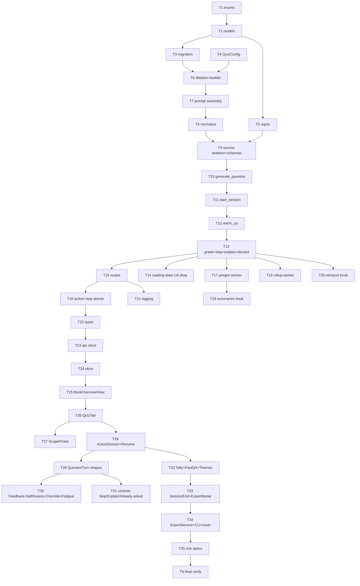

# AI Comprehension Quiz — Implementation Plan

---

## Overview

Adds a `Quiz` tab to `BookOverviewView` that generates LLM-powered comprehension questions (MCQ / open / spot-the-error) grounded in book summaries or full chapter content, grades open-ended answers with structured feedback, deduplicates against history via verbatim-stem + themed-summary rollup, and shows session + lifetime tallies. Five-phase delivery: schema → service core → API/workers/re-import → frontend core → frontend turn UX + export + final verify.

**Done when:** All 4 quiz tables migrate up/down cleanly; `bookcompanion add → summarize → start quiz → answer → stop` works end-to-end against a real Claude/Codex CLI; `Book.pre_drafted_q1_id` populates within seconds of summarize-complete; first question of a default-scope post-summarize session renders <500 ms p95 (Playwright timing); all backend unit + integration suites pass with zero failures (full `pytest` run shows 0 failed); `ruff check . && ruff format --check .` exits 0; `npm run type-check && npm run test:unit && npm run lint` exit 0; all 6 Playwright e2e quiz specs pass; lifetime-tally + themes-summary render on a quizzed book; re-import flips `is_stale=true` on existing quiz_questions and resets `quiz_dedup_state`; `bookcompanion export quiz-session <id>` produces self-contained Markdown with sanitized image URLs; manual UX walk through every wireframe state shows zero console errors.

**Done-when walkthrough:** With a fresh DB, `bookcompanion init && bookcompanion add tests/fixtures/sample_epub/art_of_war.epub && bookcompanion summarize 1 --preset practitioner_bullets` completes; structlog shows `quiz.pregen.completed`; `sqlite3 library.db "SELECT pre_drafted_q1_id FROM books WHERE id=1"` returns a non-null integer. Then `bookcompanion serve --port 8765 &`, navigate to `/books/1?tab=quiz` in the browser, see the empty-state → click `Start Quiz` (default scope, no theme) → first question renders without spinner (queue_hit=true) → submit an open-ended answer → see 3-field feedback within ~10 s → click `Got it` → click `Next question` → see spinner with verbatim copy "Reading the book to draft your question…" → answer 2 more turns mixing shapes → click `Stop` → see session in past panel with tally `Session 1 — 3 Q · 2/1/0` → after rollup completes (when stems > 50), `themes_summary` paragraph appears in `ThemesCoveredPanel`. `bookcompanion export quiz-session 1 -o /tmp/q1.md` produces a Markdown doc whose image links are `/api/v1/images/<id>` (per CLAUDE.md gotcha #20). Re-import the same epub → past Q&A panel renders the prior session with "stale (re-imported)" badge → `Book.pre_drafted_q1_id` is NULL and a fresh `QUIZ_PREGEN_Q1` job appears in the queue.

**Execution order:**

```
Phase 1 (Schema)         T1 → T2 → T3 → T4 → T5
Phase 2 (Service core)   T6 → T7 → T8 → T9 → T10 → T11 → T12 → T13
Phase 3 (API + Workers)  T14 [P] T15 → T16 → T17 [P] T18 → T19 → T20 → T21
Phase 4 (FE core)        T22 → T23 → T24 → T25 → T26 → T27 → T28
Phase 5 (FE turn + exp)  T29 → T30 → T31 → T32 → T33 → T34 → T35 → TN
```

[P] = parallelizable within phase. Phase boundaries trigger full /verify (per FR-26a / execute Phase 2.5).



---

## Decision Log

| # | Decision | Options Considered | Rationale |
|---|----------|-------------------|-----------|
| P1 | Reading-state extension shape: drop the `user_agent` predicate from the existing `/api/v1/reading-state/by-book/{id}` and add a `most_recent_section_ids` array field (latest distinct section ids across devices, capped at 10 within 48 h). | (a) new `/by-book-all-devices/{id}` endpoint, (b) extend existing endpoint, (c) reuse `/resume-banner` | User picked (b). Per CLAUDE.md gotcha #27, the cross-device-filtering happens in `/continue` (which `ContinueBanner` consumes), NOT in `/by-book`. So dropping UA on `/by-book` is safe; the regression test in T14 confirms `ContinueBanner` still self-gates on `/continue`. The new array field satisfies FR-16/17 D31 multi-section default. |
| P2 | Question generation, grading, and rollup all flow through the existing `LLMProvider.generate(prompt, json_schema=...)` ABC; no new provider type. The new prompt families ship as Jinja2 templates under `backend/app/templates/quiz/` mirroring `app/templates/summarize/`. | (a) one mega-prompt, (b) per-flow Jinja2 templates, (c) inline f-strings in service | (b) keeps prompts editable without code change (matches the "Adding a new prompt version" workflow in CLAUDE.md). Three families: `question.j2`, `grade.j2`, `explain.j2`, `rollup.j2`. |
| P3 | Pregen-Q1 enqueue lives in `JobQueueWorker._run_processing` immediately after the `bg_job.status = COMPLETED` flip and before `bg_session.commit()`, NOT inside `SummarizerService.summarize_book()`. | (a) inside service, (b) inside worker post-commit hook, (c) inside route | Service is called from CLI too; CLI summarize would silently enqueue a quiz job (wrong layer). Worker is the single place where COMPLETED is decided in production (route → worker for API; CLI calls a separate code path). Adding it post-commit risks losing the enqueue on commit failure. In the same transaction is correct. FR-80's idempotency guard (`pre_drafted_q1_id IS NULL OR is_stale`) keeps it safe under retry. |
| P4 | New step types are dispatched via an explicit branch in `_on_promoted` next to the existing AUDIO branch, not via a strategy table. | (a) explicit if-elif, (b) handler registry dict, (c) ProcessingStep → handler subclasses | Codebase has 2 step types today (SUMMARIZE default, AUDIO branch). Adding 2 more = 4 branches; below the threshold where a registry would pay back. Matches existing pattern. |
| P5 | `quiz_questions.citation_json` stores the section_id as JSON, not a FK, accepting that re-import staleness covers the only realistic deletion path (per spec §10.2 trade-off note). | (a) FK with ON DELETE SET NULL, (b) join table `quiz_question_sections`, (c) JSON-stored | Spec already adopts (c). Plan honors that decision; adds a comment in the model body citing §10.2 so future-me doesn't refactor by reflex. |
| P6 | tiktoken is added as a hard dependency (not optional extra). | (a) `[quiz]` extra, (b) hard dep, (c) optional with char-count fallback | tiktoken is ~3 MB pure-Python wheel; gating it behind an extra means `bookcompanion init` would silently degrade the budget bar to char-counts, producing user-visible numeric drift between dev and prod. Hard dep keeps behavior consistent. |
| P7 | Pinia store `quizSessions.ts` is per-book (keyed by `bookId`) not global. | (a) global with last-loaded book, (b) per-book map, (c) one store instance per `<QuizTab>` | Per-book matches the natural lifecycle (open Quiz tab on book A → store loads → open book B → store loads B's data). Mirrors `aiThreads.ts`. The map avoids stale renders when navigating across books. |
| P8 | Rollup prompt budget is enforced by truncating the stems list to the most recent 200 stems before sending; if even truncated payload exceeds `min(settings.llm.context_budget_tokens, 180000) - 8k`, the worker logs `quiz.rollup.skipped_oversized` and noop-completes. | (a) hard fail with 500-equivalent, (b) truncate-then-fit, (c) chunked map-reduce rollup | (b) keeps the rollup honest at scale without inventing a new map-reduce pipeline. 200 stems × ~50 tokens = 10k tokens, well under the cap. |
| P9 | G32 retry policy (`max_attempts=2` PREGEN / `=3` ROLLUP) is **deferred to v1.x**. v1 ships with single-attempt jobs. | (a) add `ProcessingJob.attempts` column + worker increment-on-failure now, (b) per-handler in-memory counter, (c) defer | `ProcessingJob` has no retry counter today (verified via grep — zero matches). Adding one is a cross-cutting queue change touching every step type. v1 graceful-degrade behavior is acceptable: failed PREGEN leaves the slot empty (FR-83 already tolerates LLMProvider absence), failed ROLLUP gets re-attempted at the next session-end (since enqueue is gated on completion, not on prior rollup state). Decision Log entry per user pick on Loop 1 finding F4. |

---

## Code Study Notes

> Glossary inherited from spec — see `02_spec.md` §"Domain Terms" / `01_requirements.md` for terminology. The plan introduces no new domain terms.

### Patterns to follow

- `backend/app/services/ai_thread_service.py:37-187` — service constructor DI pattern (`AsyncSession`, `LLMProvider`, `Settings`); `build_*_prompt` helpers; `selectinload` + `INSERT` + `await self.llm.generate(...)` + `INSERT` + `commit`.
- `backend/app/api/routes/ai_threads.py:1-209` — REST conventions: `@router.post("/api/v1/...")`, `Depends(get_db)` + `Depends(get_settings)`, `selectinload` in fetches, `HTTPException` for 4xx.
- `backend/app/services/job_queue_worker.py:88-148` — atomic `_atomic_promote` SQL with `RETURNING id`; reuse for QUIZ steps. `_on_promoted` dispatches by `step` enum (currently if AUDIO else summarize).
- `backend/app/services/job_queue_worker.py:106-145` — `BEGIN IMMEDIATE`-equivalent atomic UPDATE shape for stop-session implementation.
- `backend/app/services/book_service.py:223-310` — `_re_import_book` flow; the 5-step quiz cleanup (FR-64/82) plugs in just before `await self.db.commit()` at the end.
- `backend/app/services/summarizer/llm_provider.py:48-57` — `generate(prompt, ..., json_schema=...)` signature; `LLMResponse` returns `.content` for free-text and `.structured_output`-equivalent JSON shape (Claude path) / `--output-last-message` parsed JSON (Codex path) per CLAUDE.md gotchas #11/#12.
- `backend/app/db/models.py:298-336` (ProcessingJob), `298-337` (EvalTrace) — model declaration shape: `Mapped[]` typing, `mapped_column(..., nullable=False)`, `Enum(ProcessingStep)`, `ForeignKey(..., ondelete="CASCADE")`, `selectinload`-friendly relationships.
- `backend/app/db/models.py:48-56` — `ProcessingStep` enum extension is straightforward additive (string values).
- `backend/app/migrations/versions/d4e5f6a7b8c9_v1_4a_schema.py` and siblings — Alembic file naming + `op.create_table` + `op.create_index` + `op.batch_alter_table` for SQLite ALTER TABLE.
- `backend/app/services/export_service.py:1-150` — image URL sanitization helper (`_sanitize_image_urls`), Jinja2 template loading via `jinja2.FileSystemLoader`. Reuse both verbatim.
- `frontend/src/views/BookOverviewView.vue:108-208` — `BookTab` union, `TAB_VALUES`, `setTab()` with `router.replace()` for `?tab=` sync; pattern to extend with `'quiz'`.
- `frontend/src/stores/aiThreads.ts` — Pinia store shape: `state` factory, async actions that call the typed REST client, optimistic update + rollback. Mirror exactly into `quizSessions.ts`.
- `frontend/src/api/aiThreads.ts:1-39` — typed REST client shape: per-route function returning `fetch(...).then(r => r.json())`. Mirror into `api/quizSessions.ts`.
- `backend/app/api/routes/reading_state.py:59-77` — existing `/by-book/{id}` route shape. T14 modifies this route to drop the `user_agent` arg + repo call, returning all-device rows.

### Existing code to reuse

- `backend/app/api/deps.py:get_db, get_settings, _get_llm_provider` — wire `get_quiz_service`, `get_quiz_repo` etc. via the same pattern; `get_quiz_service()` returns `None` when LLM provider is None (T9 + T15).
- `backend/app/services/summarizer/__init__.py:create_llm_provider, detect_llm_provider` — reused unchanged for quiz.
- `backend/app/services/export_service.py` — `ExportService.export_book()` Jinja2 + image-sanitization template plumbing copied for `export_quiz_session()` (T34).
- `backend/app/db/repositories/section_repo.py` — `get_by_book_id()` with `selectinload(BookSection.images).undefer(Image.data)` for chapter-content fetches in scope (T6 token budget, T11 generate prompt).
- `backend/app/services/job_queue_worker.py:_atomic_promote` — the SQL pattern is reused as-is; only the `_on_promoted` dispatcher and one new `_run_quiz_*` body are added (T17/T18).
- `frontend/src/components/sidebar/AIChatTab.vue` — chat-bubble layout reference for `QuestionTurn.vue` (T29).
- `frontend/src/composables/` — no quiz-specific composables planned in v1; existing patterns suffice.

### Constraints discovered

- **`/reading-state/by-book/{id}` is per-device today** (line 60: `user_agent: str = Header(...)` + `repo.get_for_device_and_book(user_agent, book_id)`). T14 drops the header param, switches to a new repo method `get_all_devices_for_book(book_id)`, and adds a regression test that `ContinueBanner` still functions because it self-gates on `/continue` (per CLAUDE.md gotcha #27).
- **`ProcessingStep` enum has 8 values today** (PARSE/SUMMARIZE/EMBED/EVAL/CAPTION/QUICK_SUMMARY/EXTERNAL_REFS/AUDIO). Adding `QUIZ_PREGEN_Q1` and `QUIZ_ROLLUP` is purely additive at the enum + ORM level; no DDL change since SQLite stores TEXT.
- **`JobQueueWorker._on_promoted` (line 146-167)** branches on `step == AUDIO` else summarize. Plan adds two more branches (T17/T18).
- **`BookService._re_import_book` ends with `await self.db.commit()` at line 313** after the audio reconciliation block. The 5-step quiz cleanup (FR-64/82) MUST be inserted between the audio block and the final commit so it's part of the same transaction. T20 confirms via integration test that an exception in the cleanup rolls back the section/audio changes.
- **`expire_on_commit=False` + lazy load gotcha** (CLAUDE.md gotcha #1, #7): every quiz repo query that crosses a `commit` boundary must use `selectinload(QuizSession.questions)`. The lifetime-tally route returns derived counts only, so no eager-load needed there; the session-detail route needs it.
- **CLAUDE.md gotcha #2 (Integer PK for autoincrement)**: all 3 new tables MUST use `mapped_column(Integer, primary_key=True)`, not `BigInteger`.
- **CLAUDE.md gotcha #11 / #12 (structured output)**: `LLMProvider.generate(json_schema=...)` parses JSON for both Claude (`structured_output` field) and Codex (`--output-last-message` file). The service consumes `response.content` for free-text and a parsed dict for JSON; the existing provider implementations already handle both — no change needed at the provider layer.
- **CLAUDE.md gotcha #14 (`get_services()` does not auto-commit)**: the FastAPI dependency `get_db()` does not auto-commit either; routes MUST `await db.commit()` after writes. Quiz routes follow this pattern explicitly.
- **CLAUDE.md gotcha #20 (image URLs)**: `quiz_questions.citation_json.snippet` may contain `/api/v1/images/{id}` references when chapters have figures. Export sanitization (T34) must run them through `_sanitize_image_urls`.
- **Tailwind v4 + indigo accent + DESIGN.md anti-patterns**: no second blue, no exclamation marks, no marketing imagery. Wireframes already follow these — copy structure but adapt visual to host tokens.

### Stack signals

- `pyproject.toml` (uv-managed Python 3.12+, hatchling build) → Python stack.
- `frontend/package.json` (Vite 5, Vue 3, Vitest, Playwright, Tailwind v4) → JS stack via npm (lockfile: `package-lock.json` if present; verify before T22).
- `Makefile` → repo's verification ladder front door (`make help` lists targets); plan defers to `./test.sh` for full verification.
- No `Cargo.toml`, `go.mod`, `Gemfile` — single primary stack each side (Python backend / TS+Vue frontend), no monorepo ambiguity.
- `docker-compose.yml` not present at root (this is the zero-dependency packaging target per spec) — no Docker rollback line in TN.

---

## Prerequisites

- `uv sync --dev` clean inside `backend/`; `npm install` clean inside `frontend/`.
- Either `claude` or `codex` CLI on `$PATH` (verified via `bookcompanion doctor` or `which claude || which codex`); without it, generation paths skip gracefully but cannot be exercised end-to-end.
- A test book added: `cd backend && uv run python tests/fixtures/download_fixtures.py && uv run bookcompanion add tests/fixtures/sample_epub/art_of_war.epub`.
- Library on a writable XDG path (default macOS `~/Library/Application Support/bookcompanion/`).
- No competing `bookcompanion serve` on port 8000 if running `make dev`; T35 / TN spin a separate server on `:8765` per CLAUDE.md "Interactive verification (Playwright MCP)".
- Branch: work on `feat/ai-comprehension-quiz` (single feature branch; `commit_cadence: per-task`).

---

## File Map

> Generated index — per-task **Files:** sections are source of truth.

| Action | File | Responsibility | Task |
|--------|------|---------------|------|
| Modify | `backend/app/db/models.py:48-56` | Extend `ProcessingStep` enum with `QUIZ_PREGEN_Q1`, `QUIZ_ROLLUP` | T1 |
| Create | `backend/app/db/models.py` (append) | `QuizSession`, `QuizQuestion`, `QuizDedupState` ORM models + `Book.pre_drafted_q1_id` column | T2 |
| Create | `backend/app/migrations/versions/<hex>_v1_7a_quiz_tables.py` | Single Alembic revision: 3 new tables + 1 column + indexes | T3 |
| Modify | `backend/app/config.py` | Add `QuizConfig` nested model + `quiz: QuizConfig` on `Settings` | T4 |
| Create | `backend/app/db/repositories/quiz_session_repo.py` | Thin query builder for `quiz_sessions` | T5 |
| Create | `backend/app/db/repositories/quiz_question_repo.py` | Thin query builder for `quiz_questions` (recent stems, candidates, by-session) | T5 |
| Create | `backend/app/db/repositories/quiz_dedup_state_repo.py` | Thin query builder for `quiz_dedup_state` | T5 |
| Modify | `backend/pyproject.toml` | Add `tiktoken` to `[project.dependencies]` | T6 |
| Create | `backend/app/services/quiz/__init__.py` | Package marker | T6 |
| Create | `backend/app/services/quiz/token_counter.py` | `count_tokens(text: str) -> int` using `tiktoken.cl100k_base` | T6 |
| Create | `backend/app/services/quiz/prompt_builder.py` | `QuizPromptBuilder` (scope, recent stems, themed-summary, theme, histogram, fatigue) | T7 |
| Create | `backend/app/templates/quiz/question.j2` | Question generation prompt | T7 |
| Create | `backend/app/templates/quiz/grade.j2` | Answer grading prompt | T7 |
| Create | `backend/app/templates/quiz/explain.j2` | Explain prompt | T7 |
| Create | `backend/app/templates/quiz/rollup.j2` | Themes-summary rollup prompt | T7 |
| Create | `backend/app/services/quiz/normalize.py` | `normalize_concept_label(s: str) -> str` (FR-34, 5-step pipeline) | T8 |
| Create | `backend/app/services/quiz/schemas.py` | JSON schemas: `QUESTION_SCHEMA`, `FEEDBACK_SCHEMA`, `ROLLUP_SCHEMA` | T9 |
| Create | `backend/app/services/quiz/quiz_service.py` | `QuizService` skeleton, generate_question, start_session, warm-up, grade, skip, explain, override, discard, stop | T9-T13 |
| Modify | `backend/app/api/routes/reading_state.py:59-77` | Drop UA filter on `/by-book/{id}`; return `most_recent_section_ids` array | T14 |
| Modify | `backend/app/db/repositories/reading_state_repo.py` | Add `get_all_devices_for_book(book_id) -> list[ReadingState]` | T14 |
| Modify | `backend/app/api/schemas.py` | Extend `ReadingStateResponse` with `most_recent_section_ids: list[int] = []` | T14 |
| Create | `backend/app/api/routes/quiz.py` | All 11 quiz routes | T15 |
| Modify | `backend/app/api/main.py` | `app.include_router(quiz.router)` | T15 |
| Modify | `backend/app/api/deps.py` | `get_quiz_service`, `get_quiz_session_repo` etc. | T15 |
| Modify | `backend/app/services/quiz/quiz_service.py` | `start_session` resume-banner check (FR-19); `stop_session` atomic txn + idempotent (FR-24) | T16 |
| Modify | `backend/app/services/job_queue_worker.py:146-167` | Dispatch `QUIZ_PREGEN_Q1` to `_run_quiz_pregen_q1` and `QUIZ_ROLLUP` to `_run_quiz_rollup` | T17, T18 |
| Modify | `backend/app/services/job_queue_worker.py` (append) | `_run_quiz_pregen_q1(self, job_id, book_id)` | T17 |
| Modify | `backend/app/services/job_queue_worker.py` (append) | `_run_quiz_rollup(self, job_id, book_id)` | T18 |
| Modify | `backend/app/services/job_queue_worker.py:408-421` | Insert `QUIZ_PREGEN_Q1` enqueue right after `bg_job.status = COMPLETED` (gated per FR-80) | T19 |
| Modify | `backend/app/services/book_service.py:223-313` | Insert 5-step quiz cleanup (FR-64/82, E16) before final `await self.db.commit()` | T20 |
| Modify | `backend/app/services/quiz/quiz_service.py` (and routes) | Structured logging + `quiz.<step>.outcome` events (NFR-10, NFR-10a) | T21 |
| Modify | `frontend/src/types/index.ts` | Add `QuizSession`, `QuizQuestion`, `QuizScope`, `QuizFeedback`, `QuizSelfAssessment`, `QuizQuestionShape` | T22 |
| Create | `frontend/src/api/quizSessions.ts` | Typed REST client for all 11 routes | T23 |
| Create | `frontend/src/stores/quizSessions.ts` | Pinia store; per-book map; parallel `§9.1` + `§9.9` fetch; optimistic-rollback | T24 |
| Modify | `frontend/src/views/BookOverviewView.vue:195-208` | Extend `BookTab` union + `TAB_VALUES` with `'quiz'`; conditional render `<QuizTab>` | T25 |
| Create | `frontend/src/components/quiz/QuizTab.vue` | Tab root; state machine (empty / scope / active / past) | T26 |
| Create | `frontend/src/components/quiz/copy.ts` | Centralized copy strings (NFR-08) | T26 |
| Create | `frontend/src/components/quiz/ScopePicker.vue` | Radio + chapter multi-select + budget bar + theme input + D31 default | T27 |
| Create | `frontend/src/components/quiz/BudgetBar.vue` | Token budget bar | T27 |
| Create | `frontend/src/components/quiz/ChapterMultiSelect.vue` | Chapter checkboxes with token estimate | T27 |
| Create | `frontend/src/components/quiz/ThemeInput.vue` | Theme freeform input (max 200 chars) | T27 |
| Create | `frontend/src/components/quiz/ResumeBanner.vue` | Active-session resume/abandon banner (FR-19) | T28 |
| Create | `frontend/src/components/quiz/ActiveSession.vue` | Wraps WarmUpBanner + QuestionTurn + Feedback + SelfAssessment + controls | T28 |
| Create | `frontend/src/components/quiz/WarmUpBanner.vue` | Last-time-Missed/Partial banner (FR-72) | T28 |
| Create | `frontend/src/components/quiz/QuestionTurn.vue` | One question card; per-shape rendering | T29 |
| Create | `frontend/src/components/quiz/McqInput.vue` | 4-button stacked MCQ | T29 |
| Create | `frontend/src/components/quiz/OpenInput.vue` | Autosize textarea | T29 |
| Create | `frontend/src/components/quiz/SpotErrorInput.vue` | Wrong-restatement callout + correction textarea | T29 |
| Create | `frontend/src/components/quiz/CitationChip.vue` | Section title pill (visibility per FR-41) | T29 |
| Create | `frontend/src/components/quiz/LoadingSpinner.vue` | Verbatim-copy spinner (D16/D28) | T29 |
| Create | `frontend/src/components/quiz/FeedbackPanel.vue` | 3-field feedback render | T30 |
| Create | `frontend/src/components/quiz/SelfAssessmentButtons.vue` | Got it / Partial / Missed (with optimistic-rollback toast on 409/5xx) | T30 |
| Create | `frontend/src/components/quiz/OverrideAffordance.vue` | Override note input | T30 |
| Create | `frontend/src/components/quiz/FatiguePromptBanner.vue` | Detects fatigue clause in feedback.actual | T30 |
| Create | `frontend/src/components/quiz/SkipButton.vue` | Skip with FE-disable guard (FR-49) | T31 |
| Create | `frontend/src/components/quiz/ExplainAffordance.vue` | Explain button with soft-cap copy + stacked history (FR-46/46a) | T31 |
| Create | `frontend/src/components/quiz/AlreadyAskedLink.vue` | Discard link with first-time tooltip | T31 |
| Create | `frontend/src/components/quiz/SessionTally.vue` | Sticky session + lifetime tally header | T32 |
| Create | `frontend/src/components/quiz/PastQAPanel.vue` | Collapsible session-grouped history | T32 |
| Create | `frontend/src/components/quiz/PastSessionGroup.vue` | One per session | T32 |
| Create | `frontend/src/components/quiz/PastQuestionRow.vue` | One per question | T32 |
| Create | `frontend/src/components/quiz/ThemesCoveredPanel.vue` | Themes paragraph + clickable chips | T32 |
| Create | `frontend/src/components/quiz/SessionEndActions.vue` | Stop + Export buttons | T33 |
| Create | `frontend/src/components/quiz/ExportSessionModal.vue` | Triggers `GET /export?fmt=markdown` + browser download | T33 |
| Create | `backend/app/templates/exports/quiz_session.md.j2` | Markdown export template | T34 |
| Modify | `backend/app/services/export_service.py` | Add `export_quiz_session(session_id, fmt='markdown')` | T34 |
| Modify | `backend/app/cli/commands/export_cmd.py` | Add `quiz-session <session_id>` Typer subcommand | T34 |
| Modify | `backend/app/api/routes/quiz.py` | Add `GET /api/v1/quiz-sessions/{sid}/export?fmt=markdown` | T34 |
| Test   | `backend/tests/unit/test_quiz_models.py` | SQLAlchemy round-trip + CHECK constraint coverage | T2 |
| Test   | `backend/tests/unit/test_quiz_token_counter.py` | tiktoken token-count behavior | T6 |
| Test   | `backend/tests/unit/test_quiz_prompt_builder.py` | Prompt assembly correctness | T7 |
| Test   | `backend/tests/unit/test_quiz_normalize.py` | All 5 normalize-pipeline branches | T8 |
| Test   | `backend/tests/unit/test_quiz_service_generate.py` | Generate strict-schema retry; spot-error validator; concept_label normalize | T10 |
| Test   | `backend/tests/unit/test_quiz_service_start.py` | Pregen-Q1 consume eligibility; warm-up precedence | T11 |
| Test   | `backend/tests/unit/test_quiz_service_warmup.py` | All D29 branches (FR-70) | T12 |
| Test   | `backend/tests/unit/test_quiz_service_grade.py` | Feedback persistence; agent_verdict captured-not-surfaced | T13 |
| Test   | `backend/tests/unit/test_quiz_service_skip_explain_override.py` | per-stem skip_count; explain history; override_note | T13 |
| Test   | `backend/tests/unit/test_quiz_service_dedup.py` | FR-60 query correctness | T13 |
| Test   | `backend/tests/integration/test_reading_state_by_book.py` | UA-drop regression: ContinueBanner still gates on /continue | T14 |
| Test   | `backend/tests/integration/test_quiz_routes.py` | Full HTTP per-route incl. 400/404/409/502/503/504 | T15 |
| Test   | `backend/tests/integration/test_quiz_lifecycle.py` | start → 3 turns → stop; lifetime tally correct | T16 |
| Test   | `backend/tests/integration/test_quiz_pregen_job.py` | Enqueue + worker run → pre_drafted_q1_id populated; consume on start | T17, T19 |
| Test   | `backend/tests/integration/test_quiz_rollup_job.py` | Threshold + delta gate; themes_summary persisted | T18 |
| Test   | `backend/tests/integration/test_quiz_reimport.py` | Re-import flips is_stale + resets dedup_state + ends sessions + enqueues fresh pregen | T20 |
| Test   | `backend/tests/integration/test_quiz_export.py` | CLI + UI export; sanitized URLs; abandoned 404 | T34 |
| Test   | `frontend/src/stores/__tests__/quizSessions.spec.ts` | Store optimistic-rollback on 409/5xx | T24 |
| Test   | `frontend/src/components/quiz/__tests__/ScopePicker.spec.ts` | D31 default; budget overflow; verbatim copy | T27 |
| Test   | `frontend/src/components/quiz/__tests__/QuestionTurn.spec.ts` | Per-shape render; FE-disable guards | T29 |
| Test   | `frontend/tests/e2e/quiz-primary.spec.ts` | Empty → start → answer → self-assess → stop → past | T35 |
| Test   | `frontend/tests/e2e/quiz-specific-chapters.spec.ts` | Multi-select + budget + over-budget reject + start | T35 |
| Test   | `frontend/tests/e2e/quiz-spot-error.spec.ts` | Force spot-error via fixture provider | T35 |
| Test   | `frontend/tests/e2e/quiz-warmup.spec.ts` | Seed Missed concept → warm-up banner appears | T35 |
| Test   | `frontend/tests/e2e/quiz-pregen-q1.spec.ts` | Seed pre_drafted_q1_id → Start → Q1 < 500 ms | T35 |
| Test   | `frontend/tests/e2e/quiz-no-llm.spec.ts` | LLM=None → banner; past history (seeded) readable | T35 |

File-action verbs: Create / Modify / Test only. No Move / Rename / Delete in this plan.

---

## Risks

| # | Risk | Likelihood | Impact | Severity | Mitigation | Mitigation in: |
|---|------|-----------|--------|----------|------------|----------------|
| R1 | Concept-label drift breaks D29 warm-up join silently (G16) | Medium | High | High | Implement FR-34 5-step normalize pipeline; unit test every branch; integration test that "Loss Aversion (Kahneman)" and "loss-aversion" collapse to same key | T8, T12 |
| R2 | Stop-session atomicity failure leaves session COMPLETED with no rollup enqueue | Low | Medium | Medium | Single-transaction wrap; integrity-error rollback test | T16 |
| R3 | `/reading-state/by-book/{id}` UA-drop regresses `ContinueBanner` cross-device gating | Medium | High | High | Regression integration test covering both endpoints; ContinueBanner still self-gates on `/continue` (per CLAUDE.md gotcha #27) | T14 |
| R4 | LLM JSON schema retry loops forever on persistently-malformed output | Low | Medium | Medium | Hard cap at 1 retry → 502; never persist failed attempts (FR-32); outcome metric `schema_failed` | T10, T21 |
| R5 | Pregen Q1 job runs at every summarize-complete and burns LLM budget unnecessarily | Medium | Medium | Medium | FR-80 enqueue-side guard (`pre_drafted_q1_id IS NULL OR is_stale`) + FR-81 worker-side noop | T17, T19 |
| R6 | Rollup re-runs at every session-end once threshold crossed (G18) | Medium | Low | Low | FR-61 delta gate (`current_count - last_rollup_count >= 10`) | T18 |
| R7 | Per-row `skip_count` would never reach 3 since each generation is a new row (G17 blocker) | Was-blocker; Low | High | Medium | FR-43 spec patch already mandates per-stem UPDATE; integration test confirms cross-row increment | T13 |
| R8 | Re-import mid-session leaves orphaned `in_progress` session that the resume-banner offers stale content | Low | Medium | Medium | E16: `_re_import_book` ends open sessions with `status='abandoned'` in same transaction | T20 |
| R9 | Two concurrent `start_session` on same book on different devices both succeed → two `in_progress` rows | Medium | Low | Low | FR-19 resume/abandon banner on tab mount surfaces the conflict deterministically | T16, T28 |
| R10 | Wireframe→implementation visual drift if tasks copy wireframe styling verbatim instead of host tokens | Medium | Medium | Medium | Per skill rule: tasks cite wireframes for IA/copy/states/journeys ONLY; visual style follows host Tailwind tokens. TN wireframe diff classifies deltas as `intentional — style adaptation` | T26-T33, TN |
| R11 | Codex CLI vs Claude CLI structured-output divergence (CLAUDE.md gotchas #11/#12) breaks generation under one provider but not the other | Low | Medium | Medium | Existing `LLMProvider` ABC already abstracts both; T10 unit test uses a `FakeLLMProvider`; integration test runs against the actual installed CLI; outcome events differentiate | T10, T15 |

---

## Rollback

- **Migration rollback:** `cd backend && uv run alembic -c app/migrations/alembic.ini downgrade -1` reverses the single quiz revision (drops `books.pre_drafted_q1_id` first via `batch_alter_table`, then `quiz_dedup_state`, `quiz_questions`, `quiz_sessions`).
- **Feature kill switch:** set `BOOKCOMPANION_QUIZ__ENABLED=false` in env or via `bookcompanion config set quiz.enabled false` and restart `bookcompanion serve`. Tab renders banner-only; routes 503; existing books unaffected.
- **Bad pregen job poisoning the queue:** `sqlite3 library.db "DELETE FROM processing_jobs WHERE step IN ('quiz_pregen_q1','quiz_rollup') AND status='PENDING'"`; the worker picks up the next valid job at the next poll.
- **Stale `pre_drafted_q1_id` references after partial rollout:** `sqlite3 library.db "UPDATE books SET pre_drafted_q1_id = NULL WHERE pre_drafted_q1_id NOT IN (SELECT id FROM quiz_questions)"` (only safe if quiz_questions table still exists; otherwise just downgrade).

No data backfill — feature ships empty.

---

## Tasks

## Phase 1: Schema and Migration

Schema and migration must land first so service-layer tasks can write against real models. Single migration revision per S11. Phase boundary triggers full /verify (clean migration up/down + model round-trip).

### T1: Extend ProcessingStep enum

**Goal:** Add `QUIZ_PREGEN_Q1` and `QUIZ_ROLLUP` to the `ProcessingStep` enum so the queue worker can dispatch them.
**Spec refs:** §6.2 (service responsibilities), §10.1 (ProcessingStep extension note)
**Depends on:** none
**Idempotent:** yes
**TDD:** yes — new-feature

**Files:**
- Modify: `backend/app/db/models.py:48-56`

**Steps:**

- [ ] Step 1: Write failing test in `backend/tests/unit/test_quiz_models.py` (new file):
  ```python
  from app.db.models import ProcessingStep

  def test_processing_step_includes_quiz_values():
      assert ProcessingStep.QUIZ_PREGEN_Q1.value == "quiz_pregen_q1"
      assert ProcessingStep.QUIZ_ROLLUP.value == "quiz_rollup"
  ```

- [ ] Step 2: Run `cd backend && uv run python -m pytest tests/unit/test_quiz_models.py::test_processing_step_includes_quiz_values -v`. Expected: FAIL with `AttributeError`.

- [ ] Step 3: Append to `ProcessingStep` enum:
  ```python
  QUIZ_PREGEN_Q1 = "quiz_pregen_q1"
  QUIZ_ROLLUP = "quiz_rollup"
  ```

- [ ] Step 4: Re-run test. Expected: PASS.

- [ ] Step 5: Commit: `git add backend/app/db/models.py backend/tests/unit/test_quiz_models.py && git commit -m "feat(T1): add QUIZ_PREGEN_Q1 and QUIZ_ROLLUP to ProcessingStep enum"`

**Inline verification:**
- `cd backend && uv run python -m pytest tests/unit/test_quiz_models.py -v` — 1 passed, 0 failed
- `uv run ruff check app/db/models.py` — no findings

---

### T2: Add Quiz ORM models + Book.pre_drafted_q1_id column

**Goal:** Declare `QuizSession`, `QuizQuestion`, `QuizDedupState` SQLAlchemy 2.0 models matching spec §10.1 DDL, plus the `pre_drafted_q1_id` column on `Book`.
**Spec refs:** §10.1 (full DDL), §10.3 (indexes), CLAUDE.md gotchas #1, #2, #16, S11
**Depends on:** T1
**Idempotent:** yes
**TDD:** yes — new-feature

**Files:**
- Modify: `backend/app/db/models.py` (append 3 model classes + column on `Book`)
- Test: `backend/tests/unit/test_quiz_models.py` (extend)

**Steps:**

- [ ] Step 1: Add round-trip + CHECK constraint tests:
  ```python
  import pytest
  from sqlalchemy.exc import IntegrityError
  from app.db.models import (
      QuizSession, QuizQuestion, QuizDedupState, Book,
      Author, BookStatus,
  )

  @pytest.mark.asyncio
  async def test_quiz_session_round_trip(db_session):
      book = Book(title="t", file_data=b"x", file_hash="h", file_format="epub",
                  file_size_bytes=1, status=BookStatus.PARSED)
      db_session.add(book); await db_session.flush()
      qs = QuizSession(book_id=book.id, scope_mode="all_summaries", status="in_progress")
      db_session.add(qs); await db_session.commit()
      assert qs.id and qs.created_at and qs.updated_at

  @pytest.mark.asyncio
  async def test_quiz_question_shape_check_mcq_requires_options(db_session, book_factory):
      book = await book_factory()
      qq = QuizQuestion(
          session_id=None, book_id=book.id, shape="mcq",
          bloom_level="apply", stem="?", concept_label="x",
          citation_json='{}', mcq_options_json=None,  # MISSING — should fail CHECK
      )
      db_session.add(qq)
      with pytest.raises(IntegrityError):
          await db_session.commit()

  @pytest.mark.asyncio
  async def test_quiz_question_bloom_create_accepted(db_session, book_factory):
      book = await book_factory()
      qq = QuizQuestion(
          session_id=None, book_id=book.id, shape="open",
          bloom_level="create", stem="?", concept_label="x", citation_json='{}',
      )
      db_session.add(qq); await db_session.commit()
      assert qq.bloom_level == "create"

  @pytest.mark.asyncio
  async def test_book_pre_drafted_q1_id_nullable(db_session, book_factory):
      book = await book_factory()
      assert book.pre_drafted_q1_id is None
  ```
  Pull `db_session` and `book_factory` from `backend/tests/conftest.py` — confirm fixtures exist (they do per `tests/conftest.py:db_session` pattern used elsewhere); add `book_factory` if missing.

- [ ] Step 2: Run `cd backend && uv run python -m pytest tests/unit/test_quiz_models.py -v`. Expected: FAIL with `ImportError` on the new model classes.

- [ ] Step 3: Append models to `backend/app/db/models.py` matching spec §10.1 verbatim. Pattern (interface only — implementor mirrors `ProcessingJob`/`AIThread` shapes for Mapped[] typing):
  ```python
  class QuizSession(Base):
      __tablename__ = "quiz_sessions"
      id: Mapped[int] = mapped_column(Integer, primary_key=True)
      book_id: Mapped[int] = mapped_column(Integer, ForeignKey("books.id", ondelete="CASCADE"), nullable=False, index=True)
      scope_mode: Mapped[str] = mapped_column(String(32), nullable=False)
      scope_section_ids: Mapped[str | None] = mapped_column(JSON, nullable=True)  # JSON list[int]
      theme: Mapped[str | None] = mapped_column(String(200), nullable=True)
      status: Mapped[str] = mapped_column(String(16), nullable=False, default="in_progress")
      created_at: Mapped[datetime] = mapped_column(DateTime(timezone=True), server_default=func.now())
      updated_at: Mapped[datetime] = mapped_column(DateTime(timezone=True), server_default=func.now(), onupdate=func.now())  # G19
      ended_at: Mapped[datetime | None] = mapped_column(DateTime(timezone=True), nullable=True)
      __table_args__ = (
          CheckConstraint("scope_mode IN ('all_summaries','specific_chapters')", name="ck_quiz_sessions_scope_mode"),
          CheckConstraint("status IN ('in_progress','completed','abandoned')", name="ck_quiz_sessions_status"),
          Index("ix_quiz_sessions_book_status", "book_id", "status"),
          Index("ix_quiz_sessions_book_created", "book_id", "created_at"),
      )
      questions: Mapped[list["QuizQuestion"]] = relationship(back_populates="session", cascade="all, delete-orphan")

  class QuizQuestion(Base):
      __tablename__ = "quiz_questions"
      # ... per §10.1 DDL — all CHECK constraints declared via CheckConstraint(..., name=...)
      # CRITICAL: shape-conditional CHECK must be in __table_args__ (G23)
      session: Mapped["QuizSession | None"] = relationship(back_populates="questions")

  class QuizDedupState(Base):
      __tablename__ = "quiz_dedup_state"
      book_id: Mapped[int] = mapped_column(Integer, ForeignKey("books.id", ondelete="CASCADE"), primary_key=True)
      themes_summary: Mapped[str | None] = mapped_column(Text, nullable=True)
      themes_summary_computed_at: Mapped[datetime | None] = mapped_column(DateTime(timezone=True), nullable=True)
      last_rollup_question_count: Mapped[int] = mapped_column(Integer, nullable=False, default=0)
  ```
  Add to `Book` (line ~143):
  ```python
  pre_drafted_q1_id: Mapped[int | None] = mapped_column(
      Integer,
      ForeignKey("quiz_questions.id", ondelete="SET NULL", use_alter=True),
      nullable=True,
  )
  ```
  Comment cite: `# §10.2: citation_json stores section_id as JSON, not FK — staleness covers re-import`.

- [ ] Step 4: Re-run pytest. Expected: round-trip + CHECK tests PASS; `bloom_level == 'create'` accepted; pre_drafted_q1_id nullable.

- [ ] Step 5: `uv run ruff check app/db/models.py && uv run ruff format app/db/models.py`. Expected: no findings.

- [ ] Step 6: Commit: `git add backend/app/db/models.py backend/tests/unit/test_quiz_models.py && git commit -m "feat(T2): add QuizSession, QuizQuestion, QuizDedupState models + Book.pre_drafted_q1_id"`

**Inline verification:**
- `cd backend && uv run python -m pytest tests/unit/test_quiz_models.py -v` — all tests pass; CHECK violations raise `IntegrityError`
- `uv run python -c "from app.db.models import QuizSession, QuizQuestion, QuizDedupState; print('ok')"` — prints `ok`

---

### T3: Alembic migration

**Goal:** Single Alembic revision creating all 4 schema artifacts (3 tables + 1 column + indexes) per S11. Round-trip clean (up → down → up produces identical schema).
**Spec refs:** §10.1, §10.2, §10.3, S11, CLAUDE.md gotcha #8
**Depends on:** T2
**Idempotent:** no — recovery: `uv run alembic -c app/migrations/alembic.ini downgrade -1` then re-run upgrade
**TDD:** yes — new-feature

**Files:**
- Create: `backend/app/migrations/versions/<auto-hex>_v1_7a_quiz_tables.py`

**Steps:**

- [ ] Step 1: Generate revision skeleton: `cd backend && uv run alembic -c app/migrations/alembic.ini revision --autogenerate -m "v1_7a quiz tables"`. Inspect the generated file; confirm it captured the 3 tables + column + indexes correctly. If autogenerate misses the shape-conditional CHECK constraint or the partial index, hand-edit to match §10.1 verbatim.

- [ ] Step 2: Round-trip test: write `backend/tests/integration/test_quiz_migration.py`:
  ```python
  import subprocess, os, tempfile, pytest

  @pytest.mark.integration
  def test_quiz_migration_round_trip(tmp_path):
      env = os.environ.copy()
      db_path = tmp_path / "lib.db"
      env["BOOKCOMPANION_DATABASE__URL"] = f"sqlite+aiosqlite:///{db_path}"
      env["BOOKCOMPANION_DATA__DIRECTORY"] = str(tmp_path)
      cmd = ["uv", "run", "alembic", "-c", "app/migrations/alembic.ini"]
      assert subprocess.run([*cmd, "upgrade", "head"], env=env, cwd="backend").returncode == 0
      assert subprocess.run([*cmd, "downgrade", "-1"], env=env, cwd="backend").returncode == 0
      assert subprocess.run([*cmd, "upgrade", "head"], env=env, cwd="backend").returncode == 0
      # Schema sanity
      import sqlite3
      con = sqlite3.connect(db_path)
      tables = {r[0] for r in con.execute("SELECT name FROM sqlite_master WHERE type='table'")}
      assert {"quiz_sessions", "quiz_questions", "quiz_dedup_state"}.issubset(tables)
      cols = {r[1] for r in con.execute("PRAGMA table_info(books)")}
      assert "pre_drafted_q1_id" in cols
  ```

- [ ] Step 3: Run the test. Expected: FAIL initially if migration file is missing the new bits; iterate on the migration file until PASS.

- [ ] Step 4: Verify use of `op.batch_alter_table("books") as batch_op: batch_op.add_column(...)` for the column add (CLAUDE.md gotcha #8 — `render_as_batch=True` is already set in `env.py`, so autogenerate should produce this; verify).

- [ ] Step 5: Commit: `git add backend/app/migrations/versions/*v1_7a_quiz_tables.py backend/tests/integration/test_quiz_migration.py && git commit -m "feat(T3): single Alembic migration for quiz tables (v1_7a)"`

**Inline verification:**
- `cd backend && uv run python -m pytest tests/integration/test_quiz_migration.py -v` — 1 passed
- Manual: `cd backend && BOOKCOMPANION_DATABASE__URL="sqlite+aiosqlite:///$(mktemp -d)/lib.db" uv run alembic -c app/migrations/alembic.ini upgrade head` — completes with 0 exit

---

### T4: QuizConfig settings class

**Goal:** Add `QuizConfig` nested model on `Settings` with all 11 fields from spec §13 + sane defaults.
**Spec refs:** §13 (Configuration & Feature Flags)
**Depends on:** none (parallelizable with T1-T3)
**Idempotent:** yes
**TDD:** yes — new-feature

**Files:**
- Modify: `backend/app/config.py`
- Test: `backend/tests/unit/test_config.py` (extend)

**Steps:**

- [ ] Step 1: Add failing test:
  ```python
  def test_quiz_config_defaults():
      from app.config import Settings
      s = Settings()
      assert s.quiz.enabled is True
      assert s.quiz.specific_chapters_token_budget == 60_000
      assert s.quiz.dedup_verbatim_cap == 50
      assert s.quiz.rollup_delta_threshold == 10
      assert s.quiz.shape_target_distribution == {"mcq": 0.4, "open": 0.45, "spot_error": 0.15}
      assert s.quiz.warm_up_lookback_sessions == 3
      assert s.quiz.warm_up_max_questions == 2
      assert s.quiz.explain_soft_cap == 2
      assert s.quiz.skip_dedup_threshold == 3
      assert s.quiz.fatigue_prompt_interval == 10
      assert s.quiz.override_note_max_chars == 500
      assert s.quiz.theme_max_chars == 200

  def test_quiz_config_env_override(monkeypatch):
      monkeypatch.setenv("BOOKCOMPANION_QUIZ__ENABLED", "false")
      monkeypatch.setenv("BOOKCOMPANION_QUIZ__DEDUP_VERBATIM_CAP", "25")
      from app.config import Settings
      s = Settings()
      assert s.quiz.enabled is False
      assert s.quiz.dedup_verbatim_cap == 25
  ```

- [ ] Step 2: Run pytest. Expected: FAIL — `Settings.quiz` does not exist.

- [ ] Step 3: Add `QuizConfig` class to `backend/app/config.py` next to other `*Config` classes; wire as `quiz: QuizConfig = Field(default_factory=QuizConfig)` on `Settings`.

- [ ] Step 4: Re-run pytest. Expected: PASS.

- [ ] Step 5: Commit: `git add backend/app/config.py backend/tests/unit/test_config.py && git commit -m "feat(T4): add QuizConfig with 11 fields per spec §13"`

**Inline verification:**
- `cd backend && uv run python -m pytest tests/unit/test_config.py::test_quiz_config_defaults tests/unit/test_config.py::test_quiz_config_env_override -v` — both pass
- `uv run python -c "from app.config import Settings; print(Settings().quiz.enabled)"` — prints `True`

---

### T5: Quiz repositories

**Goal:** Three thin query-builder repos for the new tables, mirroring `eval_repo.py` / `processing_repo.py` shape.
**Spec refs:** §6.1 (architecture), CLAUDE.md gotcha #1 (selectinload requirement)
**Depends on:** T2, T3
**Idempotent:** yes
**TDD:** yes — new-feature

**Files:**
- Create: `backend/app/db/repositories/quiz_session_repo.py`
- Create: `backend/app/db/repositories/quiz_question_repo.py`
- Create: `backend/app/db/repositories/quiz_dedup_state_repo.py`
- Test: `backend/tests/unit/test_quiz_repos.py`

**Steps:**

- [ ] Step 1: Write failing tests covering the public surface each repo needs:

  `quiz_session_repo`:
  - `create(book_id, scope_mode, scope_section_ids, theme) -> QuizSession`
  - `get_by_id(id) -> QuizSession | None` (with `selectinload(QuizSession.questions)`)
  - `list_by_book(book_id) -> list[QuizSession]` (ordered by created_at DESC)
  - `get_in_progress_for_book(book_id) -> QuizSession | None`
  - `update_status(id, status, ended_at) -> None`

  `quiz_question_repo`:
  - `create(...) -> QuizQuestion`
  - `get_by_id(id) -> QuizQuestion | None`
  - `recent_stems(book_id, limit=50) -> list[str]` (FR-60 query)
  - `concepts_with_skip_threshold(book_id, threshold) -> list[str]` (FR-44)
  - `warm_up_candidates(book_id, lookback_sessions=3) -> list[tuple[str, dict]]` (FR-70)
  - `mark_stale_for_book(book_id) -> int` (rowcount; FR-64)
  - `increment_skip_for_stem(book_id, stem) -> int` (FR-43 per-stem!)
  - `discard(question_id) -> None`
  - `discarded_stems_for_session(session_id) -> list[str]` (FR-47/G4)

  `quiz_dedup_state_repo`:
  - `get(book_id) -> QuizDedupState | None`
  - `upsert(book_id, themes_summary, last_rollup_question_count) -> QuizDedupState`
  - `reset(book_id) -> None` (FR-64: `themes_summary=NULL, last_rollup_question_count=0`)

  Example test for the spec-critical per-stem skip increment:
  ```python
  @pytest.mark.asyncio
  async def test_increment_skip_for_stem_updates_all_matching_rows(db_session, book_factory, question_factory):
      book = await book_factory()
      q1 = await question_factory(book_id=book.id, stem="What is X?", session_id=1)
      q2 = await question_factory(book_id=book.id, stem="What is X?", session_id=2)
      q3 = await question_factory(book_id=book.id, stem="What is Y?", session_id=2)
      from app.db.repositories.quiz_question_repo import QuizQuestionRepository
      repo = QuizQuestionRepository(db_session)
      n = await repo.increment_skip_for_stem(book.id, "What is X?")
      assert n == 2
      await db_session.refresh(q1); await db_session.refresh(q2); await db_session.refresh(q3)
      assert q1.skip_count == 1 and q2.skip_count == 1 and q3.skip_count == 0
  ```

- [ ] Step 2: Run pytest. Expected: FAIL on imports.

- [ ] Step 3: Implement repos. Mirror `backend/app/db/repositories/eval_repo.py` (constructor takes `AsyncSession`); use raw `select(...).options(selectinload(...))`; `recent_stems` exact SQL per FR-60:
  ```python
  async def recent_stems(self, book_id: int, limit: int = 50) -> list[str]:
      q = (
          select(QuizQuestion.stem)
          .where(
              QuizQuestion.book_id == book_id,
              QuizQuestion.is_stale == 0,
              QuizQuestion.discarded == 0,
              QuizQuestion.skip_count < 3,
              # warm_up=0 OR self_assessment IS NOT NULL
              or_(QuizQuestion.warm_up == 0, QuizQuestion.self_assessment.isnot(None)),
          )
          .order_by(QuizQuestion.created_at.desc())
          .limit(limit)
      )
      return [row[0] for row in (await self.session.execute(q)).all()]
  ```

- [ ] Step 4: Re-run pytest. Expected: PASS.

- [ ] Step 5: Commit: `git add backend/app/db/repositories/quiz_*.py backend/tests/unit/test_quiz_repos.py && git commit -m "feat(T5): add quiz_session/question/dedup_state repositories"`

**Inline verification:**
- `cd backend && uv run python -m pytest tests/unit/test_quiz_repos.py -v` — all pass
- `uv run ruff check app/db/repositories/quiz_*.py` — clean

---

**Phase 1 Boundary Verify:** run full /verify cycle before proceeding to Phase 2 (per FR-26a):

```bash
cd backend
uv run python -m pytest tests/unit/test_quiz_models.py tests/unit/test_quiz_repos.py tests/unit/test_config.py tests/integration/test_quiz_migration.py -v
uv run ruff check . && uv run ruff format --check .
uv run alembic -c app/migrations/alembic.ini upgrade head && uv run alembic -c app/migrations/alembic.ini downgrade -1 && uv run alembic -c app/migrations/alembic.ini upgrade head
```

Expected: all green.

---

## Phase 2: Service Core

`QuizService` orchestrates everything. Built bottom-up: token counter → prompt builder → normalize → LLM JSON schemas → service skeleton → generate → start (warm-up + pregen) → grade/skip/explain/discard. Phase boundary verifies the service against `FakeLLMProvider` only — real-CLI integration lives in Phase 3.

### T6: tiktoken dependency + token counter

**Goal:** Add `tiktoken` to backend deps; implement `count_tokens(text) -> int` using `cl100k_base` per S4.
**Spec refs:** S4 (tiktoken cl100k), FR-14 (token counting)
**Depends on:** none (parallelizable with T1-T5)
**Idempotent:** yes
**TDD:** yes — new-feature

**Files:**
- Modify: `backend/pyproject.toml`
- Create: `backend/app/services/quiz/__init__.py` (empty)
- Create: `backend/app/services/quiz/token_counter.py`
- Test: `backend/tests/unit/test_quiz_token_counter.py`

**Steps:**

- [ ] Step 1: Failing test:
  ```python
  from app.services.quiz.token_counter import count_tokens

  def test_count_tokens_empty_string():
      assert count_tokens("") == 0

  def test_count_tokens_short_phrase():
      n = count_tokens("loss aversion")
      assert 2 <= n <= 4  # cl100k typically tokenizes this as 2-3 tokens

  def test_count_tokens_long_text_within_10pct_of_chars_div_4():
      text = "The book emphasizes loss aversion as a core finding. " * 100
      n = count_tokens(text)
      approx = len(text) // 4
      assert 0.7 * approx <= n <= 1.3 * approx
  ```

- [ ] Step 2: Add to `backend/pyproject.toml` `[project.dependencies]`: `"tiktoken>=0.7.0"`. Run `cd backend && uv sync`. Confirm `uv pip show tiktoken` shows the package.

- [ ] Step 3: Run pytest. Expected: FAIL on import.

- [ ] Step 4: Implement `count_tokens`:
  ```python
  import tiktoken

  _enc = tiktoken.get_encoding("cl100k_base")

  def count_tokens(text: str) -> int:
      if not text:
          return 0
      return len(_enc.encode(text))
  ```
  Module-level encoder is intentional — `get_encoding` is expensive on first call but cached after; lazy-init not needed for personal-tool scale.

- [ ] Step 5: Re-run pytest. Expected: PASS.

- [ ] Step 6: Commit: `git add backend/pyproject.toml backend/app/services/quiz/__init__.py backend/app/services/quiz/token_counter.py backend/tests/unit/test_quiz_token_counter.py && git commit -m "feat(T6): add tiktoken dep + count_tokens helper"`

**Inline verification:**
- `cd backend && uv run python -m pytest tests/unit/test_quiz_token_counter.py -v` — 3 passed
- `uv run python -c "from app.services.quiz.token_counter import count_tokens; print(count_tokens('hello world'))"` — prints small int

---

### T7: QuizPromptBuilder + Jinja2 templates

**Goal:** Build the question / grading / explain / rollup prompts via Jinja2 with structured context (scope content, recent stems, themed-summary, theme, recent-shape histogram, fatigue clause).
**Spec refs:** §6.2 (QuizPromptBuilder), FR-31, FR-44, FR-50, FR-55, FR-62, S5
**Wireframe refs:** none (backend-only)
**Depends on:** T5, T6
**Idempotent:** yes
**TDD:** yes — new-feature

**Files:**
- Create: `backend/app/services/quiz/prompt_builder.py`
- Create: `backend/app/templates/quiz/question.j2`
- Create: `backend/app/templates/quiz/grade.j2`
- Create: `backend/app/templates/quiz/explain.j2`
- Create: `backend/app/templates/quiz/rollup.j2`
- Test: `backend/tests/unit/test_quiz_prompt_builder.py`

**Steps:**

- [ ] Step 1: Failing tests asserting prompt content shape (substring assertions, NOT exact match):
  ```python
  def test_build_generation_prompt_includes_scope_content(builder):
      p = builder.build_generation_prompt(
          scope_content="The chapter introduces loss aversion.",
          recent_stems=[], themed_summary=None, theme=None,
          shape_histogram={"mcq": 0, "open": 0, "spot_error": 0},
          skipped_concepts=[],
      )
      assert "loss aversion" in p
      assert "{mcq:" in p or "mcq: 0.4" in p  # target distribution mentioned

  def test_build_generation_prompt_includes_recent_stems_block(builder):
      p = builder.build_generation_prompt(
          scope_content="...", recent_stems=["What is X?", "Define Y."],
          themed_summary=None, theme=None,
          shape_histogram={"mcq": 0, "open": 0, "spot_error": 0},
          skipped_concepts=[],
      )
      assert "What is X?" in p and "Define Y." in p

  def test_build_generation_prompt_skipped_concepts_augmentation(builder):
      p = builder.build_generation_prompt(
          scope_content="...", recent_stems=[], themed_summary=None, theme=None,
          shape_histogram={"mcq": 0, "open": 0, "spot_error": 0},
          skipped_concepts=["loss aversion", "anchoring"],
      )
      assert "repeatedly skipped" in p
      assert "loss aversion, anchoring" in p or ("loss aversion" in p and "anchoring" in p)

  def test_build_grading_prompt_appends_fatigue_clause_when_flagged(builder):
      p = builder.build_grading_prompt(
          stem="?", citation="...", user_answer="...", append_fatigue_prompt=True,
      )
      assert "Want to keep going or wrap up here?" in p

  def test_build_generation_prompt_token_budget_enforcement_truncates_scope(builder):
      huge = "word " * 100_000  # ~100k tokens
      p = builder.build_generation_prompt(
          scope_content=huge, recent_stems=[], themed_summary=None, theme=None,
          shape_histogram={"mcq": 0, "open": 0, "spot_error": 0},
          skipped_concepts=[],
          max_prompt_tokens=8_000,
      )
      from app.services.quiz.token_counter import count_tokens
      assert count_tokens(p) <= 8_000
  ```

- [ ] Step 2: Run pytest. Expected: FAIL on import.

- [ ] Step 3: Implement Jinja2 templates. `question.j2` is the largest — captures (a) Bloom-verb instructions, (b) shape target distribution, (c) recent shape histogram, (d) recent stems block, (e) themed-summary block, (f) theme, (g) skipped-concepts augmentation, (h) scope content. Pattern:
  ```jinja2
  You are generating ONE comprehension question grounded in the provided book content.

  ## Bloom's Taxonomy (vary across turns)
  remember | understand | apply | analyze | evaluate | create

  ## Question Shape — Target Distribution
  mcq: 0.4, open: 0.45, spot_error: 0.15

  ## Recent Shape Histogram (last 5 turns)
  mcq: {{ shape_histogram.mcq }}, open: {{ shape_histogram.open }}, spot_error: {{ shape_histogram.spot_error }}

  
  ## Already-Asked Stems (do NOT repeat verbatim)
  - {{ stem }}
  
  

  
  ## Themes Already Covered (avoid these)
  {{ themed_summary }}
  

  
  ## User-Requested Theme
  {{ theme }}
  

  
  ## Repeatedly-Skipped Concepts
  The following concepts have been repeatedly skipped — if you choose to address any, use a noticeably different angle or aspect from prior stems: {{ skipped_concepts | join(", ") }}.
  

  ## Scope Content
  {{ scope_content }}

  Return ONE question conforming to the JSON schema.
  ```
  Implementation should reuse the existing Jinja2 environment pattern from `summarizer_service.py:535` (`self._jinja_env.get_template(...)`).

- [ ] Step 4: Implement `QuizPromptBuilder` with constructor `(settings: Settings)`; budget-enforcement via `count_tokens`. When `max_prompt_tokens` is supplied and rendered prompt exceeds it, truncate `scope_content` from the end (preserving headers) until the total fits.

- [ ] Step 5: Re-run pytest. Expected: PASS.

- [ ] Step 6: Commit: `git add backend/app/services/quiz/prompt_builder.py backend/app/templates/quiz/*.j2 backend/tests/unit/test_quiz_prompt_builder.py && git commit -m "feat(T7): QuizPromptBuilder + 4 Jinja2 prompt templates"`

**Inline verification:**
- `cd backend && uv run python -m pytest tests/unit/test_quiz_prompt_builder.py -v` — all pass
- `uv run python -c "from app.services.quiz.prompt_builder import QuizPromptBuilder; from app.config import Settings; b = QuizPromptBuilder(Settings()); print(len(b.build_generation_prompt(scope_content='x', recent_stems=[], themed_summary=None, theme=None, shape_histogram={'mcq':0,'open':0,'spot_error':0}, skipped_concepts=[])))"` — prints non-zero int

---

### T8: Concept-label normalization (FR-34)

**Goal:** Implement the deterministic 5-step normalization pipeline so D29 warm-up `WHERE concept_label = ?` JOINs survive agent drift (G16, R1).
**Spec refs:** FR-34 (5-step pipeline)
**Depends on:** none (parallelizable with T6, T7)
**Idempotent:** yes
**TDD:** yes — new-feature

**Files:**
- Create: `backend/app/services/quiz/normalize.py`
- Test: `backend/tests/unit/test_quiz_normalize.py`

**Steps:**

- [ ] Step 1: Failing tests covering every branch:
  ```python
  from app.services.quiz.normalize import normalize_concept_label

  def test_strip_lower():
      assert normalize_concept_label("  Loss Aversion  ") == "loss aversion"

  def test_trailing_parenthetical_dropped():
      assert normalize_concept_label("loss aversion (Kahneman)") == "loss aversion"
      assert normalize_concept_label("Anchoring (cf. Tversky 1974)") == "anchoring"

  def test_internal_parenthetical_kept():
      # Only TRAILING parenthetical is stripped
      assert normalize_concept_label("loss (asymmetric) aversion") == "loss (asymmetric) aversion"

  def test_hyphens_underscores_become_spaces():
      assert normalize_concept_label("loss-aversion") == "loss aversion"
      assert normalize_concept_label("loss_aversion") == "loss aversion"
      assert normalize_concept_label("loss--aversion") == "loss aversion"

  def test_collapse_internal_whitespace():
      assert normalize_concept_label("loss     aversion") == "loss aversion"

  def test_combined():
      assert normalize_concept_label("  Loss-Aversion  (Kahneman 1979)  ") == "loss aversion"

  def test_empty_returns_empty():
      assert normalize_concept_label("") == ""
      assert normalize_concept_label("   ") == ""
  ```

- [ ] Step 2: Run pytest. Expected: FAIL on import.

- [ ] Step 3: Implement per FR-34 verbatim:
  ```python
  import re

  _TRAILING_PAREN = re.compile(r"\s*\([^)]*\)\s*$")
  _DASH_UNDER = re.compile(r"[-_]+")
  _WHITESPACE = re.compile(r"\s+")

  def normalize_concept_label(s: str) -> str:
      s = s.strip().lower()
      s = _TRAILING_PAREN.sub("", s)
      s = _DASH_UNDER.sub(" ", s)
      s = _WHITESPACE.sub(" ", s).strip()
      return s
  ```

- [ ] Step 4: Re-run pytest. Expected: PASS.

- [ ] Step 5: Commit: `git add backend/app/services/quiz/normalize.py backend/tests/unit/test_quiz_normalize.py && git commit -m "feat(T8): concept_label normalization pipeline (FR-34)"`

**Inline verification:**
- `cd backend && uv run python -m pytest tests/unit/test_quiz_normalize.py -v` — 7 passed

---

### T9: QuizService skeleton + JSON schemas + DI wiring

**Goal:** Define `QuizService` constructor, the 3 JSON schemas (question / feedback / rollup) per FR-30 and FR-50, and the `get_quiz_service()` dependency.
**Spec refs:** FR-30, FR-50, FR-62, S6, §6.2
**Depends on:** T5, T6, T7, T8
**Idempotent:** yes
**TDD:** yes — new-feature

**Files:**
- Create: `backend/app/services/quiz/schemas.py`
- Create: `backend/app/services/quiz/quiz_service.py`
- Modify: `backend/app/api/deps.py` (add `get_quiz_service`)

**Steps:**

- [ ] Step 1: Failing tests:
  ```python
  def test_question_schema_strict():
      from app.services.quiz.schemas import QUESTION_SCHEMA
      assert QUESTION_SCHEMA["additionalProperties"] is False
      required = set(QUESTION_SCHEMA["required"])
      assert {"stem", "concept_label", "citation", "shape", "bloom_level"}.issubset(required)
      assert QUESTION_SCHEMA["properties"]["shape"]["enum"] == ["mcq", "open", "spot_error"]
      assert "create" in QUESTION_SCHEMA["properties"]["bloom_level"]["enum"]  # G21

  def test_feedback_schema_strict():
      from app.services.quiz.schemas import FEEDBACK_SCHEMA
      assert FEEDBACK_SCHEMA["additionalProperties"] is False
      required = set(FEEDBACK_SCHEMA["required"])
      assert {"feedback", "agent_verdict"}.issubset(required)
      assert FEEDBACK_SCHEMA["properties"]["agent_verdict"]["enum"] == ["correct", "partial", "incorrect"]

  def test_get_quiz_service_returns_none_when_no_provider(monkeypatch):
      monkeypatch.setattr("app.services.summarizer.detect_llm_provider", lambda: None)
      from app.api.deps import get_quiz_service
      svc = get_quiz_service.__wrapped__(db=None, settings=Settings())  # bypass FastAPI Depends
      assert svc is None
  ```
  (For the dep test: use the same trick `get_summarizer_service` test uses, or call the inner function directly.)

- [ ] Step 2: Run. Expected: FAIL.

- [ ] Step 3: Implement schemas in `backend/app/services/quiz/schemas.py` per FR-30 verbatim. `QUESTION_SCHEMA` must declare shape-conditional required fields via JSON Schema `oneOf`/`if`/`then` so the schema validator catches missing `mcq_options` or `intended_error` at parse time:
  ```python
  QUESTION_SCHEMA = {
      "type": "object",
      "additionalProperties": False,
      "required": ["stem", "concept_label", "citation", "shape", "bloom_level"],
      "properties": {
          "stem": {"type": "string", "minLength": 1},
          "concept_label": {"type": "string", "minLength": 1},
          "citation": {
              "type": "object", "additionalProperties": False,
              "required": ["section_id", "section_title", "snippet"],
              "properties": {
                  "section_id": {"type": "integer"},
                  "section_title": {"type": "string"},
                  "snippet": {"type": "string"},
              },
          },
          "shape": {"enum": ["mcq", "open", "spot_error"]},
          "bloom_level": {"enum": ["remember", "understand", "apply", "analyze", "evaluate", "create"]},
          "mcq_options": {"type": "array", "items": {"type": "string"}, "minItems": 4, "maxItems": 4},
          "intended_error": {"type": "string"},
          "error_explanation": {"type": "string"},
      },
      "allOf": [
          {"if": {"properties": {"shape": {"const": "mcq"}}},
           "then": {"required": ["mcq_options"]}},
          {"if": {"properties": {"shape": {"const": "spot_error"}}},
           "then": {"required": ["intended_error", "error_explanation"]}},
      ],
  }
  ```
  `FEEDBACK_SCHEMA` similar; `ROLLUP_SCHEMA` is `{"type": "object", "additionalProperties": False, "required": ["themes_summary"], "properties": {"themes_summary": {"type": "string"}}}`.

- [ ] Step 4: Skeleton `QuizService`:
  ```python
  class QuizService:
      def __init__(self, session: AsyncSession, llm: LLMProvider, settings: Settings):
          self.session = session
          self.llm = llm
          self.settings = settings
          self.session_repo = QuizSessionRepository(session)
          self.question_repo = QuizQuestionRepository(session)
          self.dedup_repo = QuizDedupStateRepository(session)
          self.builder = QuizPromptBuilder(settings)

      async def generate_question(self, *, book_id, session_id, scope, theme, warm_up, concept_label_hint=None) -> QuizQuestion: ...
      async def start_session(self, *, book_id, scope, theme) -> dict: ...
      async def grade_answer(self, *, question_id, user_answer) -> dict: ...
      # ... etc.
  ```

- [ ] Step 5: Wire `get_quiz_service()` in `backend/app/api/deps.py`:
  ```python
  def get_quiz_service(
      db: AsyncSession = Depends(get_db),
      settings: Settings = Depends(get_settings),
  ):
      llm = _get_llm_provider(settings)
      if llm is None or not settings.quiz.enabled:
          return None
      from app.services.quiz.quiz_service import QuizService
      return QuizService(session=db, llm=llm, settings=settings)
  ```

- [ ] Step 6: Re-run pytest. Expected: PASS.

- [ ] Step 7: Commit: `git add backend/app/services/quiz/schemas.py backend/app/services/quiz/quiz_service.py backend/app/api/deps.py backend/tests/unit/ && git commit -m "feat(T9): QuizService skeleton + JSON schemas + DI wiring"`

**Inline verification:**
- `cd backend && uv run python -m pytest tests/unit/ -k quiz -v` — green
- `uv run python -c "from app.services.quiz.quiz_service import QuizService; print('ok')"` — ok

---

### T10: QuizService.generate_question (strict schema, retry, spot-error validator)

**Goal:** Implement question generation: build prompt → invoke LLM with strict schema → validate → on schema/spot-error fail, retry once with error pasted in → on second fail, raise → persist.
**Spec refs:** FR-30, FR-32, FR-33, FR-34, FR-35, S6
**Depends on:** T9
**Idempotent:** no — recovery: failed attempts NOT persisted (FR-32); caller retries by issuing a fresh request.
**TDD:** yes — new-feature

**Files:**
- Modify: `backend/app/services/quiz/quiz_service.py`
- Test: `backend/tests/unit/test_quiz_service_generate.py`
- Test: `backend/tests/unit/conftest.py` (extend with `FakeLLMProvider`)

**Steps:**

- [ ] Step 1: Add `FakeLLMProvider` fixture to `tests/unit/conftest.py`:
  ```python
  class FakeLLMProvider(LLMProvider):
      def __init__(self, responses):  # list of dict | Exception
          self._responses = list(responses); self.calls = []
      async def generate(self, prompt, system_prompt=None, model=None, json_schema=None, timeout=None, context=None):
          self.calls.append({"prompt": prompt, "schema": json_schema})
          r = self._responses.pop(0)
          if isinstance(r, Exception): raise r
          import json; return LLMResponse(content=json.dumps(r), model="fake")
      async def generate_with_image(self, *a, **kw): raise NotImplementedError
  ```

- [ ] Step 2: Failing tests:
  ```python
  @pytest.mark.asyncio
  async def test_generate_question_open_persists_with_normalized_label(db_session, book_factory, section_factory):
      book = await book_factory(); section = await section_factory(book=book, title="Ch 6")
      provider = FakeLLMProvider([{
          "stem": "Why does the author argue for X?",
          "concept_label": "Loss-Aversion (Kahneman)",  # raw — must be normalized
          "citation": {"section_id": section.id, "section_title": "Ch 6", "snippet": "..."},
          "shape": "open", "bloom_level": "analyze",
      }])
      svc = QuizService(db_session, provider, Settings())
      q = await svc.generate_question(book_id=book.id, session_id=None, scope=..., theme=None, warm_up=False)
      assert q.concept_label == "loss aversion"
      assert q.shape == "open"

  @pytest.mark.asyncio
  async def test_generate_question_retries_once_on_schema_failure(...):
      # First response missing required `concept_label`; second valid
      provider = FakeLLMProvider([
          {"stem": "?", "shape": "open", "bloom_level": "remember"},  # missing fields
          {"stem": "?", "concept_label": "x", "citation": {...}, "shape": "open", "bloom_level": "remember"},
      ])
      q = await svc.generate_question(...)
      assert len(provider.calls) == 2
      # Second prompt includes validator error
      assert "validation" in provider.calls[1]["prompt"].lower() or "error" in provider.calls[1]["prompt"].lower()

  @pytest.mark.asyncio
  async def test_generate_question_raises_after_two_failures(...):
      provider = FakeLLMProvider([{}, {}])  # both invalid
      with pytest.raises(QuizGenerationError):
          await svc.generate_question(...)
      # No quiz_questions row persisted
      assert (await db_session.execute(select(QuizQuestion))).scalars().all() == []

  @pytest.mark.asyncio
  async def test_spot_error_validator_rejects_correct_restatement():
      # spot_error stem identical to citation snippet — should be treated as schema failure
      ...

  @pytest.mark.asyncio
  async def test_generate_question_mcq_persists_options():
      # mcq response → mcq_options_json populated
      ...
  ```

- [ ] Step 3: Run pytest. Expected: FAIL.

- [ ] Step 4: Implement `generate_question` per spec FR-30/32/33/34/35. Key shape:
  ```python
  async def generate_question(self, *, book_id, session_id, scope, theme, warm_up, concept_label_hint=None) -> QuizQuestion:
      scope_content = await self._fetch_scope_content(book_id, scope)
      recent_stems = await self.question_repo.recent_stems(book_id, limit=self.settings.quiz.dedup_verbatim_cap)
      themed_summary = (await self.dedup_repo.get(book_id) or DefaultDedupState).themes_summary
      shape_hist = await self._compute_shape_histogram(session_id) if session_id else {"mcq": 0, "open": 0, "spot_error": 0}
      skipped = await self.question_repo.concepts_with_skip_threshold(book_id, self.settings.quiz.skip_dedup_threshold)
      prompt = self.builder.build_generation_prompt(
          scope_content=scope_content, recent_stems=recent_stems, themed_summary=themed_summary,
          theme=theme, shape_histogram=shape_hist, skipped_concepts=skipped,
          concept_label_hint=concept_label_hint, warm_up=warm_up,
      )
      for attempt in (0, 1):
          try:
              resp = await self.llm.generate(prompt, json_schema=QUESTION_SCHEMA)
              data = json.loads(resp.content)
              jsonschema.validate(data, QUESTION_SCHEMA)
              if data["shape"] == "spot_error":
                  self._validate_spot_error(data, scope_content)  # FR-33
              break
          except (json.JSONDecodeError, jsonschema.ValidationError, SpotErrorValidationError) as e:
              if attempt == 1:
                  raise QuizGenerationError(f"after retry: {e}") from e
              prompt = self.builder.build_generation_prompt(..., validator_error=str(e))
      data["concept_label"] = normalize_concept_label(data["concept_label"])
      qq = QuizQuestion(book_id=book_id, session_id=session_id, warm_up=warm_up, ...)
      self.session.add(qq)
      await self.session.flush()
      return qq
  ```
  Add `jsonschema` to deps if not already (`backend/pyproject.toml`); confirm via `uv pip show jsonschema`.

- [ ] Step 5: Re-run pytest. Expected: PASS.

- [ ] Step 6: Commit: `git add backend/app/services/quiz/quiz_service.py backend/tests/unit/test_quiz_service_generate.py backend/tests/unit/conftest.py backend/pyproject.toml && git commit -m "feat(T10): generate_question with strict-schema retry + spot-error validator"`

**Inline verification:**
- `cd backend && uv run python -m pytest tests/unit/test_quiz_service_generate.py -v` — all pass
- `uv run ruff check app/services/quiz/` — clean

---

### T11: QuizService.start_session (warm-up + pregen-Q1 + cold-start)

**Goal:** Implement `start_session` per pseudocode §6.1: validate scope, BEGIN TX, run warm-up phase, then either consume pregen Q1 (if all 4 conditions met) or generate cold-start Q1, COMMIT.
**Spec refs:** FR-19, FR-20, FR-21, FR-22, FR-23, S3, §6.1 pseudocode
**Depends on:** T10 (T12 plugs the warm-up branch into start_session in a follow-up; T16 layers the resume banner on top)
**Idempotent:** no — recovery: TX rollback on any failure leaves no orphan session
**Requires state from:** T2 (Book.pre_drafted_q1_id)
**TDD:** yes — new-feature

> Note: T11 produces a working `start_session` for the non-warm-up path; T12 plugs in the warm-up branch; T16 layers in the active-session resume banner. Implementing in 3 tasks lets each have a focused test surface.

**Files:**
- Modify: `backend/app/services/quiz/quiz_service.py`
- Test: `backend/tests/unit/test_quiz_service_start.py`

**Steps:**

- [ ] Step 1: Failing tests covering the FR-22 4-condition consume rule (E14, E19) — every condition in isolation:
  ```python
  @pytest.mark.asyncio
  async def test_start_session_consumes_pregen_when_all_conditions_met(db_session, book_factory):
      book = await book_factory(with_pregen_q1=True)
      svc = QuizService(...)
      result = await svc.start_session(book_id=book.id, scope={"mode": "all_summaries"}, theme=None)
      assert result["queue_hit"] is True
      await db_session.refresh(book)
      assert book.pre_drafted_q1_id is None  # consumed

  @pytest.mark.asyncio
  async def test_start_session_does_not_consume_pregen_when_theme_present(...):
      result = await svc.start_session(book_id=book.id, scope={"mode": "all_summaries"}, theme="prospect theory")
      assert result["queue_hit"] is False
      await db_session.refresh(book)
      assert book.pre_drafted_q1_id is not None  # NOT consumed (E14/E19)

  @pytest.mark.asyncio
  async def test_start_session_does_not_consume_pregen_for_specific_chapters(...):
      result = await svc.start_session(book_id=book.id, scope={"mode": "specific_chapters", "section_ids": [1]}, theme=None)
      assert result["queue_hit"] is False
      assert book.pre_drafted_q1_id is not None  # E19

  @pytest.mark.asyncio
  async def test_start_session_does_not_consume_stale_pregen(...):
      # quiz_questions row referenced by pre_drafted_q1_id has is_stale=True
      result = await svc.start_session(...)
      assert result["queue_hit"] is False  # FR-22(d)

  @pytest.mark.asyncio
  async def test_start_session_invalid_scope_raises_400_equivalent(...):
      with pytest.raises(QuizValidationError):
          await svc.start_session(book_id=book.id, scope={"mode": "bogus"}, theme=None)

  @pytest.mark.asyncio
  async def test_start_session_specific_chapters_budget_exceeded(...):
      # Pick chapters whose total tiktoken > 60k
      with pytest.raises(QuizBudgetError):
          await svc.start_session(book_id=book.id, scope={"mode": "specific_chapters", "section_ids": huge_ids}, theme=None)
  ```

- [ ] Step 2: Run. Expected: FAIL.

- [ ] Step 3: Implement `start_session` per pseudocode §6.1 (warm-up branch is a stub returning `[]` until T12).

- [ ] Step 4: Re-run pytest. Expected: PASS.

- [ ] Step 5: Commit: `git add backend/app/services/quiz/quiz_service.py backend/tests/unit/test_quiz_service_start.py && git commit -m "feat(T11): start_session with pregen-Q1 4-condition consume"`

**Inline verification:**
- `cd backend && uv run python -m pytest tests/unit/test_quiz_service_start.py -v` — all pass

---

### T12: QuizService warm-up candidate computation (FR-70)

**Goal:** Implement `compute_warm_up_candidates(book_id, scope)` per pseudocode §6.2 covering all 4 FR-70 branches (a-d).
**Spec refs:** FR-70, FR-71, FR-72, FR-73, FR-74, D29, §6.2 pseudocode
**Depends on:** T11
**Idempotent:** yes (pure read)
**TDD:** yes — new-feature

**Files:**
- Modify: `backend/app/services/quiz/quiz_service.py`
- Modify: `backend/app/db/repositories/quiz_question_repo.py` (warm_up_candidates query)
- Test: `backend/tests/unit/test_quiz_service_warmup.py`

**Steps:**

- [ ] Step 1: Failing tests covering every D29 branch:
  ```python
  @pytest.mark.asyncio
  async def test_warm_up_no_prior_sessions_returns_empty(...):
      assert await svc.compute_warm_up_candidates(book_id=book.id, scope={"mode": "all_summaries"}) == []

  @pytest.mark.asyncio
  async def test_warm_up_user_missed_qualifies(seed_session_with):
      await seed_session_with(book, [("loss aversion", "missed", "correct")])  # user missed
      cands = await svc.compute_warm_up_candidates(book.id, {"mode": "all_summaries"})
      assert "loss aversion" in [c.concept_label for c in cands]

  @pytest.mark.asyncio
  async def test_warm_up_user_partial_qualifies(...): ...

  @pytest.mark.asyncio
  async def test_warm_up_agent_incorrect_qualifies_even_when_user_got_it(...):
      # Dunning-Kruger guard — agent_verdict='incorrect' but user clicked Got it → still warm-up
      await seed_session_with(book, [("anchoring", "got_it", "incorrect")])
      cands = await svc.compute_warm_up_candidates(...)
      assert "anchoring" in [c.concept_label for c in cands]

  @pytest.mark.asyncio
  async def test_warm_up_excluded_when_later_session_marks_got_it(...):
      await seed_session_with(book, [("loss aversion", "missed", "correct")], created_at=t0)
      await seed_session_with(book, [("loss aversion", "got_it", "correct")], created_at=t1)  # later
      cands = await svc.compute_warm_up_candidates(...)
      assert "loss aversion" not in [c.concept_label for c in cands]

  @pytest.mark.asyncio
  async def test_warm_up_specific_chapters_filters_by_section_id(...):
      # candidate's citation.section_id NOT in scope.section_ids → excluded
      ...

  @pytest.mark.asyncio
  async def test_warm_up_takes_at_most_max_questions(...):
      await seed_session_with(book, [(f"c{i}", "missed", "correct") for i in range(5)])
      cands = await svc.compute_warm_up_candidates(...)
      assert len(cands) <= 2  # default warm_up_max_questions

  @pytest.mark.asyncio
  async def test_warm_up_lookback_only_last_3_sessions(...):
      # 5 prior sessions, oldest 2 should be ignored
      ...
  ```

- [ ] Step 2: Run. Expected: FAIL.

- [ ] Step 3: Implement `compute_warm_up_candidates` per §6.2 pseudocode — three SELECTs (recent_sessions, candidate_labels, resolved_labels), set difference, scope filter, sort, take. Wire into `start_session` so warm-up questions are generated and persisted with `warm_up=True` BEFORE the Q1 path runs (FR-21 ordering).

- [ ] Step 4: Update `start_session` test from T11 to add: `test_start_session_warm_up_takes_precedence_over_pregen` — when warm-up has ≥1 candidate AND pregen slot is populated AND scope=all_summaries AND theme=None, slot is NOT consumed (E14).

- [ ] Step 5: Re-run all warm-up + start tests. Expected: PASS.

- [ ] Step 6: Commit: `git add backend/app/services/quiz/quiz_service.py backend/app/db/repositories/quiz_question_repo.py backend/tests/unit/test_quiz_service_warmup.py backend/tests/unit/test_quiz_service_start.py && git commit -m "feat(T12): warm-up candidate computation (FR-70 all branches)"`

**Inline verification:**
- `cd backend && uv run python -m pytest tests/unit/test_quiz_service_warmup.py tests/unit/test_quiz_service_start.py -v` — all pass

---

### T13: grade_answer + skip + explain + override + discard + dedup query

**Goal:** Implement the answer-grading and per-turn-control surface of `QuizService`. Bundles related single-method additions; each gets its own test.
**Spec refs:** FR-43, FR-44, FR-45, FR-46, FR-47, FR-50, FR-52, FR-53, FR-54, FR-55, FR-60, S9, G4, G17
**Depends on:** T11
**Idempotent:** mixed — `grade_answer` and `discard` are not idempotent (recorded answer + verdict persisted; discard creates new question); `skip`, `explain`, `override` are at-most-once via the route layer (T15 enforces 409 / soft-cap).
**TDD:** yes — new-feature

**Files:**
- Modify: `backend/app/services/quiz/quiz_service.py`
- Test: `backend/tests/unit/test_quiz_service_grade.py`
- Test: `backend/tests/unit/test_quiz_service_skip_explain_override.py`
- Test: `backend/tests/unit/test_quiz_service_dedup.py`

**Steps:**

- [ ] Step 1: Failing tests:

  Grade:
  ```python
  @pytest.mark.asyncio
  async def test_grade_answer_persists_three_field_feedback(seed_question):
      q = await seed_question(shape="open")
      provider = FakeLLMProvider([{
          "feedback": {"correct": "Yes", "missing": "Nuance Z", "actual": "Per Ch 6, ..."},
          "agent_verdict": "partial",
      }])
      svc = QuizService(db_session, provider, Settings())
      result = await svc.grade_answer(question_id=q.id, user_answer="my answer")
      await db_session.refresh(q)
      assert q.user_answer == "my answer"
      assert q.feedback_json["correct"] == "Yes"
      assert q.agent_verdict == "partial"
      # FR-52 / S9: agent_verdict captured, returned to caller for backend, but never bubbled to UI shape
      assert "agent_verdict" not in result["question"]["feedback"]

  @pytest.mark.asyncio
  async def test_grade_answer_appends_fatigue_clause_at_turn_10(...):
      # Seed session with 9 prior non-warm-up answered questions; the 10th's grading call
      # MUST be invoked with append_fatigue_prompt=True
      ...
  ```

  Skip / Explain / Override / Discard:
  ```python
  @pytest.mark.asyncio
  async def test_skip_increments_per_stem_not_per_row(seed_book_with_repeat_stems):
      # Two quiz_questions rows with stem "What is X?" + one row with "Define Y."
      await svc.skip_question(question_id=row_X1.id)
      await db_session.refresh(row_X1); await db_session.refresh(row_X2); await db_session.refresh(row_Y)
      # G17 BLOCKER fix — per-stem update
      assert row_X1.skip_count == 1
      assert row_X2.skip_count == 1
      assert row_Y.skip_count == 0

  @pytest.mark.asyncio
  async def test_explain_appends_to_history(seed_question):
      provider = FakeLLMProvider([{"explanation": "It clarifies X."}])
      svc = QuizService(db_session, provider, Settings())
      result = await svc.explain_question(question_id=q.id)
      await db_session.refresh(q)
      assert q.explain_history == ["It clarifies X."]
      assert result["explanation"] == "It clarifies X."

  @pytest.mark.asyncio
  async def test_explain_soft_cap_does_not_call_llm(seed_question_with_2_explanations):
      with pytest.raises(QuizSoftCapError):
          await svc.explain_question(question_id=q.id)

  @pytest.mark.asyncio
  async def test_override_stores_note_no_tally_change(seed_answered_question):
      await svc.override_question(question_id=q.id, note="The book actually says...")
      await db_session.refresh(q)
      assert q.override_note == "The book actually says..."
      # tally derives from self_assessment which is unchanged

  @pytest.mark.asyncio
  async def test_discard_returns_discarded_and_next_question(seed_session):
      # FR-47 / G33 — single call returns both
      provider = FakeLLMProvider([valid_question_json])
      result = await svc.discard_question(question_id=q.id)
      assert result["discarded_question"]["id"] == q.id
      assert result["next_question"]["id"] != q.id
      await db_session.refresh(q)
      assert q.discarded is True

  @pytest.mark.asyncio
  async def test_discard_negative_examples_assembled_from_session_discards(...):
      # G4 — assembled via SELECT WHERE session_id=? AND discarded=1
      # Verify the prompt sent to the LLM includes the prior discarded stems
      ...
  ```

  Dedup:
  ```python
  @pytest.mark.asyncio
  async def test_recent_stems_excludes_stale_discarded_skipped_warmup_unanswered(seed_mixed_questions):
      stems = await question_repo.recent_stems(book_id=book.id, limit=50)
      # FR-60: is_stale=0 AND discarded=0 AND skip_count<3 AND (warm_up=0 OR self_assessment IS NOT NULL)
      assert "stale_stem" not in stems
      assert "discarded_stem" not in stems
      assert "thrice_skipped_stem" not in stems
      assert "warm_up_unassessed_stem" not in stems
      assert "warm_up_assessed_stem" in stems  # warm_up=1 BUT self_assessment present
      assert "normal_stem" in stems
  ```

- [ ] Step 2: Run. Expected: FAIL.

- [ ] Step 3: Implement each method. Critical: `skip_question` MUST call `question_repo.increment_skip_for_stem(book_id, stem)` (per-stem, NOT per-row) — that repo method already exists from T5 with the integration test that covers cross-row increment.

- [ ] Step 4: Re-run all 3 test files. Expected: PASS.

- [ ] Step 5: Commit: `git add backend/app/services/quiz/quiz_service.py backend/tests/unit/test_quiz_service_grade.py backend/tests/unit/test_quiz_service_skip_explain_override.py backend/tests/unit/test_quiz_service_dedup.py && git commit -m "feat(T13): grade_answer + skip + explain + override + discard + dedup query"`

**Inline verification:**
- `cd backend && uv run python -m pytest tests/unit/test_quiz_service_*.py -v` — all pass
- `uv run ruff check app/services/quiz/` — clean

---

**Phase 2 Boundary Verify:**

```bash
cd backend
uv run python -m pytest tests/unit/ -k quiz -v
uv run ruff check . && uv run ruff format --check .
```

Expected: every quiz unit test green; lint clean. No real-CLI integration yet — that's Phase 3.

---

## Phase 3: API Routes + Workers + Re-import + Reading-state

Wires the service into HTTP and the background queue. T14 (reading-state UA drop) is independent and can run in parallel with T15. T17 and T18 are independent worker handlers. Phase boundary verifies full backend integration with the real CLI.

### T14: Drop UA filter on /reading-state/by-book/{id}

**Goal:** Extend the existing endpoint to return all-device rows so the Quiz tab's D31 default-scope logic (FR-16/17) sees recent reading across devices. Confirm `ContinueBanner` regression remains absent.
**Spec refs:** FR-17 (all-devices contract), CLAUDE.md gotcha #27, P1
**Wireframe refs:** none (backend only)
**Depends on:** none (parallelizable with T15+)
**Idempotent:** yes
**TDD:** yes — bug-fix (the spec patch treats the UA filter as the bug)

**Files:**
- Modify: `backend/app/api/routes/reading_state.py:59-77`
- Modify: `backend/app/db/repositories/reading_state_repo.py`
- Modify: `backend/app/api/schemas.py` (extend `ReadingStateResponse`)
- Test: `backend/tests/integration/test_reading_state_by_book.py`

**Steps:**

- [ ] Step 1: Write the regression test FIRST — fails on current main, passes after the fix:
  ```python
  @pytest.mark.asyncio
  async def test_by_book_returns_all_devices(client, seed_reading_states):
      # Seed 2 ReadingState rows for book 1 from different user_agents
      await seed_reading_states([
          {"book_id": 1, "section_id": 10, "user_agent": "DeviceA"},
          {"book_id": 1, "section_id": 12, "user_agent": "DeviceB"},
      ])
      # Request from DeviceC (no row exists for it) — current code returns nulls; new code returns all-devices
      r = await client.get("/api/v1/reading-state/by-book/1", headers={"User-Agent": "DeviceC"})
      assert r.status_code == 200
      payload = r.json()
      assert sorted(payload["most_recent_section_ids"]) == [10, 12]

  @pytest.mark.asyncio
  async def test_by_book_48h_window_only(client, seed_reading_states):
      # Row from 50h ago should not appear in most_recent_section_ids
      ...

  @pytest.mark.asyncio
  async def test_continue_banner_endpoint_still_filters_by_device(client, seed_reading_states):
      # /continue is a different endpoint; CLAUDE.md gotcha #27 — must remain UA-filtered.
      # Confirm the Quiz UA-drop did NOT touch /continue.
      r = await client.get("/api/v1/reading-state/continue", headers={"User-Agent": "DeviceA"})
      payload = r.json()
      # /continue excludes the writing device; from DeviceA's perspective, it should NOT see DeviceA's own row.
      assert payload.get("last_section_id") != 10
  ```

- [ ] Step 2: Run pytest. Expected: first 2 tests FAIL; the 3rd passes (proves /continue is untouched).

- [ ] Step 3: Add `get_all_devices_for_book(book_id, since: datetime | None) -> list[ReadingState]` to `reading_state_repo.py`. Filter by `book_id`, `updated_at >= since`. Order by `updated_at DESC`.

- [ ] Step 4: Modify route `@router.get("/by-book/{book_id}")` — drop the `user_agent: str = Header(...)` argument; call new repo method with `since=now() - timedelta(hours=48)`. Build response:
  ```python
  rows = await repo.get_all_devices_for_book(book_id, since=...)
  ids = list(dict.fromkeys(r.section_id for r in rows if r.section_id))[:10]
  return ReadingStateResponse(
      last_book_id=book_id if rows else None,
      last_section_id=rows[0].section_id if rows else None,
      last_viewed_at=rows[0].updated_at.isoformat() if rows else None,
      section_title=rows[0].section.title if rows and rows[0].section else None,
      most_recent_section_ids=ids,
  )
  ```
  Add `most_recent_section_ids: list[int] = []` to `ReadingStateResponse` in `app/api/schemas.py`.

- [ ] Step 5: Re-run the 3 tests. Expected: PASS.

- [ ] Step 6: Run the existing reading-state test suite to confirm no regression on other endpoints: `uv run python -m pytest tests/integration/ -k reading_state -v`. Expected: green.

- [ ] Step 7: Commit: `git add backend/app/api/routes/reading_state.py backend/app/db/repositories/reading_state_repo.py backend/app/api/schemas.py backend/tests/integration/test_reading_state_by_book.py && git commit -m "feat(T14): drop UA filter on /reading-state/by-book/{id}; add most_recent_section_ids"`

**Inline verification:**
- `cd backend && uv run python -m pytest tests/integration/ -k reading_state -v` — all pass; explicit `test_continue_banner_endpoint_still_filters_by_device` confirms /continue contract unchanged
- Manual: with the dev server running, `curl 'http://localhost:8000/api/v1/reading-state/by-book/1' -H 'User-Agent: foo' | jq` — `most_recent_section_ids` populated when other devices have read

---

### T15: Quiz API routes (11 endpoints)

**Goal:** Expose the full quiz API surface from spec §9. All routes follow `aiThreads.ts` route module shape: thin handlers calling `QuizService` methods + HTTPException for 4xx + structured logging.
**Spec refs:** §9.1 through §9.10, FR-20, FR-32, FR-50, FR-53, FR-54, FR-90, FR-91, FR-94, NFR-04
**Wireframe refs:** none (backend only)
**Depends on:** T13
**Idempotent:** mixed — GET routes idempotent; PATCH `/self_assessment` idempotent via 409 conditional UPDATE; POST `/answer` not idempotent (recovery: route layer relies on FE button-disable per FR-49).
**TDD:** yes — new-feature

**Files:**
- Create: `backend/app/api/routes/quiz.py`
- Modify: `backend/app/api/main.py:202-226` (register router)
- Modify: `backend/app/api/deps.py` (add `get_quiz_session_repo`, `get_quiz_question_repo` if missing)
- Modify: `backend/app/api/schemas.py` (Pydantic request/response models)
- Test: `backend/tests/integration/test_quiz_routes.py`

**Steps:**

- [ ] Step 1: Failing tests covering every route's happy + 4xx path:
  ```python
  @pytest.mark.asyncio
  async def test_list_sessions_empty(client, book):
      r = await client.get(f"/api/v1/books/{book.id}/quiz-sessions")
      assert r.status_code == 200
      assert r.json() == {"sessions": [], "lifetime_tally": {"total_questions": 0, "got_it": 0, "partial": 0, "missed": 0, "session_count": 0}}

  @pytest.mark.asyncio
  async def test_start_session_400_invalid_scope_mode(client, book):
      r = await client.post(f"/api/v1/books/{book.id}/quiz-sessions", json={"scope": {"mode": "bogus"}})
      assert r.status_code == 400

  @pytest.mark.asyncio
  async def test_start_session_400_no_summaries(client, book_no_summary):
      r = await client.post(..., json={"scope": {"mode": "all_summaries"}})
      assert r.status_code == 400
      assert "Generate summaries" in r.json()["detail"]

  @pytest.mark.asyncio
  async def test_start_session_503_no_llm(client, book, monkeypatch):
      monkeypatch.setattr("app.services.summarizer.detect_llm_provider", lambda: None)
      r = await client.post(...)
      assert r.status_code == 503

  @pytest.mark.asyncio
  async def test_start_session_201_with_fake_provider(client_with_fake_llm, book):
      r = await client_with_fake_llm.post(f"/api/v1/books/{book.id}/quiz-sessions", json={"scope": {"mode": "all_summaries"}})
      assert r.status_code == 201
      assert "session" in r.json() and "first_question" in r.json()

  @pytest.mark.asyncio
  async def test_self_assessment_409_when_already_assessed(client, seed_assessed_question):
      r = await client.patch(f"/api/v1/quiz-sessions/{sid}/questions/{qid}", json={"self_assessment": "got_it"})
      assert r.status_code == 409  # FR-53 race-safe

  @pytest.mark.asyncio
  async def test_next_question_502_on_persistent_schema_failure(client_with_failing_llm, ...):
      r = await client.post(f"/api/v1/quiz-sessions/{sid}/next-question")
      assert r.status_code == 502

  @pytest.mark.asyncio
  async def test_lifetime_tally_includes_themes_summary(client, book_with_dedup_state):
      r = await client.get(f"/api/v1/books/{book.id}/quiz-sessions/lifetime-tally")
      assert r.json()["themes_summary"] == "..."
  ```
  Add `client_with_fake_llm` fixture to `tests/integration/conftest.py` that overrides the `_get_llm_provider` dependency.

- [ ] Step 2: Run pytest. Expected: FAIL on import.

- [ ] Step 3: Implement `backend/app/api/routes/quiz.py` with 11 routes per spec §9. Each route:
  - `Depends(get_db), Depends(get_quiz_service), Depends(get_settings)`
  - Validates path params + body (Pydantic schemas in `app/api/schemas.py`)
  - Returns 503 when `quiz_service is None` (per NFR-04)
  - Catches `QuizValidationError → 400`, `QuizGenerationError → 502`, `QuizTimeoutError → 504`, `QuizAlreadyAssessedError → 409`, `LLMUnavailableError → 503`
  - Calls `await db.commit()` after writes (CLAUDE.md gotcha #14)

  Routes:
  | Method | Path | Handler |
  |--------|------|---------|
  | GET | `/api/v1/books/{book_id}/quiz-sessions` | list_sessions |
  | POST | `/api/v1/books/{book_id}/quiz-sessions` | start_session |
  | GET | `/api/v1/books/{book_id}/quiz-sessions/lifetime-tally` | lifetime_tally |
  | GET | `/api/v1/quiz-sessions/{sid}` | get_session |
  | POST | `/api/v1/quiz-sessions/{sid}/next-question` | next_question |
  | POST | `/api/v1/quiz-sessions/{sid}/questions/{qid}/answer` | submit_answer |
  | PATCH | `/api/v1/quiz-sessions/{sid}/questions/{qid}` | record_self_assessment |
  | POST | `/api/v1/quiz-sessions/{sid}/questions/{qid}/skip` | skip |
  | POST | `/api/v1/quiz-sessions/{sid}/questions/{qid}/explain` | explain |
  | POST | `/api/v1/quiz-sessions/{sid}/questions/{qid}/override` | override |
  | POST | `/api/v1/quiz-sessions/{sid}/questions/{qid}/discard` | discard |
  | POST | `/api/v1/quiz-sessions/{sid}/stop` | stop_session |

  (12th route — `GET /api/v1/quiz-sessions/{sid}/export?fmt=markdown` — added in T34.)

- [ ] Step 4: Implement `record_self_assessment` with the race-safe conditional UPDATE per FR-53/G9:
  ```python
  result = await db.execute(
      update(QuizQuestion)
      .where(QuizQuestion.id == qid, QuizQuestion.self_assessment.is_(None))
      .values(self_assessment=body.self_assessment)
  )
  if result.rowcount == 0:
      # Distinguish 404 (no row) from 409 (already assessed)
      exists = await db.scalar(select(QuizQuestion.id).where(QuizQuestion.id == qid))
      raise HTTPException(404 if exists is None else 409)
  await db.commit()
  ```

- [ ] Step 5: Register in `app/api/main.py`: `from app.api.routes import quiz; app.include_router(quiz.router)`.

- [ ] Step 6: Re-run pytest. Expected: PASS.

- [ ] Step 7: Commit: `git add backend/app/api/routes/quiz.py backend/app/api/main.py backend/app/api/deps.py backend/app/api/schemas.py backend/tests/integration/ && git commit -m "feat(T15): quiz API routes (11 endpoints) + Pydantic schemas"`

**Inline verification:**
- `cd backend && uv run python -m pytest tests/integration/test_quiz_routes.py -v` — all pass
- `uv run bookcompanion serve --port 8765 &` then `curl http://localhost:8765/openapi.json | jq '.paths | keys[]' | grep quiz` — lists 12 quiz paths (11 here + the export route in T34); `kill $(lsof -ti:8765)`

---

### T16: Active-session resume banner + atomic stop_session

**Goal:** Implement FR-19 (resume banner / abandon-and-restart) and FR-24/G10 (single-transaction stop with atomic rollup-job enqueue, idempotent re-stop).
**Spec refs:** FR-19, FR-24, FR-25, G10, §6.3 pseudocode
**Wireframe refs:** none (FE-side resume banner is T28)
**Depends on:** T15
**Idempotent:** yes — `stop_session` returns 200 with current state on re-stop
**TDD:** yes — new-feature

**Files:**
- Modify: `backend/app/services/quiz/quiz_service.py`
- Modify: `backend/app/api/routes/quiz.py`
- Test: `backend/tests/integration/test_quiz_lifecycle.py`

**Steps:**

- [ ] Step 1: Failing tests:
  ```python
  @pytest.mark.asyncio
  async def test_list_sessions_response_includes_in_progress(client, seed_in_progress_session):
      r = await client.get(f"/api/v1/books/{book.id}/quiz-sessions")
      sessions = r.json()["sessions"]
      assert any(s["status"] == "in_progress" for s in sessions)
      # FR-19 — frontend uses this to render resume banner

  @pytest.mark.asyncio
  async def test_stop_session_sets_completed_when_answered(client, seed_session_with_answers):
      r = await client.post(f"/api/v1/quiz-sessions/{sid}/stop")
      assert r.status_code == 200 and r.json()["session"]["status"] == "completed"
      # Rollup job enqueued
      jobs = await db.execute(select(ProcessingJob).where(ProcessingJob.step == ProcessingStep.QUIZ_ROLLUP))
      assert len(jobs.all()) == 1

  @pytest.mark.asyncio
  async def test_stop_session_sets_abandoned_when_zero_answers(client, seed_empty_session):
      r = await client.post(f"/api/v1/quiz-sessions/{sid}/stop")
      assert r.json()["session"]["status"] == "abandoned"
      jobs = await db.execute(select(ProcessingJob).where(ProcessingJob.step == ProcessingStep.QUIZ_ROLLUP))
      assert len(jobs.all()) == 0  # FR-24: no enqueue on abandoned

  @pytest.mark.asyncio
  async def test_stop_session_idempotent(client, seed_completed_session):
      r1 = await client.post(f"/api/v1/quiz-sessions/{sid}/stop")
      r2 = await client.post(f"/api/v1/quiz-sessions/{sid}/stop")
      assert r1.status_code == 200 and r2.status_code == 200
      jobs = await db.execute(select(ProcessingJob).where(ProcessingJob.step == ProcessingStep.QUIZ_ROLLUP))
      assert len(jobs.all()) == 1  # not double-enqueued

  @pytest.mark.asyncio
  async def test_stop_session_atomic_rolls_back_status_when_enqueue_fails(...):
      # Force the INSERT processing_jobs to raise (e.g., monkeypatch session.add)
      # Assert: session status remains 'in_progress'; route returns 500
      ...
  ```

- [ ] Step 2: Run. Expected: FAIL.

- [ ] Step 3: Implement `stop_session` per pseudocode §6.3:
  ```python
  async def stop_session(self, session_id: int) -> QuizSession:
      async with self.session.begin_nested() as tx:  # SAVEPOINT for rollback semantics
          session = (await self.session.execute(
              select(QuizSession).where(QuizSession.id == session_id).with_for_update()
          )).scalar_one_or_none()
          if session is None:
              raise QuizNotFoundError()
          if session.status in {"completed", "abandoned"}:
              return session  # idempotent (G10)
          answered = (await self.session.scalar(
              select(func.count()).select_from(QuizQuestion)
              .where(QuizQuestion.session_id == session_id,
                     QuizQuestion.user_answer.isnot(None),
                     QuizQuestion.discarded == 0)
          )) or 0
          final = "completed" if answered > 0 else "abandoned"
          session.status = final
          session.ended_at = datetime.utcnow()
          if final == "completed":
              self.session.add(ProcessingJob(
                  book_id=session.book_id,
                  step=ProcessingStep.QUIZ_ROLLUP,
                  status=ProcessingJobStatus.PENDING,
                  request_params={},
              ))
      await self.session.commit()
      return session
  ```

- [ ] Step 4: Re-run pytest. Expected: PASS.

- [ ] Step 5: Commit: `git add backend/app/services/quiz/quiz_service.py backend/app/api/routes/quiz.py backend/tests/integration/test_quiz_lifecycle.py && git commit -m "feat(T16): atomic stop_session + resume-banner support (FR-19, FR-24, G10)"`

**Inline verification:**
- `cd backend && uv run python -m pytest tests/integration/test_quiz_lifecycle.py -v` — all pass

---

### T17: QUIZ_PREGEN_Q1 worker handler

**Goal:** New `_run_quiz_pregen_q1(job_id, book_id)` method on `JobQueueWorker` + dispatch branch in `_on_promoted` (FR-80, FR-81, FR-83).
**Spec refs:** FR-80, FR-81, FR-83, S3, §5.2 sequence
**Wireframe refs:** none
**Depends on:** T13, T15
**Idempotent:** yes — handler noops when slot is already populated and not stale (FR-81a)
**TDD:** yes — new-feature

**Files:**
- Modify: `backend/app/services/job_queue_worker.py:146-167` (dispatcher branch) + append handler method
- Test: `backend/tests/integration/test_quiz_pregen_job.py`

**Steps:**

- [ ] Step 1: Failing test:
  ```python
  @pytest.mark.asyncio
  async def test_pregen_handler_populates_slot(worker, fake_llm_provider, book_with_summary):
      job = await enqueue_pregen_job(book_with_summary.id)
      await worker.tick()  # promote + run
      await session.refresh(book_with_summary)
      assert book_with_summary.pre_drafted_q1_id is not None
      q = await question_repo.get_by_id(book_with_summary.pre_drafted_q1_id)
      assert q.is_pregen is True and q.session_id is None

  @pytest.mark.asyncio
  async def test_pregen_handler_noops_when_slot_populated(...):
      # Pre-populate slot; enqueue another job; assert worker noops
      ...

  @pytest.mark.asyncio
  async def test_pregen_handler_noops_when_no_llm_provider(...):
      # FR-83: tolerate LLMProvider is None
      ...

  @pytest.mark.asyncio
  async def test_pregen_handler_max_attempts_2(...):
      # G32 retry policy
      ...
  ```

- [ ] Step 2: Run. Expected: FAIL.

- [ ] Step 3: Add ONE branch for `QUIZ_PREGEN_Q1` to `_on_promoted` (line 146-167). The `QUIZ_ROLLUP` branch is added in T18; until then ROLLUP jobs (none should exist yet) fall through to the summarize default and FAIL — acceptable because no rollup jobs are enqueued before T16/T18 land:
  ```python
  if job.step == ProcessingStep.AUDIO:
      await self._run_audio_job(job.id, job.book_id, job.request_params or {})
  elif job.step == ProcessingStep.QUIZ_PREGEN_Q1:
      await self._run_quiz_pregen_q1(job.id, job.book_id)
  else:
      await self._run_processing(job.id, job.book_id, job.request_params or {})
  ```

- [ ] Step 4: Implement `_run_quiz_pregen_q1` mirroring `_run_audio_job`'s session/provider scaffolding:
  ```python
  async def _run_quiz_pregen_q1(self, job_id, book_id):
      from app.config import Settings as _Settings
      from app.services.summarizer import create_llm_provider, detect_llm_provider
      from app.services.quiz.quiz_service import QuizService
      settings = _Settings()
      async with self._session_factory() as bg_session:
          bg_job = ...  # fetch
          try:
              # FR-81a noop check
              book = await BookRepository(bg_session).get_by_id(book_id)
              if book.pre_drafted_q1_id is not None:
                  q = await QuizQuestionRepository(bg_session).get_by_id(book.pre_drafted_q1_id)
                  if q is not None and not q.is_stale:
                      bg_job.status = ProcessingJobStatus.COMPLETED
                      await bg_session.commit(); return
              # FR-83 graceful degrade
              provider_name = settings.llm.provider
              if provider_name == "auto":
                  provider_name = detect_llm_provider()
              llm = create_llm_provider(provider_name, ...)
              if llm is None:
                  log.info("quiz.pregen.skipped_no_llm", book_id=book_id)
                  bg_job.status = ProcessingJobStatus.COMPLETED
                  await bg_session.commit(); return
              svc = QuizService(bg_session, llm, settings)
              q = await svc.generate_question(
                  book_id=book_id, session_id=None,
                  scope={"mode": "all_summaries"}, theme=None, warm_up=False,
              )
              q.is_pregen = True
              book.pre_drafted_q1_id = q.id
              bg_job.status = ProcessingJobStatus.COMPLETED
              await bg_session.commit()
              log.info("quiz.pregen.completed", book_id=book_id, question_id=q.id)
          except Exception as e:
              bg_job.status = ProcessingJobStatus.FAILED
              bg_job.error_message = str(e)[:2048]
              await bg_session.commit()
              log.warning("quiz.pregen.failed", book_id=book_id, error=str(e))
  ```
  Per Decision Log P9: v1 ships single-attempt; no retry-counter column. Failed pregen leaves slot empty (FR-83 graceful-degrade). Skip the `max_attempts=2` test for v1.

- [ ] Step 5: Re-run pytest. Expected: PASS (the max_attempts test is conditional on the column existing — if not present, skip with a note in the test docstring).

- [ ] Step 6: Commit: `git add backend/app/services/job_queue_worker.py backend/tests/integration/test_quiz_pregen_job.py && git commit -m "feat(T17): QUIZ_PREGEN_Q1 worker handler + dispatch branch"`

**Inline verification:**
- `cd backend && uv run python -m pytest tests/integration/test_quiz_pregen_job.py -v` — all pass

---

### T18: QUIZ_ROLLUP worker handler

**Goal:** New `_run_quiz_rollup` handler with FR-61 threshold + delta gate; updates `quiz_dedup_state`.
**Spec refs:** FR-61, FR-62, FR-64, S7, G18, P8 (truncate at 200 stems)
**Wireframe refs:** none
**Depends on:** T13, T15
**Idempotent:** yes — re-run on already-rolled-up state hits the delta gate and noops
**TDD:** yes — new-feature

**Files:**
- Modify: `backend/app/services/job_queue_worker.py` (append handler)
- Test: `backend/tests/integration/test_quiz_rollup_job.py`

**Steps:**

- [ ] Step 1: Failing tests:
  ```python
  @pytest.mark.asyncio
  async def test_rollup_noops_below_verbatim_cap(worker, book_with_30_stems):
      await enqueue_rollup_job(book.id); await worker.tick()
      state = await dedup_repo.get(book.id)
      assert state is None or state.themes_summary is None  # FR-61 below threshold

  @pytest.mark.asyncio
  async def test_rollup_runs_above_threshold(worker, book_with_60_stems):
      await enqueue_rollup_job(book.id); await worker.tick()
      state = await dedup_repo.get(book.id)
      assert state.themes_summary is not None
      assert state.last_rollup_question_count == 60

  @pytest.mark.asyncio
  async def test_rollup_delta_gate_skips_re_run(worker, book_already_rolled_up_at_60):
      # Add 5 more stems (delta < 10) → noop
      await add_stems(book.id, 5)
      await enqueue_rollup_job(book.id); await worker.tick()
      state = await dedup_repo.get(book.id)
      assert state.last_rollup_question_count == 60  # unchanged

  @pytest.mark.asyncio
  async def test_rollup_truncates_to_200_stems_at_oversize(...):
      # P8 truncation
      ...

  @pytest.mark.asyncio
  async def test_rollup_excludes_stale_stems_from_count(...):
      # FR-64 — is_stale=1 rows excluded from threshold count
      ...
  ```

- [ ] Step 2: Implement `_run_quiz_rollup` per pseudocode §6.3 worker block AND add the `elif ProcessingStep.QUIZ_ROLLUP:` dispatch branch to `_on_promoted` (line 146-167) right after the QUIZ_PREGEN_Q1 branch added in T17. Per Decision Log P9: v1 ships single-attempt; no retry-counter column. Skip the `max_attempts=3` test for v1.

- [ ] Step 3: Re-run pytest. Expected: PASS.

- [ ] Step 4: Commit: `git add backend/app/services/job_queue_worker.py backend/tests/integration/test_quiz_rollup_job.py && git commit -m "feat(T18): QUIZ_ROLLUP worker with threshold + delta gate"`

**Inline verification:**
- `cd backend && uv run python -m pytest tests/integration/test_quiz_rollup_job.py -v` — all pass

---

### T19: SummarizerService COMPLETED → enqueue QUIZ_PREGEN_Q1

**Goal:** Wire the post-summarize-complete pregen enqueue per P3 (in worker, post-COMPLETED, pre-commit). FR-80 enqueue gate.
**Spec refs:** FR-80, P3
**Wireframe refs:** none
**Depends on:** T17
**Idempotent:** yes (FR-80 enqueue-gate)
**TDD:** yes — new-feature

**Files:**
- Modify: `backend/app/services/job_queue_worker.py:408-421` (insert enqueue right after `bg_job.status = COMPLETED`, before commit)
- Test: `backend/tests/integration/test_quiz_pregen_job.py` (extend with end-to-end test)

**Steps:**

- [ ] Step 1: Failing test:
  ```python
  @pytest.mark.asyncio
  async def test_summarize_completion_enqueues_pregen_when_slot_empty(worker, book_with_pending_summarize_job, fake_llm):
      # Run summarize job to completion; verify a QUIZ_PREGEN_Q1 row appears
      await worker.tick()  # runs summarize
      await wait_for_job_status(summarize_job_id, "COMPLETED")
      pregen_jobs = await db.execute(
          select(ProcessingJob).where(
              ProcessingJob.book_id == book.id,
              ProcessingJob.step == ProcessingStep.QUIZ_PREGEN_Q1,
          )
      )
      assert len(pregen_jobs.scalars().all()) == 1

  @pytest.mark.asyncio
  async def test_summarize_completion_skips_enqueue_when_slot_already_populated(book_with_pregen_q1_set, ...):
      # FR-80 idempotency
      pregen_jobs = await db.execute(...)
      assert len(pregen_jobs.scalars().all()) == 0
  ```

- [ ] Step 2: Insert FR-80 logic in `_run_processing` right after `bg_job.status = COMPLETED`:
  ```python
  # FR-80: enqueue pregen Q1 only when slot is empty or stale
  book = await BookRepository(bg_session).get_by_id(book_id)
  needs_pregen = book.pre_drafted_q1_id is None
  if not needs_pregen:
      q = await QuizQuestionRepository(bg_session).get_by_id(book.pre_drafted_q1_id)
      needs_pregen = q is None or q.is_stale
  if needs_pregen:
      bg_session.add(ProcessingJob(
          book_id=book_id, step=ProcessingStep.QUIZ_PREGEN_Q1,
          status=ProcessingJobStatus.PENDING, request_params={},
      ))
  ```

- [ ] Step 3: Re-run pytest. Expected: PASS.

- [ ] Step 4: Commit: `git add backend/app/services/job_queue_worker.py backend/tests/integration/test_quiz_pregen_job.py && git commit -m "feat(T19): enqueue QUIZ_PREGEN_Q1 on summarize-complete (FR-80)"`

**Inline verification:**
- `cd backend && uv run python -m pytest tests/integration/test_quiz_pregen_job.py -v` — all pass

---

### T20: BookService._re_import_book extension

**Goal:** Insert the 5-step quiz cleanup (FR-64/82, E16) into `_re_import_book` so re-import flips `is_stale=True` on quiz_questions, resets dedup_state, ends open sessions, sets `pre_drafted_q1_id=NULL`, and enqueues a fresh pregen job — all in the same transaction as section delete-and-recreate.
**Spec refs:** FR-64, FR-82, E16, §6.2 BookService row
**Wireframe refs:** none
**Depends on:** T13, T17
**Idempotent:** yes (per re-import call)
**TDD:** yes — new-feature

**Files:**
- Modify: `backend/app/services/book_service.py:223-313` (insert before final commit at line 313)
- Test: `backend/tests/integration/test_quiz_reimport.py`

**Steps:**

- [ ] Step 1: Failing tests covering the 5 steps independently:
  ```python
  @pytest.mark.asyncio
  async def test_reimport_flags_quiz_questions_stale(seed_book_with_quiz_history):
      await book_service._re_import_book(book, file_data, ...)
      questions = await question_repo.list_by_book(book.id)
      assert all(q.is_stale for q in questions)  # FR-64

  @pytest.mark.asyncio
  async def test_reimport_resets_dedup_state(seed_book_with_themes_summary):
      await book_service._re_import_book(...)
      state = await dedup_repo.get(book.id)
      assert state.themes_summary is None
      assert state.last_rollup_question_count == 0  # FR-64

  @pytest.mark.asyncio
  async def test_reimport_ends_open_sessions_as_abandoned(seed_in_progress_session):
      await book_service._re_import_book(...)
      sessions = await session_repo.list_by_book(book.id)
      open_count = sum(1 for s in sessions if s.status == "in_progress")
      assert open_count == 0
      assert any(s.status == "abandoned" for s in sessions)  # E16

  @pytest.mark.asyncio
  async def test_reimport_clears_pre_drafted_q1_id(seed_book_with_pregen_q1):
      await book_service._re_import_book(...)
      await session.refresh(book)
      assert book.pre_drafted_q1_id is None  # FR-82

  @pytest.mark.asyncio
  async def test_reimport_enqueues_fresh_pregen_job(...):
      await book_service._re_import_book(...)
      jobs = await db.execute(select(ProcessingJob).where(
          ProcessingJob.book_id == book.id,
          ProcessingJob.step == ProcessingStep.QUIZ_PREGEN_Q1,
      ))
      assert len(jobs.scalars().all()) >= 1  # FR-82

  @pytest.mark.asyncio
  async def test_reimport_atomic_rollback_on_quiz_step_failure(monkeypatch):
      # Force one of the quiz cleanup steps to raise; assert section changes rolled back
      ...
  ```

- [ ] Step 2: Run. Expected: FAIL.

- [ ] Step 3: Insert before `await self.db.commit()` at line 313:
  ```python
  # FR-64 / FR-82 / E16 — quiz cleanup
  from app.db.models import QuizQuestion, QuizSession, QuizDedupState, ProcessingStep, ProcessingJobStatus, ProcessingJob
  await self.db.execute(
      sa_update(QuizQuestion).where(QuizQuestion.book_id == existing.id).values(is_stale=True)
  )
  await self.db.execute(
      sa_update(QuizDedupState).where(QuizDedupState.book_id == existing.id).values(
          themes_summary=None, themes_summary_computed_at=None, last_rollup_question_count=0,
      )
  )
  await self.db.execute(
      sa_update(QuizSession).where(
          QuizSession.book_id == existing.id, QuizSession.status == "in_progress",
      ).values(status="abandoned", ended_at=datetime.utcnow())
  )
  existing.pre_drafted_q1_id = None
  self.db.add(ProcessingJob(
      book_id=existing.id, step=ProcessingStep.QUIZ_PREGEN_Q1,
      status=ProcessingJobStatus.PENDING, request_params={},
  ))
  ```

- [ ] Step 4: Re-run pytest. Expected: PASS.

- [ ] Step 5: Commit: `git add backend/app/services/book_service.py backend/tests/integration/test_quiz_reimport.py && git commit -m "feat(T20): re-import quiz cleanup (FR-64, FR-82, E16)"`

**Inline verification:**
- `cd backend && uv run python -m pytest tests/integration/test_quiz_reimport.py -v` — all pass

---

### T21: Structured logging + outcome metrics

**Goal:** Emit `quiz.<step>.started/.completed/.failed` per NFR-10 and `quiz.<step>.outcome` per NFR-10a for every LLM-bound route.
**Spec refs:** NFR-10, NFR-10a, G31
**Wireframe refs:** none
**Depends on:** T15, T17, T18
**Idempotent:** yes (logging side effect only)
**TDD:** yes — new-feature

**Files:**
- Modify: `backend/app/services/quiz/quiz_service.py` (wrap LLM calls)
- Modify: `backend/app/api/routes/quiz.py` (outcome events at route boundary)
- Test: `backend/tests/unit/test_quiz_logging.py`

**Steps:**

- [ ] Step 1: Failing test using `structlog.testing.capture_logs()`:
  ```python
  @pytest.mark.asyncio
  async def test_generate_emits_started_completed_events(svc, capture_logs):
      await svc.generate_question(...)
      events = [e["event"] for e in capture_logs]
      assert "quiz.generate.started" in events
      assert "quiz.generate.completed" in events
      completed = next(e for e in capture_logs if e["event"] == "quiz.generate.completed")
      assert "latency_ms" in completed
      assert "input_tokens" in completed

  @pytest.mark.asyncio
  async def test_route_emits_outcome_event_success(client, capture_logs):
      await client.post(...)
      outcome_events = [e for e in capture_logs if e["event"].endswith(".outcome")]
      assert len(outcome_events) >= 1
      assert outcome_events[-1]["outcome"] == "success"

  @pytest.mark.asyncio
  async def test_route_emits_outcome_event_schema_failed(client_with_failing_llm, capture_logs):
      await client.post(...)
      outcome = next(e for e in capture_logs if e["event"].endswith(".outcome"))
      assert outcome["outcome"] == "schema_failed"
  ```

- [ ] Step 2: Wrap each LLM call in `quiz_service.py` with structlog timing; emit at route layer with outcome classification per NFR-10a taxonomy `{success, schema_retry, schema_failed, timeout, llm_unavailable}`.

- [ ] Step 3: Re-run pytest. Expected: PASS.

- [ ] Step 4: Commit: `git add backend/app/services/quiz/quiz_service.py backend/app/api/routes/quiz.py backend/tests/unit/test_quiz_logging.py && git commit -m "feat(T21): structured logging + outcome metrics (NFR-10, NFR-10a)"`

**Inline verification:**
- `cd backend && uv run python -m pytest tests/unit/test_quiz_logging.py -v` — all pass

---

**Phase 3 Boundary Verify:**

```bash
cd backend
uv run python -m pytest tests/ -k quiz -v
uv run ruff check . && uv run ruff format --check .
# Real-CLI smoke (skip if no claude/codex on PATH)
uv run bookcompanion add tests/fixtures/sample_epub/art_of_war.epub
uv run bookcompanion summarize 1 --preset practitioner_bullets
sleep 30  # let pregen worker fire
sqlite3 ~/Library/Application\ Support/bookcompanion/library.db "SELECT pre_drafted_q1_id FROM books WHERE id=1"
# Expected: non-null integer (or NULL with structlog 'quiz.pregen.skipped_no_llm' if no provider)
```

---

## Phase 4: Frontend Core (types / api / store / tab integration / scope picker / resume)

Builds the foundational FE layer: types → REST client → store (with parallel-fetch + optimistic-rollback) → BookOverviewView extension → QuizTab root → ScopePicker → ResumeBanner + ActiveSession scaffold. Phase boundary verifies the FE compiles, types check, store unit tests pass, and the empty-state + scope-picker render manually.

### T22: Frontend types

**Goal:** Add quiz-related TypeScript types to `frontend/src/types/index.ts` matching the API response shapes in spec §9.
**Spec refs:** §6.3 (frontend module map), §9.x (API contracts), §11.2 (state slices)
**Wireframe refs:** none (types only)
**Depends on:** T15 (final API shape)
**Idempotent:** yes
**TDD:** no — pure type declarations; T24 store tests exercise them transitively

**Files:**
- Modify: `frontend/src/types/index.ts`

**Steps:**

- [ ] Step 1: Add types matching API responses verbatim:
  ```ts
  export type QuizScopeMode = 'all_summaries' | 'specific_chapters'
  export type QuizQuestionShape = 'mcq' | 'open' | 'spot_error'
  export type QuizBloomLevel = 'remember' | 'understand' | 'apply' | 'analyze' | 'evaluate' | 'create'
  export type QuizSelfAssessment = 'got_it' | 'partial' | 'missed'
  export type QuizSessionStatus = 'in_progress' | 'completed' | 'abandoned'

  export interface QuizScope { mode: QuizScopeMode; section_ids?: number[] | null }
  export interface QuizCitation { section_id: number; section_title: string; snippet: string }
  export interface QuizFeedback { correct: string; missing: string; actual: string }

  export interface QuizQuestion {
    id: number; session_id: number | null; book_id: number;
    stem: string; concept_label: string; citation: QuizCitation;
    shape: QuizQuestionShape; bloom_level: QuizBloomLevel;
    mcq_options?: string[] | null;
    intended_error?: string | null; error_explanation?: string | null;
    user_answer?: string | null; feedback?: QuizFeedback | null;
    self_assessment?: QuizSelfAssessment | null; override_note?: string | null;
    explain_history: string[];
    skip_count: number; discarded: boolean; warm_up: boolean; queue_hit?: boolean;
    is_pregen: boolean; is_stale: boolean;
    created_at: string; answered_at?: string | null;
  }

  export interface QuizSessionTally { got_it: number; partial: number; missed: number; skipped: number; discarded: number }
  export interface QuizSession {
    id: number; book_id: number; scope: QuizScope; theme: string | null;
    status: QuizSessionStatus; created_at: string; ended_at: string | null;
    question_count: number; tally: QuizSessionTally; is_warm_up_session: boolean;
  }
  export interface QuizLifetimeTally {
    total_questions: number; got_it: number; partial: number; missed: number;
    session_count: number; themes_summary?: string | null;
  }
  ```

- [ ] Step 2: Verify type-check: `cd frontend && npm run type-check`. Expected: 0 errors.

- [ ] Step 3: Commit: `git add frontend/src/types/index.ts && git commit -m "feat(T22): add quiz frontend types"`

**Inline verification:**
- `cd frontend && npm run type-check` — 0 errors

---

### T23: Quiz REST client

**Goal:** Typed `fetch`-based client for all 12 quiz routes mirroring `frontend/src/api/aiThreads.ts`.
**Spec refs:** §9.x (all routes)
**Wireframe refs:** none
**Depends on:** T22
**Idempotent:** yes
**TDD:** yes — new-feature

**Files:**
- Create: `frontend/src/api/quizSessions.ts`
- Test: `frontend/src/api/__tests__/quizSessions.spec.ts`

**Steps:**

- [ ] Step 1: Failing test using Vitest's `fetch`-mock:
  ```ts
  import { vi, describe, it, expect, beforeEach } from 'vitest'
  import * as api from '../quizSessions'

  beforeEach(() => { global.fetch = vi.fn() as any })

  it('listSessions issues GET to /api/v1/books/:id/quiz-sessions', async () => {
    (global.fetch as any).mockResolvedValue({ ok: true, json: async () => ({ sessions: [], lifetime_tally: {} }) })
    await api.listSessions(7)
    expect(global.fetch).toHaveBeenCalledWith('/api/v1/books/7/quiz-sessions', expect.anything())
  })

  it('startSession POSTs the scope payload', async () => { ... })
  it('throws on !response.ok with detail message', async () => { ... })
  ```

- [ ] Step 2: Implement client per spec §9 — one exported async function per route:
  ```ts
  export async function listSessions(bookId: number) { ... }
  export async function startSession(bookId: number, body: { scope: QuizScope; theme: string | null }) { ... }
  export async function getSession(sessionId: number) { ... }
  export async function nextQuestion(sessionId: number) { ... }
  export async function submitAnswer(sessionId: number, questionId: number, answer: string) { ... }
  export async function recordSelfAssessment(sessionId: number, questionId: number, sa: QuizSelfAssessment) { ... }
  export async function skipQuestion(sessionId: number, questionId: number) { ... }
  export async function explainQuestion(sessionId: number, questionId: number) { ... }
  export async function overrideQuestion(sessionId: number, questionId: number, note: string) { ... }
  export async function discardQuestion(sessionId: number, questionId: number) { ... }
  export async function stopSession(sessionId: number) { ... }
  export async function getLifetimeTally(bookId: number) { ... }
  // T34 will add: export function exportSessionUrl(sessionId: number): string
  ```
  Each function throws an `Error` carrying `{ status, detail }` so the store can route 409/5xx through the optimistic-rollback toast logic.

- [ ] Step 3: Re-run vitest. Expected: PASS.

- [ ] Step 4: Commit: `git add frontend/src/api/quizSessions.ts frontend/src/api/__tests__/quizSessions.spec.ts && git commit -m "feat(T23): typed REST client for 11 quiz routes"`

**Inline verification:**
- `cd frontend && npm run test:unit -- --run src/api/__tests__/quizSessions.spec.ts` — all pass
- `npm run type-check` — 0 errors

---

### T24: Pinia store with parallel-fetch + optimistic-rollback

**Goal:** `useQuizSessionsStore` per-book map; `loadForBook(bookId)` issues `§9.1` + `§9.9` in parallel and reconciles `lifetime_tally` from §9.9 (canonical); `submitSelfAssessment(...)` does optimistic update + rollback on 409/5xx with toast (G30).
**Spec refs:** §11.2 (state slices), G30, G34
**Wireframe refs:** none
**Depends on:** T23
**Idempotent:** yes
**TDD:** yes — new-feature

**Files:**
- Create: `frontend/src/stores/quizSessions.ts`
- Test: `frontend/src/stores/__tests__/quizSessions.spec.ts`

**Steps:**

- [ ] Step 1: Failing tests:
  ```ts
  it('loadForBook issues §9.1 and §9.9 in parallel', async () => {
    const fetchSpy = vi.spyOn(global, 'fetch').mockImplementation(...)
    const store = useQuizSessionsStore()
    await store.loadForBook(7)
    // Both endpoints called within the same microtask batch
    expect(fetchSpy.mock.calls.map(c => c[0])).toEqual(expect.arrayContaining([
      '/api/v1/books/7/quiz-sessions',
      '/api/v1/books/7/quiz-sessions/lifetime-tally',
    ]))
  })

  it('lifetime tally from §9.9 wins over §9.1 mirror', async () => { ... })

  it('submitSelfAssessment optimistic update reverts on 409 with toast', async () => {
    // Mock submitAnswer success then PATCH fails with 409
    const store = useQuizSessionsStore()
    await store.startSession(7, { mode: 'all_summaries' }, null)
    await store.submitAnswer('answer text')
    const beforeTally = { ...store.sessionTally }
    mockPatchFails409()
    await store.recordSelfAssessment('got_it')
    expect(store.sessionTally).toEqual(beforeTally)  // reverted
    expect(store.lastToast?.message).toMatch(/Already recorded/)
  })

  it('per-book map keeps separate state for different bookIds', async () => { ... })
  ```

- [ ] Step 2: Implement store mirroring `aiThreads.ts`:
  ```ts
  export const useQuizSessionsStore = defineStore('quizSessions', () => {
    const byBook = ref<Map<number, BookQuizState>>(new Map())
    const lastToast = ref<Toast | null>(null)

    async function loadForBook(bookId: number) {
      const [list, lifetime] = await Promise.all([
        api.listSessions(bookId),
        api.getLifetimeTally(bookId),
      ])
      byBook.value.set(bookId, {
        sessions: list.sessions,
        lifetimeTally: lifetime,  // §9.9 wins
        themesSummary: lifetime.themes_summary,
        activeSession: null, currentQuestion: null,
      })
    }

    async function recordSelfAssessment(sa: QuizSelfAssessment) {
      const state = currentState()
      const prev = state.currentQuestion!.self_assessment
      state.currentQuestion!.self_assessment = sa  // optimistic
      try {
        await api.recordSelfAssessment(state.activeSession!.id, state.currentQuestion!.id, sa)
      } catch (e: any) {
        state.currentQuestion!.self_assessment = prev  // rollback
        if (e.status === 409) lastToast.value = { kind: 'warn', message: `Already recorded as ${e.detail.recordedAs ?? 'something else'} — refresh to see latest.` }
        else lastToast.value = { kind: 'error', message: "Couldn't save — try again." }
        // Re-fetch authoritative state
        await reloadCurrentQuestion()
      }
    }

    return { byBook, lastToast, loadForBook, recordSelfAssessment, ... }
  })
  ```

- [ ] Step 3: Re-run vitest. Expected: PASS.

- [ ] Step 4: Commit: `git add frontend/src/stores/quizSessions.ts frontend/src/stores/__tests__/quizSessions.spec.ts && git commit -m "feat(T24): Pinia store with parallel-fetch + optimistic-rollback"`

**Inline verification:**
- `cd frontend && npm run test:unit -- --run src/stores/__tests__/quizSessions.spec.ts` — all pass

---

### T25: BookOverviewView Quiz tab integration

**Goal:** Extend `BookTab` union + `TAB_VALUES` with `'quiz'`; conditional-render `<QuizTab :book-id="bookId" />` placeholder; sync `?tab=quiz` via existing `setTab()`.
**Spec refs:** FR-01, FR-02
**Wireframe refs:** `wireframes/01_quiz-empty_desktop-web.html`, `wireframes/02_quiz-empty_mobile-web.html` (tab strip)
**Depends on:** T22
**Idempotent:** yes
**TDD:** yes — new-feature

**Files:**
- Modify: `frontend/src/views/BookOverviewView.vue:122-208` (tab strip + tab panel + type union)
- Test: `frontend/src/views/__tests__/BookOverviewView.spec.ts` (extend or create)

**Steps:**

- [ ] Step 1: Failing test:
  ```ts
  it('renders Quiz tab in tab strip', async () => {
    const wrapper = mountBookOverviewView({ bookId: 7 })
    const tabs = wrapper.findAll('[role="tab"]')
    expect(tabs.map(t => t.text())).toContain('Quiz')
  })

  it('switches to Quiz tab on click and syncs ?tab=quiz', async () => {
    const wrapper = mountBookOverviewView({ bookId: 7 })
    await wrapper.find('[data-tab="quiz"]').trigger('click')
    expect(wrapper.find('[data-test="quiz-tab-root"]').exists()).toBe(true)
    expect(routerReplaceSpy).toHaveBeenCalledWith({ query: expect.objectContaining({ tab: 'quiz' }) })
  })
  ```
  Stub `<QuizTab>` import at this stage (T26 implements it).

- [ ] Step 2: Modify BookOverviewView:
  ```ts
  type BookTab = 'overview' | 'summary' | 'sections' | 'audio' | 'annotations' | 'quiz'
  const TAB_VALUES: BookTab[] = ['overview', 'summary', 'sections', 'audio', 'annotations', 'quiz']
  ```
  ```vue
  <section v-else-if="activeTab === 'quiz'" class="tab-panel" role="tabpanel">
    <QuizTab :book-id="bookId" />
  </section>
  ```
  Add `import QuizTab from '@/components/quiz/QuizTab.vue'`.

- [ ] Step 3: Add a stub `frontend/src/components/quiz/QuizTab.vue` (just so the import resolves) — T26 fills it in:
  ```vue
  <template><div data-test="quiz-tab-root">Quiz tab placeholder</div></template>
  <script setup lang="ts">defineProps<{ bookId: number }>()</script>
  ```

- [ ] Step 4: Re-run tests. Expected: PASS.

- [ ] Step 5: Commit: `git add frontend/src/views/BookOverviewView.vue frontend/src/components/quiz/QuizTab.vue frontend/src/views/__tests__/BookOverviewView.spec.ts && git commit -m "feat(T25): add Quiz tab to BookOverviewView"`

**Inline verification:**
- `cd frontend && npm run test:unit -- --run src/views/__tests__/BookOverviewView.spec.ts` — all pass
- `npm run type-check` — 0 errors

---

### T26: QuizTab.vue root + state machine

**Goal:** Replace placeholder with the real `QuizTab.vue` that drives a state machine: empty (no history, no provider) / scope-picker (no active session, has provider) / active-session / past-history. Handles E1 (no LLM), E2 (no summaries) banners. Adds copy.ts.
**Spec refs:** FR-03, FR-04, E1, E2, §11.1 hierarchy
**Wireframe refs:** `wireframes/01_quiz-empty_desktop-web.html`, `wireframes/02_quiz-empty_mobile-web.html`
**Depends on:** T24, T25
**Idempotent:** yes
**TDD:** yes — new-feature

**Files:**
- Modify: `frontend/src/components/quiz/QuizTab.vue` (replace stub)
- Create: `frontend/src/components/quiz/copy.ts`
- Test: `frontend/src/components/quiz/__tests__/QuizTab.spec.ts`

**Steps:**

- [ ] Step 1: Failing tests covering each render branch:
  ```ts
  it('renders no-LLM banner when llmAvailable is false', async () => { ... })
  it('renders no-summaries gate when default_summary is null', async () => { ... })
  it('renders scope picker when ready and no active session', async () => { ... })
  it('renders resume banner when an in_progress session exists for this book', async () => { ... })
  it('renders past-Q&A panel when prior history exists', async () => { ... })
  ```

- [ ] Step 2: Implement state machine (computed `mode = 'no-llm' | 'no-summaries' | 'resume' | 'scope' | 'active' | 'past-only'` switching on store + book state). Drop ScopePicker / ResumeBanner / ActiveSession / PastQAPanel as child stubs (T27/T28/T32 fill them in). Wire `onMounted(() => store.loadForBook(bookId))`.

- [ ] Step 3: Create `copy.ts` with all verbatim strings (NFR-08):
  ```ts
  export const COPY = {
    noLLMBanner: 'No LLM provider detected — install Claude Code or Codex CLI.',
    noSummariesGate: 'Generate summaries first to quiz across all summaries.',
    pickAtLeastOneChapter: 'Pick at least one chapter.',
    wouldExceedBudget: 'Would exceed budget — deselect a chapter to add.',
    loadingQuestion: 'Reading the book to draft your question…',
    loadingGrading: 'Reading your answer alongside the book…',
    explainSoftCap: 'Try answering or Skip',
    fatigueClause: 'Want to keep going or wrap up here?',
    selfAssessmentMicrocopy: 'Your click is the source of truth for the tally.',
    alreadyAskedTooltip: 'Discards this question and asks the agent for a different one.',
    abandonedExportError: 'Cannot export an abandoned session — answer at least one question first.',
    // ... more
  }
  ```

- [ ] Step 4: Re-run tests. Expected: PASS.

- [ ] Step 5: Commit: `git add frontend/src/components/quiz/QuizTab.vue frontend/src/components/quiz/copy.ts frontend/src/components/quiz/__tests__/QuizTab.spec.ts && git commit -m "feat(T26): QuizTab root + state machine + copy.ts"`

**Inline verification:**
- `cd frontend && npm run test:unit -- --run src/components/quiz/__tests__/QuizTab.spec.ts` — all pass

---

### T27: ScopePicker + BudgetBar + ChapterMultiSelect + ThemeInput

**Goal:** Implement the scope-picker UI with All-Summaries / Specific-Chapters radio, chapter multi-select with token estimate per row, indigo→amber→red budget bar, theme freeform input, D31 default-scope priority order.
**Spec refs:** FR-10, FR-11, FR-12, FR-13, FR-14, FR-15, FR-16, FR-17, FR-18, E3, E4, E5, §11.3
**Wireframe refs:** `wireframes/03_scope-specific-chapters_desktop-web.html`, `wireframes/04_scope-specific-chapters_mobile-web.html`
**Depends on:** T26, T14 (reading-state endpoint extension)
**Idempotent:** yes
**TDD:** yes — new-feature

**Files:**
- Create: `frontend/src/components/quiz/ScopePicker.vue`
- Create: `frontend/src/components/quiz/BudgetBar.vue`
- Create: `frontend/src/components/quiz/ChapterMultiSelect.vue`
- Create: `frontend/src/components/quiz/ThemeInput.vue`
- Test: `frontend/src/components/quiz/__tests__/ScopePicker.spec.ts`

**Steps:**

- [ ] Step 1: Failing tests:
  ```ts
  it('defaults to recently-read chapters when within 48h (D31)', async () => {
    mockReadingStateBy(bookId, { most_recent_section_ids: [12, 14] })
    const wrapper = mount(ScopePicker, { props: { bookId, sections } })
    await flushPromises()
    expect(wrapper.vm.selectedSectionIds).toEqual([12, 14])
    expect(wrapper.vm.scopeMode).toBe('specific_chapters')
  })

  it('falls back to last-used scope from localStorage', async () => { ... })
  it('falls back to All Summaries when no signals', async () => { ... })

  it('blocks chapter add at >100% budget with verbatim copy', async () => {
    const wrapper = mount(ScopePicker, { props: { bookId, sections: bigSections } })
    await wrapper.findAll('input[type="checkbox"]').at(-1)!.trigger('click')
    expect(wrapper.text()).toContain('Would exceed budget — deselect a chapter to add.')
    expect((wrapper.findAll('input[type="checkbox"]').at(-1)!.element as HTMLInputElement).checked).toBe(false)
  })

  it('Start button disabled with helper text when 0 chapters in specific-chapters mode', async () => {
    expect(wrapper.find('button[data-test="start"]').attributes('disabled')).toBeDefined()
    expect(wrapper.text()).toContain('Pick at least one chapter.')
  })

  it('lists only chapter/part/section section_types', async () => {
    const wrapper = mount(ChapterMultiSelect, { props: { sections: mixedTypeSections } })
    expect(wrapper.findAll('label').length).toBe(numChapterPartSection)  // glossary, notes, etc. excluded
  })

  it('budget bar turns indigo <80%, amber 80-95%, red on overflow attempt', async () => { ... })
  ```

- [ ] Step 2: Implement components. ChapterMultiSelect uses `count_tokens` via the backend? No — token-counts can be precomputed server-side in the section list response, OR estimated on the client with `(content_md.length / 4)` for the bar (note: spec says use tiktoken server-side for FR-14; the bar shows the server-computed estimate per section returned in `section.tokenEstimate` field). Confirm the section endpoint includes a `token_estimate` field; if not, add it to the section list response in the same task (extend `GET /api/v1/books/{id}/sections` minimally).

- [ ] Step 3: Re-run tests. Expected: PASS.

- [ ] Step 4: Commit: `git add frontend/src/components/quiz/ScopePicker.vue frontend/src/components/quiz/BudgetBar.vue frontend/src/components/quiz/ChapterMultiSelect.vue frontend/src/components/quiz/ThemeInput.vue frontend/src/components/quiz/__tests__/ScopePicker.spec.ts && git commit -m "feat(T27): ScopePicker + BudgetBar + ChapterMultiSelect + ThemeInput"`

**Inline verification:**
- `cd frontend && npm run test:unit -- --run src/components/quiz/__tests__/ScopePicker.spec.ts` — all pass
- Manual: in dev server, navigate to `/books/1?tab=quiz`, click Specific Chapters, see budget bar update on each toggle

---

### T28: ResumeBanner + ActiveSession scaffold + WarmUpBanner

**Goal:** FR-19 resume/abandon banner; `ActiveSession.vue` shell wraps WarmUpBanner + (placeholder) QuestionTurn + (placeholder) FeedbackPanel + SessionEndActions; WarmUpBanner enumerates Missed/Partial concept_labels (FR-72).
**Spec refs:** FR-19, FR-21, FR-72, FR-73, FR-74, E14, E16, §11.1
**Wireframe refs:** `wireframes/05_quiz-returning_desktop-web.html`, `wireframes/06_quiz-returning_mobile-web.html`, `wireframes/15_warm-up_desktop-web.html`, `wireframes/16_warm-up_mobile-web.html`
**Depends on:** T26
**Idempotent:** yes
**TDD:** yes — new-feature

**Files:**
- Create: `frontend/src/components/quiz/ResumeBanner.vue`
- Create: `frontend/src/components/quiz/ActiveSession.vue`
- Create: `frontend/src/components/quiz/WarmUpBanner.vue`
- Test: `frontend/src/components/quiz/__tests__/ResumeBanner.spec.ts`
- Test: `frontend/src/components/quiz/__tests__/WarmUpBanner.spec.ts`

**Steps:**

- [ ] Step 1: Failing tests:
  ```ts
  // ResumeBanner
  it('emits resume event on Resume click', async () => { ... })
  it('emits stop event on Stop & start a new one click', async () => { ... })
  it('renders verbatim copy "You have a session in progress — [Resume] or [Stop & start a new one]"', async () => { ... })

  // WarmUpBanner
  it('enumerates the actual concept labels in the banner copy', async () => {
    const wrapper = mount(WarmUpBanner, { props: { missedConcepts: ['loss aversion'], partialConcepts: ['anchoring'] } })
    expect(wrapper.text()).toContain('Last time you marked loss aversion as Missed')
    expect(wrapper.text()).toContain('anchoring as Partial')
  })
  it('renders nothing when both arrays empty (FR-74)', async () => { ... })
  ```

- [ ] Step 2: Implement components. ActiveSession.vue wires `<WarmUpBanner v-if="warmUpActive" />` + `<QuestionTurn :question="store.currentQuestion!" />` (T29 placeholder) + `<SessionEndActions />` (T33 placeholder).

- [ ] Step 3: Re-run tests. Expected: PASS.

- [ ] Step 4: Commit: `git add frontend/src/components/quiz/ResumeBanner.vue frontend/src/components/quiz/ActiveSession.vue frontend/src/components/quiz/WarmUpBanner.vue frontend/src/components/quiz/__tests__/ && git commit -m "feat(T28): ResumeBanner + ActiveSession scaffold + WarmUpBanner"`

**Inline verification:**
- `cd frontend && npm run test:unit -- --run src/components/quiz/__tests__/ResumeBanner.spec.ts src/components/quiz/__tests__/WarmUpBanner.spec.ts` — all pass

---

**Phase 4 Boundary Verify:**

```bash
cd frontend
npm run type-check && npm run test:unit && npm run lint
npm run build  # verify the FE builds with stubs in place

# Manual smoke
cd ../backend && uv run bookcompanion serve --port 8765 &
cd ../frontend && rm -rf ../backend/app/static && cp -R dist ../backend/app/static
# Open http://localhost:8765/books/1?tab=quiz — should render the empty state, scope picker, OR resume banner depending on book state. Console: 0 errors.
kill $(lsof -ti:8765)
```

---

## Phase 5: Frontend Question Turn UX + Tally + Past Q&A + Export + Final

The remaining UI surface — per-shape question rendering, feedback + self-assessment, per-turn controls, tally header, past-Q&A panel, themes-covered, session-end + export modal — plus the export backend (Jinja2 + CLI + GET route), the e2e Playwright suite, and final verification.

### T29: QuestionTurn + per-shape inputs + LoadingSpinner + CitationChip

**Goal:** Render one question card with shape-conditional inputs (MCQ 4 buttons / open textarea / spot-error wrong-restatement + correction textarea); D16/D28 loading spinners with verbatim copy; citation visibility per FR-41.
**Spec refs:** FR-30, FR-40, FR-41, FR-48, FR-49, §11.3
**Wireframe refs:** `wireframes/07_q-turn-mcq_desktop-web.html`, `wireframes/08_q-turn-mcq_mobile-web.html`, `wireframes/09_q-turn-open_desktop-web.html`, `wireframes/10_q-turn-open_mobile-web.html`, `wireframes/11_q-turn-spot-error_desktop-web.html`, `wireframes/12_q-turn-spot-error_mobile-web.html`
**Depends on:** T28
**Idempotent:** yes
**TDD:** yes — new-feature

**Files:**
- Create: `frontend/src/components/quiz/QuestionTurn.vue`
- Create: `frontend/src/components/quiz/McqInput.vue`
- Create: `frontend/src/components/quiz/OpenInput.vue`
- Create: `frontend/src/components/quiz/SpotErrorInput.vue`
- Create: `frontend/src/components/quiz/LoadingSpinner.vue`
- Create: `frontend/src/components/quiz/CitationChip.vue`
- Test: `frontend/src/components/quiz/__tests__/QuestionTurn.spec.ts`

**Steps:**

- [ ] Step 1: Failing tests:
  ```ts
  it('renders MCQ with 4 stacked buttons', async () => {
    const wrapper = mount(QuestionTurn, { props: { question: mcqQuestion } })
    expect(wrapper.findAll('button[data-test="mcq-option"]').length).toBe(4)
  })
  it('renders open-ended autosize textarea', async () => { ... })
  it('renders spot-error wrong-restatement callout + correction textarea', async () => { ... })
  it('shows citation chip alongside question for open shape (FR-41)', async () => {
    const wrapper = mount(QuestionTurn, { props: { question: openQuestion } })
    expect(wrapper.find('[data-test="citation-chip"]').exists()).toBe(true)
  })
  it('hides citation chip until after-answer for mcq and spot_error (FR-41)', async () => {
    const wrapper = mount(QuestionTurn, { props: { question: mcqQuestion } })
    expect(wrapper.find('[data-test="citation-chip"]').exists()).toBe(false)
  })
  it('renders loading spinner with verbatim "Reading the book to draft your question…" when in flight', async () => { ... })
  it('Submit button disabled until input meets shape rules (FR-48)', async () => {
    const wrapper = mount(QuestionTurn, { props: { question: openQuestion } })
    expect(wrapper.find('button[data-test="submit"]').attributes('disabled')).toBeDefined()
    await wrapper.find('textarea').setValue('answer')
    expect(wrapper.find('button[data-test="submit"]').attributes('disabled')).toBeUndefined()
  })
  it('Submit button disabled-on-click with 5s fallback re-enable (FR-49)', async () => {
    vi.useFakeTimers()
    const wrapper = mount(QuestionTurn, { props: { question: openQuestion } })
    await wrapper.find('textarea').setValue('x')
    await wrapper.find('button[data-test="submit"]').trigger('click')
    expect(wrapper.find('button[data-test="submit"]').attributes('disabled')).toBeDefined()
    vi.advanceTimersByTime(5000)
    await flushPromises()
    expect(wrapper.find('button[data-test="submit"]').attributes('disabled')).toBeUndefined()
  })
  ```

- [ ] Step 2: Implement components. McqInput emits `select(idx)`; OpenInput emits `update:modelValue(text)`; SpotErrorInput shows `intended_error` in a callout box and emits `update:correction(text)`. LoadingSpinner takes `:copy` prop. CitationChip is a clickable pill that opens `/books/:id/sections/:sid` in a new tab.

- [ ] Step 3: Re-run tests. Expected: PASS.

- [ ] Step 4: Commit: `git add frontend/src/components/quiz/QuestionTurn.vue frontend/src/components/quiz/McqInput.vue frontend/src/components/quiz/OpenInput.vue frontend/src/components/quiz/SpotErrorInput.vue frontend/src/components/quiz/LoadingSpinner.vue frontend/src/components/quiz/CitationChip.vue frontend/src/components/quiz/__tests__/QuestionTurn.spec.ts && git commit -m "feat(T29): QuestionTurn + per-shape inputs + spinner + citation chip"`

**Inline verification:**
- `cd frontend && npm run test:unit -- --run src/components/quiz/__tests__/QuestionTurn.spec.ts` — all pass

---

### T30: FeedbackPanel + SelfAssessmentButtons + OverrideAffordance + FatiguePromptBanner

**Goal:** After-answer surface: 3-field feedback render, Got it/Partial/Missed buttons (with optimistic rollback hooked to T24 store), Override input with 500-char clamp, Fatigue banner that detects the appended clause in `feedback.actual`.
**Spec refs:** FR-50, FR-52, FR-53, FR-54, FR-55, E13, E20, E23, §11.3, G30
**Wireframe refs:** `wireframes/09_q-turn-open_desktop-web.html` (feedback area), `wireframes/13_q-controls_desktop-web.html`
**Depends on:** T29
**Idempotent:** yes
**TDD:** yes — new-feature

**Files:**
- Create: `frontend/src/components/quiz/FeedbackPanel.vue`
- Create: `frontend/src/components/quiz/SelfAssessmentButtons.vue`
- Create: `frontend/src/components/quiz/OverrideAffordance.vue`
- Create: `frontend/src/components/quiz/FatiguePromptBanner.vue`
- Test: `frontend/src/components/quiz/__tests__/FeedbackAndAssessment.spec.ts`

**Steps:**

- [ ] Step 1: Failing tests:
  ```ts
  it('FeedbackPanel renders 3 distinct sections (correct / missing / actual)', async () => {
    const wrapper = mount(FeedbackPanel, { props: { feedback: { correct: 'A', missing: 'B', actual: 'C' } } })
    expect(wrapper.text()).toContain('A'); expect(wrapper.text()).toContain('B'); expect(wrapper.text()).toContain('C')
    expect(wrapper.findAll('[data-test="feedback-field"]').length).toBe(3)
  })

  it('SelfAssessmentButtons calls store.recordSelfAssessment on click', async () => { ... })
  it('SelfAssessmentButtons shows microcopy "Your click is the source of truth for the tally." on first session', async () => { ... })

  it('OverrideAffordance clamps at 500 chars (E23)', async () => { ... })
  it('OverrideAffordance does NOT alter self_assessment (FR-54 / E13)', async () => { ... })

  it('FatiguePromptBanner appears when feedback.actual contains the verbatim clause', async () => {
    const fb = { correct: 'x', missing: 'y', actual: 'Per Ch 1, ... Want to keep going or wrap up here?' }
    const wrapper = mount(FatiguePromptBanner, { props: { feedback: fb } })
    expect(wrapper.find('[data-test="fatigue-banner"]').exists()).toBe(true)
  })
  it('FatiguePromptBanner is hidden when clause absent', async () => { ... })
  ```

- [ ] Step 2: Implement. SelfAssessmentButtons uses 3 buttons left-to-right (Got it default indigo, Partial amber, Missed grey), color-coded subtly. Click handler calls `store.recordSelfAssessment(...)` and renders the toast from `store.lastToast` on rollback.

- [ ] Step 3: Re-run tests. Expected: PASS.

- [ ] Step 4: Commit: `git add frontend/src/components/quiz/FeedbackPanel.vue frontend/src/components/quiz/SelfAssessmentButtons.vue frontend/src/components/quiz/OverrideAffordance.vue frontend/src/components/quiz/FatiguePromptBanner.vue frontend/src/components/quiz/__tests__/FeedbackAndAssessment.spec.ts && git commit -m "feat(T30): Feedback + SelfAssessment + Override + FatigueBanner"`

**Inline verification:**
- `cd frontend && npm run test:unit -- --run src/components/quiz/__tests__/FeedbackAndAssessment.spec.ts` — all pass

---

### T31: SkipButton + ExplainAffordance + AlreadyAskedLink

**Goal:** Per-turn controls. Skip with FE-disable guard. Explain stacks history above question (FR-46a) and replaces with `"Try answering or Skip"` after 2 hits. Already-asked link with first-time tooltip; calls `discardQuestion(...)`.
**Spec refs:** FR-42, FR-43, FR-45, FR-46, FR-46a, FR-47, FR-49, E8, E9, E10
**Wireframe refs:** `wireframes/13_q-controls_desktop-web.html`, `wireframes/14_q-controls_mobile-web.html`
**Depends on:** T29
**Idempotent:** yes
**TDD:** yes — new-feature

**Files:**
- Create: `frontend/src/components/quiz/SkipButton.vue`
- Create: `frontend/src/components/quiz/ExplainAffordance.vue`
- Create: `frontend/src/components/quiz/AlreadyAskedLink.vue`
- Test: `frontend/src/components/quiz/__tests__/QControls.spec.ts`

**Steps:**

- [ ] Step 1: Failing tests:
  ```ts
  it('Skip button disables on click and re-enables after response (FR-49)', async () => { ... })

  it('Explain stacks all explanations above the question card (FR-46a)', async () => {
    const wrapper = mount(ExplainAffordance, {
      props: { question: { ...q, explain_history: ['First clarification.', 'Second clarification.'] } },
    })
    const stack = wrapper.findAll('[data-test="explain-history-item"]')
    expect(stack.length).toBe(2)
    expect(stack[0].text()).toContain('First clarification.')
    expect(stack[1].text()).toContain('Second clarification.')
  })

  it('Explain replaces button with "Try answering or Skip" after 2 hits', async () => {
    const wrapper = mount(ExplainAffordance, {
      props: { question: { ...q, explain_history: ['a', 'b'] } },
    })
    expect(wrapper.find('button[data-test="explain"]').exists()).toBe(false)
    expect(wrapper.text()).toContain('Try answering or Skip')
  })

  it('AlreadyAsked tooltip shows on first session-hover only', async () => { ... })
  it('AlreadyAsked click calls discardQuestion and shows the next question', async () => { ... })
  ```

- [ ] Step 2: Implement. ExplainAffordance accepts `question` prop, renders `explain_history` stack as muted text prefixed `Clarification:` (FR-46a), button or replacement copy based on `explain_history.length >= settings.quiz.explain_soft_cap` (read soft cap from a frontend constants module mirroring backend default).

- [ ] Step 3: Re-run tests. Expected: PASS.

- [ ] Step 4: Commit: `git add frontend/src/components/quiz/SkipButton.vue frontend/src/components/quiz/ExplainAffordance.vue frontend/src/components/quiz/AlreadyAskedLink.vue frontend/src/components/quiz/__tests__/QControls.spec.ts && git commit -m "feat(T31): Skip + Explain + AlreadyAsked controls (with stacked explain history)"`

**Inline verification:**
- `cd frontend && npm run test:unit -- --run src/components/quiz/__tests__/QControls.spec.ts` — all pass

---

### T32: SessionTally + PastQAPanel + ThemesCoveredPanel

**Goal:** Sticky tally header (session + lifetime), collapsible past-Q&A panel grouped by session with stale badges, themes-covered panel with clickable chips that seed `ThemeInput`.
**Spec refs:** FR-90, FR-91, FR-92, FR-93, FR-94, D23, D25, D26, FR-63, E22, E24
**Wireframe refs:** `wireframes/05_quiz-returning_desktop-web.html` (Past Q&A + tally header), `wireframes/06_quiz-returning_mobile-web.html`
**Depends on:** T26, T28
**Idempotent:** yes
**TDD:** yes — new-feature

**Files:**
- Create: `frontend/src/components/quiz/SessionTally.vue`
- Create: `frontend/src/components/quiz/PastQAPanel.vue`
- Create: `frontend/src/components/quiz/PastSessionGroup.vue`
- Create: `frontend/src/components/quiz/PastQuestionRow.vue`
- Create: `frontend/src/components/quiz/ThemesCoveredPanel.vue`
- Test: `frontend/src/components/quiz/__tests__/PastQAPanel.spec.ts`

**Steps:**

- [ ] Step 1: Failing tests:
  ```ts
  it('SessionTally renders "Session: X / Y / Z (N skipped) · Lifetime: X / Y / Z across N sessions"', async () => { ... })
  it('SessionTally is hidden when no completed sessions exist (E24)', async () => { ... })

  it('PastQAPanel groups questions by session with collapsible headers (FR-92)', async () => { ... })
  it('Most-recent session expanded by default; older sessions collapsed', async () => { ... })

  it('PastQuestionRow renders "stale (re-imported)" badge when is_stale=true (FR-93)', async () => { ... })

  it('ThemesCoveredPanel renders themes_summary as paragraph with clickable chips', async () => {
    const wrapper = mount(ThemesCoveredPanel, { props: { themesSummary: 'Prospect theory and anchoring dominate' } })
    const chips = wrapper.findAll('[data-test="theme-chip"]')
    expect(chips.length).toBeGreaterThan(0)
  })
  it('ThemesCoveredPanel emits seed-theme on chip click (FR-63)', async () => { ... })
  it('ThemesCoveredPanel is hidden when themes_summary is null', async () => { ... })
  ```

- [ ] Step 2: Implement. ThemesCoveredPanel parses the themes-summary paragraph into theme chips heuristically: any noun-phrase delimited by commas / "and" / "; " becomes a chip. Conservative — better to under-chip than mangle the paragraph. Fallback: render as plain paragraph + a single "Use theme" affordance per recognized phrase.

- [ ] Step 3: Re-run tests. Expected: PASS.

- [ ] Step 4: Commit: `git add frontend/src/components/quiz/SessionTally.vue frontend/src/components/quiz/PastQAPanel.vue frontend/src/components/quiz/PastSessionGroup.vue frontend/src/components/quiz/PastQuestionRow.vue frontend/src/components/quiz/ThemesCoveredPanel.vue frontend/src/components/quiz/__tests__/PastQAPanel.spec.ts && git commit -m "feat(T32): SessionTally + PastQAPanel + ThemesCoveredPanel"`

**Inline verification:**
- `cd frontend && npm run test:unit -- --run src/components/quiz/__tests__/PastQAPanel.spec.ts` — all pass

---

### T33: SessionEndActions + ExportSessionModal (UI shell)

**Goal:** Stop + Export buttons; modal triggers `GET /api/v1/quiz-sessions/{sid}/export?fmt=markdown` (route added in T34) and downloads the .md file with filename `{book_slug}_quiz_session_{sid}.md`. Export disabled for abandoned sessions (E15, FR-105).
**Spec refs:** FR-104, FR-105, E15, §9.10
**Wireframe refs:** `wireframes/17_session-end_desktop-web.html`, `wireframes/18_session-end_mobile-web.html`
**Depends on:** T28, T32
**Idempotent:** yes
**TDD:** yes — new-feature

**Files:**
- Create: `frontend/src/components/quiz/SessionEndActions.vue`
- Create: `frontend/src/components/quiz/ExportSessionModal.vue`
- Test: `frontend/src/components/quiz/__tests__/SessionEndActions.spec.ts`

**Steps:**

- [ ] Step 1: Failing tests:
  ```ts
  it('Stop button disables on click and calls stopSession', async () => { ... })
  it('Export button disabled when session.status === "abandoned"', async () => {
    const wrapper = mount(SessionEndActions, { props: { session: { ...s, status: 'abandoned' } } })
    expect(wrapper.find('button[data-test="export"]').attributes('disabled')).toBeDefined()
  })
  it('Export click triggers download with correct filename', async () => {
    // Stub document.createElement('a') click
    const wrapper = mount(ExportSessionModal, { props: { session, bookSlug: 'art-of-war' } })
    await wrapper.find('button[data-test="confirm-export"]').trigger('click')
    expect(stubAnchor.download).toBe('art-of-war_quiz_session_42.md')
  })
  ```

- [ ] Step 2: Implement. ExportSessionModal uses `<a download>` with the export URL; the route returns `Content-Type: text/markdown` (T34 implements server-side).

- [ ] Step 3: Re-run tests. Expected: PASS.

- [ ] Step 4: Commit: `git add frontend/src/components/quiz/SessionEndActions.vue frontend/src/components/quiz/ExportSessionModal.vue frontend/src/components/quiz/__tests__/SessionEndActions.spec.ts && git commit -m "feat(T33): SessionEndActions + ExportSessionModal (FE shell)"`

**Inline verification:**
- `cd frontend && npm run test:unit -- --run src/components/quiz/__tests__/SessionEndActions.spec.ts` — all pass

---

### T34: ExportService.export_quiz_session + Jinja2 template + CLI command + GET /export route

**Goal:** Backend export pipeline. New Markdown template, image-URL sanitization, Typer subcommand, route for the FE.
**Spec refs:** FR-100, FR-101, FR-102, FR-103, FR-104, FR-105, §9.10, CLAUDE.md gotcha #20
**Wireframe refs:** none (export output is a Markdown file, no wireframe)
**Depends on:** T15, T33
**Idempotent:** yes (read-only export)
**TDD:** yes — new-feature

**Files:**
- Modify: `backend/app/services/export_service.py`
- Create: `backend/app/templates/exports/quiz_session.md.j2`
- Modify: `backend/app/cli/commands/export_cmd.py`
- Modify: `backend/app/api/routes/quiz.py`
- Test: `backend/tests/integration/test_quiz_export.py`

**Steps:**

- [ ] Step 1: Failing tests:
  ```python
  @pytest.mark.asyncio
  async def test_export_quiz_session_markdown_includes_each_turn(seed_completed_session):
      svc = ExportService(session=db)
      md = await svc.export_quiz_session(session_id=sid, fmt="markdown")
      for q in seeded_questions:
          assert q.stem in md
          assert q.feedback_json["correct"] in md if q.feedback_json else True

  @pytest.mark.asyncio
  async def test_export_quiz_session_sanitizes_image_urls(seed_session_with_image_in_snippet):
      md = await svc.export_quiz_session(session_id=sid, fmt="markdown")
      assert "/api/v1/images/" not in md  # sanitized to data: URI or removed per existing helper
      assert "image://" not in md

  @pytest.mark.asyncio
  async def test_export_quiz_session_abandoned_raises(seed_abandoned_session):
      with pytest.raises(QuizExportError):
          await svc.export_quiz_session(session_id=sid, fmt="markdown")

  def test_cli_export_quiz_session_writes_file(tmp_path, seeded_session):
      result = runner.invoke(cli, ["export", "quiz-session", str(seeded_session.id), "-o", str(tmp_path / "out.md")])
      assert result.exit_code == 0
      assert (tmp_path / "out.md").exists()

  @pytest.mark.asyncio
  async def test_route_export_returns_markdown_content_type(client, seeded_session):
      r = await client.get(f"/api/v1/quiz-sessions/{seeded_session.id}/export?fmt=markdown")
      assert r.status_code == 200
      assert "text/markdown" in r.headers["content-type"]

  @pytest.mark.asyncio
  async def test_route_export_404_for_abandoned(client, abandoned_session):
      r = await client.get(f"/api/v1/quiz-sessions/{abandoned_session.id}/export?fmt=markdown")
      assert r.status_code == 404
      assert "abandoned" in r.json()["detail"].lower()
  ```

- [ ] Step 2: Implement Jinja2 template `quiz_session.md.j2`:
  ```jinja2
  # Quiz Session — {{ book.title }}

  - Session: #{{ session.id }} ({{ session.status }})
  - Created: {{ session.created_at }}
  - Ended: {{ session.ended_at or "—" }}
  - Scope: {{ session.scope.mode }} ({{ session.scope.section_ids | join(", ") }})
  - Theme: {{ session.theme or "—" }}
  - Tally: Got it {{ tally.got_it }} · Partial {{ tally.partial }} · Missed {{ tally.missed }} ({{ tally.skipped }} skipped, {{ tally.discarded }} discarded)

  ---

  
  ## Turn {{ loop.index }} — {{ q.shape }} (warm-up) (discarded)

  **Stem:** {{ q.stem }}

  **Options:**
  - {{ o }}
  
  

  **Citation:** {{ q.citation.section_title }} — “{{ q.citation.snippet | sanitize_image_urls }}”

  **Your answer:** {{ q.user_answer or "_skipped_" if q.skip_count > 0 else "—" }}

  
  **Feedback:**
  - Correct: {{ q.feedback.correct }}
  - Missing: {{ q.feedback.missing }}
  - Actual: {{ q.feedback.actual | sanitize_image_urls }}
  

  **Self-assessment:** {{ q.self_assessment or "—" }} (override: {{ q.override_note }})

  ---
  
  ```

- [ ] Step 3: Add `export_quiz_session` to `ExportService` reusing the existing `_sanitize_image_urls` helper as a Jinja filter; wire into the Jinja env.

- [ ] Step 4: Add CLI subcommand `export quiz-session <session_id> [-o file.md]` to `export_cmd.py`.

- [ ] Step 5: Add route `GET /api/v1/quiz-sessions/{sid}/export?fmt=markdown` to `quiz.py` returning `Response(content=md, media_type="text/markdown", headers={"Content-Disposition": f"attachment; filename={book_slug}_quiz_session_{sid}.md"})`.

- [ ] Step 6: Re-run pytest. Expected: PASS.

- [ ] Step 7: Commit: `git add backend/app/services/export_service.py backend/app/templates/exports/quiz_session.md.j2 backend/app/cli/commands/export_cmd.py backend/app/api/routes/quiz.py backend/tests/integration/test_quiz_export.py && git commit -m "feat(T34): ExportService.export_quiz_session + CLI + GET /export route"`

**Inline verification:**
- `cd backend && uv run python -m pytest tests/integration/test_quiz_export.py -v` — all pass
- `uv run bookcompanion export quiz-session 1 -o /tmp/q.md` — exits 0; file exists; `grep '/api/v1/images' /tmp/q.md` finds nothing (sanitized)

---

### T35: Playwright e2e suite (6 specs)

**Goal:** Cover the 6 e2e scenarios from spec §14.3.
**Spec refs:** §14.3
**Wireframe refs:** all 18 wireframe screens (e2e walks through them)
**Depends on:** T34
**Idempotent:** yes
**TDD:** yes — new-feature

**Files:**
- Create: `frontend/tests/e2e/quiz-primary.spec.ts`
- Create: `frontend/tests/e2e/quiz-specific-chapters.spec.ts`
- Create: `frontend/tests/e2e/quiz-spot-error.spec.ts`
- Create: `frontend/tests/e2e/quiz-warmup.spec.ts`
- Create: `frontend/tests/e2e/quiz-pregen-q1.spec.ts`
- Create: `frontend/tests/e2e/quiz-no-llm.spec.ts`
- Create: `frontend/tests/e2e/fixtures/quiz_seed.ts` (seed helpers)

**Steps:**

- [ ] Step 1: Build a `quiz_seed.ts` helper that hits backend test endpoints (or directly populates the DB via an `/api/test/seed-quiz` route gated by `BOOKCOMPANION_TEST_MODE=1`) to set up: seeded sessions, seeded warm-up Missed concept, populated `pre_drafted_q1_id`, etc. If a test-only API isn't present, use `sqlite3` shell from the test setup hook.

- [ ] Step 2: Author each spec. Walking-skeleton example for `quiz-primary.spec.ts`:
  ```ts
  test('quiz primary journey', async ({ page }) => {
    await seedBook(); await seedSummary()
    await page.goto('/books/1?tab=quiz')
    await expect(page.getByRole('heading', { name: /quiz/i })).toBeVisible()
    await page.getByRole('radio', { name: /all summaries/i }).check()
    await page.getByRole('button', { name: /start quiz/i }).click()
    await expect(page.getByText(/Reading the book to draft your question/i).or(page.getByTestId('question-stem'))).toBeVisible({ timeout: 30_000 })
    await page.getByTestId('open-input').fill('My answer.')
    await page.getByRole('button', { name: /submit/i }).click()
    await expect(page.getByTestId('feedback-correct')).toBeVisible({ timeout: 30_000 })
    await page.getByRole('button', { name: /got it/i }).click()
    await page.getByRole('button', { name: /stop/i }).click()
    await expect(page.getByText(/past q/i)).toBeVisible()
    expect(await page.evaluate(() => (console as any)._errors ?? [])).toHaveLength(0)
  })
  ```

- [ ] Step 3: For `quiz-pregen-q1.spec.ts`, time the click→first-question render and assert `<500 ms` (NFR-01) when slot is pre-populated:
  ```ts
  await page.evaluate(() => sql(`UPDATE books SET pre_drafted_q1_id = ${preCreatedQuestionId} WHERE id = 1`))
  const t0 = Date.now()
  await page.getByRole('button', { name: /start quiz/i }).click()
  await expect(page.getByTestId('question-stem')).toBeVisible()
  expect(Date.now() - t0).toBeLessThan(500)
  ```

- [ ] Step 4: For `quiz-no-llm.spec.ts`, set `BOOKCOMPANION_LLM__PROVIDER=disabled` env on the spawned backend.

- [ ] Step 5: Run: `cd frontend && npm run build && rm -rf ../backend/app/static && cp -R dist ../backend/app/static && cd ../backend && uv run bookcompanion serve --port 8765 &` then `cd ../frontend && npx playwright test tests/e2e/quiz*.spec.ts`. Expected: 6 specs PASS. `kill $(lsof -ti:8765)`.

- [ ] Step 6: Commit: `git add frontend/tests/e2e/quiz*.spec.ts frontend/tests/e2e/fixtures/quiz_seed.ts && git commit -m "feat(T35): Playwright e2e suite (6 quiz specs)"`

**Inline verification:**
- `cd frontend && npx playwright test tests/e2e/quiz*.spec.ts --reporter=list` — 6 passed

---

### TN: Final Verification

**Goal:** Verify the entire implementation works end-to-end against the real-CLI provider and the real frontend build.

- [ ] **Lint & format (backend):** `cd backend && uv run ruff check . && uv run ruff format --check .` — exits 0, no findings.
- [ ] **Lint & format (frontend):** `cd frontend && npm run lint -- --max-warnings 0` — exits 0.
- [ ] **Type check (frontend):** `cd frontend && npm run type-check` — 0 errors.
- [ ] **Unit + integration tests (backend):** `cd backend && uv run python -m pytest tests/ -v` — full suite green; expect ~440 baseline + ~50 new quiz tests.
- [ ] **Unit tests (frontend):** `cd frontend && npm run test:unit -- --run` — all pass.
- [ ] **Database migration round-trip:**
  ```bash
  cd backend
  TMPDB=$(mktemp -d)/lib.db
  BOOKCOMPANION_DATABASE__URL="sqlite+aiosqlite:///$TMPDB" uv run alembic -c app/migrations/alembic.ini upgrade head
  BOOKCOMPANION_DATABASE__URL="sqlite+aiosqlite:///$TMPDB" uv run alembic -c app/migrations/alembic.ini downgrade -1
  BOOKCOMPANION_DATABASE__URL="sqlite+aiosqlite:///$TMPDB" uv run alembic -c app/migrations/alembic.ini upgrade head
  ```
  Expected: 0 exit on each command; 4 quiz tables / 1 column present after final upgrade.
- [ ] **API smoke test:**
  ```bash
  cd backend && uv run bookcompanion serve --port 8765 &
  sleep 2
  curl -sf http://localhost:8765/api/v1/health
  curl -sf http://localhost:8765/openapi.json | jq '.paths | keys[] | select(contains("quiz"))' | sort
  # Expected: 12 quiz paths listed.
  curl -sf -X POST http://localhost:8765/api/v1/books/1/quiz-sessions -H 'Content-Type: application/json' -d '{"scope":{"mode":"all_summaries"},"theme":null}' | jq
  # Expected: 201 with session + first_question (or 503 if no LLM provider).
  kill $(lsof -ti:8765)
  ```
- [ ] **CLI smoke:**
  ```bash
  cd backend
  uv run bookcompanion add tests/fixtures/sample_epub/art_of_war.epub
  uv run bookcompanion summarize 1 --preset practitioner_bullets
  # wait ~30s; tail logs for quiz.pregen.completed
  sqlite3 ~/Library/Application\ Support/bookcompanion/library.db "SELECT pre_drafted_q1_id FROM books WHERE id=1"
  # Expected: non-null integer (or NULL with structlog 'quiz.pregen.skipped_no_llm' if no provider — that's also acceptable)
  uv run bookcompanion export quiz-session 1 -o /tmp/q.md   # only after a real session is completed; otherwise skip this step
  ```
- [ ] **Frontend smoke test (Playwright MCP):**
  1. `cd frontend && npm run build && rm -rf ../backend/app/static && cp -R dist ../backend/app/static && cd ../backend && uv run bookcompanion serve --port 8765 &`
  2. Authenticate not needed (single-user local).
  3. Navigate to `http://localhost:8765/books/1?tab=quiz`.
  4. Verify the empty state, then scope picker (default-scope reflects D31 reading-state if any), budget bar updates as chapters toggle.
  5. Walk the primary user flow: Start → loading → question → answer → feedback → Got it → Stop → Past Q&A populated.
  6. Take a screenshot of the active-question state for verification.
  7. **Hard-reload every parameterized route** (`/books/1?tab=quiz` opened in a fresh tab, NOT via in-app nav from `/books/1`); confirm the Quiz tab renders directly without flickering through other tabs.
  8. **Force at least one error path:** kill the backend mid-grading-call (`kill $(lsof -ti:8765)`); confirm UI surfaces `"Couldn't grade your answer — try again."` toast with a recoverable CTA. Restart backend; retry succeeds.
- [ ] **UX polish checklist:** `document.title` updates per route; no internal IDs/enum keys (e.g., `quiz_pregen_q1`) leak into copy; casing consistent ("Got it" / "Partial" / "Missed" — not "GOT IT"); date format consistent with rest of app; meaningful `alt` on tally icons; no dead disabled affordances; zero uncaught console errors during the journey; navigation labels match destination titles ("Quiz" tab → page heading "Quiz").
- [ ] **Wireframe diff** (since `wireframes/` exists):
  - `01/02 quiz-empty` ↔ T26 — IA, copy, empty-state CTA all match; visual style adapts to host indigo accent.
  - `03/04 scope-specific-chapters` ↔ T27 — radio + multi-select + budget bar all match; per-chapter token estimate present.
  - `05/06 quiz-returning` ↔ T26+T28+T32 — Past Q&A panel + tally + ThemesCovered match.
  - `07-12 q-turn-*` ↔ T29 — per-shape rendering matches.
  - `13/14 q-controls` ↔ T31 — Skip/Explain/Already-asked all present.
  - `15/16 warm-up` ↔ T28 — banner enumerates concept labels; question follows.
  - `17/18 session-end` ↔ T33 — Stop + Export visible; Export disabled for abandoned.
  - For every delta, classify: `intentional — style adaptation` (host Tailwind tokens vs wireframe colors), `intentional — decision` (e.g., chip layout), or `regression` (fix before completion).
- [ ] **Done-when walkthrough:** trace each clause in the plan's Done-when one-liner through the running system per the walkthrough section above. Note any clause that fails and pin it as a blocker before continuing.

**Cleanup:**
- [ ] Stop dev backend: `kill $(lsof -ti:8765) 2>/dev/null || true`.
- [ ] Update documentation files: append a `## AI Comprehension Quiz` section to `CLAUDE.md` Architecture (covering QuizService, the 4 new tables, the pre-gen Q1 lifecycle gotcha, and the 12 routes); add a `Gotcha` row for "the pre-gen Q1 slot is consumed-on-serve, regenerated post-summarize, and invalidated on re-import"; add a `## v1.7a — AI Comprehension Quiz` section to `docs/changelog.md` with user-facing notes.

---

## Review Log

> Sidecar: detailed loop-by-loop findings live in `03_plan_review.md` (FR-45). This table is the summary index.

| Loop | Findings | Changes Made |
|------|----------|-------------|
| 1    | Self-review (structural + design). F1: T11 deps circular (listed T12, but T12 depends on T11). F2: T17 dispatcher edit referenced T18's handler before it exists. F3: no dedicated NFR-07 a11y task. F4: G32 retry-counter requires a `ProcessingJob.attempts` column not present in the codebase. | F1/F2 auto-applied. F3 — user picked "keep transitive (per-task aria + TN UX checklist)". F4 — user picked "Defer to v1.x"; added Decision Log entry P9; T17/T18 instructions updated to drop the max_attempts test. |
| 2    | User confirmed "Plan is ready — proceed". Status promoted to Ready for Execute. | Status promoted; no further edits. |

---
