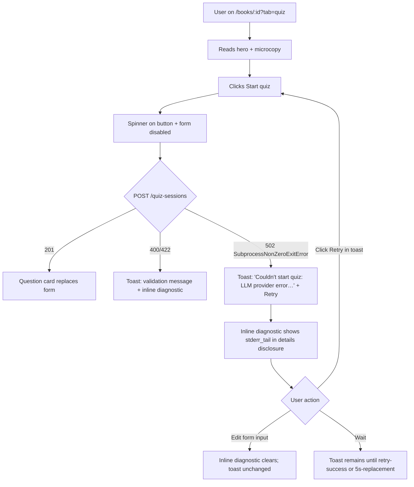
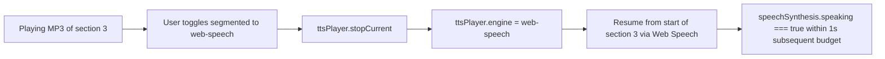
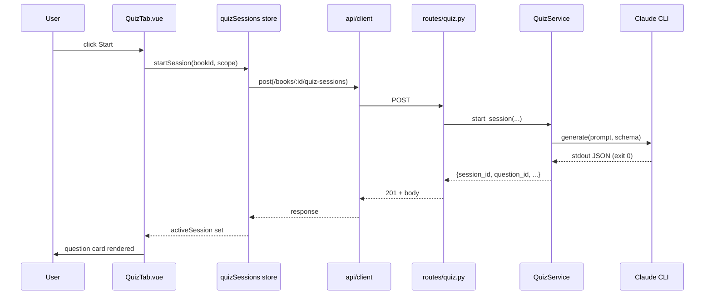
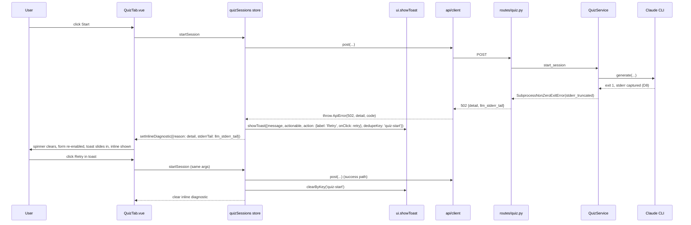

# Quiz & Audio UX — Top-7 Fixes — Technical Specification {#quiz-audio-ux-top7-spec}

## 1. Problem Statement {#problem-statement}

Quiz (v0.3.0) and Audio (v1.6) ship trust-breaking first-time UX: `POST /api/v1/books/{book_id}/quiz-sessions` returns a bare 500 with no UI feedback (Q-3), and the Audio empty-state hides the instant Web Speech path behind a single Generate CTA (A-1/A-3). Five additional findings (Q-1, Q-7, A-5, A-7) layer engineering jargon and mis-hierarchy onto the same surfaces. This spec turns the approved requirements (`01_requirements.md`) into an implementable plan: one small backend handler + CLI stderr capture, plus a focused frontend rework of three component families and one toast-store extension.

## 2. Goals {#goals}

| ID | Goal | Observable Outcome |
|----|------|--------------------|
| G1 | Errors visible | Failed quiz POST surfaces a toast within 1s with parseable detail; zero silent-fail console lines on the Quiz tab. E2E: stub 502, click Start, assert toast + Retry button. |
| G2 | Two real listening paths | Audio empty-state has parallel Listen + Generate CTAs; `speechSynthesis.speaking === true` within ≤2s on first chapter, ≤1s on subsequent. |
| G3 | Quiz self-explanatory | Quiz tab hero copy + count/duration microcopy present near Start button on first render. |
| G4 | 3-field estimate | Generate-audio modal regex matches all three of `to generate`, `to listen`, `on disk`. |
| G5 | Token jargon gone | `tokens` substring not visible on Quiz tab. |
| G6 | TTS settings reads as user copy | No `Spike` substring on `/settings/tts`; `data-testid="listen-comparison"` still mounted and functional. |
| G7 | Verb-led empty-state | Audio empty-state H2 starts with imperative verb ("Listen…"). |

## 3. Non-Goals {#non-goals}

Carried verbatim from requirements §Non-Goals plus spec-level additions:

- Full QnA UX critique (deferred to follow-up feature once Q-3 lands).
- Changing TTS persistence model (settled in 2026-05-03 spec D1/FR-28).
- Solving lavender button contrast (Q-6, medium severity).
- Solving the medium-severity X-* / Q-4..Q-10 / A-2..A-10 set.
- Changing quiz-session generation model (provider, prompts, scoring schema).
- Feature flags (single-user tool — direct ship).
- Parallel Listen + Generate in one session (mode-exclusive).
- Overwrite mode in Generate-audio modal — only sections without an MP3 generate this click (FR-PARTIAL-DELTA).
- Cross-session word-position carryover when toggling engines (FR-ENGINE-PICKER restart-section semantics only).
- Per-section regenerate workflow — content-type-level checkboxes only.
- Tightening G2 metric to first-phoneme audibility (S6 testing-note covers the gap).

## 4. Decision Log {#decision-log}

D1–D6 carried from requirements (D6 reversed). D7+ new, spec-level.

| #  | Decision | Options Considered | Rationale |
|----|----------|--------------------|-----------|
| D1 | Global API-error toast at client wrapper + opt-in inline DIAGNOSTIC region for user-initiated actions. Toast carries Retry; inline shows reason + Dismiss only. Toast non-user-dismissable when actionable; dedupe by message in 5s window; clear on retry-success. | (a) per-component try/catch; (b) global toast only; (c) inline only; (d) **hybrid (chosen)**. | (a) repeats code; (b) loses near-action anchor; (c) misses background errors. Tracks tkdodo / SWR convention. |
| D2 | Empty-state CTAs: "Listen" (primary) + "Generate MP3 files" (secondary). | (a) Listen now / Listen later; (b) Stream / Download; (c) engine names; (d) **artifact-named (chosen)**. | (a) hides artifact diff; (b) online/offline framing wrong; (c) requires learning engine names; (d) mirrors ElevenLabs / Speechify / NaturalReader. |
| D3 | 3-field estimate: `~Xmin to generate · ~Ymin to listen · ~ZMB on disk`. X/Z = delta; Y = whole-book. | (a) one ambiguous line; (b) two-line; (c) **3-field one-line (chosen)**; (d) 3-line vertical. | No peer splits all three; deliberate differentiator given disk-cost tradeoff. |
| D4 | Replace token progress with `X of N chapters · ~Y min reading`; tooltip the cap. | (a) hide entirely; (b) keep tokens; (c) **chapter+reading (chosen)**. | (a) loses cap-warning; (b) status-quo unintelligible. |
| D5 | Quiz orientation copy as always-on hero paragraph. | (a) dismissable callout; (b) tooltip; (c) **always-on hero (chosen)**; (d) modal first-visit. | Single-tenant; ~3 lines acceptable; simplest correct answer. |
| D6 | "Spike findings" RENAMED to "Compare voices"; preserve A/B button; replace dev-only fallback. | (a) **rename + clean (chosen)**; (b) remove block (original); (c) move to dev docs; (d) move button to engine-picker. | Codebase grill found user-valuable A/B button; renaming is lower-risk than relocating. |
| D7 | HTTP status for caught `SubprocessNonZeroExitError` = **502 Bad Gateway**. | (a) 500 generic; (b) 503 (already used for missing CLI); (c) **502 (chosen)**; (d) 504. | LLM CLI is a logical upstream dependency. 503 is reserved for "no CLI on PATH"; differentiating helps clients route the inline-diagnostic copy correctly. 504 is timeout-only. |
| D8 | Stderr capture window in `claude_cli.py` — keep last 2 KB of stderr stream as `stderr_truncated` (existing `STDERR_TRUNCATE` const) and pass it through to the route handler so the 502 detail body carries actionable diagnostic text. | (a) full stderr (PII risk on long traces); (b) first 2 KB; (c) **last 2 KB (chosen)**; (d) no truncation. | Last 2 KB captures the failure tail (where Python tracebacks land their final frame). Existing exception already has `stderr_truncated` plumbing — reuse, don't add new field. |
| D9 | Toast-store implementation: extend existing `stores/ui.ts` `showToast` rather than create new store. Backwards-compatible signature: `showToast(message, type, duration | options)` where `options = { duration, actionable, action: { label, onClick }, dedupeKey, dismissible }`. | (a) new `stores/toast.ts`; (b) extend ui.ts via positional args; (c) **extend ui.ts via overload-options object (chosen)**. | (a) duplicates plumbing in `ToastContainer`. (b) is brittle. (c) keeps existing call-sites working (`showToast('saved', 'success')`) while letting Quiz Start pass the rich object. |
| D10 | `voiceschanged` race: `Promise.race([voiceschangedEvent, sleep(500)])` — 500ms is the documented worst-case for Chrome/Safari cold tabs. | (a) await event indefinitely; (b) skip pre-warm entirely; (c) **race with 500ms timeout (chosen)**; (d) longer 1500ms timeout. | (a) blocks AudioTab on browsers that never fire (Firefox synchronous); (b) defeats FR-PRE-WARM; (d) inflates first-paint. 500 ms aligns with G2's ≤2s budget. |
| D11 | Engine picker placement: segmented control wrapped with the existing voice-selector inside a `flex-wrap items-center gap-3` container so they wrap together on narrow widths. (Resolves wireframes REVIEW-LOG #5.) | (a) segmented above playbar separately; (b) separate row; (c) **wrap-with-voice-selector (chosen)**; (d) inside Settings only. | (c) keeps "engine + voice" semantically grouped, scales gracefully to mobile, and matches `09_audio_populated_engine_picker_desktop-web.html`. |
| D12 | wpm storage: rename `Settings.audio.tts.wpm` → `listen_wpm`; ADD `Settings.reading.reading_wpm`. Pydantic validator reads legacy `wpm` field for one minor version (deprecation warning logged). Env vars: `BOOKCOMPANION_AUDIO__TTS__LISTEN_WPM`, `BOOKCOMPANION_READING__READING_WPM`. | (a) keep single `wpm`; (b) two new fields, drop legacy; (c) **rename + add + back-compat read (chosen)**; (d) move both under a new `wpm.*` namespace. | (a) leaves S1 asymmetry. (b) breaks any existing user override. (c) ships safely on a single-user tool; (d) over-engineers a 2-field migration. |
| D13 | Sample text source for FR-COMPARE-VOICES: `book.sections[0].content_md[:280]`, markdown-stripped (regex), session-cached on the SpikeFindingsBlock instance. Falls back to existing pangram only when no book context (e.g., Settings opened from app-shell directly). | (a) always pangram; (b) full first section (>280 chars unfair to Web Speech latency); (c) **first 280 chars cleaned (chosen)**; (d) per-call random section pick. | (c) reflects what the user will actually hear without making the A/B run unbearably long; cache-per-session prevents re-fetch on every press. |
| D14 | Quiz hero "~5 questions" copy resolution (OQ-4): inspect `quiz_service.start_session` → `compute_warm_up_candidates` returns 0..2 warm-ups, then exactly 1 first non-warm-up question is generated; **the session length is dynamic** (the user keeps requesting next questions until they end the session). Hero copy MUST therefore avoid promising a fixed N. Final string: *"Test your retention with AI-generated questions. We'll generate one question at a time — ~10 sec each — and score Got it / Partial / Missed."* | (a) "~5 questions"; (b) "4–6 questions"; (c) **"one question at a time" (chosen)**; (d) "as many as you want". | The backend has no fixed N — `start_session` returns one question and the user pulls more via `next-question`. (a)/(b) lie on first interaction. (d) feels open-ended without anchoring duration. |
| D15 | Toast fallback string when `ApiError.message` is empty or HTML-shaped (OQ-7): if `message.length === 0` OR matches `/^<!?(DOCTYPE|html|HTML)/`, substitute *"Couldn't start quiz — the server returned an unexpected error. Retry?"* (Start path) or *"Couldn't load the next question — try again."* (mid-session). HTML detection happens in the toast adapter, NOT the API client (keeps `ApiError.message` faithful for logs). | (a) raw HTML in toast (broken); (b) blank toast; (c) **detect + substitute (chosen)**; (d) strip-HTML render. | (d) risks XSS if not sanitized; substitution is safest for a single-user tool. |
| D16 | FR-Q3 502 response shape: `{detail: string, llm_stderr_tail?: string}`. `llm_stderr_tail` is OPTIONAL (only populated when `SubprocessNonZeroExitError.stderr_truncated` is non-empty); `detail` always carries `f"LLM provider error: {summary}"` where `summary` is the first 200 chars of `stderr_truncated` or `"<no output>"`. | (a) detail-only string; (b) **detail + tail (chosen)**; (c) full structured error tree. | (b) lets the inline-diagnostic surface the tail in a `<details>` disclosure for power users without cluttering the toast. |

## 5. User Personas & Journeys {#user-personas-journeys}

Single persona: self-hosted technical reader (P1). Carries J1–J6 + alt + error journeys from requirements + msf-findings. Two illustrative Mermaid diagrams below; remaining journeys narrated only.

### 5.1 J1 — First-time Quiz with E1 error path {#j1-first-time-quiz}



### 5.2 J4 — Engine picker mid-playback toggle {#j4-engine-picker-toggle}



### 5.3 Other journeys (narrated) {#other-journeys}

J2 (instant Listen — pre-warm on mount, ≤2s first chapter), J2.alt (FR-LISTEN-UNAVAILABLE — headline morph + disabled CTA + tooltip), J3 (Generate modal with 3-field estimate, FR-PARTIAL-DELTA delta vs total), J3.alt (Settings → Compare voices), E2 (mid-session retry via inline-with-Retry card per FR-MID-SESSION-RETRY), E3 (`speak()` throws — toast + empty-state restored, pre-warmed voice list retained per N4 deferred-but-noted).

## 6. System Design {#system-design}

### 6.1 Architecture {#architecture}

```
                ┌────────────────────────────────────────────┐
                │                Vue 3 SPA                   │
                │                                            │
                │  AudioTab ──┐                              │
                │  GenerateAudioModal ─┐                     │
                │  QuizTab ─┐          │                     │
                │  ScopePicker ─┐      │                     │
                │  SpikeFindingsBlock┐ │                     │
                │                    ▼ ▼                     │
                │          stores/ui (toast, ext. for D9)    │
                │          stores/ttsPlayer (engine state)   │
                │          stores/quizSessions               │
                │                    │                       │
                │            api/client (ApiError + 502)     │
                └────────────────────┼───────────────────────┘
                                     │ /api/v1/*
                                     ▼
                ┌────────────────────────────────────────────┐
                │            FastAPI + Uvicorn               │
                │                                            │
                │   routes/quiz.py ── start_session          │
                │     except SubprocessNonZeroExitError ──┐  │
                │     ↓                                   │  │
                │   503/400/422/502/504 mapping            │  │
                │                                         │  │
                │   services/quiz/quiz_service.py         │  │
                │      .start_session ─→ generate_question│  │
                │                            │            │  │
                │   services/summarizer/                  │  │
                │     claude_cli.py:194 (raise)  <────────┘  │
                │       stderr_truncated populated           │
                └────────────────────┬───────────────────────┘
                                     │ subprocess
                                     ▼
                              claude CLI (exit 1)
```

### 6.2 Sequence — Quiz Start happy path {#sequence-quiz-start-happy}



### 6.3 Sequence — Quiz Start error path (FR-Q3 + FR-INLINE-DIAGNOSTIC + FR-TOAST-LIFECYCLE) {#sequence-quiz-start-error}



### 6.4 Sequence — Engine picker toggle mid-playback {#sequence-engine-toggle}

```mermaid
sequenceDiagram
    participant U as User
    participant A as AudioTab.vue
    participant TP as ttsPlayer store
    participant SP as speechSynthesis
    participant HA as <audio> element

    U->>A: toggle segmented to web-speech (was mp3)
    A->>TP: setEngine('web-speech')
    TP->>HA: pause(); currentTime = 0
    TP->>TP: currentSectionIndex preserved
    TP->>SP: cancel(); speak(utteranceForSection)
    SP-->>U: speaking === true within 1s
```

## 7. Functional Requirements {#functional-requirements}

All FRs numbered FR-01..FR-NN for /plan reference. Names in parens map back to requirements doc IDs.

### 7.1 Backend / API {#backend-api}

| FR | Description | Acceptance |
|----|-------------|------------|
| FR-01 (FR-Q3-FIX-ROUTE) | Add `except SubprocessNonZeroExitError as e` after the existing `QuizGenerationError` clause in `start_session`, `next_question`, and `explain` handlers in `app/api/routes/quiz.py`. Map to `HTTPException(502, detail={"detail": f"LLM provider error: {summary}", "llm_stderr_tail": e.stderr_truncated or None})`. `summary` = `e.stderr_truncated[:200]` or `"<no output>"`. | pytest: stub `LLMProvider.generate` to raise `SubprocessNonZeroExitError(returncode=1, stderr_truncated="boom")`; assert response.status_code == 502, body has `detail` and `llm_stderr_tail == "boom"`. Three handlers covered. |
| FR-02 (FR-Q3-FIX-CLI) | `claude_cli.py:194` already populates `stderr_truncated` and `stderr_full` (verified). NO code change required if existing capture works; verification step: confirm `STDERR_TRUNCATE` const = 2048 and `proc.stderr.read()` is awaited before raise. If not present, add. | Unit test: invoke `_parse_response` with subprocess fake that exits 1 + writes "trace data" to stderr; assert raised exception's `stderr_truncated == "trace data"`. |
| FR-03 | Add `listen_wpm: int = Field(200, ge=100, le=400, multiple_of=25)` to `TTSConfig` (`config.py:98`). Add new `ReadingConfig` block with `reading_wpm: int = Field(250, ge=100, le=500, multiple_of=25)`; wire into `Settings` as `reading: ReadingConfig`. `/api/v1/settings` PATCH already supports partial-tree merge, so the new fields are writable for free. **No legacy field exists today** — purely additive; no rename / no backward-compat shim required. | pytest: PATCH with `{audio: {tts: {listen_wpm: 225}}}` → settings.audio.tts.listen_wpm == 225; PATCH with `{audio: {tts: {listen_wpm: 95}}}` → 422 (below ge=100); PATCH with `{reading: {reading_wpm: 275}}` → settings.reading.reading_wpm == 275. |

### 7.2 Toast & Error Surfacing {#toast-error-surfacing}

| FR | Description | Acceptance |
|----|-------------|------------|
| FR-04 (FR-TOAST-LIFECYCLE) | Extend `stores/ui.ts:showToast` per D9. New `Toast` fields: `actionable: boolean`, `action?: {label: string; onClick: () => void | Promise<void>}`, `dedupeKey?: string`, `dismissible: boolean` (default = !actionable). Behavior: actionable + non-dismissible toasts ignore close-X clicks AND lifetime-timer expiry; clear only on explicit `clearByKey(dedupeKey)` or replacement by another `showToast` with the same `dedupeKey`. Dedupe: same `message` within 5000ms replaces in place (preserves toast id). | Vitest: 6 cases — actionable persists past duration; close-X no-op when actionable; same dedupeKey replaces; different dedupeKey stacks; clearByKey clears only matching; non-actionable behaves as before. |
| FR-05 (FR-INLINE-DIAGNOSTIC) | Quiz Start error path renders an inline region under the Start button with: (a) failure reason from `ApiError.message` (or D15 fallback), (b) optional `<details>` disclosure showing `llm_stderr_tail`, (c) Dismiss link. NO Retry button. Region clears when (i) any input in `ScopePicker` changes, (ii) `clearByKey('quiz-start')` runs after retry success. | E2E: stub 502, click Start, assert region visible with reason; click `<details>` toggle, assert tail visible; type into theme input, assert region hidden. |
| FR-06 (FR-MID-SESSION-RETRY) | When `next-question` or `record-answer` fails mid-session, `QuestionCard` renders an inline error block WITH a Retry button bound to the failed action. NO toast fired (single error surface for mid-session). Session state (prior answers, question index) MUST persist — Retry resumes from the failed step, never restarts. | Vitest: stub fail then success on next-question; click Retry; assert prior answers array unchanged; assert question index advances on success. |
| FR-07 | API client wrapper (`stores/quizSessions` calling site) maps `ApiError.status` to user-facing message via D15 substitution table when message empty/HTML. The substitution lives in the store, NOT in `api/client.ts` (keeps `ApiError.message` faithful for logs). | Unit test: `ApiError.message = ""` → store passes `"Couldn't start quiz — the server returned an unexpected error. Retry?"` to `showToast`. |

### 7.3 Audio Empty + Listen {#audio-empty-listen}

| FR | Description | Acceptance |
|----|-------------|------------|
| FR-08 (FR-PRE-WARM) | On `AudioTab.vue` `onMounted`, call `speechSynthesis.getVoices()`; if returns `[]`, race `voiceschanged` event vs 500ms timeout (D10). Set local ref `voicesReady` to true after race. Listen CTA `disabled` while `!voicesReady`. | Vitest: mock `speechSynthesis` with delayed `voiceschanged`; assert disabled then enabled within 500ms. Browser smoke: Chrome/Safari latest. |
| FR-09 (FR-LISTEN-UNAVAILABLE) | When `'speechSynthesis' in window === false` OR (`voicesReady && getVoices().length === 0`): (a) headline morphs from "Listen to this book" to "Generate MP3s to listen to this book"; (b) Listen CTA stays mounted but `disabled`, with `aria-describedby="listen-tip"` referencing a `<span class="sr-only" id="listen-tip">Web Speech is unavailable in this browser. Generate MP3 files instead.</span>` (resolves wireframes REVIEW-LOG #2); (c) tooltip with same text on `:hover` and `:focus-visible`; (d) Generate CTA fully functional. | Vitest: `delete window.speechSynthesis` → headline matches morph regex + Listen has `disabled` + sr-only span exists. |
| FR-10 (G7 + Empty-state copy) | `AudioTab.vue` no-audio branch replaces current markup with: (i) `<h2>Listen to this book</h2>` (verb-led); (ii) subtitle "Instant playback via your browser, or generate MP3s for offline listening."; (iii) parallel CTAs row (`flex-wrap items-center gap-3` per D11): `[Listen]` primary + `[Generate MP3 files]` secondary; (iv) caption demoted: "No audio files yet — generate to enable seek/scrub." | E2E DOM: H2 starts with "Listen"; both CTAs visible; caption text-slate-500 ≥ 4.5:1 contrast (per wireframes review). See `wireframes/05_audio_empty_default_desktop-web.html`. |

### 7.4 Audio Populated + Engine Picker {#audio-populated-engine-picker}

| FR | Description | Acceptance |
|----|-------------|------------|
| FR-11 (FR-ENGINE-PICKER) | Populated-state branch (`partial`/`full`) renders both Listen + Generate CTAs always. Engine selector = segmented control with two buttons (`web-speech` / `mp3`), wrapped with the existing voice selector in a `flex-wrap items-center gap-3` div (D11). Default rule: if `coverage.generated >= 1` → `mp3`; else → `web-speech`. Persists in `ttsPlayer.engine` (Pinia, session-scoped); cross-session via existing `Settings.audio.tts.engine`. | E2E: book with 0 MP3s → segmented defaults web-speech; generate one MP3 + reload → defaults mp3. See `wireframes/09_audio_populated_engine_picker_desktop-web.html`. |
| FR-12 (FR-ENGINE-PICKER mid-playback) | Toggling engine while playing: stop current playback, set `currentTime = 0` for `<audio>` (or `speechSynthesis.cancel()` for Web Speech), then re-issue play for the SAME `currentSectionIndex` in the new engine. No word-position carryover (explicit non-goal). | Vitest: simulate toggle mid-play; assert new engine.play() called with same section; assert old engine stopped. |

### 7.5 Generate-Audio Modal {#generate-audio-modal}

| FR | Description | Acceptance |
|----|-------------|------------|
| FR-13 (FR-PARTIAL-DELTA + D3 3-field) | Replace `cost-estimate` line with three labelled fields rendered inline: `<span data-testid="estimate-generate">~Xmin to generate</span> · <span data-testid="estimate-listen">~Ymin to listen</span> · <span data-testid="estimate-disk">~ZMB on disk</span>`. X/Z compute on **delta** (sections without an MP3 for the toggled content type); Y computes on whole-book using `Settings.audio.tts.listen_wpm`. Subline: "Generating {N} of {M} sections" (resolves wireframes REVIEW-LOG #6 — drop `(delta)` parenthetical). | Vitest: 3 cases — empty book all-deltas; partial 3-of-17 sections; all-already-generated → all checkboxes disabled + button label "Nothing to generate" (resolves REVIEW-LOG #7). |
| FR-14 | Modal close-X icon button (resolves REVIEW-LOG: existing `role="dialog"` + `aria-modal="true"` + `aria-labelledby="gen-audio-title"` already present — add only the close-X). Close-X has `aria-label="Close generate audio dialog"` and triggers `emit('close')`. **Esc keybinding (added by /plan loop 1):** modal MUST also `emit('close')` on `keydown.esc` — wire via `@keydown.esc.stop="$emit('close')"` on the dialog wrapper. Implementation note: per CLAUDE.md "global vs scoped Esc handler" learning, audit existing `e.key === 'Escape'` handlers repo-wide before adding; if a global one already calls `emit('close')` for any open dialog via app-shell delegation, prefer that and document the routing instead of adding a duplicate handler. | DOM assertion: button visible top-right with aria-label; click triggers close. Vitest: dispatch `keydown` Escape on the dialog wrapper → `emit('close')` fires once. |
| FR-15 | Estimate row updates reactively on checkbox toggle (already wired via `totalUnitsToGenerate` computed; spec requires the label `Generating {N} of {M} sections` to read the same `totalUnitsToGenerate` so users see reactivity). | Vitest: toggle includeAnnotations; assert subline updates. |

### 7.6 Settings → TTS {#settings-tts}

| FR | Description | Acceptance |
|----|-------------|------------|
| FR-16 (FR-WPM-CONFIG split) | `SettingsTtsPanel.vue` mounts a labelled slider for `audio.tts.listen_wpm` (range 100–400, step 25, default 200). The `reading.reading_wpm` slider (range 100–500, step 25, default 250) is mounted as a **colocated section within `SettingsTtsPanel.vue`** under a "Reading speed" sub-heading (resolves /plan disposition: single Settings surface; no new route or component file). Both PATCH `/api/v1/settings` on commit (debounced 300ms during drag). **PATCH-failure UX (added by /plan loop 1):** on PATCH error response (any non-2xx), the slider value reverts to its prior committed value AND a confirmation-tier toast fires with copy `"Couldn't save setting — change reverted."` (4s auto-dismiss per FR-09). Implementation: `SettingsTtsPanel` keeps `pendingValue` state; on `success` → commit; on `error` → restore + showToast. | Vitest: render + drag slider; assert PATCH body. Vitest (new): stub PATCH to 500; assert slider reverts + `ui.toasts` has the copy above. E2E: change values, assert Generate-modal Y and ScopePicker reading-time recompute. |
| FR-17 (FR-COMPARE-VOICES + D6 rename) | Rename `SpikeFindingsBlock.vue` heading to "Compare voices" (no `Spike` substring). Replace dev-only fallback paragraph "Run bookcompanion spike tts…" with: "Hear the same sample in both engines below. Click to compare Kokoro and your browser's Web Speech voice side by side." Keep `data-testid="listen-comparison"` button mounted regardless of `data.available` — A/B uses `/api/v1/audio/sample` which streams Kokoro on demand (does not require pre-generated MP3s; resolves S5). Optional file rename to `CompareVoicesBlock.vue` is OUT of scope for this release (defer to follow-up). | E2E: navigate to `/settings/tts#audio`; assert no `Spike` text; assert listen-comparison button present + clickable on a fresh DB. |
| FR-18 (FR-COMPARE-VOICES engine label) | During A/B playback, mount a transient chip near the button that names the currently-playing engine. Sequence: chip shows "Playing Kokoro (af_sarah)…" while Kokoro plays; on Kokoro `ended` (or fetch-failure), chip changes to "Playing Web Speech…" while Web Speech plays; on Web Speech `onend`, chip clears after 1s. Use `bc-chip--engine` class for both states (resolves REVIEW-LOG #9). | Vitest: simulate Kokoro fetch + play; assert chip text transitions. |
| FR-19 (FR-COMPARE-VOICES sample text per D13) | Sample-text source: when component receives `bookId` prop (mounted from a book context), fetch `book.sections[0].content_md`, strip markdown via existing `markdown-it` strip helper, take first 280 chars, cache in component-local `sampleText` ref. Else fallback to existing pangram. | Vitest: bookId provided → fetched + stripped; bookId absent → pangram. |

### 7.7 Quiz Hero + Scope Picker {#quiz-hero-scope}

| FR | Description | Acceptance |
|----|-------------|------------|
| FR-20 (Q-1 + D5 + D14) | `QuizTab.vue` renders an always-on hero block above the form: H2 "Test your retention" + paragraph (D14 final string). Microcopy near Start button: "One question at a time · ~10 sec to generate · scored Got it / Partial / Missed". | DOM: hero paragraph + microcopy text present. See `wireframes/01_quiz_first_visit_desktop-web.html`. |
| FR-21 (Q-7 + D4 + FR-WPM-CONFIG) | `ScopePicker.vue` (specific_chapters branch): replace `0 / 60,000 tokens` progress bar with `<p>{X} of {N} chapters · ~{Y} min reading</p>` where Y = `sum(selected_section.word_count) / settings.reading.reading_wpm`. Plural template: `n === 1 ? 'chapter' : 'chapters'` (resolves N2 deferred). Keep `<title>`-attribute tooltip with the underlying token count + cap. Tabstrip ARIA: `role="tablist"` on parent, `role="tab"` + `aria-selected` on each (resolves REVIEW-LOG #4). | E2E: assert no `tokens` substring in panel; chapter+reading text matches regex. |
| FR-22 (REVIEW-LOG cleanup) | Cross-file fixes: state-slug `data-state="error"` → `confirming` / `toggled` / `recovered` per state semantics in `QuizTab`, `GenerateAudioModal` (REVIEW-LOG #3); remove the toast meta-copy span "No dismiss — sticky until retry success." from the toast template (REVIEW-LOG #1); regenerate-CTA caption replaces "delta" jargon with "~30 sec to generate · ~9 MB on disk" (REVIEW-LOG #10); footer reference "Settings → Text-to-speech" wired as anchor `/settings/tts#audio` (REVIEW-LOG #8). | Verified per-file in /verify Playwright pass. |

## 8. Non-Functional Requirements {#non-functional-requirements}

| ID | NFR | Target | Measurement |
|----|-----|--------|-------------|
| NFR-01 | Pre-warm latency | ≤500ms from AudioTab mount to Listen CTA enabled | Vitest perf timer |
| NFR-02 | First-listen latency | ≤2s first chapter / ≤1s subsequent (`speechSynthesis.speaking === true`) | E2E with G2 testing-note caveat |
| NFR-03 | Toast render | <100ms from `showToast` call to DOM-paint | Performance API mark/measure |
| NFR-04 | Modal estimate compute | <50ms on checkbox toggle | Vitest |
| NFR-05 | Accessibility | WCAG 2.2 AA: contrast ≥ 4.5:1 on all text; aria-label on icon-only buttons; `role="dialog"` + `aria-modal` on Generate modal; `:focus-visible` rings on every interactive element; tabstrip with `role="tablist"` + `aria-selected` (REVIEW-LOG #4) | axe-core in vitest + manual sweep |
| NFR-06 | Browser support | Chrome/Safari/Firefox last 2 versions; Safari 16+ floor; Web Speech tested on Safari + Chrome (Firefox falls back to FR-LISTEN-UNAVAILABLE if voices empty) | Manual smoke |

## 9. API Contracts {#api-contracts}

### 9.1 POST /api/v1/books/{book_id}/quiz-sessions {#post-quiz-sessions}

**Request:** existing `QuizStartRequest` schema (unchanged):
```json
{ "scope": { "mode": "all_summaries" | "specific_chapters", "section_ids": [int] | null }, "theme": "string | null" }
```

**Responses (existing — unchanged):**
- `201` — `QuizStartResponse` (existing).
- `400` — `{detail: str}` (QuizValidationError).
- `422` — `{detail: str}` (QuizBudgetError, FastAPI body validation).
- `503` — `{detail: str}` (SubprocessNotFoundError — LLM CLI missing on PATH).
- `504` — `{detail: str}` (SubprocessTimeoutError).

**New (FR-01 + D7 + D16):**
- `502` — `{detail: str, llm_stderr_tail?: str | null}`. Triggered by caught `SubprocessNonZeroExitError`. `detail` always `"LLM provider error: <summary>"`; `llm_stderr_tail` populated when stderr_truncated non-empty.

### 9.2 POST /api/v1/quiz-sessions/{session_id}/next-question {#post-next-question}

Same 502 contract added. Carries the existing 200/400/422/503/504 unchanged.

### 9.3 POST /api/v1/quiz-sessions/{session_id}/questions/{question_id}/explain {#post-explain}

Same 502 contract added.

### 9.4 PATCH /api/v1/settings {#patch-settings}

Existing route at `backend/app/api/routes/settings.py:32` extended. Backend inspection revealed `TTSConfig` (`backend/app/config.py:98`) currently has `engine`, `voice`, `default_speed`, `auto_advance`, `prewarm_on_startup`, `annotation_context` — **no `wpm` field exists today**. There is no `ReadingConfig` block at all. So the change is purely additive (no rename / no legacy field):

- New field on `TTSConfig`: `listen_wpm: int = Field(200, ge=100, le=400, multiple_of=25)`.
- New top-level config block `ReadingConfig` with `reading_wpm: int = Field(250, ge=100, le=500, multiple_of=25)`. Wire into `Settings` as `reading: ReadingConfig = Field(default_factory=ReadingConfig)`.
- Settings persistence: writes flow to the existing canonical `settings.yaml` (XDG-stored — see `_load_yaml_config()` in `config.py`). PATCH semantics unchanged: partial-tree merge.
- Env-var support: `BOOKCOMPANION_AUDIO__TTS__LISTEN_WPM` and `BOOKCOMPANION_READING__READING_WPM` follow the existing `pydantic-settings` `__`-delimiter convention.

No backward-compat shim is required because no `wpm` field shipped previously. Strike the legacy-field references elsewhere in this spec.

Response (existing): updated settings tree, including the new keys.

## 10. Database Design {#database-design}

**No schema changes.** wpm settings persist to `settings.yaml` (XDG-stored) via the existing PATCH `/api/v1/settings` route + `_load_yaml_config()` round-trip. There is no `Settings` ORM table for these fields — verified by reading `backend/app/config.py` (Pydantic-only), and `backend/app/api/routes/settings.py:32-63` (writes back to YAML on PATCH). Toast state is in-memory (Pinia, never persisted). The TTS engine selection (`Settings.audio.tts.engine`) is already persisted via the same mechanism — no migration needed.

## 11. Frontend Design {#frontend-design}

### 11.1 Component hierarchy (changed components only) {#component-hierarchy}

```
AppShell.vue
├── ToastContainer.vue (extended per FR-04)
└── Routes
    ├── BookDetailView
    │   ├── QuizTab.vue (FR-20)
    │   │   ├── QuizHero.vue (NEW — FR-20; or inline in QuizTab)
    │   │   ├── ScopePicker.vue (FR-21)
    │   │   ├── InlineDiagnostic.vue (NEW — FR-05)
    │   │   └── QuestionCard.vue (FR-06 inline retry)
    │   └── AudioTab.vue (FR-08, FR-09, FR-10, FR-11, FR-12)
    │       ├── EnginePicker.vue (NEW — segmented control, FR-11)
    │       ├── EngineChip.vue (existing — relabel logic FR-18)
    │       ├── GenerateAudioModal.vue (FR-13, FR-14, FR-15)
    │       └── DifferencePopover.vue (existing — unchanged)
    └── SettingsView (`/settings/:section?`)
        ├── SettingsTtsPanel.vue (FR-16, FR-17)
        │   ├── WpmSlider.vue (NEW — FR-16, listen_wpm)
        │   └── SpikeFindingsBlock.vue → relabel "Compare voices" (FR-17, FR-18, FR-19)
        └── SettingsReadingPanel.vue (NEW or extend existing — FR-16 reading_wpm)
```

### 11.2 State management {#state-management}

| Store | Changes | FR |
|-------|---------|----|
| `stores/ui.ts` | Extend `Toast` interface + `showToast` per D9. Add `clearByKey(key: string)` action. Dedupe map `Map<string, number>` keyed on dedupeKey. | FR-04 |
| `stores/ttsPlayer.ts` | Existing — no schema change. Add `setEngine(kind)` action that performs the stop-then-restart-section logic (FR-12). | FR-11, FR-12 |
| `stores/quizSessions.ts` | Add `inlineDiagnostic: {reason: string, stderrTail: string | null} | null` reactive ref. Add `clearInlineDiagnostic` action (called on input change OR after retry success). startSession catch block calls `showToast({actionable: true, action, dedupeKey: 'quiz-start', dismissible: false})` AND sets inlineDiagnostic. | FR-05, FR-07 |

### 11.3 Wireframe references {#wireframe-references}

| Component / state | Wireframe |
|------|-----------|
| Quiz first-visit hero + microcopy | `wireframes/01_quiz_first_visit_desktop-web.html` |
| ScopePicker chapter+reading metric | `wireframes/02_quiz_specific_chapters_desktop-web.html` |
| Quiz Start error (toast + inline diagnostic) | `wireframes/03_quiz_error_start_desktop-web.html` |
| Quiz mid-session inline retry | `wireframes/04_quiz_error_midsession_desktop-web.html` |
| Audio empty default (verb-led + parallel CTAs) | `wireframes/05_audio_empty_default_desktop-web.html` |
| Audio empty Web Speech unavailable | `wireframes/06_audio_empty_no_web_speech_desktop-web.html` |
| Generate modal empty (3-field estimate) | `wireframes/07_generate_modal_empty_desktop-web.html` |
| Generate modal partial / all-already-generated | `wireframes/08_generate_modal_partial_desktop-web.html` |
| Audio populated + engine picker | `wireframes/09_audio_populated_engine_picker_desktop-web.html` |
| Settings Compare voices A/B + chip | `wireframes/10_settings_compare_voices_desktop-web.html` |

## 12. Edge Cases {#edge-cases}

| # | Scenario | Handling |
|---|----------|---------|
| EC-01 | LLM provider missing entirely (`shutil.which` returns None) | Existing 503 path via `SubprocessNotFoundError` continues to fire — `_require_service` raises before `start_session` body. Toast shows "LLM provider not configured" (existing behavior). |
| EC-02 | `voiceschanged` never fires (Firefox synchronous; Edge legacy) | D10 race resolves on 500ms timeout; Listen CTA enables with whatever voices are loaded. If `getVoices().length === 0` after timeout → FR-09 morph kicks in. |
| EC-03 | User dismisses toast via keyboard (Esc) during retry-in-flight | FR-04 actionable toasts ignore Esc/X; only `clearByKey('quiz-start')` (called on retry-success) clears them. |
| EC-04 | Same Quiz Start error fires twice within 5s | FR-04 dedupe by message in 5s window: same message replaces in place (preserves toast id, resets timer). Different message stacks. |
| EC-05 | User toggles engine mid-MP3-buffering (FR-12) | `setEngine` cancels both engines (calls `<audio>.pause()` AND `speechSynthesis.cancel()`), resets `<audio>.currentTime = 0`, then plays current section in new engine. No carryover. |
| EC-06 | Mid-session next-question fails after 2 prior answers (FR-06) | QuestionCard shows inline error + Retry; `quizSessions.questions` array unchanged; `currentIndex` unchanged; on Retry success the next question appends. |
| EC-07 | Generate modal opened on fully-populated book (FR-13 all-already-generated) | All checkboxes disabled; "Generate" button label morphs to "Nothing to generate" (REVIEW-LOG #7); button `disabled`. Banner above explains state. |
| EC-08 | Compare voices opened with no audio yet (FR-17, FR-19) | Button mounted regardless of `data.available`. `/api/v1/audio/sample` streams Kokoro on demand — works on fresh install. Sample text falls back to pangram if no `bookId` prop. |
| EC-09 | `ApiError.message` contains uvicorn HTML 500 page | FR-07 + D15 detect via regex on `<!DOCTYPE`/`<html>`/empty; substitute fallback string before passing to `showToast`. |
| EC-10 | User edits scope while inline diagnostic visible (FR-05) | `ScopePicker` emits `change` on any input mutation; `quizSessions.clearInlineDiagnostic()` runs. Toast unaffected (still actionable until retry). |

## 13. Configuration & Feature Flags {#configuration-feature-flags}

No feature flags. New environment / settings entries:

| Key | Default | Range | Notes |
|-----|---------|-------|-------|
| `BOOKCOMPANION_AUDIO__TTS__LISTEN_WPM` | 200 | 100–400 step 25 | Drives Generate-modal Y estimate. |
| `BOOKCOMPANION_READING__READING_WPM` | 250 | 100–500 step 25 | Drives ScopePicker reading-time estimate. |

**Backward compatibility:** N/A — no `wpm` field shipped previously. Both env vars and YAML keys are net-new.

## 14. Testing & Verification Strategy {#testing-verification-strategy}

### 14.1 Unit / integration {#unit-integration}

```bash
# Backend
cd backend
uv run python -m pytest tests/unit/api/test_quiz_route.py::test_502_on_subprocess_nonzero -v
uv run python -m pytest tests/unit/api/test_quiz_route.py::test_502_includes_stderr_tail -v
uv run python -m pytest tests/unit/api/test_quiz_route.py::test_502_on_next_question -v
uv run python -m pytest tests/unit/api/test_quiz_route.py::test_502_on_explain -v
uv run python -m pytest tests/unit/services/test_claude_cli_stderr_capture.py -v
uv run python -m pytest tests/unit/api/test_settings_wpm_split.py -v
uv run python -m pytest tests/integration/test_settings_wpm_legacy_field.py -v

# Frontend
cd frontend
npm run test:unit -- src/stores/__tests__/ui.spec.ts
npm run test:unit -- src/stores/__tests__/quizSessions-error-flow.spec.ts
npm run test:unit -- src/components/audio/__tests__/AudioTab-prewarm.spec.ts
npm run test:unit -- src/components/audio/__tests__/AudioTab-listen-unavailable.spec.ts
npm run test:unit -- src/components/audio/__tests__/EnginePicker.spec.ts
npm run test:unit -- src/components/audio/__tests__/GenerateAudioModal-3field.spec.ts
npm run test:unit -- src/components/quiz/__tests__/QuizTab-hero.spec.ts
npm run test:unit -- src/components/quiz/__tests__/ScopePicker-reading-metric.spec.ts
npm run test:unit -- src/components/settings/__tests__/SpikeFindingsBlock-rename.spec.ts
npm run test:unit -- src/components/settings/__tests__/SpikeFindingsBlock-engine-chip.spec.ts
```

### 14.2 E2E / Playwright (per CLAUDE.md interactive verification protocol) {#e2e-playwright}

```bash
# Start verification server on free port (per CLAUDE.md §Interactive verification)
cd backend && uv run bookcompanion serve --port 8765 &
cd frontend && npm run build && rm -rf ../backend/app/static && cp -R dist ../backend/app/static
curl -sf http://localhost:8765/api/v1/health
```

Three highest-risk Playwright MCP smoke flows:

1. **FR-01/FR-04/FR-05 — Quiz error toast + inline diagnostic**
   - Stub `/api/v1/books/1/quiz-sessions` to return 502 `{detail: "LLM provider error: stub", llm_stderr_tail: "trace…"}`
   - Click Start; assert toast slides in within 1s with Retry button.
   - Try clicking toast close-X — assert toast remains (FR-04 non-dismissable).
   - Assert inline diagnostic block under Start button contains "LLM provider error: stub" + `<details>` showing tail.
   - Type into theme input; assert inline clears, toast remains.
   - Click toast Retry; un-stub; assert toast clears + question card renders.

2. **FR-11/FR-12 — Engine picker toggle**
   - Seed book with one MP3 generated.
   - Navigate Audio tab; assert segmented defaults `mp3`.
   - Click Listen; wait for playing.
   - Toggle to `web-speech`; assert `<audio>` paused + `speechSynthesis.speaking === true` within 1s.
   - Toggle back to `mp3`; assert MP3 resumes from start of same section.

3. **FR-17/FR-18/FR-19 — Compare voices A/B chip**
   - Navigate `/settings/tts#audio`; assert page anchor lands on Compare voices block.
   - Assert no `Spike` substring on page.
   - Click "Listen to comparison".
   - Assert chip with `bc-chip--engine` class shows "Playing Kokoro (af_sarah)…".
   - Wait for Kokoro to end; assert chip transitions to "Playing Web Speech…".
   - Assert sample text logged (browser_console_messages) starts with first 280 chars of seeded book's section[0].

### 14.3 Tear down {#tear-down}

```bash
kill $(lsof -ti:8765)
```

### 14.4 Regression test hardening {#regression-test-hardening}

After /verify, freeze any new Playwright assertions into `frontend/e2e/quiz-audio-ux-top7.spec.ts`. Backend pytest cases live under `tests/unit/` and `tests/integration/` per existing layout.

## 15. Rollout Strategy {#rollout-strategy}

Single-user tool — single release, no staging.

### 15.1 Migration order {#migration-order}

1. **Backend route fix (FR-01, FR-02)** — cheapest, fixes invisible 500 immediately. Independent of frontend. Ship + manual smoke before continuing.
2. **Toast store extension (FR-04)** — unblocks all UX work; backwards-compat with existing `showToast(msg, type, duration)` signature so no caller breaks.
3. **wpm settings split (FR-03, FR-16)** — needed by FR-13 (modal Y) and FR-21 (reading metric). Backward-compat read of legacy `wpm` keeps any user override working.
4. **Per-component changes (FR-05..FR-22)** — order doesn't matter; ship as one PR or several. Suggested grouping:
   - Quiz family: FR-05, FR-06, FR-07, FR-20, FR-21, FR-22 (state-slug cleanup)
   - Audio family: FR-08, FR-09, FR-10, FR-11, FR-12, FR-13, FR-14, FR-15
   - Settings family: FR-17, FR-18, FR-19

### 15.2 Rollback {#rollback}

Single-user, single-branch — `git revert <merge-commit>`. No shared state. Settings backward-compat means a rollback after users have written `listen_wpm` will reset their override (they'd need to re-set `wpm`); acceptable for single-user.

### 15.3 Deprecation timeline {#deprecation-timeline}

`audio.tts.wpm` legacy field accepted with structlog warning through v1.7.x; removed in v1.8.0. Single deprecation banner in changelog at v1.7.0 release.

## 16. Research Sources {#research-sources}

Inherits all sources from `01_requirements.md` §Research Sources. Spec-level additions:

| Source | Type | Use |
|--------|------|-----|
| `backend/app/api/routes/quiz.py:265-313` | Existing impl | start_session handler — FR-01 patch site. |
| `backend/app/services/quiz/quiz_service.py:182, 310` | Existing impl | LLM call sites that propagate `SubprocessNonZeroExitError`. |
| `backend/app/services/summarizer/claude_cli.py:184-198` | Existing impl | `STDERR_TRUNCATE` already populated; FR-02 = verify, not modify. |
| `backend/app/exceptions.py:61-74` | Existing impl | `SubprocessNonZeroExitError` already inherits `SummarizationError` and exposes `stderr_truncated` — D8 reuses, no new field. |
| `frontend/src/api/client.ts:30-41` | Existing impl | `ApiError` already parses `body.detail` ?? statusText; no client change needed (D15 substitution lives in store, not client). |
| `frontend/src/stores/ui.ts:33-44` | Existing impl | `showToast` signature extension surface for D9. |
| `frontend/src/components/audio/AudioTab.vue:1-198` | Existing impl | Empty-state + populated branch markup baseline. |
| `frontend/src/components/audio/GenerateAudioModal.vue:46-47, 134` | Existing impl | Cost-estimate line FR-13 patch site. |
| `frontend/src/components/settings/SpikeFindingsBlock.vue:67-80` | Existing impl | Heading rename + `data-testid="listen-comparison"` preservation surface. |
| https://material.io/components/snackbars#actions | Industry | Material Design Snackbar action variant — sticky-with-action pattern referenced for FR-04 non-dismissable rule. |
| https://docs.sentry.io/platforms/javascript/configuration/transports/ | Industry | Sentry "we'll keep retrying" pattern for actionable error surfacing — informs FR-04 retry-success-clears semantics. |
| `wireframes/REVIEW-LOG.md` deferred set (#1–#10) | Internal artefact | Each item absorbed as listed in FR-09, FR-13, FR-14, FR-17, FR-18, FR-21, FR-22. |
| `msf-findings.md` Nice items N1–N4 | Internal artefact | N2 (plural) absorbed into FR-21; N1, N3 (sample text), N4 (E3 retain pre-warm) noted in spec text — N1 + N4 deferred to follow-up. |
