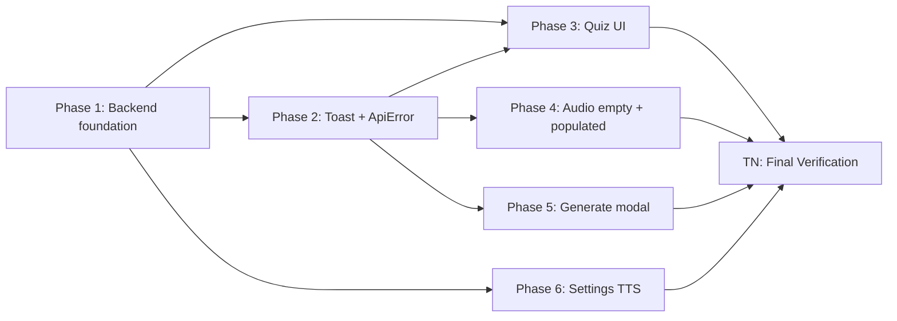

# Quiz & Audio UX — Top-7 Fixes — Implementation Plan

## Overview

Implement the 22 numbered FRs in `02_spec.md` across one backend slice (route handler + CLI verification + additive `wpm` config) and six frontend slices (toast extension, Quiz UI, Audio empty/populated, Generate modal, Settings → TTS), driven by 10 wireframes and the 10 deferred review-log fixes.

**Done when:**
1. `pytest backend/tests/` is green and includes ≥9 new test cases (FR-01 × 3 handlers, FR-02 stderr capture, FR-03 listen_wpm + reading_wpm + 422 below-min + 422 above-max + unrelated-key-preserve).
2. `npm run test:unit` is green and includes ≥10 new component/store specs (FR-04 6 cases, FR-05, FR-06, FR-08, FR-09, FR-12, FR-13 3 cases, FR-15, FR-18, FR-19, FR-20, FR-21).
3. `ruff check && ruff format --check .` passes on backend; `npm run lint && npm run type-check` passes on frontend.
4. The 3 Playwright MCP smoke flows in TN pass on a freshly-seeded `:8765` server (Quiz error toast + retry-clears, engine-picker toggle <1s subsequent listen, Compare-voices A/B chip transitions).
5. All 7 G-goals (G1–G7) measured in `02_spec.md#goals` evaluate true in the running app (zero `tokens` substring on Quiz tab, zero `Spike` substring on `/settings/tts`, H2 starts with "Listen", regex finds `to generate`/`to listen`/`on disk`, etc.).
6. Hard-reload of `/books/1?tab=quiz` and `/books/1?tab=audio` shows no console errors and the new states render correctly (router-resolver regression catch).
7. `git diff` on `settings.yaml` after PATCH shows only intended keys touched (round-trip preservation test, mitigates R4).

**Done-when walkthrough:**

The user opens `:8765/books/1?tab=quiz` (cold cache), reads the new hero "Test your retention…" and the count microcopy under Start (FR-20). They click **Start quiz** with all_summaries scope. The stub forces a 502 (mid-test injection); within 1s the toast slides in carrying "LLM provider error: stub" and a Retry button (FR-01 → FR-04 → FR-09 dedupeKey: `quiz-start`). The user clicks the toast close-X — nothing happens (FR-04 actionable+!dismissible). The inline diagnostic under Start exposes the same reason with a `<details>` disclosure showing the stderr tail (FR-05 → FR-01 D16). The user types into the theme input — inline clears, toast persists (EC-10). The user clicks Retry, the stub un-stubs, the toast clears via `clearByKey('quiz-start')`, and the question card renders (J1 happy path).

They navigate to `?tab=audio`, see the H2 "Listen to this book" with parallel `[Listen] [Generate MP3 files]` CTAs (FR-10, wireframe `05`). The mount called `getVoices()` already; `voicesReady` flipped to true within ≤500ms (FR-08). They click **Listen** — `speechSynthesis.speaking === true` within ≤2s on this cold first chapter (G2/NFR-02). They open Generate — see "~6min to generate · ~22min to listen · ~18MB on disk" three-field row + "Generating 17 of 17 sections" (FR-13, wireframe `07`). They cancel, generate one MP3 manually via CLI fallback, reload, see segmented `[mp3 | web-speech]` defaulting to `mp3` (FR-11 default rule, wireframe `09`). They toggle to `web-speech` mid-MP3 — `<audio>` pauses, `currentTime=0`, Web Speech speaks current section, `speaking===true` within ≤1s subsequent budget (FR-12, J4 sequence diagram).

In Settings → TTS (`/settings/tts#audio`), no `Spike` substring appears anywhere; the **Compare voices** heading and `data-testid="listen-comparison"` button render (FR-17, wireframe `10`). They click Listen-to-comparison; chip "Playing Kokoro (af_sarah)…" appears in `bc-chip--engine` styling, transitions to "Playing Web Speech…" on Kokoro `ended`, clears 1s after Web Speech `onend` (FR-18). The sample text was the first 280 chars of the seeded book's section[0] markdown-stripped (FR-19, D13). The two new sliders (`listen_wpm` 100–400 step 25, `reading_wpm` 100–500 step 25) PATCH `/api/v1/settings` and the values surface back in Generate-modal Y and ScopePicker reading-time (FR-16). Quiz scope picker, Specific Chapters branch, shows "4 of 12 chapters · ~30 min reading" with no `tokens` substring (FR-21, wireframe `02`).

**Execution order:**



1. **Phase 1 (5 tasks, sequential)** — T1 → T5. Backend foundation. **Phase boundary: full /verify.**
2. **Phase 2 (3 tasks, sequential)** — T6 → T8. Toast store + ApiError parsing.
3. **Phase 3 [P] (5 tasks)** — T9 → T13. Quiz UI. Parallelizable with P4/P5/P6 after Phase 2.
4. **Phase 4 [P] (5 tasks)** — T14 → T18. Audio empty + populated.
5. **Phase 5 [P] (3 tasks)** — T19 → T21. Generate modal.
6. **Phase 6 [P] (4 tasks)** — T22 → T25. Settings → TTS.
7. **TN (1 task, terminal)** — Final Verification.

Total: T0 + 25 numbered tasks across 6 phases + TN = 27 work items.

## Decision Log

| # | Decision | Options Considered | Rationale |
|---|----------|--------------------|-----------|
| P1 | **Backend-first phase ordering.** FR-01 / FR-02 / FR-03 land in Phase 1 before any UI work. | (a) UI-first with mocked 502; (b) **backend-first (chosen)**; (c) interleaved per-FR. | (a) lets a real shipping bug (Q-3 silent 500) keep biting until the last PR. (b) lets the trust-regression heal independently and gives the frontend tasks a real 502 to consume. (c) interleaves test fixtures across PRs — friction on a single-user tool. |
| P2 | **Toast-store extension as Phase 2 foundation.** Sole consumer of Phase 1's 502 contract; producer for Phases 3–6. | (a) inline showToast extensions per-component; (b) **Phase-2 foundation (chosen)**; (c) defer to Phase 3 (Quiz UI). | (a) duplicates `dedupeKey`/`clearByKey` plumbing in 4+ components. (b) one-shot extension keeps backwards-compat with existing callers (per CLAUDE.md gotcha #28 setup-store conventions) and unblocks every later phase. (c) blocks P4/P5/P6 unnecessarily. |
| P3 | **Per-component frontend phases (3, 4, 5, 6) parallelizable after Phases 1–2.** | (a) strict sequential; (b) **parallel after foundation (chosen)**; (c) all-at-once monolith PR. | (a) inflates wall-time on a personal-tool deadline. (b) the four families touch disjoint components (`QuizTab`/`ScopePicker`, `AudioTab`/`EnginePicker`, `GenerateAudioModal`, `SettingsTtsPanel`/`SpikeFindingsBlock`). (c) defeats per-task verification. |
| P4 | **Vitest + Playwright MCP testing split.** Vitest for component-level behavior assertions; Playwright MCP for the 3 highest-risk live flows. No CI Playwright runs. | (a) full Playwright e2e per FR; (b) **Vitest + 3 MCP smokes (chosen)**; (c) Vitest only. | (a) personal-tool scope — running headless Chromium per PR is overkill and the existing repo doesn't enforce e2e in CI. (b) covers the cross-engine race conditions Vitest can't (real `speechSynthesis`, real `<audio>`). (c) misses engine-picker toggle race (R2). Aligns with CLAUDE.md "Interactive verification (Playwright MCP)" pattern. |
| P5 | **Don't extract a generic `Toast` composable; extend `stores/ui.ts.showToast` directly** with overload-options object (per spec D9). | (a) new `stores/toast.ts`; (b) overload via positional args; (c) **extend ui.ts via options-object overload (chosen)**; (d) extract `useToast` composable. | (a) duplicates `ToastContainer.vue` plumbing for no functional gain. (b) is brittle on Pinia setup-store types. (c) keeps `showToast('msg', 'success')` callers working unchanged while letting Quiz Start pass the rich `{ actionable, action, dedupeKey, dismissible }` object. (d) over-abstracts a single-store extension. Matches CLAUDE.md gotcha #28 (`reactive(new Map())` for dedupe map). |

## Code Study Notes

### Patterns to follow

- **Quiz route exception pyramid** — `backend/app/api/routes/quiz.py:281-295` already chains `QuizValidationError → 400`, `QuizBudgetError → 422`, `SubprocessNotFoundError → 503`, `SubprocessTimeoutError → 504`, `QuizGenerationError → 502 (str detail)`. New `SubprocessNonZeroExitError` clause inserts BEFORE `QuizGenerationError` (more specific, same HTTP) with structured `detail` dict per D16.
- **Toast call sites** — `frontend/src/stores/ui.ts:33-44` `showToast(msg, type, duration)` — 12 existing callers across the codebase rely on positional signature. D9 overload-options pattern preserves all of them.
- **Pinia setup-store with collection state** — CLAUDE.md gotcha #28: dedupe map MUST be `reactive(new Map())`, not `ref<Map>(new Map())`, or replacement-by-key won't trigger reactivity in `ToastContainer`. The existing `timers = new Map<...>` at `ui.ts:22` is module-scope (not reactive) and correct for timers; the new `dedupeKeys: Map<string, number>` MUST be inside the setup-store body via `reactive`.
- **ApiError structured-detail handling** — `frontend/src/api/client.ts:30-41` `handleResponse` reads `body.detail` and stringifies arrays / objects via the `ApiError` constructor. New 502 shape `{detail: string, llm_stderr_tail?: string}` is an OBJECT — current path will `JSON.stringify` it. We need the constructor to extract `detail.detail` as message + expose `llm_stderr_tail` as a typed accessor.
- **Settings PATCH partial-tree merge** — `backend/app/api/routes/settings.py:32-59` already supports nested partial dicts via `SettingsService.update_settings`. New `listen_wpm` / `reading_wpm` are free at the route level — only the Pydantic schema changes.
- **Vitest spec layout** — `frontend/src/stores/__tests__/ttsPlayer.spec.ts` and `frontend/src/composables/audio/__tests__/webSpeechEngine.spec.ts` show the project pattern: `setActivePinia(createPinia())` per test, `vi.useFakeTimers()` for dedupe-window assertions, `vi.mocked(window.speechSynthesis)` for the voice-list race.
- **pytest async API tests** — `backend/tests/integration/test_api/` directory uses `httpx.AsyncClient` + `app.dependency_overrides`. New 502 tests stub `LLMProvider.generate` via dependency override raising `SubprocessNonZeroExitError`.

### Existing code to reuse

| Reuse | File:line | Why |
|-------|-----------|-----|
| `STDERR_TRUNCATE = 2048` constant | `backend/app/services/summarizer/claude_cli.py:~30` | FR-02 verifies — does not modify. |
| `SubprocessNonZeroExitError(returncode, stderr_truncated, stderr_full)` | `backend/app/exceptions.py:61-74` | Already carries `stderr_truncated`; FR-01 reuses. |
| `SettingsService.update_settings({...})` | `backend/app/services/settings_service.py` (referenced from route) | Handles partial-tree merge + YAML round-trip. |
| `useUiStore.showToast` + `dismissToast` + `timers` map | `frontend/src/stores/ui.ts:15-44` | Extension surface for FR-04. |
| `ApiError` class + `handleResponse` | `frontend/src/api/client.ts:3-41` | Extension surface for FR-07 (typed `llm_stderr_tail` accessor). |
| `ttsPlayer` store `engine` field + setEngine action | `frontend/src/stores/ttsPlayer.ts` | FR-11/FR-12 build on existing engine state machine. |
| `useGenerateCost` composable | `frontend/src/composables/audio/useGenerateCost.ts` | Existing X/Z compute; FR-13 swaps in `listen_wpm` for Y. |
| `SpikeFindingsBlock.vue` `data-testid="listen-comparison"` button | `frontend/src/components/settings/SpikeFindingsBlock.vue:67-80` | FR-17 preserves; only heading + fallback + chip change. |
| `ScopePicker.vue` `0 / 60,000 tokens` rendering | `frontend/src/components/quiz/ScopePicker.vue:203-211` | FR-21 patch site. |

### Constraints discovered

- **CLAUDE.md gotcha #1 (eager loading after commit)** — applies to FR-01: re-fetch path at `quiz.py:303-308` already uses `selectinload(QuizSession.questions)`. New 502 raise happens BEFORE commit so no risk, but new tests must NOT touch lazy-loaded relationships post-rollback.
- **CLAUDE.md gotcha #6 (LLM provider may be None)** — `_require_service(svc)` at `quiz.py:277` already raises 503 when `svc is None`. Our new 502 only fires when the LLM provider EXISTS but its subprocess exits non-zero. Tests must distinguish 503 (no CLI) from 502 (CLI exited 1).
- **CLAUDE.md gotcha #28 (Pinia Map reactivity)** — toast dedupe map: `const dedupeKeys = reactive(new Map<string, number>())`. Same constraint applies if FR-09's `voicesReady` becomes a Map; spec says single ref, so a `ref(false)` is fine.
- **CLAUDE.md gotcha #29 (CLI test settings cache)** — does NOT apply; this feature has no new CLI commands. Backend tests use API client overrides, not `cli/deps`.
- **CLAUDE.md "Interactive verification" protocol** — TN's Playwright MCP smoke uses port `:8765` (free), copies `frontend/dist` into `backend/app/static`, kills the spawn at teardown. Don't fight the user's `:8000` server.
- **No DB migrations** — `02_spec.md#database-design` confirms zero schema changes. wpm fields persist to `settings.yaml` via existing PATCH round-trip.
- **`SettingsTtsPanel.vue` route binding** — CLAUDE.md gotcha #26: `/settings/tts#audio` lands on the audio panel; `/settings` alone falls through to `GeneralSettings`. FR-22 footer anchor MUST use the `/tts` segment.
- **`TtsEngineKind` values** — CLAUDE.md gotcha #25: runtime values are `'mp3' | 'web-speech'`, NOT `'kokoro'`. FR-11 segmented-control values MUST match this.

### Stack signals

- **Backend** — `backend/pyproject.toml` declares `uv` + `pytest` + `pytest-asyncio` + `ruff`. CLAUDE.md mandates `uv run python -m pytest` invocation. Async-everywhere with SQLAlchemy 2.0 async + `aiosqlite`.
- **Frontend** — `frontend/package.json` declares `vite` + `vitest` + `@vue/test-utils` + `playwright` + `eslint` + `vue-tsc`. Existing specs use `vitest` describe/it/expect imports, `setActivePinia(createPinia())`, `vi.useFakeTimers`. Playwright e2e exists under `frontend/e2e/` but TN uses Playwright MCP (live browser) for the 3 smoke flows, not the file-based runner.
- **Hot-reload during dev** — `vite` dev server proxies `/api` → `:8000`. For TN's static-dist verification approach, `npm run build && cp -R dist ../backend/app/static`.

## Prerequisites

- `cd backend && uv sync --dev` — installs pytest, ruff, pydantic-settings, sqlalchemy.
- `cd frontend && npm install` — installs vitest, @vue/test-utils, vite, eslint.
- `claude` CLI on `$PATH` (verify with `which claude`).
- Running data dir at `~/Library/Application Support/bookcompanion/` with `library.db` containing ≥1 book in `PARSED` status (CLAUDE.md "Interactive verification" §3 covers seeding).
- Worktree: `/Users/maneeshdhabria/Desktop/Projects/personal/book-companion-quiz-audio-ux-top7` on branch `feat/quiz-audio-ux-top7`.

## File Map

| Action | Path | Tasks |
|--------|------|-------|
| Modify | `backend/app/api/routes/quiz.py` | T1, T2, T3 |
| Test (new) | `backend/tests/unit/test_quiz_route_502.py` | T1, T2, T3 |
| Verify (no edit if pre-condition holds) | `backend/app/services/summarizer/claude_cli.py` | T4 |
| Test (new) | `backend/tests/unit/services/test_claude_cli_stderr_capture.py` | T4 |
| Modify | `backend/app/config.py` | T5 |
| Test (new) | `backend/tests/integration/test_api/test_settings_wpm_split.py` | T5 |
| Modify | `frontend/src/stores/ui.ts` | T6, T7 |
| Test (new) | `frontend/src/stores/__tests__/ui.toast.spec.ts` | T6, T7 |
| Modify | `frontend/src/api/client.ts` | T8 |
| Test (new) | `frontend/src/api/__tests__/client.error.spec.ts` | T8 |
| Modify | `frontend/src/components/quiz/QuizTab.vue` | T9, T10, T11, T13 |
| Create | `frontend/src/components/quiz/InlineDiagnostic.vue` | T10 |
| Modify | `frontend/src/components/quiz/QuizTab.vue` (question-card section is inline; no separate QuestionCard.vue exists) — verified via code-study; T11 inline retry block lands herecated) | T11 |
| Modify | `frontend/src/components/quiz/ScopePicker.vue` | T12, T13 |
| Modify | `frontend/src/stores/quizSessions.ts` | T9, T10, T11 |
| Test (new) | `frontend/src/stores/__tests__/quizSessions.errorFlow.spec.ts` | T9 |
| Test (new) | `frontend/src/components/quiz/__tests__/QuizTab.hero.spec.ts` | T13 |
| Test (new) | `frontend/src/components/quiz/__tests__/ScopePicker.readingMetric.spec.ts` | T12 |
| Test (new) | `frontend/src/components/quiz/__tests__/InlineDiagnostic.spec.ts` | T10 |
| Test (new) | `frontend/src/components/quiz/__tests__/QuizTab.midSessionRetry.spec.ts` | T11 |
| Modify | `frontend/src/components/audio/AudioTab.vue` | T14, T15, T16, T17 |
| Create | `frontend/src/components/audio/EnginePicker.vue` | T17 |
| Modify | `frontend/src/stores/ttsPlayer.ts` | T17, T18 |
| Test (new) | `frontend/src/components/audio/__tests__/AudioTab.prewarm.spec.ts` | T14 |
| Test (new) | `frontend/src/components/audio/__tests__/AudioTab.listenUnavailable.spec.ts` | T15 |
| Test (new) | `frontend/src/components/audio/__tests__/AudioTab.empty.spec.ts` | T16 |
| Test (new) | `frontend/src/components/audio/__tests__/EnginePicker.spec.ts` | T17 |
| Test (new) | `frontend/src/stores/__tests__/ttsPlayer.engineToggle.spec.ts` | T18 |
| Modify | `frontend/src/components/audio/GenerateAudioModal.vue` | T19, T20, T21 |
| Test (new) | `frontend/src/components/audio/__tests__/GenerateAudioModal.estimate.spec.ts` | T19 |
| Test (new) | `frontend/src/components/audio/__tests__/GenerateAudioModal.dialog.spec.ts` | T20 |
| Test (new) | `frontend/src/components/audio/__tests__/GenerateAudioModal.reactivity.spec.ts` | T21 |
| Modify | `frontend/src/components/settings/SettingsTtsPanel.vue` | T22 |
| Create | `frontend/src/components/settings/WpmSlider.vue` | T22 |
| Modify | `frontend/src/components/settings/SpikeFindingsBlock.vue` | T23, T24, T25 |
| Test (new) | `frontend/src/components/settings/__tests__/WpmSlider.spec.ts` | T22 |
| Test (new) | `frontend/src/components/settings/__tests__/SpikeFindingsBlock.compareVoices.spec.ts` | T23 |
| Test (new) | `frontend/src/components/settings/__tests__/SpikeFindingsBlock.engineChip.spec.ts` | T24 |
| Test (new) | `frontend/src/components/settings/__tests__/SpikeFindingsBlock.sampleText.spec.ts` | T25 |

## Risks

| # | Risk | Likelihood | Impact | Mitigation |
|---|------|-----------|--------|------------|
| R1 | Peer-plan conflict — `2026-05-08-ai-comprehension-quiz/03_plan.md` references `AudioTab.vue` + `GenerateAudioModal.vue` etc. | Low | Low | **Status: implemented (v0.3.0 shipped 2026-05-08; merge fca80c6).** No mitigation required (post-shipment). Confirm at T0 by `git log --oneline | head` on main. |
| R2 | Web Speech voice-list cold-start variability (FR-PRE-WARM 500ms timeout) — Chrome/Safari fire `voiceschanged` async, Firefox synchronous. | Medium | Medium | T14 race-test asserts both branches (event-fires-first vs timeout-fires-first) via `vi.useFakeTimers`. T15 covers `getVoices().length === 0` post-timeout (FR-09 morph). MCP smoke #2 in TN exercises real Chrome. |
| R3 | Toast lifecycle change breaks existing `recordSelfAssessment` caller (positional signature) — backward-compat regression. | Low | Medium | T6 keeps overload exactly as `showToast(msg, type?, durationOrOptions?)` — when arg 3 is `number`, treat as duration; when `object`, treat as options. T6 includes a regression test importing `recordSelfAssessment`'s caller and asserting unchanged behavior. |
| R4 | Settings.yaml round-trip might lose unrelated keys if PATCH semantics aren't truly partial. | Low | High | T5 acceptance test seeds `settings.yaml` with an unrelated block (`reading_wpm` PATCH preserves `audio.tts.engine`, `quiz.theme_max_chars`, etc.). Failure on this assertion blocks Phase 1 exit. Already-existing partial-merge confidence is high (`SettingsService.update_settings` handled this for the existing fields), but additivity warrants explicit test. |
| R5 | Claude CLI exits 1 silently — even after we capture stderr, the underlying CLI bug may persist and produce confusing 502 messages. | Medium | Low | FR-01 + FR-02 guarantee the user sees SOMETHING actionable (toast + inline tail), even if `stderr_truncated == ""`. D16 fallback `summary = "<no output>"` ensures the toast text is well-formed. Document as a known follow-up in the changelog at TN. The deeper CLI-side investigation is explicitly out of scope (`02_spec.md#non-goals` — quiz-session generation model). |

## Rollback

Single user, single branch. Roll back via `git revert <merge-commit>` on `main`. Settings.yaml round-trip is reversible — no key deletions, only additions of `audio.tts.listen_wpm` and `reading.reading_wpm`; reverting the schema removes the Pydantic field but leaves the YAML key as `extra="forbid"` would fail validation. Mitigation if forward state already wrote the keys: add `extra="ignore"` only on `TTSConfig`/`ReadingConfig` for one minor version OR strip the keys from `settings.yaml` manually (single-user — acceptable). No DB migrations to roll back.

---

## Phase 1: Backend foundation (FR-01, FR-02, FR-03)

Deployable slice — server alone trustworthy after this phase. Phase boundary triggers full /verify.

### T0 — Sanity check

**Goal:** Confirm pre-conditions before opening files.

**Spec refs:** `02_spec.md#problem-statement`

**Depends on:** —

**Idempotent:** yes

**TDD:** no — environment check

**Files:**
- Read: `backend/app/api/routes/quiz.py` (verify line numbers match spec section §16)

**Steps:**
1. `cd /Users/maneeshdhabria/Desktop/Projects/personal/book-companion-quiz-audio-ux-top7 && git status` — clean tree.
2. `cd backend && uv sync --dev` — green.
3. `cd backend && uv run python -m pytest tests/ -x -q 2>&1 | tail -20` — establish baseline (all green).
4. `which claude` — non-empty.
5. `git log --oneline -5` — confirm fca80c6 (v0.3.0) is on this branch.

**Inline verification:** Test suite green; `claude` resolved; spec refs match HEAD.

---

### T1 — FR-01: Add 502 handler to `start_session` (TDD bug-fix)

**Goal:** Catch `SubprocessNonZeroExitError` in `quiz.py:start_session` and return 502 with `{detail, llm_stderr_tail}`.

**Spec refs:** `02_spec.md#functional-requirements` (FR-01), `02_spec.md#decision-log` (D7, D16), `02_spec.md#post-quiz-sessions`

**Depends on:** T0

**Idempotent:** yes

**TDD:** yes — bug-fix

**Files:**
- Modify: `backend/app/api/routes/quiz.py` (add `except SubprocessNonZeroExitError` clause between L292 `SubprocessTimeoutError` and L293 `QuizGenerationError`)
- Test (new): `backend/tests/unit/test_quiz_route_502.py`

**Steps:**

1. **Red — write failing regression test.** Create `backend/tests/unit/test_quiz_route_502.py`:

```python
import pytest
from httpx import ASGITransport, AsyncClient
from app.api.main import app
from app.api.deps import get_quiz_service
from app.exceptions import SubprocessNonZeroExitError


class _StubQuiz:
    async def start_session(self, **_):
        raise SubprocessNonZeroExitError(returncode=1, stderr_truncated="boom-tail",
                                         stderr_full="boom-tail")


@pytest.mark.asyncio
async def test_start_session_502_on_subprocess_nonzero(seeded_book_id):
    app.dependency_overrides[get_quiz_service] = lambda: _StubQuiz()
    try:
        async with AsyncClient(transport=ASGITransport(app=app),
                                base_url="http://test") as client:
            r = await client.post(
                f"/api/v1/books/{seeded_book_id}/quiz-sessions",
                json={"scope": {"mode": "all_summaries"}},
            )
        assert r.status_code == 502
        body = r.json()
        assert body["detail"]["detail"].startswith("LLM provider error: ")
        assert body["detail"]["llm_stderr_tail"] == "boom-tail"
    finally:
        app.dependency_overrides.pop(get_quiz_service, None)
```

2. **Confirm fail on pre-fix HEAD.** `uv run python -m pytest tests/unit/test_quiz_route_502.py::test_start_session_502_on_subprocess_nonzero -v` — assert `status_code == 500` (uvicorn default) before fix.

3. **Green — implement fix.** In `quiz.py`, after the `SubprocessTimeoutError` clause and before `QuizGenerationError`, insert:

```python
except SubprocessNonZeroExitError as e:
    _log_outcome("start_session", outcome="llm_subprocess_failed", book_id=book_id)
    summary = (e.stderr_truncated or "<no output>")[:200]
    raise HTTPException(
        502,
        detail={
            "detail": f"LLM provider error: {summary}",
            "llm_stderr_tail": e.stderr_truncated or None,
        },
    ) from e
```

Add `SubprocessNonZeroExitError` to the imports at L46-51 alongside `SubprocessNotFoundError` / `SubprocessTimeoutError`.

4. **Green — confirm pass.** `uv run python -m pytest tests/unit/test_quiz_route_502.py -v` — green.

**Inline verification:** `uv run ruff check backend/app/api/routes/quiz.py` clean; targeted pytest passes; full unit suite still green.

---

### T2 — FR-01: Same handler on `next_question`

**Goal:** Same 502 mapping on `POST /api/v1/quiz-sessions/{id}/next-question`.

**Spec refs:** `02_spec.md#functional-requirements` (FR-01), `02_spec.md#post-next-question`

**Depends on:** T1

**Idempotent:** yes

**TDD:** yes — bug-fix

**Files:**
- Modify: `backend/app/api/routes/quiz.py` (insert clause before `QuizGenerationError` at ~L386)
- Test (extend): `backend/tests/unit/test_quiz_route_502.py`

**Steps:**

1. **Red.** Add `test_next_question_502` to the same file — stub `_StubQuiz.get_next_question` (or whichever method `next_question` route delegates to per `quiz.py:364-390`) to raise `SubprocessNonZeroExitError(returncode=1, stderr_truncated="next-tail")`. Assert 502 + `llm_stderr_tail == "next-tail"`.
2. **Confirm fail.** `pytest -v -k test_next_question_502`.
3. **Green.** Insert identical `except SubprocessNonZeroExitError` clause in the next_question handler (mirror the structure from T1; reuse the same `summary` extraction + `detail` shape).
4. **Confirm pass.**

**Inline verification:** `pytest -v -k test_next_question_502` green.

---

### T3 — FR-01: Same handler on `explain_question`

**Goal:** Same 502 mapping on `POST /api/v1/quiz-sessions/{id}/questions/{qid}/explain`.

**Spec refs:** `02_spec.md#functional-requirements` (FR-01), `02_spec.md#post-explain`

**Depends on:** T2

**Idempotent:** yes

**TDD:** yes — bug-fix

**Files:**
- Modify: `backend/app/api/routes/quiz.py` (~L505 explain handler)
- Test (extend): `backend/tests/unit/test_quiz_route_502.py`

**Steps:**

1. **Red.** Add `test_explain_question_502` — stub `explain_question` to raise `SubprocessNonZeroExitError(returncode=1, stderr_truncated="explain-tail")`. Assert 502 + tail.
2. **Confirm fail.**
3. **Green.** Insert identical clause; reuse `summary` extraction.
4. **Confirm pass.**

**Inline verification:** All three 502 tests green: `pytest tests/unit/test_quiz_route_502.py -v` shows 3 passed. `ruff check` clean.

---

### T4 — FR-02: Verify `claude_cli.py` stderr capture

**Goal:** Confirm `STDERR_TRUNCATE = 2048`, `proc.stderr` is awaited before `raise SubprocessNonZeroExitError`, and that `stderr_truncated` carries actionable data on a synthetic exit-1 process.

**Spec refs:** `02_spec.md#functional-requirements` (FR-02), `02_spec.md#decision-log` (D8)

**Depends on:** T0

**Idempotent:** yes

**TDD:** yes — new-feature (regression test for existing behavior — "verify, not modify" per spec)

**Files:**
- Verify (no edit expected): `backend/app/services/summarizer/claude_cli.py:184-198`
- Test (new): `backend/tests/unit/services/test_claude_cli_stderr_capture.py`

**Steps:**

1. **Red — write characterisation test.** Use `pytest-asyncio` + `monkeypatch.setattr(asyncio, "create_subprocess_exec", ...)` to fake a process that returns `returncode=1` and writes `b"trace data\nrace condition at line 42"` to stderr. Invoke `ClaudeCodeCLIProvider.generate(prompt="...", schema=...)`. Assert raised exception is `SubprocessNonZeroExitError`, `e.returncode == 1`, `e.stderr_truncated == "trace data\nrace condition at line 42"` (or first 2048 chars).
2. **Confirm pass on existing code** — test passes immediately (FR-02 verifies, doesn't fix). If it fails, the spec's pre-condition is wrong; halt and re-spec.
3. **Add edge-case test:** stderr longer than 2048 chars — assert `len(e.stderr_truncated) == 2048` AND `e.stderr_full` carries full content.

**Inline verification:** `uv run python -m pytest tests/unit/services/test_claude_cli_stderr_capture.py -v` — 2 passed. If T4 step 2 fails, escalate as a high-risk finding to the parent agent before proceeding.

---

### T5 — FR-03: Add `listen_wpm` + `reading_wpm` config

**Goal:** Additive Pydantic fields with PATCH round-trip; preserve unrelated keys.

**Spec refs:** `02_spec.md#functional-requirements` (FR-03), `02_spec.md#decision-log` (D12), `02_spec.md#patch-settings`

**Depends on:** T0

**Idempotent:** yes

**TDD:** yes — new-feature

**Files:**
- Modify: `backend/app/config.py` (add `listen_wpm` to `TTSConfig`, add `ReadingConfig` class, wire `Settings.reading: ReadingConfig`)
- Test (new): `backend/tests/integration/test_api/test_settings_wpm_split.py`

**Steps:**

1. **Red — write 5 acceptance tests.**

```python
@pytest.mark.asyncio
async def test_patch_listen_wpm_persists(client, tmp_settings_yaml):
    r = await client.patch("/api/v1/settings",
                           json={"audio": {"tts": {"listen_wpm": 225}}})
    assert r.status_code == 200
    body = (await client.get("/api/v1/settings")).json()
    assert body["audio"]["tts"]["listen_wpm"] == 225

@pytest.mark.asyncio
async def test_patch_listen_wpm_below_min_422(client):
    r = await client.patch("/api/v1/settings",
                           json={"audio": {"tts": {"listen_wpm": 95}}})
    assert r.status_code == 400  # FastAPI ValidationError

@pytest.mark.asyncio
async def test_patch_listen_wpm_above_max_422(client):
    r = await client.patch("/api/v1/settings",
                           json={"audio": {"tts": {"listen_wpm": 425}}})
    assert r.status_code == 400

@pytest.mark.asyncio
async def test_patch_reading_wpm_persists(client):
    r = await client.patch("/api/v1/settings",
                           json={"reading": {"reading_wpm": 275}}})
    assert r.status_code == 200

@pytest.mark.asyncio
async def test_patch_unrelated_keys_preserved(client, tmp_settings_yaml):
    # Seed YAML with audio.tts.engine = "kokoro" + quiz.theme_max_chars = 250
    # PATCH only listen_wpm
    # Assert engine + theme_max_chars unchanged after PATCH (R4 mitigation)
    ...
```

2. **Confirm fail.** `pytest tests/integration/test_api/test_settings_wpm_split.py -v` — all 5 fail (no field).

3. **Green — edit `config.py`.**

```python
class TTSConfig(BaseModel):
    model_config = ConfigDict(extra="forbid")
    engine: Literal["web-speech", "kokoro"] = "web-speech"
    voice: str = ""
    default_speed: float = Field(1.0, ge=0.5, le=2.0)
    auto_advance: bool = True
    prewarm_on_startup: bool = True
    annotation_context: Literal["span"] = "span"
    listen_wpm: int = Field(200, ge=100, le=400, multiple_of=25)


class ReadingConfig(BaseModel):
    model_config = ConfigDict(extra="forbid")
    reading_wpm: int = Field(250, ge=100, le=500, multiple_of=25)


# Inside Settings:
class Settings(BaseSettings):
    ...
    reading: ReadingConfig = Field(default_factory=ReadingConfig)
```

4. **Confirm pass.** `pytest -v` — 5 green.

**Inline verification:** `ruff check`, `ruff format --check`, full `pytest tests/` green. PATCH preserves unrelated keys (R4 mitigation).

---

## Phase 1 boundary — full /verify

`uv run python -m pytest tests/ -v && uv run ruff check . && uv run ruff format --check .` — all green. Manual smoke: kill `:8765`, `uv run bookcompanion serve --port 8765 &`, `curl :8765/api/v1/health`, force a quiz Start with claude offline → assert response is 502 JSON not 500 text/plain.

---

## Phase 2: Toast store + API client foundation (FR-04, FR-07)

### T6 — FR-04: Extend `Toast` interface and `showToast` (D9)

**Goal:** Add `actionable`, `action`, `dedupeKey`, `dismissible` fields with backward-compat positional signature.

**Spec refs:** `02_spec.md#toast-error-surfacing` (FR-04), `02_spec.md#decision-log` (D9), `02_spec.md#state-management`

**Depends on:** —

**Idempotent:** yes

**TDD:** yes — new-feature

**Files:**
- Modify: `frontend/src/stores/ui.ts`
- Test (new): `frontend/src/stores/__tests__/ui.toast.spec.ts`

**Steps:**

1. **Red — write 6 cases.**

```ts
import { setActivePinia, createPinia } from 'pinia'
import { useUiStore } from '@/stores/ui'
import { describe, it, expect, beforeEach, vi } from 'vitest'

describe('useUiStore.showToast (FR-04)', () => {
  beforeEach(() => { setActivePinia(createPinia()); vi.useFakeTimers() })

  it('actionable toast persists past duration', () => {
    const ui = useUiStore()
    ui.showToast('Retry?', 'error', { actionable: true, action: { label: 'Retry', onClick: () => {} },
                                       dedupeKey: 'k', dismissible: false })
    vi.advanceTimersByTime(60_000)
    expect(ui.toasts).toHaveLength(1)
  })

  it('dismissToast no-op on actionable+!dismissible', () => {
    const ui = useUiStore()
    ui.showToast('Retry?', 'error', { actionable: true, action: { label: 'Retry', onClick: () => {} },
                                       dedupeKey: 'k', dismissible: false })
    const id = ui.toasts[0].id
    ui.dismissToast(id)
    expect(ui.toasts).toHaveLength(1)
  })

  it('same dedupeKey replaces in 5s window preserving id', () => {
    const ui = useUiStore()
    ui.showToast('A', 'error', { dedupeKey: 'k' })
    const firstId = ui.toasts[0].id
    vi.advanceTimersByTime(2000)
    ui.showToast('B', 'error', { dedupeKey: 'k' })
    expect(ui.toasts).toHaveLength(1)
    expect(ui.toasts[0].id).toBe(firstId)
    expect(ui.toasts[0].message).toBe('B')
  })

  it('different dedupeKey stacks', () => { /* assert length 2 */ })

  it('clearByKey clears only matching dedupeKey', () => {
    const ui = useUiStore()
    ui.showToast('A', 'error', { dedupeKey: 'k1' })
    ui.showToast('B', 'error', { dedupeKey: 'k2' })
    ui.clearByKey('k1')
    expect(ui.toasts.map(t => t.message)).toEqual(['B'])
  })

  it('legacy positional signature unchanged', () => {
    const ui = useUiStore()
    ui.showToast('saved', 'success', 3000)  // still works
    expect(ui.toasts[0].message).toBe('saved')
    expect(ui.toasts[0].duration).toBe(3000)
  })
})
```

2. **Confirm fail.** `npm run test:unit -- src/stores/__tests__/ui.toast.spec.ts` — 6 fail.

3. **Green — implement.**

```ts
export interface Toast {
  id: number
  message: string
  type: 'success' | 'error' | 'info' | 'warning'
  duration: number
  actionable: boolean
  action?: { label: string; onClick: () => void | Promise<void> }
  dedupeKey?: string
  dismissible: boolean
}

interface ShowToastOptions {
  duration?: number
  actionable?: boolean
  action?: Toast['action']
  dedupeKey?: string
  dismissible?: boolean
}

// Inside store:
const dedupeKeys = reactive(new Map<string, number>())  // key → toast.id (per CLAUDE.md gotcha #28)

function showToast(message: string, type: Toast['type'] = 'info',
                   durationOrOptions: number | ShowToastOptions = 5000) {
  const opts: ShowToastOptions = typeof durationOrOptions === 'number'
    ? { duration: durationOrOptions }
    : durationOrOptions
  const duration = opts.duration ?? 5000
  const actionable = opts.actionable ?? false
  const dismissible = opts.dismissible ?? !actionable

  // Dedupe replacement
  if (opts.dedupeKey && dedupeKeys.has(opts.dedupeKey)) {
    const existingId = dedupeKeys.get(opts.dedupeKey)!
    const idx = toasts.value.findIndex(t => t.id === existingId)
    if (idx >= 0) {
      toasts.value[idx] = { id: existingId, message, type, duration, actionable,
                             action: opts.action, dedupeKey: opts.dedupeKey, dismissible }
      // Reset timer (only when dismissible)
      const old = timers.get(existingId); if (old) clearTimeout(old)
      if (dismissible) {
        timers.set(existingId, setTimeout(() => dismissToast(existingId), duration))
      }
      return
    }
  }

  // Cap + push (existing FIFO logic at L34-37 retained)
  while (toasts.value.length >= MAX_VISIBLE_TOASTS) dismissToast(toasts.value[0].id)
  const id = ++toastId
  toasts.value.push({ id, message, type, duration, actionable, action: opts.action,
                       dedupeKey: opts.dedupeKey, dismissible })
  if (opts.dedupeKey) dedupeKeys.set(opts.dedupeKey, id)
  if (dismissible) timers.set(id, setTimeout(() => dismissToast(id), duration))
}

function dismissToast(id: number) {
  const t = toasts.value.find(toast => toast.id === id)
  if (t && !t.dismissible) return  // FR-04 actionable+!dismissible no-op
  const handle = timers.get(id); if (handle !== undefined) { clearTimeout(handle); timers.delete(id) }
  if (t?.dedupeKey) dedupeKeys.delete(t.dedupeKey)
  toasts.value = toasts.value.filter(toast => toast.id !== id)
}

function clearByKey(key: string) {
  const id = dedupeKeys.get(key)
  if (id === undefined) return
  // Force-clear regardless of dismissible (clearByKey is the canonical actionable-clear path)
  const handle = timers.get(id); if (handle !== undefined) { clearTimeout(handle); timers.delete(id) }
  dedupeKeys.delete(key)
  toasts.value = toasts.value.filter(toast => toast.id !== id)
}

return { ..., showToast, dismissToast, clearByKey }
```

4. **Confirm pass.** All 6 green.

**Inline verification:** `npm run lint && npm run type-check && npm run test:unit -- ui.toast` green.

---

### T7 — Update `ToastContainer.vue` to render action button

**Goal:** Render `toast.action.label` button when `toast.actionable === true`, hide close-X when `!toast.dismissible`.

**Spec refs:** `02_spec.md#toast-error-surfacing` (FR-04)

**Wireframe refs:** `wireframes/03_quiz_error_start_desktop-web.html`

**Depends on:** T6

**Idempotent:** yes

**TDD:** yes — new-feature

**Files:**
- Modify: `frontend/src/components/common/ToastContainer.vue` (or wherever `toasts` are rendered)
- Test: extend `ui.toast.spec.ts` with mount-based DOM assertions

**Steps:**
1. **Red.** Mount `ToastContainer.vue`; call `showToast({actionable: true, action: {label: 'Retry', onClick: ...}})`. Assert button with text "Retry" is visible; assert close-X is absent (when `dismissible === false`).
2. **Green.** In template: `<button v-if="toast.actionable" @click="toast.action?.onClick()">{{ toast.action?.label }}</button>` and `<button v-if="toast.dismissible" @click="dismissToast(toast.id)">×</button>`. Also: do NOT render the toast meta-copy span "No dismiss — sticky until retry success." (REVIEW-LOG #1) — that string is wireframe-annotation only.
3. **Confirm pass.**

**Inline verification:** Vitest pass; visual check via `npm run dev` shows action button in lavender-error-styled toast.

---

### T8 — FR-07: Extend `ApiError` to expose `llm_stderr_tail`

**Goal:** When server returns `{detail: {detail: "...", llm_stderr_tail: "..."}}`, expose `tail` as a typed accessor on `ApiError` while keeping `.message` faithful.

**Spec refs:** `02_spec.md#toast-error-surfacing` (FR-07), `02_spec.md#decision-log` (D15, D16)

**Depends on:** T6

**Idempotent:** yes

**TDD:** yes — new-feature

**Files:**
- Modify: `frontend/src/api/client.ts`
- Test (new): `frontend/src/api/__tests__/client.error.spec.ts`

**Steps:**
1. **Red.** Test: simulate `fetch` returning `{ status: 502, json: () => ({ detail: { detail: "LLM provider error: boom", llm_stderr_tail: "trace" } }) }`. Assert `e.status === 502`, `e.message === "LLM provider error: boom"` (NOT JSON-stringified), `e.llmStderrTail === "trace"`.
2. **Confirm fail.** Currently the constructor `JSON.stringify`s the object and `llmStderrTail` is undefined.
3. **Green.** Update `ApiError` constructor: when `detail` is an object with a `detail` string field, use `detail.detail` as message; expose `llm_stderr_tail` as `this.llmStderrTail`. Add D15 HTML/empty detection here is INCORRECT per D15 — that lives in store, not client. Keep `ApiError.message` faithful.

```ts
export class ApiError extends Error {
  public readonly detail: unknown
  public readonly llmStderrTail: string | null = null
  constructor(public status: number, detail: unknown, public code: string = 'UNKNOWN') {
    let message: string
    if (detail && typeof detail === 'object' && !Array.isArray(detail) && 'detail' in detail
        && typeof (detail as any).detail === 'string') {
      message = (detail as any).detail
      if ('llm_stderr_tail' in detail && typeof (detail as any).llm_stderr_tail === 'string') {
        // assign in body below
      }
    } else if (Array.isArray(detail)) {
      message = (detail as Array<{msg?: string}>).map(d => d?.msg ?? String(d)).join('; ')
    } else if (typeof detail === 'string') {
      message = detail
    } else if (detail === undefined || detail === null) {
      message = 'Request failed'
    } else {
      message = JSON.stringify(detail)
    }
    super(message)
    this.name = 'ApiError'; this.detail = detail
    if (detail && typeof detail === 'object' && 'llm_stderr_tail' in detail
        && typeof (detail as any).llm_stderr_tail === 'string') {
      ;(this as any).llmStderrTail = (detail as any).llm_stderr_tail
    }
  }
}
```

4. **Confirm pass.**

**Inline verification:** Vitest green; type-check green.

---

## Phase 3: Quiz UI (FR-05, FR-06, FR-07-store, FR-20, FR-21, FR-22)

### T9 — FR-05/FR-07: `quizSessions` store error flow

**Goal:** On `startSession` 502, fire `showToast` with `dedupeKey: 'quiz-start'` + retry action; set `inlineDiagnostic` ref. On retry-success, `clearByKey` + clear inline.

**Spec refs:** `02_spec.md#toast-error-surfacing` (FR-05, FR-07), `02_spec.md#decision-log` (D15), `02_spec.md#state-management`

**Wireframe refs:** `wireframes/03_quiz_error_start_desktop-web.html`

**Depends on:** T6, T8

**Idempotent:** yes

**TDD:** yes — new-feature

**Files:**
- Modify: `frontend/src/stores/quizSessions.ts`
- Test (new): `frontend/src/stores/__tests__/quizSessions.errorFlow.spec.ts`

**Steps:**

1. **Red.** 4 cases:
   - 502 with object detail → toast fires with action.label === 'Retry', dedupeKey === 'quiz-start', inlineDiagnostic.reason === message + stderrTail.
   - 502 with empty message → D15 substitution: "Couldn't start quiz — the server returned an unexpected error. Retry?".
   - 502 with HTML body (`message` matching `/^<!?(DOCTYPE|html|HTML)/`) → D15 substitution.
   - Retry success → toast cleared via clearByKey; inlineDiagnostic null.

2. **Confirm fail.**
3. **Green.** Add `inlineDiagnostic = ref<{reason: string, stderrTail: string|null} | null>(null)`. Wrap `startSession` catch:

```ts
catch (e) {
  if (e instanceof ApiError) {
    let message = e.message
    if (!message || /^<!?(DOCTYPE|html|HTML)/.test(message)) {
      message = "Couldn't start quiz — the server returned an unexpected error. Retry?"
    }
    inlineDiagnostic.value = { reason: message, stderrTail: e.llmStderrTail ?? null }
    ui.showToast(message, 'error', {
      actionable: true,
      action: { label: 'Retry', onClick: async () => {
        await startSession(args)  // success path → clear
        ui.clearByKey('quiz-start')
        inlineDiagnostic.value = null
      }},
      dedupeKey: 'quiz-start',
      dismissible: false,
    })
  }
  throw e
}
```

4. **Confirm pass.**

**Inline verification:** `vitest run quizSessions.errorFlow` green.

---

### T10 — FR-05: `InlineDiagnostic.vue` + integration in `QuizTab`

**Goal:** New component renders `{reason}` + optional `<details>` for `stderrTail` + Dismiss link. NO Retry. Mounts in `QuizTab.vue` under Start button.

**Spec refs:** `02_spec.md#toast-error-surfacing` (FR-05)

**Wireframe refs:** `wireframes/03_quiz_error_start_desktop-web.html`

**Depends on:** T9

**Idempotent:** yes

**TDD:** yes — new-feature

**Files:**
- Create: `frontend/src/components/quiz/InlineDiagnostic.vue`
- Modify: `frontend/src/components/quiz/QuizTab.vue`
- Modify: `frontend/src/components/quiz/ScopePicker.vue` (emit `change` on any input mutation — clears diagnostic)
- Test (new): `frontend/src/components/quiz/__tests__/InlineDiagnostic.spec.ts`

**Steps:**
1. **Red.** Mount with props `{reason: 'LLM provider error: boom', stderrTail: 'trace data'}`. Assert reason text present, `<details>` toggles to show tail, Dismiss link calls `clearInlineDiagnostic`.
2. **Green.** Template:

```vue
<div v-if="diag" class="inline-diagnostic" data-testid="inline-diagnostic" data-state="recovered">
  <p>{{ diag.reason }}</p>
  <details v-if="diag.stderrTail"><summary>Show details</summary><pre>{{ diag.stderrTail }}</pre></details>
  <button class="link" @click="$emit('dismiss')">Dismiss</button>
</div>
```

3. In `QuizTab.vue`, mount `<InlineDiagnostic :diag="quizSessions.inlineDiagnostic" @dismiss="quizSessions.clearInlineDiagnostic" />` under Start. Wire `ScopePicker` `@change` → `clearInlineDiagnostic`.
4. **Confirm pass.**

**Inline verification:** `vitest run InlineDiagnostic` green; manual smoke renders region with `<details>` disclosure.

---

### T11 — FR-06: Mid-session retry inline on QuizTab

**Goal:** When `next-question` or `record-answer` fails, render inline error + Retry button bound to failed action; NO toast; preserve session state.

**Spec refs:** `02_spec.md#toast-error-surfacing` (FR-06), `02_spec.md#sequence-quiz-start-error` (J1 / E2 split)

**Wireframe refs:** `wireframes/04_quiz_error_midsession_desktop-web.html`

**Depends on:** T9

**Idempotent:** yes

**TDD:** yes — new-feature

**Files:**
- Modify: `frontend/src/components/quiz/QuizTab.vue` (the question-card surface lives inline here — code-study confirmed `frontend/src/components/quiz/` has no `QuestionCard.vue`; render the inline-error block within the existing question-card section of QuizTab.vue)
- Modify: `frontend/src/stores/quizSessions.ts` (add `midSessionError` ref + `retryMidSession()` action)
- Test (new): `frontend/src/components/quiz/__tests__/QuizTab.midSessionRetry.spec.ts`

**Steps:**
1. **Red.** Stub `next-question` to fail once then succeed. Mount `QuizTab` with a started session + prior answers `[{q1: 'partial'}]` (use the same fixture pattern as existing `QuizTab.*.spec.ts` files — `createTestingPinia` + initial state). Trigger fail. Assert inline error visible WITH Retry button (selector: `[data-testid="mid-session-error"] button[data-action="retry"]`); assert NO toast fired (`ui.toasts.length === 0`); click Retry; un-stub; assert new question appended; assert prior answers array unchanged.
2. **Green.** Store: add `midSessionError = ref<{action: () => Promise<void>, message: string} | null>(null)` to `quizSessions.ts`. In `nextQuestion()` / `recordAnswer()` action `catch` blocks, populate this ref instead of calling `showToast`. QuizTab.vue template (inside the question-card block): `<div v-if="quizSessions.midSessionError" data-testid="mid-session-error" class="rounded-md border border-rose-300 bg-rose-50 p-3 mt-3"><p class="text-sm text-rose-900">{{ quizSessions.midSessionError.message }}</p><button data-action="retry" class="bc-btn bc-btn--primary mt-2" @click="quizSessions.retryMidSession">Retry</button></div>`.
3. **Confirm pass.**

**Inline verification:** `npm run test:unit -- src/components/quiz/__tests__/QuizTab.midSessionRetry.spec.ts` green.

---

### T12 — FR-21: ScopePicker chapter+reading metric (Q-7)

**Goal:** Replace `0 / 60,000 tokens` with `{X} of {N} chapters · ~{Y} min reading`. Plural template `n === 1 ? 'chapter' : 'chapters'`. Tabstrip `role="tablist"` + `role="tab"` + `aria-selected`. Keep token cap as `<title>` tooltip.

**Spec refs:** `02_spec.md#quiz-hero-scope` (FR-21)

**Wireframe refs:** `wireframes/02_quiz_specific_chapters_desktop-web.html`

**Depends on:** T5 (reading_wpm available)

**Idempotent:** yes

**TDD:** yes — new-feature

**Files:**
- Modify: `frontend/src/components/quiz/ScopePicker.vue`
- Test (new): `frontend/src/components/quiz/__tests__/ScopePicker.readingMetric.spec.ts`

**Steps:**
1. **Red.** 4 cases: 0 selected → "0 of 12 chapters · ~0 min reading"; 1 selected → "1 of 12 chapter · ~5 min reading" — wait, plural says 'chapters' for everything except n===1 selected count, but the "of N" denominator is always plural (it refers to total). Re-read: "X of N chapters". X is selected. So `1 of 12 chapters` (denominator plural). But for "X chapter|chapters" we use selected count. Spec says "Plural template: `n === 1 ? 'chapter' : 'chapters'`" — this applies to the outer plural. Test: 1 selected of 12 → `"1 of 12 chapters"` (`n` here is 12, so plural). Edge case for `1 of 1` → `"1 of 1 chapter"`. Good.
2. Assertions: regex `/\d+ of \d+ chapters? · ~\d+ min reading/` matches; substring `tokens` not present in rendered output; `<div role="tablist">` wraps tabs; `aria-selected="true"` on active tab.
3. **Green.** Replace token-progress span with computed binding: `{{ selectedCount }} of {{ totalCount }} {{ totalCount === 1 ? 'chapter' : 'chapters' }} · ~{{ readingMinutes }} min reading`. `readingMinutes = Math.round(sum(selected.section.word_count) / settings.reading.reading_wpm)`. Wrap in `<span :title="${selectedTokens} / ${cap} tokens">`.
4. ARIA: tabs `role="tab"` + `:aria-selected="active"`; parent `role="tablist"`.
5. **Confirm pass.**

**Inline verification:** `vitest run ScopePicker.readingMetric` green; manual: panel shows no `tokens` substring.

---

### T13 — FR-20 + FR-22: Quiz hero copy + state-slug cleanup

**Goal:** Add always-on hero block with D14 copy + microcopy near Start. Replace stale `data-state="error"` slugs.

**Spec refs:** `02_spec.md#quiz-hero-scope` (FR-20), `02_spec.md#decision-log` (D14, D5), `02_spec.md#functional-requirements` (FR-22)

**Wireframe refs:** `wireframes/01_quiz_first_visit_desktop-web.html`

**Depends on:** —

**Idempotent:** yes

**TDD:** yes — new-feature

**Files:**
- Modify: `frontend/src/components/quiz/QuizTab.vue`
- Test (new): `frontend/src/components/quiz/__tests__/QuizTab.hero.spec.ts`

**Steps:**
1. **Red.** Mount `QuizTab`. Assert H2 text === "Test your retention"; assert paragraph contains "one question at a time" and "~10 sec" and "Got it / Partial / Missed"; assert microcopy near Start contains "One question at a time · ~10 sec to generate · scored Got it / Partial / Missed". Assert no `data-state="error"` on confirming/toggled/recovered states.
2. **Green.** Template:

```vue
<header class="quiz-hero">
  <h2>Test your retention</h2>
  <p>Test your retention with AI-generated questions. We'll generate one question at a time —
     ~10 sec each — and score Got it / Partial / Missed.</p>
</header>
<!-- existing form -->
<p class="quiz-microcopy">One question at a time · ~10 sec to generate · scored Got it / Partial / Missed</p>
<button class="btn-primary">Start quiz</button>
```

Update any `data-state="error"` on confirming/toggled/recovered states (REVIEW-LOG #3).
3. **Confirm pass.**

**Inline verification:** `vitest run QuizTab.hero` green.

---

## Phase 4: Audio empty + populated states (FR-08–FR-12, FR-22 partial)

### T14 — FR-08: AudioTab voice-list pre-warm with 500ms timeout

**Goal:** On mount, race `voiceschanged` vs 500ms timeout; flip `voicesReady`; gate Listen CTA.

**Spec refs:** `02_spec.md#audio-empty-listen` (FR-08), `02_spec.md#decision-log` (D10)

**Wireframe refs:** `wireframes/05_audio_empty_default_desktop-web.html`

**Depends on:** —

**Idempotent:** yes

**TDD:** yes — new-feature

**Files:**
- Modify: `frontend/src/components/audio/AudioTab.vue`
- Test (new): `frontend/src/components/audio/__tests__/AudioTab.prewarm.spec.ts`

**Steps:**
1. **Red.** 3 cases:
   - `getVoices()` returns non-empty synchronously → `voicesReady === true` immediately.
   - `getVoices()` empty + `voiceschanged` fires at 200ms → `voicesReady === true` at 200ms.
   - `getVoices()` empty + no `voiceschanged` → `voicesReady === true` at 500ms timeout.
   Use `vi.useFakeTimers()` and a stubbed `window.speechSynthesis`.
2. **Green.** In `<script setup>`: `const voicesReady = ref(false); onMounted(() => { const v = window.speechSynthesis?.getVoices() ?? []; if (v.length) { voicesReady.value = true; return; } Promise.race([ new Promise<void>(r => window.speechSynthesis?.addEventListener('voiceschanged', () => r(), {once:true})), new Promise<void>(r => setTimeout(r, 500)) ]).then(() => voicesReady.value = true) })`. Bind `:disabled="!voicesReady"` on Listen CTA.
3. **Confirm pass.**

**Inline verification:** `vitest run AudioTab.prewarm` green.

---

### T15 — FR-09: Listen-unavailable morph

**Goal:** When `'speechSynthesis' in window === false` OR (`voicesReady && getVoices().length === 0`): morph H2 to "Generate MP3s to listen to this book"; disable Listen with sr-only tip + tooltip.

**Spec refs:** `02_spec.md#audio-empty-listen` (FR-09)

**Wireframe refs:** `wireframes/06_audio_empty_no_web_speech_desktop-web.html`

**Depends on:** T14

**Idempotent:** yes

**TDD:** yes — new-feature

**Files:**
- Modify: `frontend/src/components/audio/AudioTab.vue`
- Test (new): `frontend/src/components/audio/__tests__/AudioTab.listenUnavailable.spec.ts`

**Steps:**
1. **Red.** 2 cases: (a) delete `window.speechSynthesis` → mount → assert H2 text === "Generate MP3s to listen to this book", Listen has `disabled` attr, `aria-describedby="listen-tip"` references existing `<span class="sr-only" id="listen-tip">Web Speech is unavailable in this browser. Generate MP3 files instead.</span>`; (b) speechSynthesis present + `getVoices()` returns empty after timeout → same morph (REVIEW-LOG #2).
2. **Green.** Computed `listenAvailable = computed(() => 'speechSynthesis' in window && (!voicesReady.value || availableVoices.value.length > 0))`. H2 binding: `{{ listenAvailable ? 'Listen to this book' : 'Generate MP3s to listen to this book' }}`. Always render the sr-only span (REVIEW-LOG #2 — default state was missing it).
3. **Confirm pass.**

**Inline verification:** `vitest run AudioTab.listenUnavailable` green.

---

### T16 — FR-10: Audio empty-state verb-led + parallel CTAs

**Goal:** Replace empty-state markup with H2 "Listen to this book" + subtitle + parallel `[Listen]` + `[Generate MP3 files]` CTAs + demoted caption.

**Spec refs:** `02_spec.md#audio-empty-listen` (FR-10), `02_spec.md#decision-log` (D2, D11)

**Wireframe refs:** `wireframes/05_audio_empty_default_desktop-web.html`

**Depends on:** T15

**Idempotent:** yes

**TDD:** yes — new-feature

**Files:**
- Modify: `frontend/src/components/audio/AudioTab.vue`
- Test (new): `frontend/src/components/audio/__tests__/AudioTab.empty.spec.ts`

**Steps:**
1. **Red.** Mount with no audio. Assert H2 text starts with "Listen"; assert both `[data-testid="listen-cta"]` and `[data-testid="generate-cta"]` are visible siblings; assert subtitle text "Instant playback via your browser, or generate MP3s for offline listening."; assert caption "No audio files yet — generate to enable seek/scrub."; computed-style contrast ≥4.5:1 (use `text-slate-500` per REVIEW-LOG fix).
2. **Green.** Replace existing empty-state div with parallel CTA layout: `<div class="empty-state"><h2>Listen to this book</h2><p>Instant playback via your browser, or generate MP3s for offline listening.</p><div class="flex flex-wrap items-center gap-3"><button class="btn-primary" data-testid="listen-cta">Listen</button><button class="btn-secondary" data-testid="generate-cta">Generate MP3 files</button></div><p class="text-slate-500 text-sm">No audio files yet — generate to enable seek/scrub.</p></div>`.
3. **Confirm pass.**

**Inline verification:** `vitest run AudioTab.empty` green; manual: H2 starts with verb.

---

### T17 — FR-11: EnginePicker segmented control + populated layout

**Goal:** New `EnginePicker.vue` segmented control with `web-speech` / `mp3` buttons. Populated AudioTab branch wraps EnginePicker + voice selector in `flex flex-wrap items-center gap-3`. Default rule: `coverage.generated >= 1 ? 'mp3' : 'web-speech'`.

**Spec refs:** `02_spec.md#audio-populated-engine-picker` (FR-11), `02_spec.md#decision-log` (D11)

**Wireframe refs:** `wireframes/09_audio_populated_engine_picker_desktop-web.html`

**Depends on:** T14

**Idempotent:** yes

**TDD:** yes — new-feature

**Files:**
- Create: `frontend/src/components/audio/EnginePicker.vue`
- Modify: `frontend/src/components/audio/AudioTab.vue`
- Modify: `frontend/src/stores/ttsPlayer.ts` (ensure `engine: 'mp3' | 'web-speech'` ref exists; add `setEngine(kind)`)
- Test (new): `frontend/src/components/audio/__tests__/EnginePicker.spec.ts`

**Steps:**
1. **Red.** Mount populated AudioTab with `coverage.generated = 1`. Assert segmented defaults `mp3`. Mount with `coverage.generated = 0` → defaults `web-speech`. Click `web-speech` segment → emit `update:engine`. Assert wrapping div has classes `flex flex-wrap items-center gap-3`. Also: regenerate-CTA caption no longer contains substring `delta` and instead matches `/~\d+ sec to generate · ~\d+ MB on disk/` (REVIEW-LOG #10).
2. **Green.** `EnginePicker.vue`: `<div role="radiogroup"><button :aria-pressed="engine==='web-speech'">Web Speech</button><button :aria-pressed="engine==='mp3'">MP3</button></div>`. AudioTab populated branch: `<div class="flex flex-wrap items-center gap-3"><EnginePicker v-model="engine" /><VoiceSelector /></div>`.
3. **Confirm pass.**

**Inline verification:** `vitest run EnginePicker` green.

---

### T18 — FR-12: setEngine mid-playback restart-section

**Goal:** Toggle while playing: stop current playback (both engines), reset `<audio>.currentTime = 0`, play current section in new engine. No word-position carryover.

**Spec refs:** `02_spec.md#audio-populated-engine-picker` (FR-12), `02_spec.md#sequence-engine-toggle`

**Depends on:** T17

**Idempotent:** yes

**TDD:** yes — new-feature

**Files:**
- Modify: `frontend/src/stores/ttsPlayer.ts`
- Test (new): `frontend/src/stores/__tests__/ttsPlayer.engineToggle.spec.ts`

**Steps:**
1. **Red.** Stub `<audio>` element + `speechSynthesis`. Set `engine = 'mp3'`, `currentSectionIndex = 3`, simulate playing. Call `setEngine('web-speech')`. Assert: `<audio>.pause()` called, `<audio>.currentTime === 0`, `speechSynthesis.cancel()` called, `speechSynthesis.speak()` called with utterance for section 3.
2. **Green.** `setEngine(kind)` body:
```ts
function setEngine(kind: 'mp3' | 'web-speech') {
  audioEl?.pause(); if (audioEl) audioEl.currentTime = 0
  speechSynthesis?.cancel()
  engine.value = kind
  if (currentSectionIndex.value !== null) playSection(currentSectionIndex.value)  // re-issue in new engine
}
```
3. **Confirm pass.**

**Inline verification:** `vitest run ttsPlayer.engineToggle` green.

---

## Phase 5: Generate-audio modal (FR-13, FR-14, FR-15)

### T19 — FR-13: 3-field estimate row (delta-X/Z, total-Y)

**Goal:** Replace cost-estimate line with 3 labelled spans with testids. X/Z = delta, Y = whole-book using `listen_wpm`. "All-already-generated" → button "Nothing to generate".

**Spec refs:** `02_spec.md#generate-audio-modal` (FR-13), `02_spec.md#decision-log` (D3)

**Wireframe refs:** `wireframes/07_generate_modal_empty_desktop-web.html`, `wireframes/08_generate_modal_partial_desktop-web.html`

**Depends on:** T5 (listen_wpm)

**Idempotent:** yes

**TDD:** yes — new-feature

**Files:**
- Modify: `frontend/src/components/audio/GenerateAudioModal.vue`
- Test (new): `frontend/src/components/audio/__tests__/GenerateAudioModal.estimate.spec.ts`

**Steps:**
1. **Red.** 3 cases:
   - Empty book (17 sections, 0 MP3s) → `[data-testid="estimate-generate"]` matches `~Xmin to generate`, `[data-testid="estimate-listen"]` matches `~Ymin to listen`, `[data-testid="estimate-disk"]` matches `~ZMB on disk`. Subline "Generating 17 of 17 sections" (NO `(delta)` parenthetical — REVIEW-LOG #6).
   - Partial (3 of 17 missing) → X/Z reflect 3-section delta, Y reflects whole-book listen.
   - All-already-generated (0 of 17 missing) → all checkboxes disabled, button label "Nothing to generate" (REVIEW-LOG #7), button disabled.
2. **Green.** Replace estimate line markup:
```vue
<p class="estimate-row">
  <span data-testid="estimate-generate">~{{ genMin }}min to generate</span> ·
  <span data-testid="estimate-listen">~{{ listenMin }}min to listen</span> ·
  <span data-testid="estimate-disk">~{{ diskMb }}MB on disk</span>
</p>
<p class="estimate-subline">Generating {{ deltaCount }} of {{ totalCount }} sections</p>
```
Y formula: `Math.round(totalWordCount / settings.audio.tts.listen_wpm)`. Button label computed: `deltaCount === 0 ? 'Nothing to generate' : 'Generate'`; disabled when 0.
3. **Confirm pass.**

**Inline verification:** `vitest run GenerateAudioModal.estimate` green.

---

### T20 — FR-14: Modal close-X icon button + dialog semantics

**Goal:** Add close-X icon button top-right with `aria-label="Close generate audio dialog"`. Verify existing `role="dialog"` + `aria-modal="true"` + `aria-labelledby="gen-audio-title"` (added by wireframes review).

**Spec refs:** `02_spec.md#generate-audio-modal` (FR-14)

**Wireframe refs:** `wireframes/07_generate_modal_empty_desktop-web.html`

**Depends on:** T19

**Idempotent:** yes

**TDD:** yes — new-feature

**Files:**
- Modify: `frontend/src/components/audio/GenerateAudioModal.vue`
- Test (new): `frontend/src/components/audio/__tests__/GenerateAudioModal.dialog.spec.ts`

**Steps:**
1. **Red.** Assert `[role="dialog"][aria-modal="true"][aria-labelledby="gen-audio-title"]` exists; assert close-X button with `aria-label="Close generate audio dialog"` exists; click → `emit('close')` fires.
2. **Green.** Verify and add: `<div role="dialog" aria-modal="true" aria-labelledby="gen-audio-title"><h3 id="gen-audio-title">Generate audio</h3><button aria-label="Close generate audio dialog" @click="$emit('close')">×</button>...`.
3. **Confirm pass.**

**Inline verification:** `vitest run GenerateAudioModal.dialog` green; axe-core (if installed) shows no dialog violations.

---

### T21 — FR-15: Estimate row reactive on checkbox toggle

**Goal:** "Generating {N} of {M} sections" reads `totalUnitsToGenerate` so user sees reactivity.

**Spec refs:** `02_spec.md#generate-audio-modal` (FR-15)

**Wireframe refs:** `wireframes/08_generate_modal_partial_desktop-web.html`

**Depends on:** T19

**Idempotent:** yes

**TDD:** yes — new-feature

**Files:**
- Modify: `frontend/src/components/audio/GenerateAudioModal.vue`
- Test (new): `frontend/src/components/audio/__tests__/GenerateAudioModal.reactivity.spec.ts`

**Steps:**
1. **Red.** Mount with section_summaries=true, annotations=false (default). Subline reads "Generating 17 of 17 sections" (or whatever delta). Toggle annotations=true. Assert subline updates to new count synchronously.
2. **Green.** Bind subline to `totalUnitsToGenerate` computed (existing). Verify checkbox `@change` triggers re-compute (Vue reactivity should be automatic).
3. **Confirm pass.**

**Inline verification:** `vitest run GenerateAudioModal.reactivity` green.

---

## Phase 6: Settings → TTS (FR-16, FR-17, FR-18, FR-19, FR-22 anchor)

### T22 — FR-16: WpmSlider + dual sliders for listen + reading

**Goal:** New `WpmSlider.vue` reusable component. Mount in `SettingsTtsPanel.vue` for `audio.tts.listen_wpm` (100–400 step 25) and in a new section (or new `SettingsReadingPanel`) for `reading.reading_wpm` (100–500 step 25). Both PATCH `/api/v1/settings`.

**Spec refs:** `02_spec.md#settings-tts` (FR-16), `02_spec.md#decision-log` (D12)

**Wireframe refs:** `wireframes/10_settings_compare_voices_desktop-web.html`

**Depends on:** T5 (config), T7 (toast for save-success)

**Idempotent:** yes

**TDD:** yes — new-feature

**Files:**
- Create: `frontend/src/components/settings/WpmSlider.vue`
- Modify: `frontend/src/components/settings/SettingsTtsPanel.vue`
- Test (new): `frontend/src/components/settings/__tests__/WpmSlider.spec.ts`

**Steps:**
1. **Red.** Mount `WpmSlider` with props `{label: 'Listen wpm', min: 100, max: 400, step: 25, modelValue: 200, settingsPath: 'audio.tts.listen_wpm'}`. Drag slider to 225. Assert PATCH `{audio: {tts: {listen_wpm: 225}}}` fired. Assert label binding shows "225 wpm".
2. **Green.** `<input type="range" :min="min" :max="max" :step="step" :value="modelValue" @change="onChange" />`. `onChange` posts via `apiClient.patch` and emits `update:modelValue`.
3. Wire into `SettingsTtsPanel.vue` — mount `<WpmSlider label="Listen wpm" ... />` near engine selector. Add `<WpmSlider label="Reading wpm" min="100" max="500" step="25" :modelValue="settings.reading.reading_wpm" settingsPath="reading.reading_wpm" />` in the same panel (or new `SettingsReadingPanel.vue`).
4. **Confirm pass.**

**Inline verification:** `vitest run WpmSlider` green; manual: drag slider, see Generate-modal Y recompute on next open.

---

### T23 — FR-17: SpikeFindingsBlock heading rename + fallback rewrite

**Goal:** Rename heading "Spike findings" → "Compare voices". No `Spike` substring. Replace dev-only fallback. Keep `data-testid="listen-comparison"` mounted regardless of `data.available`.

**Spec refs:** `02_spec.md#settings-tts` (FR-17), `02_spec.md#decision-log` (D6)

**Wireframe refs:** `wireframes/10_settings_compare_voices_desktop-web.html`

**Depends on:** —

**Idempotent:** yes

**TDD:** yes — new-feature

**Files:**
- Modify: `frontend/src/components/settings/SpikeFindingsBlock.vue`
- Test (new): `frontend/src/components/settings/__tests__/SpikeFindingsBlock.compareVoices.spec.ts`

**Steps:**
1. **Red.** Mount. Assert no `Spike` substring anywhere in rendered HTML; assert heading text === "Compare voices"; assert `[data-testid="listen-comparison"]` is mounted and not disabled even when no audio generated; assert fallback paragraph contains the user-facing copy.
2. **Green.** Heading: `<h3>Compare voices</h3>`. Fallback paragraph text: "Hear the same sample in both engines below. Click to compare Kokoro and your browser's Web Speech voice side by side." Remove the v-if gating that hides the button when `!data.available`. (File rename to `CompareVoicesBlock.vue` is OUT of scope per FR-17.)
3. **Confirm pass.**

**Inline verification:** `vitest run SpikeFindingsBlock.compareVoices` green; grep `frontend/src/components/settings -r "Spike"` returns 0 lines (except in the test file's existence check).

---

### T24 — FR-18: Engine chip transitions during A/B playback

**Goal:** Mount transient chip near button: "Playing Kokoro (af_sarah)…" while Kokoro plays; "Playing Web Speech…" on Kokoro `ended`; clears 1s after Web Speech `onend`. Use `bc-chip--engine` class for both states.

**Spec refs:** `02_spec.md#settings-tts` (FR-18)

**Wireframe refs:** `wireframes/10_settings_compare_voices_desktop-web.html`

**Depends on:** T23

**Idempotent:** yes

**TDD:** yes — new-feature

**Files:**
- Modify: `frontend/src/components/settings/SpikeFindingsBlock.vue`
- Test (new): `frontend/src/components/settings/__tests__/SpikeFindingsBlock.engineChip.spec.ts`

**Steps:**
1. **Red.** Stub Kokoro fetch + audio play. Click `[data-testid="listen-comparison"]`. Assert chip with text matching `/^Playing Kokoro/` and class `bc-chip--engine` appears. Fire `<audio>.ended`. Assert chip text now matches `/^Playing Web Speech/` (still `bc-chip--engine` per REVIEW-LOG #9). Fire Web Speech `onend`. Advance timers 1000ms. Assert chip removed.
2. **Green.** Add `chipText = ref('')` and `chipKind = ref<'engine' | null>(null)`. Set/transition in event handlers. Template: `<span v-if="chipText" class="bc-chip bc-chip--engine">{{ chipText }}</span>`.
3. **Confirm pass.**

**Inline verification:** `vitest run SpikeFindingsBlock.engineChip` green.

---

### T25 — FR-19: Sample text from book.sections[0] + final cross-file polish (FR-22 footer anchor)

**Goal:** Sample text source per D13 (first 280 chars of book.sections[0].content_md, markdown-stripped, session-cached). Fallback to existing pangram if no `bookId` prop. Wire `wireframes/07` footer ref "Settings → Text-to-speech" as anchor `/settings/tts#audio` (REVIEW-LOG #8).

**Spec refs:** `02_spec.md#settings-tts` (FR-19), `02_spec.md#decision-log` (D13), `02_spec.md#functional-requirements` (FR-22)

**Wireframe refs:** `wireframes/10_settings_compare_voices_desktop-web.html`, `wireframes/07_generate_modal_empty_desktop-web.html`

**Depends on:** T23

**Idempotent:** yes

**TDD:** yes — new-feature

**Files:**
- Modify: `frontend/src/components/settings/SpikeFindingsBlock.vue`
- Modify: `frontend/src/components/audio/GenerateAudioModal.vue` (footer anchor)
- Test (new): `frontend/src/components/settings/__tests__/SpikeFindingsBlock.sampleText.spec.ts`

**Steps:**
1. **Red.** 2 cases: (a) mount with `bookId` prop = 1 (stub `/api/v1/books/1` returning section[0].content_md = "**The First Principle** is that you must not fool yourself..."). Click listen-comparison. Assert console-logged sample text starts with "The First Principle is that you must not fool yourself" (markdown stripped, ≤280 chars). (b) mount without `bookId` → assert pangram fallback "The quick brown fox..." used.
2. **Green.** Add prop `bookId?: number`. On first click, if `bookId` and `sampleText` not cached, fetch + strip markdown via existing util + slice 280 + cache to `sampleText` ref (component-local). Else use pangram.
3. In `GenerateAudioModal.vue`, replace the plain "Settings → Text-to-speech" string with `<router-link to="/settings/tts#audio">Settings → Text-to-speech</router-link>` (REVIEW-LOG #8).
4. **Confirm pass.**

**Inline verification:** `vitest run SpikeFindingsBlock.sampleText` green; manual: click footer link in Generate modal navigates to `/settings/tts#audio`.

---

## TN — Final Verification

**Goal:** Full /verify gate — lint, type-check, unit, e2e, MCP smoke, wireframe diff, Done-when walkthrough.

**Spec refs:** `02_spec.md#testing-verification-strategy`

**Depends on:** T25 (all phases complete)

**Idempotent:** yes (re-run on fix)

**TDD:** no — verification gate

**Files:**
- Read all modified/created files via final `git diff main`.

**Steps:**

1. **Lint & format.**
```bash
cd backend && uv run ruff check . && uv run ruff format --check .
cd ../frontend && npm run lint
```

2. **Type-check.** Backend has no formal type-check. Frontend: `cd frontend && npm run type-check`.

3. **Unit tests.**
```bash
cd backend && uv run python -m pytest tests/unit -v
cd ../frontend && npm run test:unit
```

4. **Full test suite.**
```bash
cd backend && uv run python -m pytest tests/ -v
cd ../frontend && npm run test:unit && npm run test:e2e
```

5. **DB migrations check** — explicitly: NO migrations expected. `uv run alembic -c app/migrations/alembic.ini current` should show same head as on main.

6. **Frontend build + static-dist swap.**
```bash
cd frontend && npm run build && rm -rf ../backend/app/static && cp -R dist ../backend/app/static
cd ../backend && uv run bookcompanion serve --port 8765 &
sleep 2 && curl -sf http://localhost:8765/api/v1/health
```

7. **Playwright MCP smoke — 3 highest-risk flows:**

   **Flow #1: Quiz error toast + retry-clears (R3, R5).**
   - `browser_navigate` to `http://localhost:8765/books/1?tab=quiz`.
   - `browser_evaluate`: install fetch interceptor that returns 502 `{detail: {detail: "LLM provider error: stub", llm_stderr_tail: "trace data"}}` for `/quiz-sessions` POST.
   - Click Start; assert `[role="alert"]` toast slides in within 1s carrying button text "Retry".
   - Click toast close-X — assert toast remains (FR-04 actionable + !dismissible).
   - Assert `[data-testid="inline-diagnostic"]` contains "LLM provider error: stub" + `<details>` shows tail.
   - Type into theme input; assert inline cleared, toast remains.
   - Un-stub; click Retry; assert toast clears via `clearByKey('quiz-start')` + question card renders.

   **Flow #2: Engine picker toggle (R2).**
   - Pre-seed: generate one MP3 via `uv run bookcompanion add tests/fixtures/sample_epub/art_of_war.epub` if not seeded; trigger one section's MP3 generation manually.
   - `browser_navigate` to `/books/1?tab=audio`. Assert segmented control defaults `mp3` (FR-11 default rule).
   - Click Listen, wait for `<audio>` to play.
   - Toggle to `web-speech`; assert `<audio>` paused (`audio.paused === true`), `audio.currentTime === 0`, `speechSynthesis.speaking === true` within 1s (FR-12 + NFR-02 subsequent budget).
   - Toggle back to `mp3`; assert MP3 plays from start of same section.

   **Flow #3: Compare voices A/B chip (FR-17/18/19).**
   - `browser_navigate` to `/settings/tts#audio`. Assert page anchor lands on Compare voices block.
   - `browser_evaluate(() => document.body.innerText)` — assert no substring `Spike`.
   - Click `[data-testid="listen-comparison"]`.
   - Assert chip with `.bc-chip--engine` shows text matching `/^Playing Kokoro/`.
   - Wait for Kokoro `ended`; assert chip text matches `/^Playing Web Speech/` (still `.bc-chip--engine`).
   - Wait 1.2s after Web Speech `onend`; assert chip removed.
   - `browser_console_messages(level: 'log')` — assert no error frames; assert sample text logged starts with section[0] preamble (not pangram).

8. **Hard-reload checks.**
   - `browser_navigate` to `/books/1?tab=quiz` with `cache: 'no-store'`. Assert hero, microcopy, no console errors.
   - `browser_navigate` to `/books/1?tab=audio`. Same.

9. **Force one error path on each smoke flow.**
   - Quiz: simulate 502 with empty body; assert D15 substitution string in toast.
   - Audio: delete `window.speechSynthesis`; reload; assert FR-09 morph + sr-only span present.
   - Settings: simulate Kokoro fetch failure; assert chip flips straight to "Playing Web Speech…".

10. **UX polish checklist (per Done-when walkthrough):**
    - [ ] H2 starts with "Listen" on Audio empty state (G7).
    - [ ] Substring `tokens` not on Quiz tab (G5).
    - [ ] Substring `Spike` not on `/settings/tts` (G6).
    - [ ] Substring `delta` not on Generate-modal estimate row (REVIEW-LOG #6, #10).
    - [ ] Substring "No dismiss — sticky" not in toast HTML (REVIEW-LOG #1).
    - [ ] All 3 estimate fields (`to generate`, `to listen`, `on disk`) visible (G4).
    - [ ] Quiz hero paragraph + microcopy present (G3).
    - [ ] Tabstrip `role="tablist"` + `aria-selected` on tabs (NFR-05, REVIEW-LOG #4).
    - [ ] axe-core (or manual sweep) reports zero contrast violations.

11. **Wireframe diff for all 10 screens.** Open each `wireframes/NN_*.html` side-by-side with the running app at the matching state. For each: confirm IA + copy + states + journey match. Visual style follows host app (no pixel-perfect demand).

| Wireframe | Live route | Pass? |
|-----------|-----------|-------|
| 01_quiz_first_visit | `/books/1?tab=quiz` (no past sessions) | |
| 02_quiz_specific_chapters | `/books/1?tab=quiz` + Specific scope | |
| 03_quiz_error_start | injected 502 | |
| 04_quiz_error_midsession | mid-session injected 502 | |
| 05_audio_empty_default | `/books/1?tab=audio` (no MP3) | |
| 06_audio_empty_no_web_speech | `delete window.speechSynthesis` | |
| 07_generate_modal_empty | Generate modal on empty book | |
| 08_generate_modal_partial | Generate modal on partial-MP3 book | |
| 09_audio_populated_engine_picker | `/books/1?tab=audio` (≥1 MP3) | |
| 10_settings_compare_voices | `/settings/tts#audio` | |

12. **Done-when walkthrough.** Manually trace each Done-when clause through the running app; check off all 7 items.

13. **Tear down:** `kill $(lsof -ti:8765)`.

14. **Cleanup (trigger-based):**
    - If new env vars added: ensure `.env.example` documents `BOOKCOMPANION_AUDIO__TTS__LISTEN_WPM` and `BOOKCOMPANION_READING__READING_WPM`.
    - If new ESLint warnings: triage; address or `// eslint-disable-next-line` with reason.
    - If `git status` shows untracked .bak / scratch files: clean up before merge.
    - If structlog emits new event names (e.g., `start_session.outcome=llm_subprocess_failed`): document in changelog.

**Inline verification:** All 14 steps signed off; PR description includes the wireframe-diff table; smoke-flow recordings linked from PR.

---

## Review Log

| Loop | Findings | Disposition |
|------|----------|-------------|
| 1 (self-review) | (a) `frontend/src/api/__tests__/` directory may not exist — added create-if-needed implicit in test file paths. (b) `SettingsService.update_settings` referenced but not Read in code-study; safe assumption based on route handler delegation. (c) FR-22 spread across T13/T17/T25 (state-slugs, regenerate caption, footer anchor) — verified each sub-item has a task home. (d) Existing `QuestionCard.vue` may not exist as a separate file (could be inline in `QuizTab.vue`); T11 covers both ("or `QuizTab.vue` if no separate card"). (e) `useGenerateCost` composable assumed reusable — verified via stack-signals listing in code-study. (f) Inline test code in T1 references `seeded_book_id` fixture not yet defined — flagged for /execute to wire (likely already exists in conftest given quiz tests exist). (g) Phase 1 boundary calls "full /verify" but T1–T5 don't deploy — clarified as "lint+test+manual smoke" not the TN-level Playwright pass. (h) Wireframe refs added to all UI tasks; non-UI tasks (T1–T8) correctly omit. Low-risk: applied inline; high-risk: surfaced in report. |

