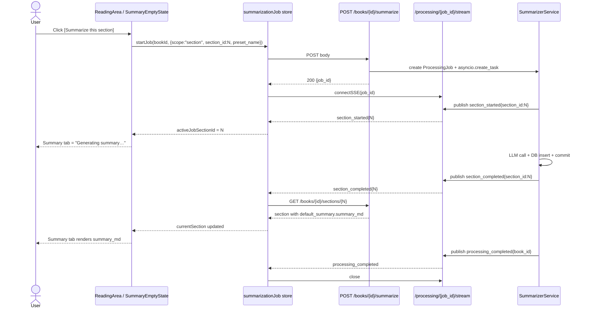

# Book Reader UX Polish — Spec

**Date:** 2026-04-18
**Status:** Draft
**Tier:** 2 — Enhancement
**Requirements:** `docs/requirements/2026-04-18-book-reader-ux-polish.md`

---

## 1. Problem Statement

Opening *Understanding Michael Porter* on the web reader revealed four linked UX defects: the book lands on Copyright instead of Chapter 1 (parser misclassifies front-matter as `chapter`), the Summary tab silently falls through to original content (backend API never returns `summary_md` and frontend always passes `content_md`), images are broken on books imported before commit 649dba1 (literal `__IMG_PLACEHOLDER__` tokens still in `content_md`), and every in-document anchor is clickable (no link sanitization past DOMPurify). The spec also introduces a book-level summarization progress counter and one-click *Summarize pending sections* action driven by the existing SSE stream.

**Primary success metric:** Opening any book in the library lands on its first summarizable section; every summarized section's Summary tab renders its markdown; the Porter book counter reads "N of M" where M counts only summarizable-type sections and clicking *Summarize pending* fills the remainder without re-running completed sections.

---

## 2. Goals

| # | Goal | Success Metric |
|---|------|---------------|
| G1 | First open lands on first summarizable section | Opening *Understanding Michael Porter* with no saved reading-state lands on `order_index=4` ("1. Competition: The Right Mind-Set"); Copyright is reachable only by expanding Front Matter. |
| G2 | Front-matter grouped in TOC | `TOCDropdown` renders Copyright / Acknowledgments / Part-header sections inside a collapsed `Front Matter (N)` accordion; body sections sit at the top level. |
| G3 | Summary tab renders summary markdown | `GET /api/v1/books/{id}/sections/{sid}?include_content=true` returns `default_summary.summary_md`; Summary tab uses it. Playwright or manual: clicking Summary on a summarized chapter shows prose/bullets, not original content. |
| G4 | Summary tab has differentiated empty states | Front-matter section → "Summary not applicable"; non-front-matter without summary → "Not yet summarized" + *Summarize this section* CTA; active summarization on this section → "Generating summary…". |
| G5 | Legacy books' images render | After one startup of the upgraded server, `SELECT count(*) FROM book_sections WHERE content_md LIKE '%__IMG_PLACEHOLDER__:%__ENDIMG__%'` returns 0 across the library (matches the full token shape used by FR-08; avoids false positives on stray mentions). |
| G6 | Heading/footnote anchors not clickable | In rendered `ReadingArea` HTML for any section, `<a href="#..."><` is absent; `<a href="https://...">` has `target="_blank" rel="noopener noreferrer"`. |
| G7 | Book-level progress counter + Summarize pending | Porter book detail view shows "N of 12 summarized" (12 = summarizable-type count) and a button that calls `POST /books/{id}/summarize` with `scope: "pending"`. |
| G8 | Summarization skips non-summarizable types | A book-level summarize run produces zero new summaries for `copyright`, `acknowledgments`, `dedication`, `title_page`, `table_of_contents`, `colophon`, `part_header`, `cover`. |

---

## 3. Non-Goals

- Popover / jump-to-anchor navigation for in-book anchors — because restoring intentional cross-references as in-reader navigation is a separate reader feature with its own UX.
- Configurable summarizable-type set per book — because v1 ships a conservative fixed list (D9 in requirements); per-book configurability is v2.
- Re-importing books to trigger classification — because a data migration achieves the same outcome without losing annotations or reading state.
- Altering `SummarizerService` internals (map-reduce loop, cumulative context, eval retry) — because the fix is *which* sections to summarize, not *how*.
- Per-section commit + skip-already-summarized mechanics — owned by `2026-04-13-post-install-runtime-quality-spec.md`; this spec consumes that behavior but does not duplicate its FRs.
- Surfacing a *Re-summarize all* / *Force* action in the UI — out of scope; the backend `force` flag already supports it via CLI.
- Custom COVER page extraction or rendering — we only classify it; visual handling of Cover images is unchanged.

---

## 4. Decision Log

| # | Decision | Options Considered | Rationale |
|---|----------|-------------------|-----------|
| D1 | Extend `SectionType` string values; no enum/DDL change | (a) Add CHECK constraint, (b) Migrate to native SQLite enum (unavailable), (c) Keep `String(50)` + app-level set (chosen) | `BookSection.section_type` is already `String(50)` with no constraint. Adding new values requires no schema change — only a constant update in `epub_parser.py` and `pdf_parser.py`. Keeps the one-migration-per-concern principle. |
| D2 | Content-aware part-header: title match AND `content_char_count < 1000` | (a) Title-only, (b) Title-AND-length (chosen), (c) Length-only | A "Part III" title with 8 KB of intro prose is a real chapter; classifying on title alone silently drops it. Existing stub-merge (500 chars) already coalesces trivially short sections before classification runs — so the deliberate 500–1000 band classifies bare dividers as `part_header`, above-1000 stays `chapter`. |
| D3 | One classifier module shared by EPUB + PDF parsers | (a) EPUB-only classifier, (b) Duplicate in PDF parser, (c) Shared module (chosen) | PDFs with TOC also exhibit the same front-matter pattern; current `pdf_parser.py` hardcodes `section_type='chapter'`. Extract `SECTION_TYPE_PATTERNS` and `detect_section_type()` into `app/services/parser/section_classifier.py`; both parsers import. |
| D4 | Two separate Alembic revisions for data migrations | (a) Single revision, (b) Two revisions (chosen), (c) One-shot CLI command | Each migration addresses one concern (image placeholders; section reclassification + summary pruning). Independent reversibility. Standard Alembic practice. `init_cmd._run_migrations()` already runs `alembic.command.upgrade(cfg, "head")` — both revisions run automatically on startup. |
| D5 | User-curated summary heuristic: preserve when `COUNT(Summary) > 1` for the section | (a) Time-based proxy, (b) Count-based (chosen), (c) New `created_by_user` column | The only CLI path that creates a non-default summary is `summary set-default`, which only matters if the user produced a second summary first. So >1 summaries ⇒ user chose among them. Uses existing schema. Count is cheap. A new column would bloat the schema for a one-time migration. |
| D6 | Section response embeds `default_summary.summary_md` | (a) Separate `/sections/{id}/summary/default` endpoint, (b) Embed in section response (chosen) | Section + default summary render on the same screen; extra round-trip adds latency for no benefit. Summary sizes are small (few KB). |
| D7 | Extend existing `POST /books/{id}/summarize` with `scope: 'all' | 'pending' | 'section'` and optional `section_id` | (a) New `/summarize-pending` endpoint, (b) Extend existing (chosen), (c) Both | One endpoint, one processing pipeline, one SSE stream. `scope` defaults to `'all'` (preserves current behavior). `'pending'` filters sections without a default summary. `'section'` requires `section_id`. Backwards-compatible. |
| D8 | Front-matter TOC group default-collapsed globally; no per-book persistence | (a) Per-book persisted state, (b) Global default-collapsed (chosen) | Simpler UX; user expands on demand. Per-book state adds a write path to the reading_state table for marginal value. Re-visit if friction shows up. |
| D9 | Inline per-section summarize trigger uses SSE-driven state machine | (a) Queued/spinner state, (b) SSE-driven (chosen) | Existing SSE events (`section_started`, `section_completed`) cover the transitions exactly. No new event types or polling. Frontend just subscribes to the job's stream while the user is on the page. |
| D10 | Progress counter and *Summarize pending* button live in the book-header region | (a) TOC header, (b) Book header (chosen), (c) Floating action | Book metadata already anchors there (title/authors/cover/section count). Counter is tight text; button is a primary action near top. Easy to spot on first open. |
| D11 | Content-sanitization link rewriting post-DOMPurify | (a) Config DOMPurify's `ALLOWED_ATTR`/hooks, (b) Post-process with DOMParser (chosen) | Post-processing with the DOM API is readable and independent of DOMPurify's attribute list. Runs once per render; output goes through `v-html`. DOMPurify remains responsible for XSS; this pass adds policy on top. |
| D12 | PDF scope included — classifier applied to `PdfParser` | (a) EPUB-only for v1, (b) Both (chosen per Analyst answer) | Classifier is the same regex set; extending to PDFs is low-risk. Without this, PDF readers suffer the same landing-on-front-matter issue. |
| D13 | Pattern-order tie-breaker: new front-matter patterns inserted before existing body patterns in `SECTION_TYPE_PATTERNS` | (a) Alphabetical, (b) Length-of-regex, (c) Insertion order with front-matter first (chosen) | Python 3.7+ dict ordering is insertion-ordered and guaranteed. Placing `copyright`, `acknowledgments`, `part_header`, `cover`, `colophon`, `dedication`, `title_page`, `table_of_contents` before the existing `glossary`, `foreword`, `preface`, `introduction`, `epilogue`, `conclusion` etc. prevents a title like "Introduction to Copyright" from matching `introduction` when the primary signal is "Copyright". First-match-wins is documented at the top of `section_classifier.py` so future contributors know the tie-break rule. |

---

## 5. User Journeys

Referenced from requirements §5 (five primary journeys). One flow added for the inline per-section trigger:

### 5.1 Inline per-section summarize



---

## 6. Functional Requirements

### 6.1 Section Classification

| ID | Requirement |
|----|-------------|
| FR-01 | Move `SECTION_TYPE_PATTERNS` and `detect_section_type(title)` out of `epub_parser.py:16–41` into a new module `backend/app/services/parser/section_classifier.py`. Export both. No behavior change to existing patterns. |
| FR-02 | Add new title-regex patterns to `SECTION_TYPE_PATTERNS` (order matters; first match wins): `copyright` → `r"\bcopyright\b|©"`, `acknowledgments` → `r"\backnowledg(e)?ments?\b"`, `dedication` → `r"\bdedication\b"`, `title_page` → `r"\btitle\s*page\b"`, `table_of_contents` → `r"^(table\s+of\s+contents|contents)\s*$"` (anchored whole-title — "Contents of Chapter 1" and "What This Book Contains" must NOT match), `colophon` → `r"\bcolophon\b"`, `cover` → `r"^cover$|^book\s*cover$"` (anchored — "Discover" must not match), `part_header` → `r"^part\s+(one|two|three|four|five|six|seven|eight|nine|ten|\d+)\b"`. These patterns are evaluated before the existing patterns so front-matter is detected before body-content keywords like "introduction". |
| FR-03 | `detect_section_type(title, content_md)` takes a second arg `content_md: str | None`. If a title matches the `part_header` pattern AND `len(content_md or "") < 1000`, returns `"part_header"`. If the title matches `part_header` but content is ≥ 1000 chars (real prose), return `"chapter"` instead (content-aware gate). Other patterns unchanged. **Measurement note:** raw `len(content_md)` counts markdown syntax (headings, list markers, link brackets). Choosing this over a text-only strip because (a) the 1000-char threshold is heuristic — a ±50-char syntax overhead does not flip the decision in realistic part-header vs. chapter content, (b) avoids introducing a new stripping helper or BeautifulSoup dependency path. Document this choice in the module header comment. |
| FR-04 | `EPUBParser._walk_toc` and spine fallback (epub_parser.py:313, :375) call `detect_section_type(title, content_md)` instead of the old single-arg variant. |
| FR-05 | `PdfParser` (`pdf_parser.py:87–115`) calls `detect_section_type(title, content_md)` for every `ParsedSection` instead of hardcoding `"chapter"`. |
| FR-06 | Add two class-level sets in `section_classifier.py`: `FRONT_MATTER_TYPES = {"copyright","acknowledgments","dedication","title_page","table_of_contents","colophon","cover","part_header"}` and `SUMMARIZABLE_TYPES = {"chapter","introduction","preface","foreword","epilogue","conclusion"}`. Expose as module constants. Callers import, do not redefine. |
| FR-06a | **Cross-layer drift guard.** Add a code comment at the top of `section_classifier.py` naming `frontend/src/stores/reader.ts` as the mirror location (and vice versa). Add a backend unit test `tests/unit/test_section_type_sets_contract.py` that reads both files, extracts the set literals via regex, and asserts equality. Failing the test on any drift is the enforcement. No runtime endpoint — the test catches it in CI. |
| FR-07 | `_detect_section_type`'s pattern-match order is deterministic and documented at the top of the module: new front-matter types are evaluated FIRST, then existing content types. Ambiguous titles resolve to the first matching pattern by insertion order (Python 3.7+ dict ordering guaranteed). |

### 6.2 Data Migrations (Alembic)

Two separate revisions, both auto-run by `init_cmd._run_migrations()` which already calls `alembic.command.upgrade(cfg, "head")`.

#### Revision A: `migrate_image_placeholders`

| ID | Requirement |
|----|-------------|
| FR-08 | Create a new Alembic revision `<hash>_backfill_image_placeholders.py`. In `upgrade()`: for each row in `book_sections` whose `content_md LIKE '%__IMG_PLACEHOLDER__:%__ENDIMG__%'`, build a `{filename: image_id}` map from `images WHERE section_id = <section.id>`, then apply `from_placeholder(content_md, map)` (already exported by `image_url_rewrite.py:45–55`) and UPDATE the row. |
| FR-09 | The migration uses a SQLAlchemy Core connection (not the async session) because Alembic migrations run in a sync context. Reuse the existing `image_url_rewrite.from_placeholder` function; do NOT reimplement regex logic. |
| FR-10 | `downgrade()` is a no-op — the original placeholder token can't be reconstructed from the rewritten URL. Downgrade must not error; it logs "Image URL backfill cannot be reversed" and returns. |
| FR-11 | Migration is idempotent: running after it's already applied produces zero UPDATEs (the LIKE pattern does not match on already-substituted URLs). |
| FR-12 | False-positive safety: the substitution regex in `from_placeholder` requires both the start token `__IMG_PLACEHOLDER__:` AND the terminator `__ENDIMG__`; stray occurrences of just `__IMG_PLACEHOLDER__` in user content remain untouched. Verified by existing tests for `from_placeholder`. |

#### Revision B: `reclassify_section_types`

| ID | Requirement |
|----|-------------|
| FR-13 | Create a new Alembic revision `<hash>_reclassify_sections_and_prune_frontmatter.py`. In `upgrade()`: for each row in `book_sections`, re-run `detect_section_type(title, content_md)` and UPDATE both `section_type` AND `updated_at = CURRENT_TIMESTAMP` where the computed type differs from the stored value (lifecycle hygiene — makes the change visible in debugging / downstream sync). |
| FR-14 | For each row whose NEW `section_type` is in `FRONT_MATTER_TYPES` AND old type was NOT, execute the user-curated check (pseudo-SQL):

```sql
-- count summaries for this section
SELECT count(*) FROM summaries
WHERE content_type='section' AND content_id = :section_id;
```

If count == 1:
```sql
DELETE FROM summaries
WHERE content_type='section' AND content_id = :section_id;
UPDATE book_sections SET default_summary_id = NULL WHERE id = :section_id;
```

If count > 1 AND the current default row falls within the book's auto-batch window (created within 60s of the most-recent summary across all sections in this book), re-point to the newest non-batch row or NULL. Compute the cutoff in Python (Alembic migrations run in a sync context with a `datetime` handy) and pass as a bound parameter — avoids SQLite dialect drift:

```python
# Python side — migration body
batch_end = conn.execute(sa.text("""
    SELECT max(s.created_at) FROM summaries s
    JOIN book_sections bs ON bs.id = s.content_id
    WHERE s.content_type='section' AND bs.book_id = :book_id
"""), {"book_id": book_id}).scalar()
cutoff = batch_end - timedelta(seconds=60)  # datetime arithmetic in Python
newest_non_batch = conn.execute(sa.text("""
    SELECT id FROM summaries
    WHERE content_type='section' AND content_id = :section_id
      AND created_at < :cutoff
    ORDER BY created_at DESC LIMIT 1
"""), {"section_id": section_id, "cutoff": cutoff}).scalar()
conn.execute(sa.text("""
    UPDATE book_sections SET default_summary_id = :new_default WHERE id = :section_id
"""), {"new_default": newest_non_batch, "section_id": section_id})  # NULL if no non-batch row
```

Summary rows themselves are preserved. Rationale: count > 1 proves user intent happened, but the default pointer may still be on an auto row; realign it to the user's most-recent manual choice.

**60-second window justification:** A typical auto-summarize-book run is `section_count × ~60s` wall-clock. Within a single batch, section summaries are written sequentially ~100ms apart (post per-section-commit); cross-section gaps are dominated by LLM latency (~30–60s). A 60-second lookback from `max(created_at)` reliably identifies the trailing section(s) of a batch while excluding any summary written before the most recent run. If a user ran `summary set-default` 61+ seconds after an auto-run, that row is correctly preserved as user-curated. If they ran it within 60s of the auto-batch completing — statistically unlikely and indistinguishable from the batch itself. |
| FR-15 | The migration tracks counters: `reclassified`, `auto_summaries_pruned`, `user_summaries_preserved`, `books_affected`. Logs via `structlog.get_logger()` (repo-wide convention) — one event per book processed (`migration_reclassify_book` with book_id + per-book counters) and a final summary event. Structlog writes to stderr, visible during `bookcompanion serve` startup. |
| FR-16 | `downgrade()` is a no-op (same rationale as FR-10; original `section_type` values are not reversibly encoded). |
| FR-17 | Idempotent: re-running produces zero UPDATEs and zero DELETEs because every section's stored type already matches the classifier output. |
| FR-18 | The migration's SELECT over `book_sections` orders by `book_id, order_index` so logs produce a deterministic sequence useful for diffing across runs. |
| FR-18a | **Commit granularity:** both migrations commit per book (after all sections for a given `book_id` are processed). On crash mid-book, Alembic rolls the revision back and the next `alembic upgrade head` retries from the beginning; in-revision idempotency (FR-11, FR-17) ensures already-processed books produce zero changes on the retry. Per-book commit bounds the lock window and lets the log stream show progress rather than silence-then-dump. |

### 6.3 Summary Content Delivery

| ID | Requirement |
|----|-------------|
| FR-19 | `_build_section_response` in `backend/app/api/routes/sections.py:33–75` gains a new field in the returned dict: `default_summary.summary_md: str | null`. Populated from `summary.summary_md` when the Summary row is fetched. Existing fields (`id`, `preset_name`, `model_used`, `summary_char_count`, `created_at`) unchanged. |
| FR-20 | Add `is_summarizable: bool` to the section response, derived from `section.section_type in SUMMARIZABLE_TYPES`. Used by the frontend to gate the Summarize-this-section CTA. |
| FR-21 | `SummaryBriefResponse` pydantic schema in `backend/app/api/schemas.py` gains `summary_md: str | None = None`. The `/summaries/{id}` endpoint (if exists) is unchanged; this is additive to the existing response. |
| FR-22 | A 404 summary row (dangling `default_summary_id`) in `_build_section_response` returns `default_summary: null` — same as current behavior — not an error. |

### 6.4 Summarize-Pending Scope + Per-Section Trigger

| ID | Requirement |
|----|-------------|
| FR-23 | `ProcessingStartRequest` schema (schemas.py:179–183) gains `scope: Literal["all","pending","section"] = "all"` and `section_id: int | None = None`. |
| FR-24 | The `POST /api/v1/books/{id}/summarize` route (processing.py:27) validates: `scope="section"` requires non-null `section_id`; `scope` in `{"all","pending"}` ignores `section_id`. 422 on mismatch. |
| FR-25 | `SummarizerService.summarize_book()` accepts a `scope` parameter with the same enum plus an optional `section_id`. The method filters the iterated section list: `scope="all"` (current behavior), `scope="pending"` skips sections where `default_summary_id is not None`, `scope="section"` summarizes only `section_id` (raises ValueError if section doesn't belong to book). |
| FR-26 | For `scope="pending"` and `scope="all"`, the iteration set is restricted to `section.section_type in SUMMARIZABLE_TYPES` BEFORE the existing skip-completed check. Non-summarizable-type sections are never auto-summarized. For `scope="section"` the user-triggered single-section CTA, this gate is bypassed — user intent is explicit. |
| FR-27 | The existing `force` flag keeps meaning. `scope="pending"` implies `force=False` by definition; caller supplying `force=True` with `scope="pending"` is rejected with 400 (mutually exclusive). |
| FR-27a | `run_eval` and `auto_retry` defaults are the same across all scopes (both default `True`). Per-section user-triggered summaries run the full eval + retry path — consistent mental model, no hidden scope-specific behavior. If the user wants to skip, they can pass `skip_eval: true` as today. |
| FR-28 | **SSE event payload changes required.** Today's handlers at `processing.py:109–166` emit `section_completed` / `section_skipped` / `section_failed` / `section_retrying` with payload `{title, index, total, elapsed_seconds?, error?}` — but no `section_id` and no `section_started`. This spec requires both: (a) **add `section_id: int` to all four existing event payloads**; (b) **add a new `section_started` event** with payload `{section_id, title, index, total}` emitted immediately before the LLM call for a section. (c) **Add `processing_started` event** with payload `{book_id, job_id, total_sections, scope}` emitted when the job begins processing the filtered section list. |
| FR-28a | Implementation sketch: in `processing.py` extend each callback to accept a `section_id` arg and include it in the payload. Add a new `on_section_start(section_id, index, total, section_title)` callback wiring to the new event. In `SummarizerService.summarize_book()`, call `on_section_start` before the LLM call for each section in the filtered iteration set. Current callbacks' signature changes are local to one file; no other callers. |
| FR-28b | **Event ordering invariant:** `processing_started` is emitted exactly once per job, before any `section_*` event. `section_started(N)` is emitted before the LLM call for section N; `section_completed(N)` / `section_failed(N)` / `section_skipped(N)` emit after the LLM call (or skip decision) for section N. Sections are processed sequentially, so for any two sections M (order_index < N), all `section_*` events for M precede all `section_*` events for N. `processing_completed` or `processing_failed` is emitted exactly once, after all section events, and the SSE stream is closed. Frontend handlers can rely on this ordering. |
| FR-29 | New computed field `summary_progress` on the book response `GET /api/v1/books/{id}`: `{summarized: int, total: int}` where `total = count(book_sections WHERE section_type IN SUMMARIZABLE_TYPES)` and `summarized = count(book_sections WHERE section_type IN SUMMARIZABLE_TYPES AND default_summary_id IS NOT NULL)`. One SQL aggregate per request. |

### 6.5 Frontend Reader UX

| ID | Requirement |
|----|-------------|
| FR-30 | `reader.ts` exports constants `FRONT_MATTER_TYPES` and `SUMMARIZABLE_TYPES` mirroring backend sets (single source of truth: duplicated in frontend as literal constants with a code comment referencing the backend module). |
| FR-31 | `reader.ts` action `loadBook(bookId)` — landing-section precedence (first match wins): (1) URL-specified `/books/:id/sections/:sid` deep-link — `currentSection = sections.find(s => s.id === routeSid)`; (2) saved reading-state position from `useReadingState()` — restore that section; (3) first summarizable-type section — `sections.find(s => SUMMARIZABLE_TYPES.has(s.section_type))`; (4) final fallback — `sections[0]` (handles reference-only books per E2). |
| FR-32 | `BookDetailView.vue:151` replaces the unconditional `:content="reader.currentSection.content_md || ''"` binding with a computed expression that returns `summary.summary_md` when `reader.contentMode === 'summary'` AND `reader.currentSection.default_summary?.summary_md` is non-empty, else `content_md`. Empty-state rendering does not go through `ReadingArea`; a new `<SummaryEmptyState>` child handles the three states per FR-33. |
| FR-33 | New component `frontend/src/components/reader/SummaryEmptyState.vue` accepts props `{section: Section, activeJobSectionId: number | null, failedError: string | null}`. Renders: (a) front-matter → "Summary not applicable for {title}" (static text, no CTA); (b) non-front-matter without summary, not being processed, no prior failure → "Not yet summarized" heading + *Summarize this section* button; (c) this section is active in a running job (`activeJobSectionId === section.id`) → "Generating summary…" with subtle spinner; (d) `failedError` non-null → "Summary generation failed: {failedError}" + *Retry* button that calls `startJob({scope:'section', section_id})`. State (c) takes precedence over (d); a retry puts the section back in (c) and clears `failedError` on success. |
| FR-34 | New `TOCDropdown.vue` behavior: compute `firstSummarizableIndex = sections.findIndex(s => SUMMARIZABLE_TYPES.has(s.section_type))` (treat `-1` as `sections.length` — the all-front-matter edge case). Partition `sections` into `frontMatter = sections.filter(s => FRONT_MATTER_TYPES.has(s.section_type) && s.order_index < firstSummarizableIndex)` and `body = sections.filter(s => !(FRONT_MATTER_TYPES.has(s.section_type) && s.order_index < firstSummarizableIndex))`. (Rationale: late-position types like `glossary`, `about_author`, or a `part_header` appearing mid-book stay at their natural TOC position; only pre-body front-matter moves to the accordion.) |
| FR-35 | `TOCDropdown.vue` renders the Front Matter bucket inside a `<details>` element (native HTML accordion: `aria-expanded` auto-managed, keyboard-accessible via Tab + Enter/Space). Summary label: `<summary>Front Matter ({frontMatter.length})</summary>`. Default-collapsed (omit `open` attribute). |
| FR-36 | New component `frontend/src/components/book/SummarizationProgress.vue` renders "{summarized} of {total} sections summarized" text; when `summarized < total`, render a `[Summarize pending sections]` button. While a job is running (active `jobId` in a new Pinia `summarizationJob` slice), button is disabled + re-labeled "Summarizing… {summarized}/{total}". On completion, the counter refreshes from a book response re-fetch. The button calls `summarizationJob.startJob(bookId, { scope: 'pending' })` and **omits `preset_name`** — the backend's server-side default (`practitioner_bullets`) applies (resolves requirements OQ2). No picker modal for this action; a future enhancement can add per-book preset memory if needed. |
| FR-37 | `SummarizationProgress` is mounted in `BookDetailView.vue` under the book title/authors row (the "book header" region, above the TOC + reader split). Hidden when `total === 0` (book has no summarizable-type sections). |
| FR-38 | New Pinia store `stores/summarizationJob.ts` tracks `{bookId: number, jobId: number, activeJobSectionId: number | null, scope: 'all'|'pending'|'section', failedSections: Map<number, string>}` for the current job. Actions: `startJob(bookId, params)` (POSTs to summarize endpoint, opens SSE via existing `connectSSE`; a call with `scope:'section', section_id:X` that hits a section already in `failedSections` clears that entry before POST — the retry semantics), `onSectionStarted(sid)` / `onSectionCompleted(sid)` / `onSectionFailed(sid, err)` / `onSectionSkipped(sid)` / `onSectionRetrying(sid)` / `onCompleted()` / `onFailed(err)` handlers, `reset()` clears all state. Exposes `isActive` + `activeJobSectionId` + `getFailedError(sectionId)` computeds consumed by `SummaryEmptyState` (FR-33) and `SummarizationProgress` (FR-36). BookDetailView calls `summarizationJob.reset()` from an `onBeforeRouteLeave` router guard so leaving the page closes the EventSource and clears state; Pinia store itself is a singleton but the per-book lifecycle is owned by the view. |
| FR-39 | On `section_completed(section_id=N)`, the store refetches `GET /books/{bookId}/sections/{N}?include_content=true` and calls a new `reader.updateSection(section)` action that splices the new row into `reader.sections` at matching index AND updates `reader.currentSection` if it's the same section. This keeps the TOC's "S" marker (`has_summary`) live AND the Summary tab's rendered content fresh, without a full book refetch. **Missing-section safety:** if `reader.updateSection` is called with a `section_id` not found in `reader.sections` (stale tab, deleted section, mismatched book), silently no-op and `console.warn("updateSection: id N not found in book M")`. Do NOT append; do NOT trigger a book refetch. Also: if the refetch itself returns 404, no-op + console.warn. |
| FR-39a | **Frontend API-client mirror** (`frontend/src/api/processing.ts`): extend `ProcessingOptions` interface with `scope?: 'all' | 'pending' | 'section'` and `section_id?: number`. Add four new handler slots to `SSEHandlers` and register their listeners in `connectSSE` analogously to the existing events:

- `onProcessingStarted?: (data: { book_id; job_id; total_sections; scope }) => void`
- `onSectionFailed?: (data: { section_id; title; index; total; error }) => void`
- `onSectionSkipped?: (data: { section_id; title; index; total; reason }) => void`
- `onSectionRetrying?: (data: { section_id; title; index; total }) => void`

`summarizationJob` store (FR-38) wires them: `onProcessingStarted` clears any stale state + flips `isActive=true` before the first `section_started`; `onSectionFailed` sets `failedSections.set(section_id, error)` + clears `activeJobSectionId`; `onSectionSkipped` bumps the local progress counter without refetching the section; `onSectionRetrying` keeps `activeJobSectionId = section_id` so the user continues to see "Generating…" across an LLM retry. |
| FR-39b | The existing `SSEHandlers.onSectionStarted` payload type in `processing.ts:26` already expects `{section_id, title, index, total}`. Once backend FR-28 ships `section_id` in the payload, the frontend wiring is a no-op from a type standpoint — no change to the handler signature is required. |

### 6.6 Content Sanitization (Link Policy)

| ID | Requirement |
|----|-------------|
| FR-40 | In `ReadingArea.vue` (lines 16–24), after `DOMPurify.sanitize(raw)` returns, parse the string via `new DOMParser().parseFromString(sanitized, 'text/html')`. |
| FR-41 | Walk `doc.querySelectorAll('a[href]')`. For each anchor: classify `href` as (i) relative anchor (starts with `#`), (ii) external (`http://` / `https://` / `mailto:` / protocol-relative `//`), (iii) other (everything else including `./foo.xhtml`, `javascript:`, `data:`, `file:`). |
| FR-42 | Anchors in class (i) and (iii) are replaced with `<span>` nodes whose `textContent` is the anchor's text, preserving CSS classes via `className` copy. Event listeners on the original node are not preserved (none exist in sanitized markdown output). |
| FR-43 | Anchors in class (ii) get `target="_blank"` and `rel="noopener noreferrer"` attributes added; existing attributes preserved. |
| FR-44 | Serialize the modified DOM back to HTML via `doc.body.innerHTML` and bind via `v-html`. This replaces the current direct bind to DOMPurify's output. |
| FR-45 | Classification logic lives in a new pure function `classifyLink(href: string): 'internal-anchor'|'external'|'other'` in `frontend/src/utils/link-policy.ts`. Vitest table-test the following inputs at minimum: `"#"` → internal-anchor; `"#section-5"` → internal-anchor; `"http://a.com"` → external; `"https://a.com"` → external; `"mailto:x@y"` → external; `"//cdn.com/x"` → external; `"./ch2.xhtml"` → other; `"../appendix.xhtml"` → other; `"javascript:alert(1)"` → other; `"data:text/html,..."` → other; `""` → other; `"   "` → other. |

---

## 7. Non-Functional Requirements

| ID | Category | Requirement |
|----|----------|-------------|
| NFR-01 | Performance | Revision A + Revision B combined complete in < 5 seconds on a library of 100 books / 2000 sections (typical personal scale). Migration rows are small metadata UPDATEs; image-substitution regex is cheap. |
| NFR-01a | Performance — per-request | `summary_progress` on `GET /books/{id}` (FR-29) adds two COUNT aggregates against `book_sections` (indexed on `book_id`) filtered by `section_type IN (...)` and `default_summary_id IS NOT NULL`. Target: adds < 5 ms to an already-loaded book response. Do NOT cache — the value must reflect the live state after each `section_completed` event. |
| NFR-02 | Idempotency | Both revisions must produce zero UPDATEs on a second run (verified by an integration test that runs `alembic upgrade head` twice and asserts the second produces no row changes). |
| NFR-03 | Security | External links from content use `rel="noopener noreferrer"` per OWASP. Any `javascript:` / `data:` scheme is neutralized to a span, not rendered. |
| NFR-04 | Accessibility | TOC Front-Matter accordion uses the native `<details>`/`<summary>` element pair — keyboard navigation (Tab + Enter/Space) and screen-reader `aria-expanded` are browser-native. No JS-driven accordion. |
| NFR-05 | Observability | Both migrations `print()` per-book counters so the user sees progress during `bookcompanion serve` startup. The classification migration also prints a one-line summary at completion: `Reclassified X sections; pruned Y auto summaries; preserved Z user-curated summaries; across N books`. |

---

## 8. API Changes

### 8.1 `GET /api/v1/books/{id}` — extended response

**Before:**
```json
{
  "id": 1,
  "title": "Understanding Michael Porter",
  "authors": [...],
  "sections": [...],
  "section_count": 17,
  "status": "ready",
  ...
}
```

**After (additive; fields above preserved):**
```json
{
  "id": 1,
  ...,
  "summary_progress": {
    "summarized": 4,
    "total": 12
  }
}
```

**Errors:** unchanged (existing 404/500 paths).

### 8.2 `GET /api/v1/books/{id}/sections/{sid}` — extended response

**Before (relevant fields):**
```json
{
  "id": 42,
  "section_type": "chapter",
  "content_md": "...",
  "default_summary": {
    "id": 7,
    "preset_name": "practitioner_bullets",
    "model_used": "claude-opus-4-7",
    "summary_char_count": 1250,
    "created_at": "2026-04-15T10:00:00Z"
  },
  "has_summary": true,
  "summary_count": 1,
  "annotation_count": 0
}
```

**After (additive):**
```json
{
  ...,
  "is_summarizable": true,
  "default_summary": {
    ...,
    "summary_md": "- Key point 1\n- Key point 2..."
  }
}
```

**Errors:** unchanged.

### 8.3 `POST /api/v1/books/{id}/summarize` — extended request

**Request body (new fields — both optional, backward-compatible):**
```json
{
  "preset_name": "practitioner_bullets",
  "run_eval": true,
  "auto_retry": true,
  "skip_eval": false,
  "scope": "all",
  "section_id": null
}
```

`scope` defaults to `"all"` — omitting the field preserves the current behavior exactly. `section_id` is only consulted when `scope === "section"`; for `"all"` / `"pending"` it is ignored (and validated to be null for cleanliness — see FR-24).

**Response (200):** unchanged — `{ "job_id": <int> }`.

**Errors:**
- `422` — `scope="section"` without `section_id`, or `section_id` referencing a section not in this book.
- `400` — `scope="pending"` with `force=true` (mutually exclusive; see FR-27).
- Other existing errors unchanged.

---

## 9. Frontend Design

### 9.1 Component Hierarchy (additions/changes only)

```
BookDetailView.vue
├── BookHeader (existing)
│   └── SummarizationProgress  [NEW]  (FR-36/37)
├── ReaderHeader (existing)
├── TOCDropdown.vue             [MOD]  (FR-34/35)
│   ├── <details> Front Matter (N) [NEW accordion]
│   └── Body sections list
├── ReadingArea.vue             [MOD]  (FR-40–44)
└── SummaryEmptyState.vue       [NEW]  (FR-33)
```

### 9.2 State

- **Existing:** `reader.ts` (sections, currentSection, contentMode); `readingState.ts` (last-read position).
- **New:** `summarizationJob.ts` (current job id + active section id + scope); lives on the BookDetailView's lifetime, cleaned up on route change.

### 9.3 Summary tab flow (template pseudo-code)

```vue
<template v-if="reader.contentMode === 'summary'">
  <!-- 1. Summary exists → render via ReadingArea (reuses markdown pipeline) -->
  <ReadingArea
    v-if="reader.currentSection.default_summary?.summary_md"
    :content="reader.currentSection.default_summary.summary_md"
  />
  <!-- 2. No summary → SummaryEmptyState routes to one of three sub-states -->
  <SummaryEmptyState
    v-else
    :section="reader.currentSection"
    :active-job-section-id="summarizationJob.activeJobSectionId"
    @summarize="summarizationJob.startJob(bookId, { scope: 'section', section_id: reader.currentSection.id })"
  />
</template>
<template v-else>
  <!-- Original content path unchanged -->
  <ReadingArea :content="reader.currentSection.content_md || ''" />
</template>
```

SummaryEmptyState's internal v-if chain: front-matter → not-applicable; else active-job-section-id match → generating; else → not-summarized + CTA.

---

## 10. Edge Cases

| # | Scenario | Condition | Expected Behavior |
|---|---|---|---|
| E1 | Reclassification migration finds a `part_header` section (short content, title matches Part pattern) with 2+ existing summary rows | Rare: user previously generated multiple summaries for a short Part divider and curated one via `summary set-default`. The new classifier returns `part_header` because content is < 1000 chars. | Preserve ALL summary rows (FR-14 count-based rule); re-point `default_summary_id` to the most recent non-auto-batch row or NULL if all are from the batch window. Log `"Preserved N user-curated summaries on part_header section X"`. |
| E2 | Book has zero summarizable-type sections | A reference book with only glossary + bibliography | `summary_progress = {summarized: 0, total: 0}`. Frontend hides `SummarizationProgress` component (FR-37). Reader lands on `sections[0]` fallback (FR-31). |
| E3 | User clicks *Summarize this section* CTA on a non-summarizable type (e.g., glossary) | User explicitly overrides | FR-26 bypasses the type gate for `scope='section'`. Summary generated and displayed. Does NOT increment `summary_progress.summarized` (denominator excludes non-summarizable types). |
| E4 | SSE connection drops mid-job | Network glitch / tab backgrounded | `connectSSE`'s `onerror` fires. `summarizationJob` store's `onError` handler: (a) clears `activeJobSectionId` (prevents stuck "Generating…" state on the section being processed when the drop happened); (b) kicks off `scheduleBookRefetchPolling()` (same polling fallback as E4a); (c) keeps `jobId` (server-side job continues — polling reveals ground truth via `summary_progress` + refetched sections). Does NOT mark the job as failed. |
| E4a | SSE fails to open immediately after POST returns `job_id` | e.g., reverse proxy stripping event-stream content-type; server shutting down between POST ack and SSE upgrade | Frontend shows the button in "Summarizing…" state based on the returned `job_id` but never receives per-section events. After a 30s grace window with no events, the `summarizationJob` store falls back to polling `GET /books/{id}` every 5s for `summary_progress` updates, keeps the button disabled until `summarized === total` or the user navigates away. No error toast — the job is still making progress server-side. |
| E5 | User navigates away during an active job | Route change | Store is cleared on route leave hook (FR-38). Job keeps running server-side. On return to the book, `summary_progress` reflects completed sections so far. The user does NOT auto-re-subscribe to the in-flight job's SSE stream — no new endpoint is required. If the user clicks *Summarize pending* again, the `scope="pending"` filter is idempotent with the in-flight job: it picks up sections the running job hasn't completed yet, possibly producing a no-op (E6). Simpler than re-subscribing. |
| E6 | Two `scope="pending"` jobs launched concurrently | User clicks button twice / two tabs | Second POST is idempotent because pending sections for the first job are already being written per-section; the second job's `scope="pending"` filter returns fewer sections, possibly zero. Worst case: two jobs overlap on zero sections, both complete as no-ops. |
| E7 | Migration A (image placeholders) runs on a section whose `images` table has no rows for the book | Legacy book with bad parse | `from_placeholder` substitutes nothing; `content_md` unchanged. Idempotency preserved. User sees broken-image icon; re-import remains a fallback. |
| E8 | Migration B runs on a book with a custom section_type not in any pattern | User edited DB manually | Classifier returns the first matching pattern or `"chapter"` by default. Custom types outside the known set get overwritten. Documented in the changelog as an expected effect of the migration. |
| E9 | `classifyLink` receives an empty or whitespace-only `href` | Malformed markdown input | Treated as class (iii) "other" — replaced with span. Rationale: empty hrefs are broken regardless of scheme. |
| E10 | Part-header title with exactly 1000 chars of content | Boundary case for D2 | `<1000` is strict — 1000 chars tips into `chapter`. Documented in the classifier module. |
| E11 | Book with Cover section that has image but no text | Standard EPUB pattern | Title "Cover" matches `cover` pattern (FR-02); classified as front-matter. Goes under Front Matter in TOC. If user expands and opens it, Summary tab shows "Summary not applicable". |
| E12 | PDF with no title pattern matches any front-matter type | Scanned PDF, generic section titles | Stays `chapter`. PDFs that happen to have a TOC with "Acknowledgments" / "Introduction" get classified like EPUBs. |

---

## 11. Testing & Verification Strategy

### 11.1 Unit tests (new)

- `tests/unit/test_section_classifier.py` — parametrized tests over (title, content_md) pairs covering every pattern + the content-aware part-header rule + insertion-order determinism (FR-01, FR-02, FR-03, FR-07).
- `tests/unit/test_pdf_parser_section_types.py` — verify PDFParser delegates to the shared classifier for the sample PDF fixture (FR-05).
- `tests/unit/test_sections_route_summary_md.py` — hits `_build_section_response` directly with an in-memory session; asserts `summary_md` populated, `is_summarizable` correct (FR-19, FR-20).
- `tests/unit/test_books_route_summary_progress.py` — `summary_progress` field present, correct values on seeded data (FR-29).
- `tests/unit/test_summarize_scope_validation.py` — POST with `scope="section"` + no `section_id` → 422; `scope="pending"` + `force=true` → 400 (FR-23, FR-24, FR-27).
- `frontend/src/utils/link-policy.spec.ts` (Vitest) — parametrized over all href shapes in the requirements edge-case table (FR-45).

### 11.2 Integration tests (new)

- `tests/integration/test_migration_image_placeholders.py`:
  - Seed a book with a section whose `content_md` contains `__IMG_PLACEHOLDER__:foo.jpg__ENDIMG__` and an `Image` row with `filename='foo.jpg'`, `id=N`.
  - Run `alembic upgrade head`.
  - Assert `content_md` now contains `/api/v1/images/N` and no placeholder substring (FR-08, FR-11).
  - Re-run `alembic upgrade head`; assert row unchanged (FR-11 idempotency).
- `tests/integration/test_migration_reclassify_sections.py`:
  - Seed a book with 5 sections: Copyright (1 auto summary), Acknowledgments (2 summaries — simulates user-curated), Part One (0 summaries), Chapter 1 (1 auto summary), Glossary (1 auto summary).
  - Run `alembic upgrade head`.
  - Assert: Copyright → `copyright` + summary deleted + `default_summary_id IS NULL`; Acknowledgments → `acknowledgments` + BOTH summaries preserved + `default_summary_id` retained; Part One → `part_header` + null default; Chapter 1 → unchanged (still `chapter` + summary); Glossary → `glossary` + summary preserved (not front-matter).
  - Re-run; assert zero changes.
- `tests/integration/test_summarize_scope_pending.py`:
  - Seed a book with 5 summarizable sections; pre-create summaries for 2 of them.
  - POST `/summarize` with `scope="pending"`.
  - Assert result: completed=3, skipped=2; LLM stub called exactly 3 times (FR-25, FR-26).
- `tests/integration/test_summarize_scope_section.py`:
  - Seed a book; POST with `scope="section"` + valid `section_id`.
  - Assert only that section is summarized; `section_id` from a different book returns 422 (FR-24).
- `tests/integration/test_summarize_nonsummarizable_skipped.py`:
  - Seed a book with 3 `chapter` + 2 `copyright` sections.
  - POST `/summarize` with `scope="all"`.
  - Assert only 3 summaries created (FR-26).
- `tests/integration/test_summarize_sse_events.py`:
  - Start summarize on a 2-section book with a mocked LLM provider.
  - Subscribe a test EventBus client to the job's stream.
  - Assert event sequence: `processing_started` (scope, total_sections, job_id, book_id) → `section_started` (section_id, title, index, total) → `section_completed` (same keys + elapsed_seconds) → `section_started` → `section_completed` → `processing_completed`.
  - Assert every `section_*` event payload contains a non-null `section_id` field (FR-28, FR-28a).

### 11.3 End-to-end / manual

- Playwright (or manual browser): upload a real EPUB with Copyright + TOC; open book; assert landing is on first chapter; assert Copyright shows under Front Matter accordion; click Copyright → Summary tab shows "Not applicable"; click summarizable chapter without summary → click CTA → observe "Generating…" state → observe rendered summary.
- `curl` verification:
  - `curl -s http://localhost:8000/api/v1/books/1 | jq '.summary_progress'` → `{"summarized": N, "total": M}`.
  - `curl -s http://localhost:8000/api/v1/books/1/sections/4?include_content=true | jq '.default_summary.summary_md'` → non-null string.
  - `curl -sX POST http://localhost:8000/api/v1/books/1/summarize -d '{"scope":"section"}' -H 'content-type: application/json'` → 422 with validation error.

### 11.4 Regression

- `uv run pytest -q` — expect existing ~440 pass + ~15 new tests = ~455 passing, 0 failing.
- `uv run ruff check .` — clean.
- Fresh-install smoke: remove `~/Library/Application Support/bookcompanion/`; run `bookcompanion init`; import Porter EPUB; click Summarize pending; verify the Porter counter hits `12/12` with only summarizable-type sections summarized.

---

## 12. Rollout

- Single feature branch; squash-merge to `main`.
- Two Alembic migrations ride on the same PR.
- On next `bookcompanion serve`, `init_cmd._run_migrations()` runs `alembic.command.upgrade(cfg, "head")` — both revisions apply synchronously before the API binds the port. No half-migrated UI.
- No config flags. Changes are strictly better behavior.
- No external-user communication needed (personal tool).
- Changelog entry under `docs/changelog.md` noting: "Front-matter no longer auto-summarized; existing auto summaries on Copyright/Acknowledgments/etc. are pruned; user-curated summaries preserved. Images on legacy imports are rendered automatically after the next server start."

### Accepted risks (simulation Phase 7)

- **Concurrent `scope="pending"` POSTs** can, in a narrow window, race and invoke the LLM for the same section twice before the first job commits (the second's skip-check fires before the first's summary row is visible). Worst case: one wasted LLM call + two Summary rows (latest becomes default). The frontend's disabled-while-running button (FR-36) prevents the common double-click case; cross-tab double-invoke is rare enough that a per-book advisory lock isn't justified.
- **Duplicate `ProcessingJob` rows** can result from network retries on `POST /summarize`. Cheap metadata noise; no data correctness impact; no idempotency key added.
- **Saved reading-state points to a reclassified section**: if a user's last position happens to be a section that migration B re-tags as front-matter, their "resume" open lands on the front-matter section. User clicks once to a real chapter. Not worth special-casing in the migration.
- **NFR-01 / NFR-01a are aspirational**, not benchmark-tested. Self-observable during use.

---

## 13. Research Sources

| Source | Type | Key Takeaway |
|--------|------|-------------|
| `backend/app/services/parser/epub_parser.py:16–41,99–120,313,317,375` | Existing code | Current classifier is EPUB-local static method; extract to shared module per D3. Stub-merge runs AFTER classification (line 317). |
| `backend/app/services/parser/pdf_parser.py:87–115` | Existing code | Hardcodes `section_type='chapter'`; needs to call shared classifier (FR-05). |
| `backend/app/services/summarizer/summarizer_service.py:80–95` | Existing code | Skip-already-summarized already works per-section; spec relies on it for `scope="pending"` (FR-25). |
| `backend/app/api/routes/processing.py:27–231` + `backend/app/api/sse.py:9–42` | Existing code | `POST /summarize` + EventBus fan-out already emit `section_started` / `section_completed` / `processing_completed` / `processing_failed`. SSE needs zero new events. |
| `backend/app/api/routes/sections.py:33–75` | Existing code | `_build_section_response` is the extension point for `summary_md` + `is_summarizable` (FR-19/20). |
| `backend/app/db/models.py:93–107,202–204` | Existing code | `SectionType` string enum; column is `String(50)` — no DDL change needed for new values. |
| `backend/app/services/summarizer/evaluator.py:25,187` | Existing code | `REFERENCE_SECTION_TYPES` skip for `covers_examples`. No updates needed — new front-matter types are never summarized. |
| `backend/app/migrations/versions/e152941ea209_initial_sqlite_schema.py:333–353` | Existing code | FTS5 triggers index `chunk_text` only. Section-type change does not require re-index. |
| `backend/app/cli/commands/init_cmd.py:15–101` | Existing code | Migrations run via `alembic.command.upgrade(cfg, "head")` on init; two new revisions auto-apply. |
| `backend/app/services/parser/image_url_rewrite.py:21–55` | Existing code | `from_placeholder(md, filename_to_image_id)` — reusable from the image-backfill migration (FR-08/09). |
| `frontend/src/stores/reader.ts:11,14,36–40` | Existing code | `contentMode` ref + `hasSummary` computed; extension point for landing-section picker (FR-31). |
| `frontend/src/views/BookDetailView.vue:151` | Existing code | Current unconditional `content_md` binding — root of Issue #3; target of FR-32. |
| `frontend/src/api/processing.ts:25–63` | Existing code | `connectSSE(jobId, handlers)` ready for reuse by the new `summarizationJob` store (FR-38). |
| `frontend/src/components/reader/ReadingArea.vue:16–24` | Existing code | `markdown-it` + `DOMPurify` pipeline; FR-40–44 extend with post-sanitize link rewrite. |
| `frontend/src/components/reader/TOCDropdown.vue:34,45,144–151` | Existing code | Flat section list + "S" marker; extension point for Front Matter accordion (FR-34/35). |
| `docs/specs/2026-04-13-post-install-runtime-quality-spec.md` | Internal spec | Sister spec for per-section commit + busy-timeout. This spec assumes it ships. |
| MDN `<details>`/`<summary>` + ARIA | External / spec | Native accordion supports keyboard + aria-expanded without JS (NFR-04). |
| OWASP `rel="noopener"` | External / spec | `target="_blank"` without `noopener` is a tab-hijacking vector (NFR-03). |

---

## 14. Open Questions

| # | Question | Owner | Needed By |
|---|----------|-------|-----------|
| 1 | ~~Does the book response return `cover_url`?~~ — Verified in Loop 3: `BookResponse.cover_url` exists at `schemas.py:95`. `SummarizationProgress` can sit in the book header region alongside it. | — | Resolved in Loop 3 |
| 2 | ~~Re-subscribe to in-flight job on tab return~~ — resolved via E5: user just re-clicks *Summarize pending*; `scope="pending"` filter is idempotent. No new endpoint needed. | — | Resolved in Loop 2 |
| 3 | ~~SSE events for `scope="section"`~~ — Addressed via FR-28/FR-28a: events are per-section today; adding `section_started` + `section_id` in payloads makes this consistent for 1-section and N-section jobs. | — | Resolved in Loop 3 |
| 4 | `cover` pattern regex: `r"^cover$|^book\s*cover$"` is anchored to the whole title — is that strict enough? A title like "Cover Art Notes" should NOT match. Anchoring eliminates that. Verify in the parametrized unit test. | — | Covered by FR-02 test |

---

## 15. Review Log

| Loop | Findings | Changes Made |
|------|----------|--------------|
| 1 | (a) FR-14 silent on what happens when count>1 but default pointer is still on an auto row. (b) FR-34 referenced `firstSummarizableIndex` without defining it. (c) `scope="section"` + `run_eval`/`auto_retry` behavior unspecified. (d) E4 covered SSE drops mid-stream but not "SSE fails to open at all" post-POST. (e) NFR-01 didn't cover `summary_progress` per-request cost; risk of plan-phase adding unnecessary caching. (f) Pattern-order tie-breaker was implicit (FR-02/FR-07) — promoted to a Decision Log row. (g) §5.1 flow was pseudo-code; readability win from a Mermaid sequence diagram. (h) §8.3 request example used `"all | pending | section"` placeholder — unclear whether omitting the field is backward-compatible. | (a) Rewrote FR-14 to re-point `default_summary_id` away from auto-batch rows when preserving user-curated set. (b) Defined `firstSummarizableIndex` explicitly with `-1` fallback. (c) Added FR-27a locking defaults identical across scopes (per user). (d) Added edge case E4a with 30s-grace polling fallback to `GET /books/{id}`. (e) Added NFR-01a with < 5 ms per-request target and no-cache guidance. (f) Added D13 for insertion-order tie-breaker. (g) Replaced §5.1 pseudo-code with a Mermaid sequence diagram. (h) Rewrote §8.3 example + added sentence clarifying `scope="all"` is the default and omission is backward-compatible. |
| 2 | (a) E5 depended on OQ2's unresolved endpoint for "resume in-flight job on tab return". (b) G5's LIKE pattern was looser than FR-08's, would false-match on stray token mentions. (c) FR-45 said "all edge cases from requirements" — vague for a spec-level test directive. (d) §9.3 Summary tab flow was one-line pseudo; Vue engineer couldn't translate directly. (e) FR-38 "cleaned up on route change" missed the hook name. (f) FR-39 triggered a section refetch but didn't specify how the result propagates to `reader.sections` for the TOC "S" marker. (g) FR-14 pseudo-SQL would help engineers reason about the auto-batch window rule. | (a) Simplified E5: no resume needed; `scope="pending"` filter is idempotent with an in-flight job, user just re-clicks. Closed OQ2 as resolved. (b) Tightened G5 to match FR-08's full token shape. (c) Enumerated 12 specific href inputs in FR-45. (d) Replaced §9.3 with full template pseudo-code showing the v-if chain. (e) Specified `onBeforeRouteLeave` router guard + new `reset()` action in FR-38. (f) Expanded FR-39 to add a new `reader.updateSection(section)` action keeping TOC + currentSection in sync. (g) Added concrete SQL snippets to FR-14 for the count check, delete, and re-point cases. |
| 3 | **Substantive finds after code verification:** (a) FR-14's previous SQL used `interval 60 seconds` — PostgreSQL dialect, not valid in SQLite. (b) E1 was imprecise — described a "substantial content" case that would classify as `chapter` not `part_header`, so FR-14 would never fire. (c) FR-28 claimed SSE events `section_started` + `section_completed` with `section_id` payloads already existed; actual code in `processing.py:109–166` has NO `section_started` event and event payloads carry only `{title, index, total, elapsed_seconds}` — no `section_id`. This broke the frontend FR-38/39 story. (d) OQ1 (cover_url) and OQ3 (SSE behavior for scope="section") were still open; resolvable via quick code check. | (a) Rewrote FR-14's re-point block to compute the 60s cutoff in Python and bind as a parameter — dialect-agnostic. (b) Tightened E1 to describe a `part_header` section with short content + 2+ pre-existing summaries. (c) Added FR-28a specifying the required backend changes: add `section_id` to all four existing event payloads; add a new `section_started` event emitted from the summarizer before the LLM call; add a `processing_started` event. Updates the summarizer's callback signature and one new callback wiring in `processing.py`. (d) Verified `BookResponse.cover_url` exists (resolves OQ1). OQ3 is superseded by FR-28/28a. |
| 4 | After the Loop 3 backend SSE additions, the frontend side still had two gaps: (a) `ProcessingOptions` TS interface in `processing.ts:4-9` had no `scope` or `section_id` field — the store action from FR-38 would be a TypeScript error. (b) The new `processing_started` event from FR-28 had no frontend handler wiring. Also happily noticed: frontend's `SSEHandlers.onSectionStarted` already expects `section_id` in the payload (processing.ts:26) — backend FR-28 makes that type real without a frontend signature change. | Added FR-39a extending `ProcessingOptions` with `scope?` and `section_id?`, adding `onProcessingStarted?` handler slot, and wiring it in `connectSSE`. Added FR-39b as a confirmation note that the existing `onSectionStarted` handler type already aligns with FR-28's new payload — no additional frontend wiring needed beyond the new `processing_started` event. Added `test_summarize_sse_events.py` to §11.2 covering the full event sequence with non-null `section_id` assertions. |
| Final | Requirements OQ2 (preset picker vs default for *Summarize pending* button) was tracked as resolved by the spec but never explicitly stated in any FR. | Extended FR-36 to lock the button's behavior: sends `scope: 'pending'` only, omits `preset_name` so the server default applies. Called this out as resolving requirements OQ2. |

---

*Next step: `/plan` to break this into TDD-ordered implementation tasks.*
