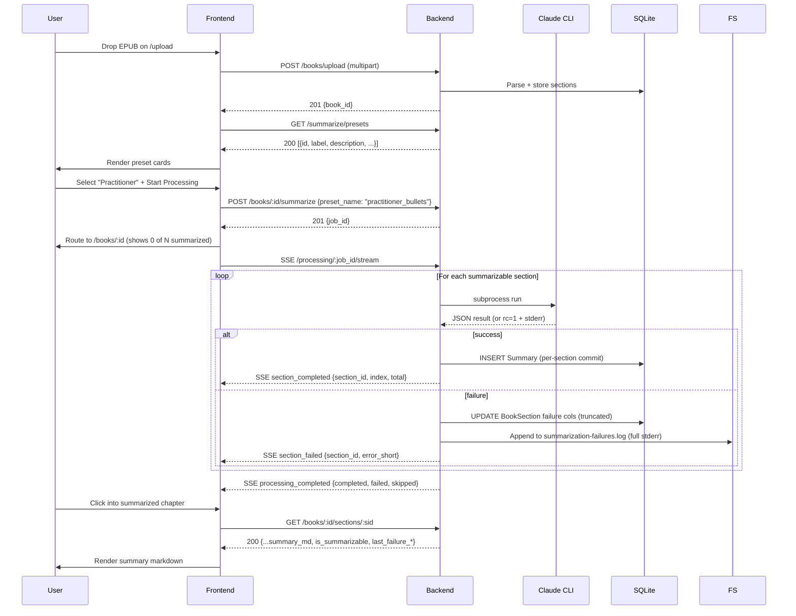
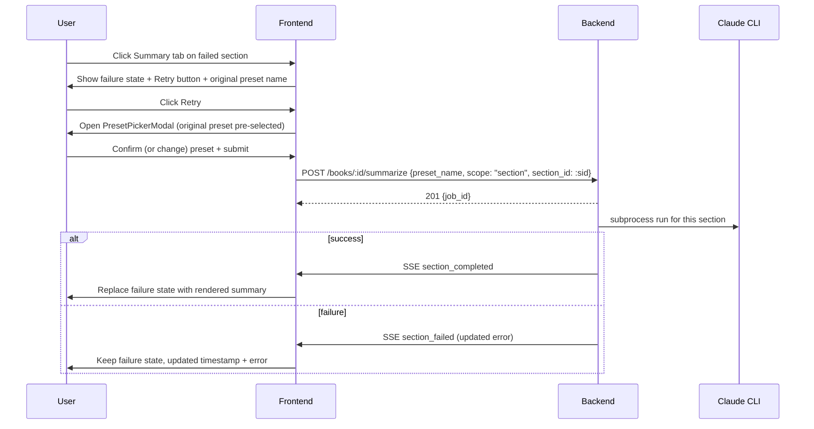
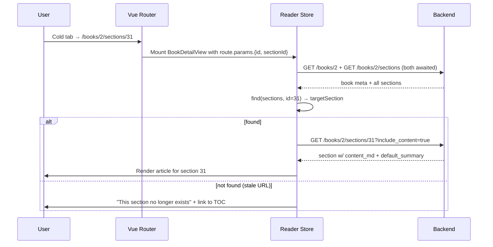
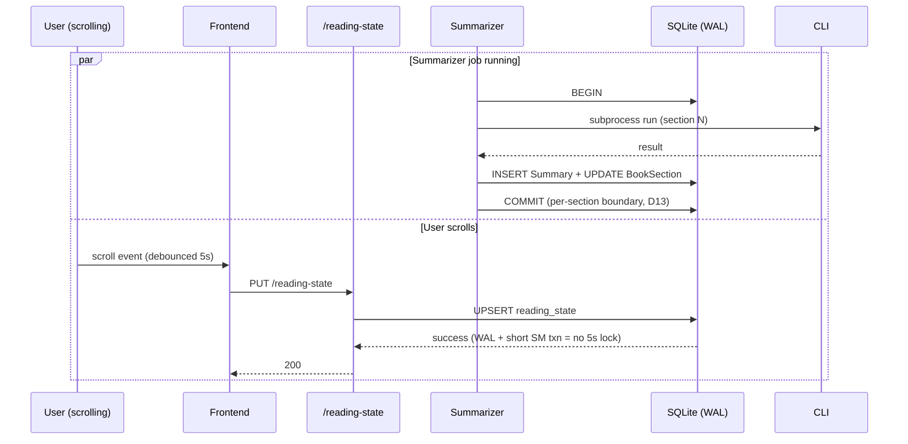

# V1.4 Pre-Ship Quality Pass — Spec

**Date:** 2026-04-22
**Status:** Draft
**Requirements:** [`../requirements/2026-04-22-v1.4-pre-ship-quality-pass.md`](../requirements/2026-04-22-v1.4-pre-ship-quality-pass.md)
**Tier:** 3

---

## 1. Problem Statement

The packaged SPA fails the end-to-end happy path: upload wizard sends fake preset IDs (`brief`, `balanced`, `detailed`) the backend rejects with 400, Claude CLI failures on chapter-length sections are silent (`rc=1: ` with empty stderr body), `/books/:id/sections/:sid` deep-links render section 1 on hard-load, and `/books/:id/summary` is a 5-line placeholder. Around those, ~20 polish gaps (markdown-as-plain-text in chat, `document.title = "Vite App"`, ambiguous DD/MM dates, etc.) compound the "unfinished" feel. Success metric: **zero blocker-class audit repros after ship**, **zero console errors on a full 7-route Playwright walk**, and **100% happy-path completion** for "upload a fresh book → open a chapter summary".

---

## 2. Goals

| # | Goal | Success Metric |
|---|------|---------------|
| G1 | Upload wizard summarize path works end-to-end | 2 fresh books (Gutenberg EPUB + non-fiction PDF) complete upload → summarize → render a section summary with zero console errors |
| G2 | LLM-CLI failures produce useful error state | Every `rc != 0` stores a typed failure record; every failed section's Summary tab shows the error + Retry button |
| G3 | Section deep-links work on hard-load | `/books/:id/sections/:sectionId` renders the requested section on cold tab AND on reload, verified across Porter + AoW books |
| G4 | `/books/:id/summary` is a real surface with generation | Page renders book summary (when present) + progress + section list, with a Generate Book Summary preset-picker-modal wired to the summarization job pipeline |
| G5 | Chat/annotations/search polish | Markdown renders in chat, `/annotations` rows link back to source with book+section context, command palette has loading + empty states |
| G6 | Global polish (title, casing, dates, labels) | Zero occurrences of "Vite App" title, DD/MM dates, `table_of_contents` underscored labels, or `practitioner_bullets` internal IDs user-visible |
| G7 | Reading-state stops 503'ing during summarize | 60-second Playwright interaction while summarize job runs: zero 5xx in network log |

---

## 3. Non-Goals

- NOT building new ingestion pipelines or parser rewrites — F4 classifier fixes extend existing regex patterns only.
- NOT adding new summarization presets — the five existing YAML files are source of truth.
- NOT redesigning the upload wizard — flow stays; only PresetPicker source + error handling change.
- NOT building editable metadata UI — F3 drops the step from the indicator per D8.
- NOT reworking chat threading/citations/memory — only markdown rendering, auto-title, scope indicator in scope.
- NOT surfacing the `database_migrations_behind` warning as a UI banner — server autorun or CLI init-check is a better solve (deferred).
- NOT introducing i18n — D6 hybrid dates use a single locale-aware helper, no translation layer.
- NOT building a global toast/notification system — inline errors + per-section banners are sufficient for v1.4.
- NOT restructuring the `Summary` model — failure records live on `BookSection` to avoid NULL-column migration.

---

## 4. Decision Log

| # | Decision | Options Considered | Rationale |
|---|----------|-------------------|-----------|
| D1 | Presets surfaced via `GET /api/v1/summarize/presets`, not embedded in SPA bundle. | (a) Runtime fetch (chosen). (b) Vite build-time YAML read. (c) Keep hardcoded. | Matches existing `reading_presets.py:19-31` list-endpoint pattern. New YAML files hot-add without rebuild. Picks up provider-filtering extensions cleanly. |
| D2 | Failure capture is two-depth: a **typed truncated record on `BookSection`** (UI-safe) + a **`summarization-failures.log` rotating file** (full stderr, debug-only). | (a) DB-only truncated (loses history). (b) Raw stderr in DB (PII/key leak risk). (c) Two-depth (chosen). | UI stays small and safe; diagnosis fidelity preserved. Log lives in `{BOOKCOMPANION_DATA_DIR}/summarization-failures.log`, 5 MB × 3 rotations via `logging.handlers.RotatingFileHandler`. |
| D3 | Thread title auto-generation is a first-40-chars heuristic in v1.4. | (a) Heuristic (chosen). (b) Per-thread LLM title call. (c) Leave "New Thread". | (b) doubles LLM cost per thread + adds latency; (c) is status quo. Upgrade path to (b) stays open via an optional setting later. |
| D4 | `/books/:id/summary` ships with an in-UI **Generate Book Summary** button backed by a preset-picker modal. | (a) Read-only + CLI pointer. (b) With Generate button (chosen). (c) Keep stub. | User confirmed in requirements. Closes audit finding without adding a separate surface. Modal reuses the upload-wizard preset cards for consistency. |
| D5 | Nav label "Notes" → "Annotations" everywhere; keep the page + model + API + CLI terminology. | (a) Rename nav (chosen). (b) Rename model. (c) Leave inconsistent. | `Annotation` is the product term across API, model, component, CLI. Renaming the nav is a one-line change; renaming the model would touch many files. |
| D6 | Date rendering: relative ("3 days ago") for <7 days, absolute long ("Apr 22, 2026") thereafter. | (a) ISO everywhere. (b) Always relative. (c) Hybrid (chosen). (d) Full `Intl.DateTimeFormat` with locale. | (c) matches reader-tool conventions (Kindle/Pocket/Readwise). (d) requires i18n plumbing explicitly a non-goal. |
| D7 | TOC "has summary" badge is `✓` + `aria-label="Summary available"` + `title` tooltip. | (a) "✓" (chosen). (b) Full word "Summarized". (c) Color-only. | Compact, universally-legible, accessible. (b) noisy in long TOC. (c) fails colorblind users. |
| D8 | Upload wizard Metadata step removed from step indicator; editable metadata deferred to v1.5+. | (a) Remove (chosen). (b) Build editable form. (c) Silently skip. | Minimal honest fix; editable metadata is a separate feature. |
| D9 | Empty-summary root cause fixed at **summarizer-service layer**, not patched at API or frontend. | (a) Service-layer (chosen). (b) API filters on read. (c) Frontend defensive check. | Prevents bad writes. (b) and (c) leak symptom to downstream consumers; must be re-applied per client (CLI/API/future surfaces). |
| D10 | A7 (SQLite concurrency) absorbed into v1.4 even though originally scoped by `2026-04-12-post-install-runtime-quality`. | (a) Depend on that doc. (b) Absorb (chosen). | That doc has zero feature commits. Absorbing means one workstream ships the fix. |
| D11 | Generate Book Summary opens a preset-picker modal with **last-used section-summarization preset pre-selected**. | (a) Silent inherit. (b) Pre-selected picker (chosen). (c) Fixed preset. (d) Empty picker. | User mental model: "I know what I chose for sections, may want different for book." Frictionless default with course-correct option. |
| D12 | Retry on failed section opens the preset picker with **originally-chosen** preset pre-selected. | (a) Silent original. (b) Pre-selected picker (chosen). (c) Current default. | Consistent with D11. Requires per-section-run preset persistence (new `BookSection.last_preset_used`). |
| D13 | A7 mechanism: **per-section commit boundaries in the summarizer**, not just a `busy_timeout` bump. | (a) Raise `busy_timeout` from 5s → 30s. (b) Per-section commits (chosen). (c) Both. | `busy_timeout` already 5s (`session.py:29`). Current symptom is the summarizer holding a write txn across 17 LLM calls; no timeout bump is enough. (b) fixes the cause. (c) is belt-and-suspenders; reject as over-engineering. |
| D14 | Failure record columns live on **`BookSection`** (one row per section, upserted), not on `Summary` and not a new table. | (a) Columns on `Summary` (blocked: `summary_md NOT NULL`). (b) New `summary_failure_attempt` table (scope inflation). (c) Columns on `BookSection` (chosen). | Cleanest mapping — one failure state per section, always present. History lives in the debug log (D2), not the DB. |
| D15 | OQ1 (chat scope) resolved: backend already supports `context_section_id` (`ai_thread_service.py:95`). D3 affordance is a **selector** (Section ↔ Book), not a static badge. | (a) Static badge. (b) Selector (chosen). | Backend capability exists and is unused; exposing it is near-free and gives users real scope control. |
| D16 | OQ2 (Generate Book Summary with no section summaries) resolved: **button disabled + tooltip**. | (a) Disabled + tooltip (chosen). (b) Warning modal. (c) Auto-summarize sections first. | Cleanest UX. User is nudged toward the Summarize pending sections button on the same surface. Avoids compound-job scope. |
| D17 | MarkdownRenderer AND PresetGrid extracted as shared components. `MarkdownRenderer.vue` used by `ReadingArea.vue` + `ChatMessage.vue` + `BookSummaryView.vue`. `PresetGrid.vue` used by upload wizard `PresetPicker.vue` + new `PresetPickerModal.vue`. | (a) Duplicate logic. (b) Shared components (chosen). | One sanitization pipeline, one link policy, one preset-card UI, one update path. |
| D18 | User-facing casing convention: **Capital-Case-With-Spaces** for all filter options/labels; acronyms uppercase (EPUB/PDF/MOBI); backend enums remain lowercase. Display-layer transform only. | (a) Capital-Case (chosen). (b) Backend-enum-raw. (c) Sentence case. | (a) matches existing "All Statuses / All Formats" and polished reader-tool conventions. |
| D19 | Router fix for B1 is a **`loadBook` fix that awaits sections before the `find(routeSectionId)` lookup**, not a `beforeEnter` resolver. | (a) `beforeEnter` resolver. (b) Fix `loadBook` await ordering (chosen). | Root cause (research): `reader.ts:44-66` `find(routeSectionId)` runs before sections are populated on hard-load; resolver would work around the bug rather than fix it. |

---

## 5. User Personas & Journeys

### 5.1 Persona: Maneesh (primary)

A solo developer using Book Companion daily, running `bookcompanion serve` locally. Tech-fluent, will notice console errors and broken deep-links immediately. Handles failures gracefully if informed, confused and disengaged if not.

### 5.2 Journey A — Upload → Summarize → Read (happy path)



### 5.3 Journey B — Failed section Retry



### 5.4 Journey C — Deep-link on hard-load



---

## 6. System Design

### 6.1 Architecture Overview

No new containers or services. Additions are all within the existing process:

```
┌─────────────────────────────────────────────────────────────────┐
│  Browser (Vue 3 SPA served by FastAPI static mount)            │
│  ┌─────────────┐  ┌──────────────┐  ┌──────────────────────┐   │
│  │ UploadView  │  │ BookDetail / │  │ BookSummaryView      │   │
│  │ + Preset    │  │ ReaderView   │  │ (NEW — full impl)    │   │
│  │ Picker      │  │ + Summary    │  │                      │   │
│  │ (NEW fetch) │  │ failure UI   │  │                      │   │
│  └──────┬──────┘  └──────┬───────┘  └──────────┬───────────┘   │
│         │                │                      │              │
│         │    ┌───────────┴──────────┐           │              │
│         │    │ Shared MarkdownRenderer (NEW)    │              │
│         │    │ (extracted from ReadingArea)     │              │
│         │    └──────────────────────────────────┘              │
│         │                │                      │              │
│         ▼                ▼                      ▼              │
│                     /api/v1/*                                  │
└─────────────────────────────────────────────────────────────────┘
                         │
┌────────────────────────▼────────────────────────────────────────┐
│  FastAPI                                                        │
│  ┌─────────────────────────────────────────────────────────┐   │
│  │ Routes                                                   │   │
│  │   /summarize/presets (NEW) — PresetService.list_all()   │   │
│  │   /books/:id/summarize (existing — 400 error shape std) │   │
│  │   /books/:id/book-summary (NEW) — GET + POST (generate) │   │
│  │   /annotations (existing — response extended)           │   │
│  │   /reading-state (existing — writer txn changes below)  │   │
│  └─────────────────────────────────────────────────────────┘   │
│  ┌─────────────────────────────────────────────────────────┐   │
│  │ Services                                                 │   │
│  │   PresetService.list_all() (existing)                   │   │
│  │   SummarizerService                                      │   │
│  │     + per-section commit boundary (D13)                 │   │
│  │     + empty-content fail enforcement (D9)               │   │
│  │   ClaudeCodeCLIProvider / CodexCLIProvider              │   │
│  │     + stderr capture format fix                         │   │
│  │     + write to summarization-failures.log (D2)          │   │
│  │   AiThreadService (existing — section context works)    │   │
│  └─────────────────────────────────────────────────────────┘   │
└────────────────────────┬────────────────────────────────────────┘
                         │
┌────────────────────────▼────────────────────────────────────────┐
│  SQLite + WAL + file log                                        │
│  • library.db                                                   │
│    - BookSection: + last_failure_type, last_failure_message,    │
│                    last_attempted_at, attempt_count,            │
│                    last_preset_used (NEW columns)               │
│    - Summary: unchanged (empty-content rejected at service)     │
│  • summarization-failures.log (NEW, 5MB × 3 rotations)          │
└─────────────────────────────────────────────────────────────────┘
```

### 6.2 Sequence Diagrams

See §5.2, 5.3, 5.4. Additional flow for concurrent reading-state during summarize:



---

## 7. Functional Requirements

FR IDs are grouped by requirements Cluster letter (A–F). Every requirements acceptance criterion maps to one FR.

### 7.1 Cluster A — Summarization reliability

| ID | Requirement |
|----|-------------|
| FR-A1.1 | `GET /api/v1/summarize/presets` returns `200` with array of preset metadata (see §9.1). Route registered before SPA static mount in `main.py`. |
| FR-A1.2 | `PresetPicker.vue` calls the new endpoint on mount and renders cards from the response. Remove hardcoded `presets` array (`PresetPicker.vue:16-25`). The fetch is NOT cached across mounts — each `PresetPicker` mount, each `PresetPickerModal` open, and each `BookSummaryView` Generate-button click fires a fresh GET (endpoint is <50ms for 5 files per NFR-01; caching is not worth the staleness risk on a personal tool where users may add YAML files). |
| FR-A1.3 | `POST /books/:id/summarize` with any preset returned by A1.1 succeeds (no 400 "Preset X not found"). |
| FR-A2.1 | Adding a new YAML file under `backend/app/services/summarizer/prompts/presets/` and restarting the server causes it to appear in the `GET /summarize/presets` response without frontend changes. |
| FR-A3.1 | When the summarize POST returns non-2xx in `UploadWizard.vue`, an inline error block renders below the preset cards with the server's error message. |
| FR-A3.2 | The Start Processing button returns to its non-busy state after an error (removes `:disabled` + spinner). |
| FR-A4.1 | When `ClaudeCodeCLIProvider._run_subprocess` returns `rc != 0`, a typed failure record (type code + truncated ≤500 chars of stderr) is persisted to `BookSection.last_failure_{type,message,at}` (schema §10.1). |
| FR-A4.2 | Full stderr is appended to `{BOOKCOMPANION_DATA_DIR}/summarization-failures.log` via `RotatingFileHandler(5MB, backupCount=3)`. |
| FR-A4.3 | Summary tab on a failed section shows a `SummaryFailureBanner` component: error type, truncated message, timestamp, Retry button. |
| FR-A4.4 | Book detail page's `SummarizationProgress` banner tallies failed count: "N of M summarized · X failed · Retry failed". |
| FR-A5.0 | `SummarizerService.summarize_section()` records the preset on `BookSection.last_preset_used` (UPSERT) BEFORE invoking the LLM subprocess. This ensures that even if the subprocess fails, Retry (FR-A5.1) has the original preset to pre-select. |
| FR-A5.1 | Retry button on a failed section opens `PresetPickerModal` with `BookSection.last_preset_used` pre-selected. |
| FR-A5.2 | Retry failed sections button on book detail opens `PresetPickerModal` once; selected preset applies to all failed sections in the job. |
| FR-A5.3 | Retry POSTs to existing `POST /books/:id/summarize` with `scope: "section", section_id: :sid` (or `scope: "failed"` for batch retry — new scope value). |
| FR-A6.1 | `SummarizerService._save_summary` refuses to write a row when `summary_md.strip() == ""`. Instead, it writes a failure record (FR-A4.1) with `type: empty_output` and does not raise. |
| FR-A6.2 | Existing empty-content rows are swept by migration (§10.2) — summary deleted, `BookSection.last_failure_{type,message,at}` set. |
| FR-A6.3 | **Pre-migration backup**: before Migration 2 (data-backfill) executes, the server creates `{BOOKCOMPANION_DATA_DIR}/library.db.pre-v1-4-<YYYYMMDD_HHMMSS>.bak` by reusing `BackupService.create_backup()`. If the backup fails for any reason (disk full, permission denied, etc.), Migration 2 aborts with a clear log entry and Alembic's version table remains at Migration 1's revision. |
| FR-A6.4 | **Migration atomicity**: Migrations 1 and 2 are **two separate Alembic revisions**. Migration 1 (additive schema) runs and commits independently. Migration 2 (data backfill + empty-row cleanup) runs its backup-then-backfill body inside a single Alembic transaction; on any error the transaction rolls back and the server continues running with the M1 schema applied but no data backfill. On next server boot, Alembic detects the version gap and retries Migration 2 automatically. |
| FR-A7.1 | `SummarizerService.summarize_book()` commits the DB transaction after each section (not once at the end). |
| FR-A7.2 | Playwright test: start a summarize job on a 17-section book, continuously scroll for 60s, assert zero 5xx in network log for `PUT /reading-state`. |

### 7.2 Cluster B — Reader deep-linking

| ID | Requirement |
|----|-------------|
| FR-B1.1 | `useReaderStore.loadBook(bookId, opts)` awaits the sections fetch before calling `find(opts.routeSectionId)` (fix at `stores/reader.ts:44-66`). |
| FR-B1.2 | Navigating directly to `/books/:id/sections/:sid` in a cold browser tab renders the requested section — verified via Playwright reload test. |
| FR-B1.3 | Route param watcher (`BookDetailView.vue:72`) retains current behavior for in-app navigation (no regression). |
| FR-B2.1 | Clicking a TOC item → copying URL → reloading in a new tab lands on the same section (already works; covered by FR-B1.2 test). |
| FR-B3.1 | First open of an un-visited book lands on the first section where `is_summarizable: true`, not front-matter (existing — Playwright regression test added against AoW fixture). |

### 7.3 Cluster C — Summary surface

| ID | Requirement |
|----|-------------|
| FR-C1.1 | `/books/:id/summary` renders `BookSummaryView.vue` with: (a) book summary markdown via shared MarkdownRenderer, (b) progress counter from `book.summary_progress`, (c) collapsible section-summary list, (d) Generate Book Summary button. |
| FR-C1.2 | Generate button opens `PresetPickerModal` with the last-used section preset pre-selected (D11). If no section summaries exist, button is disabled with tooltip "Summarize sections first" (D16). |
| FR-C1.3 | Modal submit POSTs to new endpoint `POST /books/:id/book-summary {preset_name}` (§9.2). |
| FR-C1.4 | Generation uses existing SSE (event_type=`processing_completed` or `processing_failed` carries `book_summary_id`). |
| FR-C1.5 | Generation failure re-enables the button and shows a failure banner on the page with truncated error + Retry CTA. |
| FR-C1.6 | On `/books/:id/summary`, when the frontend receives an SSE `processing_completed` event with `book_summary_id` populated, the page re-fetches `GET /books/:id` (or a book-summary-specific endpoint if one exists) and re-renders the book summary body. No manual refresh required. |
| FR-C2.1 | Summary tab renders `default_summary.summary_md` when `has_summary: true` AND `summary_md.strip() != ""`. |
| FR-C2.2 | Summary tab renders failure state (FR-A4.3) when `BookSection.last_failure_type != null` AND no successful summary exists. |
| FR-C2.3 | Summary tab renders "Not yet summarized" + Summarize CTA when `is_summarizable: true` AND no summary AND no failure record. |
| FR-C2.4 | Summary tab renders "Summary not applicable" when section type is in the front-matter set (existing behavior, verified). |
| FR-C3.1 | On `/books/:id` (the reader route), `SummarizationProgress.vue` is visible at the top of the page after upload, showing current progress (`N of M summarized · X failed`) with Summarize pending sections + Retry failed sections buttons. Verified via Playwright against a freshly-uploaded AoW EPUB. |
| FR-C4.1 | Migration: for every `BookSection` with `default_summary_id IS NULL` AND ≥1 non-empty `Summary` row with `content_type='section' AND content_id=section.id`, set `default_summary_id = latest_non_empty.id`. |
| FR-C4.2 | Post-save hook in `SummaryService.create`: if the section has no default and the new summary is non-empty, set `default_summary_id` to the new summary. |

### 7.4 Cluster D — Chat / annotations / search polish

| ID | Requirement |
|----|-------------|
| FR-D1.1 | Shared `MarkdownRenderer.vue` component extracted from `ReadingArea.vue:17-44`. Same markdown-it + DOMPurify + link-policy pipeline. Used by `ReadingArea.vue`, `ChatMessage.vue`, and `BookSummaryView.vue`. |
| FR-D1.2 | `ChatMessage.vue` renders `message.content` via `MarkdownRenderer` (replace `{{ message.content }}` at line 12). |
| FR-D1.3 | Shared `PresetGrid.vue` primitive extracted from the card-layout in `PresetPicker.vue`. Renders preset cards from an array prop; emits `@select(preset_id)`. Used by upload wizard `PresetPicker.vue` (wrapping it) AND by new `PresetPickerModal.vue`. Ensures one source of truth for preset card styling and interaction. |
| FR-D2.1 | On first user message in a thread, `AIThreadService.create_message` derives `thread.title` from first 40 chars, word-boundary trimmed. Stored on the thread row. |
| FR-D2.2 | `AIThreadsStore.threadList` shows thread titles; falls back to "New Thread" only for empty threads (pre-first-message). |
| FR-D3.1 | Chat panel shows a scope selector (toggle): "Section: {title}" ↔ "Book: {title}". Backend already supports via `context_section_id` (`ai_thread_service.py:95`). |
| FR-D3.2 | Selected scope is sent as `context_section_id` in `POST /ai-threads/:id/messages` when Section is active, omitted when Book is active. |
| FR-D3.3 | Scope selector defaults to Section when the user is in a reader view, Book when on book-level page (e.g., `/books/:id/summary`). |
| FR-D3.4 | Chat panel is accessible only on routes with a current book context (reader + `/books/:id/summary`). On `/`, `/concepts`, `/annotations`, `/search`, `/settings`, `/upload`, the chat panel is not rendered. |
| FR-D4.1 | `GET /annotations` response includes `book_title` and `section_title` per annotation (join in the repo query). |
| FR-D4.2 | `AnnotationsView.vue` shows `book_title • section_title` under the annotation quote. |
| FR-D4.3 | Clicking an annotation row navigates to `/books/:book_id/sections/:section_id` using router-link. |
| FR-D5.1 | `CommandPalette.vue` renders a loading state during the 200ms debounce (spinner or skeleton rows). |
| FR-D5.2 | When search results are empty, render "No results for '{query}'" + link to `/search?q={query}`. |

### 7.5 Cluster E — Global polish

| ID | Requirement |
|----|-------------|
| FR-E1.1 | Vue Router `afterEach` hook sets `document.title` from route meta `title`. For dynamic routes, components call `useTitle()` composable (Tier-1 extract). |
| FR-E1.2 | Per-route titles: `"Library — Book Companion"`, `"Upload — Book Companion"`, `"{Book Title} — Book Companion"` (reader), `"{Book Title} · Book Summary — Book Companion"`, `"Concepts — Book Companion"`, `"Annotations — Book Companion"`, `"Settings — Book Companion"`, `"Search — Book Companion"`. |
| FR-E1.3 | `index.html` static title changed from `"Vite App"` to `"Book Companion"`. |
| FR-E2.1 | Left-nav label "Notes" → "Annotations". `AppNav.vue` update. |
| FR-E2.2 | All filter option labels rendered via `labelize(enum_value)` helper → Capital-Case-With-Spaces; acronyms uppercase. Applies to: library status filter, library format filter, structure step section-type column, preset labels if shown raw anywhere. |
| FR-E2.3 | Reader `<h1>` (`BookDetailView.vue`) replaced: "Reader" → `{book.title}`. |
| FR-E3.1 | Date helper `formatDate(iso: string, mode: 'auto' | 'relative' | 'long' = 'auto')` at `src/utils/formatDate.ts`. `auto` mode: relative if <7 days, "MMM D, YYYY" otherwise. |
| FR-E3.2 | All human-visible date strings across library table, annotations list, book metadata, chat timestamps, summary created_at use `formatDate`. |
| FR-E4.1 | No user-visible button label uses ALL-CAPS letters (excluding acronyms). Specifically "Export MARKDOWN" → "Export Markdown". |
| FR-E5.1 | `readingState.trackPosition` skips persisting if `section.section_type` is in `FRONT_MATTER_TYPES` (reuse constant from reader classifier work). |
| FR-E5.2 | If no non-front-matter section has been visited, `/reading-state/continue` returns `null` and the banner is hidden. |
| FR-E6.1 | TOC badge for summarized sections renders `✓` glyph + `aria-label="Summary available"` + `title="Summary available"`. No bare letter "S". |
| FR-E7.1 | Reader's markdown `` renderer: if `naturalHeight <= 2` OR `alt === "image"`, emit `alt=""`. Otherwise keep derived alt. |
| FR-E8.1 | Structure-step (upload wizard) type column renders via `labelize` — `table_of_contents` → "Table of Contents", `introduction` → "Introduction", etc. |
| FR-E9.1 | Upload confirmation copy reads "…with the **{preset.label}** preset" (e.g., "Practitioner"), not the internal name. |
| FR-E10.1 | CSS variable `--highlight-saved-bg` distinct from `::selection` color. Applied to rendered `<mark class="annotation">` spans. |

### 7.6 Cluster F — Defect cleanup + classifier

| ID | Requirement |
|----|-------------|
| FR-F1.1 | `e.presets.filter is not a function` error at `BookDetailView-BaE9dFiQ.js:17:7857` eliminated. Root cause: `settings.loadPresets()` returns `null` on fetch fail, `.filter` called on null. Fix: guard `if (!Array.isArray(presets)) return []` or initialize store to `[]`. |
| FR-F2.1 | Link-policy sanitizer (`applyLinkPolicy` at `ReadingArea.vue`) strips `href` attributes matching `.xhtml`, `.htm`, `#filepos`, `#chap`, `#pref`, `#sect` prefixes (extend existing pattern). Heading self-anchors also neutralized. |
| FR-F2.2 | External `http(s)://` links retain `target="_blank" rel="noopener noreferrer"`. |
| FR-F3.1 | `UploadWizard.vue` step indicator renders 4 steps: Upload → Structure → Preset → Processing (Metadata removed). |
| FR-F4.1 | Classifier patterns in `backend/app/services/parser/section_classifier.py` extended with the following detection rules, evaluated in order: (a) title matches `Project Gutenberg.*License` (case-insensitive) → `license`; (b) title matches `^Footnotes?$` (case-insensitive) → `notes`; (c) title matches a person-name pattern — mixed-case allowed — of form `^[A-Z][a-zA-Z\.]{1,30}(\s+[A-Z][a-zA-Z\.]{1,30}){0,3}(,\s*(M\.A\.|Ph\.D\.|Jr\.|Sr\.|Esq\.))?$` AND section's `content_md` stripped length < 200 chars → `title_page`. The content-length guard prevents mis-classifying legitimate short chapters that happen to have person-name-like titles; 200 chars covers author bylines + credentials and their typical formatting. |
| FR-F4.2 | `SUMMARIZABLE_TYPES` set excludes `title_page`, `license`, `notes` (existing + new). |
| FR-F4.3 | Cross-layer contract test (extends existing `test_classifier_contract` — file from prior session) asserts frontend `SUMMARIZABLE_TYPES` matches backend. |

---

## 8. Non-Functional Requirements

| ID | Category | Requirement |
|----|----------|-------------|
| NFR-01 | Performance | `GET /summarize/presets` responds in <50ms p95 (reads 5 YAML files from disk). |
| NFR-02 | Performance | `PUT /reading-state` responds <200ms p95 during an active summarize job (validates A7 fix). |
| NFR-03 | Accessibility | Every newly-added interactive element has an accessible name (aria-label or visible label). TOC summary badge, preset picker modal, retry button, scope selector toggle. |
| NFR-04 | Compatibility | All migrations idempotent — re-running produces zero changes. |
| NFR-05 | Observability | Every subprocess failure logged at `warning` level with `section_id` + truncated stderr; additionally written to the failures log file. |
| NFR-06 | Security | `summarization-failures.log` is created with mode 0600 (user-only read/write) — stderr may contain prompt text + file paths. |
| NFR-07 | Backwards-compat | New `BookSection` columns are nullable with sensible defaults; existing rows require no backfill for failure-tracking. |
| NFR-08 | Frontend | No user-facing string in the DOM matches `/Vite App|MARKDOWN|\d{2}\/\d{2}\/\d{4}|practitioner_bullets|table_of_contents/` after v1.4 ships (automated scan via Playwright asserting `document.body.innerText`). |
| NFR-09 | Contract | All SSE payload changes in v1.4 are **additive only**. Frontend consumers use object-destructuring with defaults (`const { section_id, error_type = null, error_message_truncated = null } = payload`), never shape equality (`JSON.stringify(payload) === known_shape`). This preserves non-breakage for any consumer that still reads the v1.3 event fields. |

---

## 9. API Contracts

### 9.1 `GET /api/v1/summarize/presets`

New endpoint. Registered **before** the SPA static mount in `backend/app/api/main.py` (between lines 165 and 166 per research report §1).

**Request:** No body, no query params.

**Response (200):**
```json
{
  "presets": [
    {
      "id": "practitioner_bullets",
      "label": "Practitioner",
      "description": "Actionable bullet points for practitioners",
      "facets": {
        "style": "bullets",
        "audience": "practitioner",
        "compression": "standard",
        "content_focus": "application"
      },
      "system": true
    }
  ],
  "default_id": "practitioner_bullets"
}
```

**Response (500):** `{"detail": "Could not load presets"}` if the YAML directory is unreadable (should not occur in practice).

### 9.2 `POST /api/v1/books/{book_id}/book-summary`

New endpoint for Generate Book Summary (C1/D4). Reuses the existing summarization job pipeline.

**Request:**
```json
{ "preset_name": "executive_brief" }
```

**Response (201):**
```json
{ "job_id": 42 }
```

**Error responses:**
- `400` — `{"detail": "Preset '{name}' not found. Available: [...]"}` (same format as section summarize).
- `400` — `{"detail": "No section summaries exist; summarize sections first"}` (D16 enforcement).
- `409` — `{"detail": "A summarization job is already running for this book"}`.

**SSE:** Progress streamed on existing `/processing/{job_id}/stream`. On completion, event `processing_completed` payload gains `book_summary_id` field (non-breaking addition for existing consumers).

### 9.2.1 SSE Payload Shape Changes

`section_failed` event payload (extended for v1.4 — non-breaking additive):
```json
{
  "section_id": 31,
  "title": "Chapter I. LAYING PLANS",
  "index": 13,
  "total": 27,
  "error": "CLI exited with code 1: ...",                // existing field retained
  "error_type": "cli_nonzero_exit",                      // NEW
  "error_message_truncated": "CLI exited with code 1..." // NEW (≤500 chars, matches DB)
}
```

`processing_completed` event payload (extended — non-breaking):
```json
{
  "book_id": 2,
  "completed": 15,
  "failed": 2,
  "skipped": 10,
  "book_summary_id": 42     // NEW, only present for book-summary jobs; null for section jobs
}
```

### 9.3 `POST /api/v1/books/{book_id}/summarize` (modified)

Existing endpoint. **Changes:**

**Request:** Add optional field:
```json
{
  "preset_name": "practitioner_bullets",
  "scope": "book" | "section" | "failed",   // NEW: "failed" added
  "section_id": 31,                          // existing (used when scope="section")
  "run_eval": true,
  "auto_retry": true,
  "skip_eval": false
}
```

**Scope semantics:**
- `book` (default): summarize all `is_summarizable` sections without a summary (existing behavior).
- `section`: summarize only the section referenced by `section_id`. Used for single-section Retry.
- `failed`: summarize only sections where `BookSection.last_failure_type IS NOT NULL` AND no successful summary exists. The `preset_name` in the request applies uniformly to all failed sections in the batch (per E16 — single preset for the batch; users wanting per-section preset control use individual section retry).

**Response (201):** Unchanged — `{job_id}`.

**Error responses:** Unchanged shape. The "Preset not found" error (400) already includes the available presets list (`preset_service.py:75`) — spec formalizes this as the contract. Additional 400 for `scope: "failed"` with no failed sections: `{"detail": "No failed sections to retry"}`.

### 9.4 `GET /api/v1/books/{book_id}/sections/{section_id}` (modified)

Existing endpoint. **Response additions:**
```json
{
  // ... existing fields ...
  "last_failure_type": "cli_nonzero_exit" | null,
  "last_failure_message": "Claude CLI exited with code 1..." | null,
  "last_attempted_at": "2026-04-22T14:25:40Z" | null,
  "attempt_count": 3,
  "last_preset_used": "practitioner_bullets" | null
}
```

### 9.5 `GET /api/v1/annotations` (modified)

Existing endpoint. **Response additions per item:**
```json
{
  // ... existing fields ...
  "book_id": 1,
  "book_title": "Understanding Michael Porter",
  "section_id": 3,
  "section_title": "Introduction"
}
```

Fetched via JOIN in `annotation_repo.list_all()`.

---

## 10. Database Design

### 10.1 Schema Changes

```sql
-- Migration: v1_4_book_section_failure_tracking
-- SQLite: requires render_as_batch=True for ALTER TABLE

ALTER TABLE book_sections ADD COLUMN last_failure_type VARCHAR(64);
ALTER TABLE book_sections ADD COLUMN last_failure_message TEXT;
ALTER TABLE book_sections ADD COLUMN last_attempted_at DATETIME;
ALTER TABLE book_sections ADD COLUMN attempt_count INTEGER NOT NULL DEFAULT 0;
ALTER TABLE book_sections ADD COLUMN last_preset_used VARCHAR(200);

CREATE INDEX ix_book_sections_last_attempted_at ON book_sections(last_attempted_at);
```

**Failure type enum values (application-layer, stored as VARCHAR for flexibility):**
- `cli_nonzero_exit` — subprocess returned non-zero
- `cli_timeout` — subprocess hit configured timeout
- `schema_parse_failed` — JSON schema validation failed on LLM output
- `empty_output` — LLM returned empty/whitespace-only markdown
- `db_error` — generic DB error (rare)

### 10.2 Migration Notes

Two migrations, both additive + idempotent.

**Migration 1: `v1_4_failure_tracking_columns`** (schema only)
- Adds the five `BookSection` columns above + index.
- `render_as_batch=True`.
- Down-migration drops columns (test with `alembic downgrade`).

**Migration 2: `v1_4_default_summary_backfill_and_empty_cleanup`** (data backfill, per-commit batched)
- For every `Summary` row where `summary_md IS NULL OR TRIM(summary_md) = ''`:
  - Read its `content_id` → BookSection
  - DELETE the Summary row
  - UPDATE BookSection SET `last_failure_type='empty_output', last_failure_message='Cleaned up empty summary from prior run', last_attempted_at=summary.created_at, attempt_count=attempt_count+1` WHERE default_summary_id=summary.id OR this section had no successful summary.
  - If the BookSection's `default_summary_id` pointed to this row, NULL it.
- For every `BookSection` where `default_summary_id IS NULL` AND ≥1 non-empty Summary exists with `content_type='section' AND content_id=section.id`: SET `default_summary_id = <latest non-empty summary id>`.
- Logs at completion: `sections_default_backfilled=N, empty_summaries_deleted=N, sections_marked_failed=N`.
- Idempotent: re-running produces all-zero counts.

**Rollback strategy:** Schema migration drops columns (safe). Data migration is not reversible (deleted empty rows are gone) — backup the DB before running via the existing `BackupService`.

### 10.3 Indexes & Query Patterns

- `ix_book_sections_last_attempted_at` supports the book-detail page's "recently failed" ordering for Retry failed sections (if implemented).
- No change to existing indexes.

---

## 11. Frontend Design

### 11.1 Component Hierarchy

```
App.vue
├─ AppNav.vue
│  └─ NavItem (Library / Concepts / Annotations / Settings)  [E2.1]
├─ TopBar.vue
│  ├─ CommandPalette.vue  [D5 loading + empty states]
│  └─ UploadButton
└─ <router-view>
   ├─ LibraryView.vue
   │  ├─ ContinueBanner.vue  [E5 filter]
   │  ├─ BookFilters.vue  [E2.2 labelize]
   │  └─ BookCard.vue (grid) / BookTable.vue
   ├─ UploadView.vue → UploadWizard.vue
   │  ├─ StepIndicator  [F3: 4 steps]
   │  ├─ DropZone
   │  ├─ StructureReview  [E8 labelize types]
   │  ├─ PresetPicker.vue  [A1.2 fetch + A3 error]
   │  └─ ProcessingConfirmation  [E9 label not ID]
   ├─ BookDetailView.vue (reader)
   │  ├─ ReaderHeader  [E2.3 h1 = book title]
   │  ├─ TocDropdown  [E6 ✓ badge]
   │  ├─ ContentToggle (Original / Summary)
   │  ├─ ReadingArea.vue + MarkdownRenderer.vue  [D1, F2, E7, E10]
   │  ├─ SummaryEmptyState.vue / SummaryFailureBanner.vue  [A4.3, C2.2]
   │  ├─ SummarizationProgress.vue  [A4.4 failed count]
   │  └─ ContextSidebar
   │     ├─ AnnotationsTab.vue  [E10 highlight color]
   │     └─ AIChatTab.vue
   │        ├─ ThreadList.vue  [D2 titles]
   │        ├─ ChatScopeSelector.vue  [D3 NEW]
   │        └─ ChatMessage.vue + MarkdownRenderer  [D1]
   ├─ BookSummaryView.vue  [C1 full implementation NEW]
   │  ├─ BookSummaryHeader
   │  ├─ SummarizationProgress.vue (reused)
   │  ├─ MarkdownRenderer (book summary)
   │  ├─ SectionSummaryAccordion
   │  └─ GenerateBookSummaryButton → PresetPickerModal
   ├─ AnnotationsView.vue  [D4 book+section context]
   ├─ ConceptsView.vue
   └─ SettingsView.vue

Shared (new / modified):
  MarkdownRenderer.vue          [D1.1 NEW shared]
  PresetPickerModal.vue         [A5, C1 NEW]
  SummaryFailureBanner.vue      [A4.3 NEW]
  ChatScopeSelector.vue         [D3 NEW]
  formatDate.ts                 [E3 NEW utility]
  labelize.ts                   [E2, E8 NEW utility]
  useTitle() composable         [E1 NEW]
```

### 11.2 State Management

| State | Lives in | Notes |
|-------|----------|-------|
| Current book + section | `useReaderStore` (Pinia) | Fix: `loadBook` awaits sections before `find()` (D19) |
| Active summarize job | `useSummarizationJobStore` | Existing; extend to track `failed` count |
| Presets list | `useSettingsStore.presets` | Fetched once at app mount; used by upload wizard + retry modal + book-summary modal |
| AI thread + messages | `useAIThreadsStore` | Existing; extend `thread.title` on first message |
| Reading state (last section per book) | `useReadingStateStore` | Filter out front-matter (E5) |
| Document title | Vue Router `afterEach` + `useTitle()` composable | No store needed |
| Command palette query + results | `useSearchStore` | Existing; add loading + empty flags |

### 11.3 UI Specifications

**PresetPickerModal** — modal dialog containing the same card layout as upload-wizard PresetPicker. Accepts `preselect_preset: string | null` prop. Has primary button "Run" + secondary "Cancel". Emits `@submit(preset_name)` + `@cancel`.

**SummaryFailureBanner** — fills the Summary tab content area. Layout:
```
┌─────────────────────────────────────────────┐
│ ⚠ Summary failed                            │
│ {failure_type_human} · {formatDate(at)}    │
│ {truncated_message}                         │
│ [Retry]  [View full message ▾]             │
└─────────────────────────────────────────────┘
```

**ChatScopeSelector** — inline toggle at top of chat panel: `[ Section: Introduction | Book: {title} ]`. Left segment highlighted when section-scoped, right when book-scoped. Disabled (Section segment only) when no section is currently open.

**BookSummaryView** — responsive layout:
```
┌─ Book Title · Book Summary ─────────────────┐
│ Progress: 12 of 17 summarizable · 2 failed │
│                                             │
│ [Generate Book Summary]  (or summary body) │
│                                             │
│ ▾ Section summaries                         │
│   Chapter 1. Competition ...    (collapsed)│
│   Chapter 2. Strategy ...       (collapsed)│
│   ...                                       │
└─────────────────────────────────────────────┘
```

---

## 12. Edge Cases

| # | Scenario | Condition | Expected Behavior |
|---|----------|-----------|-------------------|
| E1 | Preset list fetch fails at wizard mount | `GET /summarize/presets` returns 5xx | `PresetPicker` shows "Loading presets…" then "Could not load presets — retry?" Never a silent empty grid. |
| E2 | Preset list fetch returns empty array | Server returns `{presets: []}` | `PresetPicker` shows "No presets configured" + link to docs. |
| E3 | LLM CLI not installed at summarize time | Subprocess spawn fails with `FileNotFoundError` | Failure record type `cli_not_found`; UI banner: "Claude/Codex CLI not found on PATH". Book detail offers link to Settings → LLM Provider. |
| E4 | Generate Book Summary with zero section summaries | User arrives at fresh book's `/books/:id/summary` | Button disabled + tooltip "Summarize sections first" (D16). Summarize pending sections link visible. |
| E5 | Generate Book Summary mid-run failure | LLM returns error on the one book-summary call | Button re-enables; failure banner on the page with Retry. No partial summary written. |
| E6 | Deep-link to section that no longer exists | `GET /books/:id/sections/:sid` returns 404 | Reader shows "This section no longer exists — it may have been removed or re-imported." + link to book TOC. |
| E7 | Retry modal fetch fails (presets endpoint down mid-session) | User clicks Retry, preset fetch fails | Modal shows inline error + retry-load button; Submit disabled. |
| E8 | Deep-link during active re-import | Book's sections are being regenerated | 404 or stale section content served; E6 handling covers the 404; stale content self-heals on next navigation. |
| E9 | Concurrent generate + section retry | User clicks Generate Book Summary while a section-retry is running | Book-summary POST returns 409 "A summarization job is already running for this book". Button re-enables. |
| E10 | Stderr contains non-UTF8 bytes | CLI writes binary to stderr | `.decode(errors="replace")` produces U+FFFD replacement chars; truncated to 500 chars; typed as `cli_nonzero_exit`. |
| E11 | Sections load but user-intended section is front-matter | URL `/books/:id/sections/1` where section 1 is Copyright | Reader DOES render section 1 (explicit URL overrides front-matter skip — E5 only applies to *default landing* and *reading-state persistence*). |
| E12 | First-time user with no LLM provider | `claude` + `codex` both missing from PATH | Upload wizard shows banner: "Summarization will not be available until Claude or Codex CLI is installed". Upload completes, summarize step is skipped, reader works. |
| E13 | Book summary exists but section summaries were since deleted | User deletes sections after generating book summary | Book summary displays normally. Progress shows "0 of N" if all sections were deleted. Generate button re-enables. |
| E14 | Long-running Generate Book Summary | LLM takes >5 minutes | SSE keeps connection alive via existing heartbeat (no changes). UI shows spinner + elapsed time. |
| E15 | Annotation orphaned by section re-import | Section ID changes on re-import; old annotation still references old ID | `GET /annotations` response's `section_id` may be stale; clicking it surfaces E6's "section no longer exists" state. Documented limitation. |
| E16 | Retry failed sections with mixed original presets | Sections A and B both failed; A used `practitioner_bullets`, B used `executive_brief`; user clicks "Retry failed sections" | Single `PresetPickerModal` opens; user picks one preset; that preset applies to all failed sections in the batch. Resolution documented in requirements D11/D12 + §9.3 scope semantics. User who needs per-section preset control must use individual section Retry buttons instead. |

---

## 13. Configuration & Feature Flags

No new env vars mandatory — v1.4 ships all-at-once. Optional:

| Variable | Default | Purpose |
|----------|---------|---------|
| `BOOKCOMPANION_LLM__STDERR_LOG_ENABLED` | `true` | When `false`, skips writing to `summarization-failures.log` (DB truncated stays). For privacy-conscious users. |
| `BOOKCOMPANION_LLM__STDERR_LOG_MAX_BYTES` | `5242880` (5 MB) | Per-file rotation size for the debug log. |
| `BOOKCOMPANION_LLM__STDERR_LOG_BACKUP_COUNT` | `3` | Number of rotated log files kept. |

No runtime flags — shipping all features together simplifies testing.

---

## 14. Testing & Verification Strategy

### 14.1 Unit Tests

- `test_preset_route` (`tests/unit/api/test_summarize_presets.py`): GET returns 200 + all 5 YAML presets + schema fields.
- `test_stderr_truncation_helper`: empty stderr → "<no output>"; 600-char stderr → truncated to 500 + "…".
- `test_labelize` (`tests/unit/utils/`): `labelize("table_of_contents")` → "Table of Contents"; `labelize("EPUB")` → "EPUB"; `labelize("practitioner_bullets")` → "Practitioner Bullets".
- `test_formatDate` (frontend Vitest): `auto` mode branches at 7 days; relative strings match expectations; long form is `MMM D, YYYY`.
- `test_markdown_renderer` (frontend Vitest): bold, lists, code block, link policy, XSS payload sanitization all work identically to ReadingArea's existing render.
- `test_classifier_gutenberg_cases` (extend existing classifier tests): "LIONEL GILES, M.A." → `title_page`; "Footnotes" → `notes`; "THE FULL PROJECT GUTENBERG™ LICENSE" → `license`.
- `test_summary_empty_rejection`: `SummarizerService` writes a failure record (not a Summary row) when LLM returns `""` or whitespace.

### 14.2 Integration Tests

- `test_summarize_400_error_shape`: POST with invalid preset returns `{"detail": "Preset '{name}' not found. Available: [...]"}` — shape is stable.
- `test_summarize_persists_failure` (`tests/integration/`): mock subprocess rc=1 → `BookSection.last_failure_*` populated + debug log written + Summary row absent.
- `test_summarize_retry_uses_original_preset`: fail section N with preset `practitioner_bullets`, call POST with scope=section + no explicit preset → verify retry uses `practitioner_bullets`.
- `test_book_summary_requires_sections`: POST `/books/:id/book-summary` with no section summaries → 400 with "No section summaries exist".
- `test_migration_default_summary_backfill`: seed DB with section having summaries but `default_summary_id=NULL`, run migration, verify `default_summary_id` points to latest non-empty. Re-run → no-op.
- `test_migration_empty_summary_cleanup`: seed with `summary_md=""` row, run migration, verify row deleted + failure record created on BookSection.
- `test_annotation_response_has_book_context`: GET `/annotations` response includes `book_title` + `section_title`.
- `test_reading_state_under_load`: start summarize job (mocked), PUT /reading-state 20 times concurrently, assert zero 5xx.

### 14.3 End-to-End Tests (Playwright)

`frontend/e2e/v1.4-audit-regression.spec.ts` — covers every audit blocker and significant bug:

- **Upload happy path (G1)**: Drop `art_of_war.epub`, pick every preset card (verify each works against a 1-section mock book or real run), assert `/books/:id` reached with zero console errors.
- **Silent-failure surface (G2)**: Seed a book with a forced-failure section (via a test-only endpoint that records a fake failure), open Summary tab, assert banner visible with error + Retry button; click Retry → assert preset picker opens with original preset pre-selected.
- **Deep-link hard-load (G3)**: Navigate to `/books/:id/sections/:sid`, `page.reload()`, assert section heading matches target (not section 1). Repeat for Porter (book 1) and fresh AoW (book 2).
- **Book summary surface (G4)**: Visit `/books/:id/summary` on a fresh book → assert Generate button disabled + tooltip; summarize one section → assert button enabled; click Generate → assert modal with preset pre-selected → assert job queued + rendered.
- **Chat markdown (D1)**: Send question, await response, assert response bubble contains rendered `<strong>` (not literal `**`).
- **Annotation context (D4)**: Create highlight, open `/annotations`, click row, assert router navigated to correct book+section.
- **Document title (E1)**: Visit each of the 7 routes, assert `document.title` matches expected pattern (not "Vite App").
- **Console-error sweep (NFR-08)**: Walk every route, assert zero messages at `browser_console_messages` level `error`.
- **Reading-state during summarize (G7)**: Start summarize job, loop scroll+wait for 60s, assert zero 5xx in network log.

### 14.4 Verification Commands

Run from repo root unless otherwise noted.

```bash
# Backend
cd backend && uv run pytest tests/unit/ tests/integration/ -v
cd backend && uv run ruff check . && uv run ruff format --check .
cd backend && uv run alembic -c app/migrations/alembic.ini upgrade head
cd backend && uv run alembic -c app/migrations/alembic.ini downgrade -1 && uv run alembic -c app/migrations/alembic.ini upgrade head   # round-trip check

# Frontend
cd frontend && npm run type-check && npm run lint && npm run test:unit
cd frontend && npm run build    # must succeed; verifies static assets

# Full stack
cd backend && uv run bookcompanion serve &
sleep 3
cd frontend && npm run test:e2e -- v1.4-audit-regression.spec.ts
kill %1

# Migration idempotency smoke test
bookcompanion init    # fresh data dir
bookcompanion add backend/tests/fixtures/sample_epub/art_of_war.epub
sqlite3 ~/Library/Application\ Support/bookcompanion/library.db "SELECT COUNT(*) FROM book_sections WHERE last_preset_used IS NOT NULL;"
# Run the migration explicitly against a seeded DB with legacy empty summaries
# (integration test covers this)

# Audit-regression one-shot
cd backend && uv run bookcompanion serve &
sleep 3
# Re-run the original audit Playwright flow — zero blockers should reproduce
npx playwright test frontend/e2e/v1.4-audit-regression.spec.ts
kill %1
```

**Expected output for the v1.4 regression spec:** all scenarios pass, zero skips. Exit code 0.

---

## 15. Rollout Strategy

Since this is a single-user personal tool installed via `pip install bookcompanion`, the rollout is:

1. **Feature branch `feature/v1-4-pre-ship-quality`** — all work lands here.
2. **Migration safety** — `BackupService` runs on server start (existing); user's DB is backed up before Migration 2 (data-backfill) executes. Add an additional pre-migration backup explicitly named `library.db.pre-v1-4-<timestamp>.bak`.
3. **Order of merge**:
   - Backend schema + data migrations (Migration 1, Migration 2) — shipped behind DB upgrade, no feature flag.
   - Backend API additions (`/summarize/presets`, `/book-summary`, annotation JOIN, section response fields) — wire all at once.
   - Backend summarizer changes (per-section commits, empty-check, stderr capture format, failure log) — wire all at once.
   - Frontend — all UI changes landed in the same release.
4. **No feature flags** — per D at §13, shipping atomically. The risk surface is the migration; backup + idempotency tests are the mitigation.
5. **Rollback plan** — if v1.4 fails in the wild: (a) `alembic downgrade -2` to undo both v1.4 revisions (data-backfill + schema), (b) restore `library.db.pre-v1-4-*.bak`, (c) `pip install bookcompanion==1.3`. Acceptable because this is a personal tool with one user.
6. **Post-ship smoke** — re-run the 2026-04-22 audit flow manually; all eight blocker repros should fail to reproduce.

---

## 16. Research Sources

| Source | Type | Key Takeaway |
|--------|------|-------------|
| [`docs/audits/2026-04-22_frontend_ux_audit.md`](../audits/2026-04-22_frontend_ux_audit.md) | Audit | Primary input — all 8 blockers, 7 significant bugs, 20 UX gaps with reproduction steps. |
| [`docs/requirements/2026-04-22-v1.4-pre-ship-quality-pass.md`](../requirements/2026-04-22-v1.4-pre-ship-quality-pass.md) | Requirements | Source doc — goals A1–F4, 19 design decisions, open questions resolved in this spec. |
| `backend/app/services/preset_service.py:71-186` | Existing code | PresetService.load() + list_all() ready for new endpoint; YAML schema confirmed. |
| `backend/app/api/routes/reading_presets.py:19-31` | Existing code | Precedent pattern for the new `/summarize/presets` list endpoint. |
| `backend/app/api/main.py:155-182` | Existing code | Router registration order + SPA fallback position; new route inserts before line 181. |
| `backend/app/services/summarizer/claude_cli.py:43-82` | Existing code | Stderr capture works (line 67); empty-stderr → `rc=1: ` empty body is a format bug, not a capture gap. |
| `backend/app/services/summarizer/codex_cli.py:47-85` | Existing code | Mirror of claude_cli; same format bug. |
| `backend/app/api/routes/processing.py:135-213` | Existing code | SSE emitters — all carry `section_id`; no contract drift this session (unlike prior session). |
| `backend/app/db/session.py:21-29` | Existing code | WAL + foreign_keys + busy_timeout=5000ms already set; A7 needs per-section commits, not pragma tuning. |
| `backend/app/db/models.py:133-360` | Existing code | `Summary.summary_md NOT NULL` blocks storing failed attempts; failure cols go on `BookSection` (D14). |
| `backend/app/migrations/versions/b2c3d4e5f6a7_*.py` | Existing code | Migration pattern (batch loop + raw SQL + structlog totals) for v1.4 migrations to match. |
| `backend/app/services/ai_thread_service.py:80-96` | Existing code | Backend supports `context_section_id` — D3 can be a selector (D15). |
| `frontend/src/router/index.ts:1-64` | Existing code | No `beforeEnter` guards; deep-link handled via watcher in BookDetailView. |
| `frontend/src/stores/reader.ts:44-66` | Existing code | `loadBook` fallback chain — find() runs before sections are guaranteed populated (D19 root cause). |
| `frontend/src/components/upload/PresetPicker.vue:16-35` | Existing code | Hardcoded preset list to replace; POST body shape confirmed. |
| `frontend/src/views/BookSummaryView.vue` | Existing code | 5-line stub — full replacement in FR-C1.1. |
| `frontend/src/components/sidebar/AIChatTab.vue` + `ChatMessage.vue:12` | Existing code | Chat renders plain text; MarkdownRenderer extraction needed (D17). |
| `frontend/src/components/reader/ReadingArea.vue:4,17-44` | Existing code | Markdown-it + DOMPurify + link-policy pipeline to extract. |
| `frontend/src/stores/readingState.ts:17-25` | Existing code | `trackPosition` has no section-type filter — E5 insertion point. |
| `frontend/src/components/search/CommandPalette.vue:12-22,61-99` | Existing code | 200ms debounce + results render; loading + empty states absent. |
| `frontend/e2e/*.spec.ts` | Existing tests | library.spec, reading-position.spec, book-reader-ux-polish.spec, summarize-live.spec — fixture/helper patterns to reuse. |

---

## 17. Open Questions

| # | Question | Owner | Needed By |
|---|----------|-------|-----------|
| OQ1 | *(resolved — D15)* Backend `ai_thread_service.py:95` supports `context_section_id`; D3 is a selector. | — | — |
| OQ2 | *(resolved — D16)* Generate Book Summary disabled with tooltip when no section summaries exist. | — | — |
| OQ3 | *(resolved — D2)* Debug log at `{BOOKCOMPANION_DATA_DIR}/summarization-failures.log`, 5MB × 3 rotations. | — | — |
| SQ1 | For FR-A5.2 (Retry failed sections batch), should the single preset pick apply to all failed sections — or should we remember each section's original preset? Current spec assumes single pick. | Plan phase | Before plan |
| SQ2 | For E5, the reading-state filter skips persisting front-matter — but what about `glossary`, `notes`, `appendix`, `bibliography`? Current spec skips only the `FRONT_MATTER_TYPES` set. Glossary/notes/appendix-first reads would surface those on the continue banner. | Plan phase | Before plan |

---

## 18. Review Log

| Loop | Findings | Changes Made |
|------|----------|-------------|
| 1 | (a) FR-C3.1 contained a spec-authoring note, not an FR. (b) Migration 2 deletes rows but spec had no pre-migration backup requirement. (c) SSE `section_failed` payload shape wasn't locked for the new typed-failure fields frontend needs. (d) `/summarize` scope=failed request body semantics were underspecified. (e) D17 only extracted MarkdownRenderer; PresetPicker/Modal logic was implicitly shared but no FR enforced it. (f) Chat panel accessibility on non-book routes wasn't defined. (g) F4.1 author-name regex was ALL-CAPS-only, missing mixed-case bylines. (h) Mixed-preset batch retry scenario wasn't in Edge Cases table. (i) D19 prescriptive level questioned. | User decisions (4): keep D19 prescriptive; auto-backup before Migration 2 with abort-on-failure; single-preset batch retry; broaden F4.1 regex + 200-char content guard. Edits applied: (1) FR-C3.1 rewritten as a concrete reader-page progress-banner assertion. (2) FR-A6.3 added for pre-migration backup via BackupService. (3) §9.2.1 added with SSE `section_failed` + `processing_completed` payload shapes (additive, non-breaking). (4) §9.3 extended with scope semantics for `book`/`section`/`failed` + additional 400 error. (5) D17 expanded to include PresetGrid primitive; FR-D1.3 added mandating PresetGrid reuse. (6) FR-D3.4 added for chat panel visibility scope. (7) FR-F4.1 regex broadened to mixed-case + content-length guard; evaluation order explicit. (8) E16 added to Edge Cases table. |
| 2 | (a) Migration 2 atomicity wasn't specified — single vs separate Alembic revisions, partial-apply recovery behavior undefined. (b) `last_preset_used` persistence timing wasn't bound to a FR (D12 implied it, no FR anchored it). (c) SSE additive-only expectation wasn't stated as a contract NFR; without it, future SSE changes could silently break consumers. (d) On `/books/:id/summary`, no FR described how the page learns about a completed book-summary generation from SSE. (e) Preset-list caching strategy was ambiguous. | User decisions (2): two separate Alembic revisions with self-healing retry on next boot; no frontend preset cache, fetch-on-open. Edits applied: (1) FR-A5.0 added — persist `last_preset_used` BEFORE invoking the LLM subprocess so Retry has it even on subprocess failure. (2) FR-A1.2 expanded to state no-cache strategy. (3) FR-A6.4 added — two-revision atomicity + Alembic self-healing retry. (4) FR-C1.6 added — book-summary page re-fetches on `processing_completed` SSE with `book_summary_id`. (5) NFR-09 added — SSE payload changes are additive-only; consumers use destructuring with defaults, never shape equality. |
