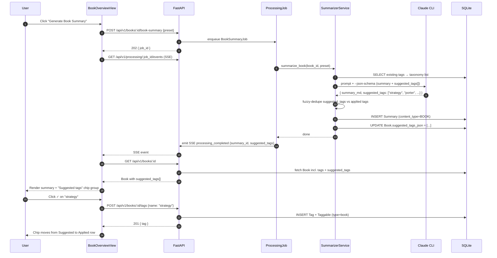
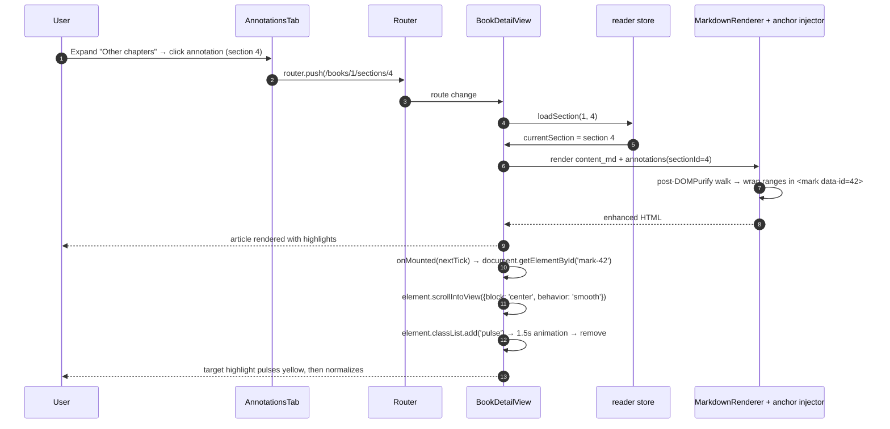
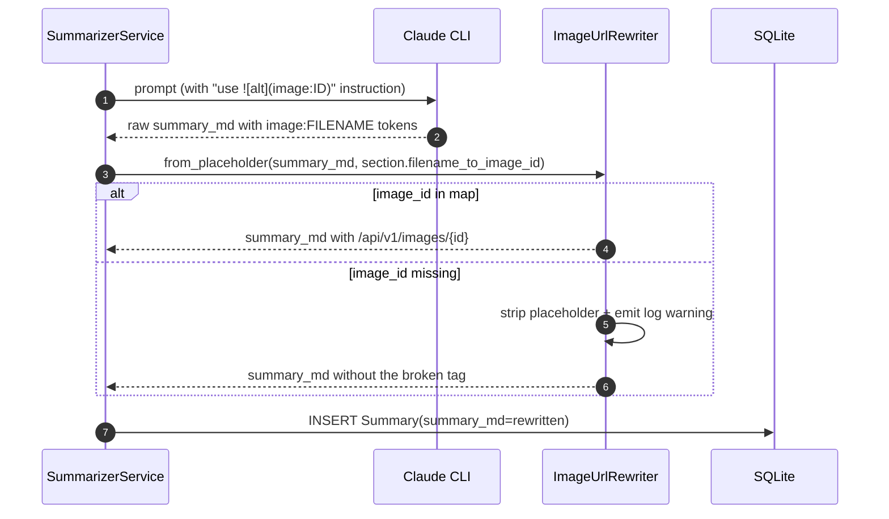
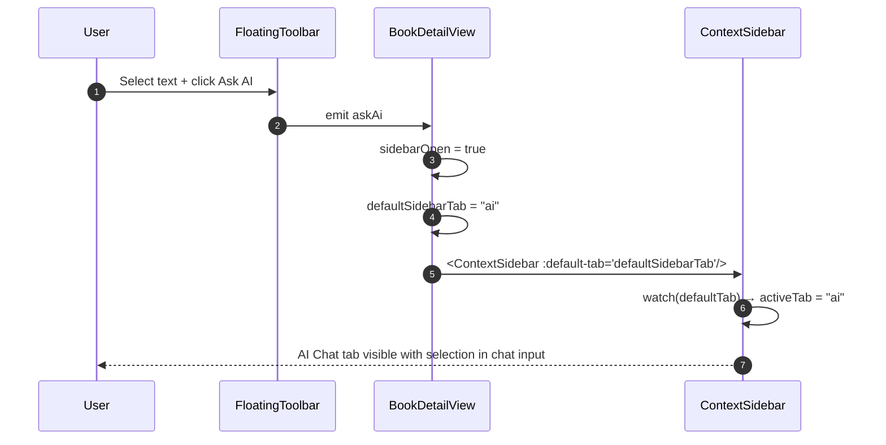

# V1.5 Reader UX & Features — Spec

**Date:** 2026-04-24
**Status:** Draft
**Requirements:** `docs/requirements/2026-04-24-v1.5-reader-ux-and-features.md`

---

## 1. Problem Statement

A focused dogfood session through the packaged reader surfaced 14 user-reported issues spanning render/routing bugs, polish gaps, and two net-new surfaces. v1.5 bundles them into a single pass because they share surfaces (reader, settings, book detail, annotations) and because leaving any in its current state makes the tool feel consistently rough. Primary success metric: the maintainer can hand an installed build to a friend and have them spend 30+ minutes reading a book without hitting a visible defect or missing expectation.

---

## 2. Goals

| # | Goal | Success Metric |
|---|------|----------------|
| G1 | Summary tab renders images identically to Original tab | Zero sections with `image:` or `__IMG_PLACEHOLDER__` strings visible in rendered Summary after migration |
| G2 | Blockquotes render with a single left border | Zero `> >` patterns in `content_md` after migration; zero visual "double-bar" reports |
| G3 | Reader pleasant for extended evening sessions | 6 preset themes + custom colors + WCAG indicator all ship; localStorage persists across tabs |
| G4 | Highlights visible inline in article body | `<mark>` elements wrap every stored annotation's text range on section load; theme-aware color |
| G5 | Annotations scoped to current section by default, scroll-to-source works | Clicking a cross-section annotation routes + smooth-scrolls + pulses the target |
| G6 | `/books/:id` is a useful overview, not a reader redirect | Cover + progress + summary + TOC + tags render; breadcrumb and library link both land here |
| G7 | Full tagging system operational end-to-end | Schema + API + UI + CLI wired; AI seeds 3–5 book tags on first book-summary completion |
| G8 | LLM model selectable from Settings + CLI without code change | YAML-driven dropdown; `model list` / `model set` / `model current` work; custom override path exists |
| G9 | Misc polish: Ask AI, cover fallback, search debounce, next/prev routing | Observable acceptance criteria per FR section |
| G10 | CLI reaches parity with new UI surfaces | Tag CLI wired; tag-suggest read-only; `summarize --only-pending`; annotations list read-only |

---

## 3. Non-Goals

Carried from requirements Section "Non-Goals" — see `docs/requirements/2026-04-24-v1.5-reader-ux-and-features.md` for full list with reasons. Key exclusions restated for spec-phase clarity:

- NOT cross-device settings sync — localStorage-per-device only.
- NOT multi-color highlights — single theme-aware color; `Annotation.color` column reserved for v1.6.
- NOT AI-seeded section tags — book-level only, one-shot.
- NOT per-book reader-setting overrides — device-global.
- NOT per-summarization-job model override — Settings-only global default.
- NOT tag taxonomy management UI (rename/merge/delete-unused) — only in-context edit.
- NOT reader-theme / highlight CLI commands — browser-only state.
- NOT annotation create/edit/delete CLI — read-only `list` only.
- NOT a library-wide on-demand AI tag re-suggestion — one-shot at first successful book-summary; regeneration does not re-suggest.

---

## 4. Decision Log

| # | Decision | Options Considered | Rationale |
|---|----------|-------------------|-----------|
| D1 | Fix A1 summary image placeholders at the backend save path (post-LLM, pre-persist); migrate existing rows with "missing image → strip + warn" policy | (a) FE renders-with-rewrite; (b) BE persists-with-rewrite (chosen); (c) BE rewrites-on-read | Save-path is the canonical home for this transformation — `content_md` already does it there. (a) duplicates the rule on the client. (c) burns CPU per read. |
| D2 | Fix A2 blockquote bug at parse time via a shared `blockquote_normalizer` used by EPUB + PDF parsers; one-time migration re-normalizes existing `content_md` | (a) CSS-only flatten; (b) parser normalization (chosen); (c) both | Parser fix gives clean stored markdown that's correct for all future consumers (renderer, exporter, LLM prompt). CSS-only leaves garbage in the data layer. |
| D3 | Keep polymorphic `Taggable` schema (honor requirements D10) with app-level cascade in delete hooks + an `orphan-tags` doctor CLI | (a) polymorphic (chosen); (b) two explicit join tables; (c) hybrid with composite index | TagService + CLI already exist as polymorphic; zero rewrite. Orphan risk mitigated explicitly via service-layer cascade + sweep CLI. Gotcha #16 absorbed as a documented tradeoff, not a surprise. |
| D4 | Hybrid highlight anchoring: offsets as primary, prefix/suffix as robustness fallback | (a) offsets only; (b) prefix/suffix + fuzzy match; (c) hybrid (chosen) | Offsets are cheap and correct >99% of the time for stable markdown. Prefix/suffix (32 chars each, Hypothesis precedent) covers the <1% that drift after A2 re-normalization migration. No new dependency — custom 40-LOC re-anchor wrapper. |
| D5 | AI tag seeding: extend existing book-summary JSON schema with `suggested_tags[]`, inject current tag taxonomy into the prompt, one-shot | (a) one-shot (chosen); (b) two-shot with dedicated tag prompt; (c) config-flagged | Saves one LLM call per book. `--json-schema` ensures structured output reliability (gotcha #11). Codex CLI injects schema into prompt (existing pattern). Client-side fuzzy-dedupe removes `AI`/`ai`/`A.I.` triplets post-generation. |
| D6 | Extend `GET /api/v1/books/:id` to include `tags[]`, `suggested_tags[]`, `summary_progress`, `default_summary` preview — single endpoint for overview | (a) extend existing (chosen); (b) new `/overview` bundle; (c) parallel fetches | One round-trip, backward-compatible (new fields, existing clients ignore). Matches v1.4 pattern of adding progress counters to Book response. |
| D7 | Reader theme: 6 pinned preset bundles + 6-swatch bg + 6-swatch fg palettes + Custom… hex + live WCAG badge + `Save & Apply as Custom` sticky CTA at popover bottom | See requirements D3, D4, D16 | Pinned hex values let /plan ship without a design round. Sticky bottom CTA survives popover scroll; invisible when clean state. |
| D8 | Overlapping highlights render as nested `<mark>` wrappers with translucent `rgba` stacking; each remains independently clickable | (a) nested stacking (chosen); (b) merged ranges with multi-id attribute; (c) forbid overlaps | Preserves per-annotation data boundaries. Stacking darkens overlap naturally. Hypothesis does this. |
| D9 | AI tag failure UX: validate via pydantic; empty/invalid suggestions → `[]` stored; frontend renders "Suggested tags" group only when count > 0; no failure banner | (a) silent + conditional render (chosen); (b) explicit banner; (c) retry once | Tag suggestion is a bonus feature; don't elevate a silent failure to a visible one. Dedupe against already-applied via Levenshtein ≤2 post-parse. |
| D10 | Tag discovery: "+ Add tag" affordance always visible in overview header and reader section-header, even with zero tags; no onboarding tour | (a) persistent affordance (chosen); (b) one-time toast; (c) help icon | Zero-state discoverability without tour overlays. Users learn by seeing the affordance. |
| D11 | `/books/:id` route repurposed: new `BookOverviewView.vue`; reader moves to `/books/:id/sections/:sid` only | — | Requirements D9 locked. Router change is a one-line edit. Breadcrumb + library-card link land on overview. |
| D12 | "Summarize N of M pending" lives only on the book overview page; shared `summarizationJobStore` drives state; removed from reader header | — | Single source of truth. Requirements D17 locked. |
| D13 | Reader settings persist to `localStorage` key `bookcompanion:readerSettings` on Save & Apply (for Custom) or on preset selection (auto); no DB writes | — | Requirements B4/B5. Simple key-based persistence; `watch`-driven serialization. |
| D14 | CLI `tag suggest <book_id>` READS `Book.suggested_tags_json`; never triggers new LLM calls | — | Requirements F2/F7/D18. Keeps UI and CLI in exact parity on one-shot model. |
| D15 | Ask AI fix: `ContextSidebar` accepts `defaultTab` prop; `handleAskAi` passes `'ai'`; tab auto-switches regardless of prior active tab | — | Diagnosed root cause (requirements G1). |
| D16 | Search debounce: 250ms via a new `useDebounceFn` composable (≤15 LOC custom, no `@vueuse` dep); min 2 chars; `AbortController` cancels in-flight on re-type | — | Requirements G3. Custom utility avoids a dependency on `@vueuse/core` for one usage. |
| D17 | Cover fallback: client-side SVG generator keyed by `hash(book.title)` against an 8-gradient palette; rendered as `<CoverFallback :title>` component | — | Requirements G2. No backend asset storage. |

---

## 5. User Personas & Journeys

### 5.1 Primary Persona — The Dogfood Reader

The maintainer (or a friend with an installed build) reading one non-fiction book end-to-end. Has used v1.4. Understands the tool but expects it to feel polished. Comfortable on desktop at 1440×900 or larger. Reads in the evening with ambient warm light; day-time reads on the same device.

### 5.2 User Journey: Set up a Custom Night theme

```mermaid
sequenceDiagram
    autonumber
    participant U as User
    participant P as ReaderSettingsPopover
    participant S as readerSettings store
    participant LS as localStorage

    U->>P: Open popover (⚙ icon)
    P-->>U: 6 preset cards + bg/fg palettes + Custom… buttons
    U->>P: Click "Night" preset card
    P->>S: applyPreset("night")
    S->>LS: write activeState = { type: "preset", name: "night" }
    S-->>P: CSS vars updated
    P-->>U: Reader transitions to dark
    U->>P: Click "Custom…" under Text Color
    P-->>U: Color wheel + hex input + contrast readout
    U->>P: Type "#d8d3c8"
    P->>S: setPendingColor("fg", "#d8d3c8")
    S-->>P: state = dirty; compute contrast 11.2:1 (AAA)
    P-->>U: Sticky bottom bar: [Discard] [Save & Apply as Custom]
    U->>P: Click "Save & Apply as Custom"
    P->>S: saveCustom()
    S->>LS: write activeState = { type: "custom", bg, fg, font, size, lineHeight }
    S-->>P: preset cards deselect; "Custom" indicator active
    U->>P: Close popover, continue reading
    Note over U,LS: Next session: LS hydrates "custom" state on store init
```

### 5.3 User Journey: AI tag seeding at book-summary completion



### 5.4 User Journey: Click a cross-section annotation



---

## 6. System Design

### 6.1 Architecture Overview

```
┌─────────────────────────── Vue 3 SPA ─────────────────────────┐
│                                                                │
│  LibraryView  →  BookOverviewView (NEW: /books/:id)            │
│                      │                                         │
│                      ▼                                         │
│                  BookDetailView (/books/:id/sections/:sid)     │
│                  ├── ReaderHeader  (section tags chip row)     │
│                  ├── ReadingArea                               │
│                  │   └── MarkdownRenderer                      │
│                  │       └── highlightInjector (NEW)           │
│                  ├── FloatingToolbar (+ Ask AI fix)            │
│                  └── ContextSidebar (+ defaultTab prop)        │
│                      ├── AnnotationsTab (scoped, toggle)       │
│                      ├── AIChatTab                             │
│                      └── NoteCompositionPanel (NEW)            │
│                                                                │
│  SettingsView (+ LLM model dropdown from config.yaml)          │
│  ReaderSettingsPopover (6 presets + palettes + WCAG + save)    │
│                                                                │
└────────────┬───────────────────────────────────────────────────┘
             │ fetch / SSE
             ▼
┌─────────────────────── FastAPI ────────────────────────────────┐
│  Routes:                                                       │
│    /api/v1/books/:id            (extended w/ tags, suggested)  │
│    /api/v1/books/:id/tags       (NEW: GET, POST, DELETE)       │
│    /api/v1/sections/:id/tags    (NEW: GET, POST, DELETE)       │
│    /api/v1/config/models        (NEW: reads models.yaml)       │
│    /api/v1/settings             (NEW: GET, PATCH llm.model)    │
└────────────┬───────────────────────────────────────────────────┘
             ▼
┌─────────────────────── Services ───────────────────────────────┐
│  TagService (existing; wire API; add section/book cascade)     │
│  SummarizerService (extend: one-shot suggested_tags[])         │
│  ParserService → EpubParser/PDFParser → blockquote_normalizer  │
│  ImageUrlRewriter.from_placeholder (now called on summary_md)  │
│  SettingsService (NEW: read/write llm.model, load models.yaml) │
└────────────┬───────────────────────────────────────────────────┘
             ▼
┌─────────────────────── SQLite ─────────────────────────────────┐
│  tags + taggables (RE-CREATED via new Alembic migration)       │
│  annotations  ALTER ADD prefix, suffix                         │
│  books        ALTER ADD suggested_tags_json                    │
│  DATA migrations: summary_md placeholder rewrite,              │
│                   content_md blockquote normalization,         │
│                   annotation prefix/suffix backfill            │
└────────────────────────────────────────────────────────────────┘

CLI (parity cluster H):
  bookcompanion tag {add|remove|list|filter|suggest}
  bookcompanion model {list|current|set}
  bookcompanion summarize <id> --only-pending
  bookcompanion annotations list <book_id> [<section_id>]
  bookcompanion doctor --orphan-tags  (one-off sweep)
```

### 6.2 Sequence Diagrams

See 5.2, 5.3, 5.4 above. Two additional flows:

**A1 image-placeholder rewrite on summary save:**



**G1 Ask AI tab-switch:**



### 6.3 Data flow trace — Tags write→read

- **Write:** `POST /api/v1/books/:id/tags {name,color?}` → `TagService.add_tag("book", id, name, color)` → `Tag` insert (if new, NOCASE unique) → `Taggable(tag_id, "book", book_id)` insert → return `Tag`.
- **Read:** `GET /api/v1/books/:id` → `BookResponse` adds eagerly-loaded `tags: list[TagResponse]` via `selectinload`-backed repo query → `tag_service.list_tags_for_entity("book", id)`.
- **Cascade on delete:** `BookService.delete(book_id)` → before DB delete, call `TagService.remove_all_for_entity("book", book_id)` → delete book → orphan Tag rows (no Taggable references) stay unless swept by `bookcompanion doctor --orphan-tags`. Acceptable — tags are cheap.

---

## 7. Functional Requirements

### 7.1 Cluster A — Reader rendering bugs

| ID | Requirement |
|----|-------------|
| FR-A1.1 | After LLM returns `summary_md`, `SummarizerService` calls `ImageUrlRewriter.from_placeholder(summary_md, section.images_by_filename)` before `Summary` row insert at `summarizer_service.py:~416` (both section and book summary paths). Applies to `_summarize_section` and `_generate_book_summary`. |
| FR-A1.2 | `from_placeholder()` is extended to accept an `on_missing: Literal['strip','keep'] = 'strip'` kwarg. Summary path passes `'strip'`; content_md path retains `'keep'` behavior. When strip: emit `logger.warning("image_placeholder_missing", book_id, section_id, filename)` and drop the placeholder text entirely (replace with empty string). |
| FR-A1.3 | One-time Alembic data migration `v1_5a_summary_image_rewrite` iterates every `Summary` row; if `summary_md` contains `__IMG_PLACEHOLDER__:` or `(image:`, resolve against `book.images` by filename, rewrite, UPDATE. Idempotent (re-run produces zero changes). |
| FR-A2.1 | New module `backend/app/services/parser/blockquote_normalizer.py` exports `normalize_blockquotes(md: str) -> str` that (a) collapses chains of `>` prefixes of length ≥2 to a single `>` per line, (b) strips lines matching `^>\s*---\s*$` when they are first or last inside a contiguous blockquote block. Pure function; unit-tested. |
| FR-A2.2 | `EpubParser.extract_sections` and the PDF parser equivalent both call `normalize_blockquotes(md)` after `to_placeholder(md)` and before section persistence. |
| FR-A2.3 | One-time Alembic data migration `v1_5b_blockquote_normalize` iterates every `BookSection.content_md`, runs `normalize_blockquotes`, UPDATE where the output differs. Logs total rows changed. Idempotent. |

### 7.2 Cluster B — Reader theming & settings

| ID | Requirement |
|----|-------------|
| FR-B1.1 | `readerSettings` store ships six preset definitions as a TS constant `BUILT_IN_PRESETS`: `paper`, `sepia`, `slate`, `solarized`, `mocha`, `night` — exact hex values per section 11.3 Theme tokens below. |
| FR-B1.2 | `ReaderSettingsPopover` renders all six presets as equally-sized cards in a 2×3 grid. Each card shows a 40×40 color swatch preview (bg + text sample) + name. Active preset card has a 2px accent border. |
| FR-B1.3 | `applyPreset(name)` sets all 5 axes (bg, fg, font, size, lineHeight) to the bundle's values, updates CSS vars on `:root`, writes the new state to localStorage immediately (presets auto-save). |
| FR-B2.1 | Below presets, a Background row shows 6 curated swatches + a "Custom…" button. Curated palette: `#faf7f2, #f1e8d2, #eceff3, #fdf6e3, #2b2320, #111417`. |
| FR-B2.2 | Custom… opens a sub-popover with (a) a native `<input type="color">` picker, (b) a hex text field, (c) a live contrast readout component `<ContrastBadge :bg :fg />`. |
| FR-B2.3 | `ContrastBadge` computes WCAG relative luminance + contrast ratio inline (~15 LOC, no dep). Renders `4.52 : 1` + badge: `AAA` (≥7), `AA` (≥4.5), `AA Large` (≥3, amber), `Fail` (<3, red). When Fail: does not block, shows warning tone. |
| FR-B3.1 | Text Color row mirrors FR-B2.1–B2.3 structure with palette `#2b2a28, #5b4a34, #212830, #657b83, #d4c4ac, #d7dbdf`. Independent of background-color selection. |
| FR-B4.1 | Any change to bg/fg/font/size/lineHeight while the state type is `"preset"` transitions state to `{ type: 'dirty', basePreset: <name>, pending: {...} }`. Popover sticky bottom bar appears with `[Discard] [Save & Apply as Custom]`. Preview applies live via CSS vars. |
| FR-B4.2 | Discard: reverts pending → re-apply `basePreset`, clears dirty flag, hides sticky bar. |
| FR-B4.3 | Save & Apply as Custom: persists `{ type: 'custom', bg, fg, font, size, lineHeight }` to localStorage; preset cards deselect; a "Custom" indicator becomes active (text + checkmark next to the preset grid, not a 7th card); clears dirty flag; hides sticky bar. |
| FR-B4.4 | Selecting any preset while dirty (or while in Custom state) calls `applyPreset(name)` → clears pending/custom → preset becomes active. |
| FR-B5.1 | localStorage key `bookcompanion:readerSettings` stores `{ schemaVersion: 1, activeState: <union>, highlightsInline: bool, annotationsOtherChaptersExpanded: bool }`. Schema version present so future migrations can detect + reset. |
| FR-B5.2 | On store init: read localStorage, validate via tiny parser. If invalid or absent → default = `{ type: 'preset', name: 'paper' }`. Never throw. |
| FR-B5.3 | CSS variables updated on every state change: `--reader-bg, --reader-fg, --reader-font, --reader-size, --reader-line-height, --highlight-bg`. `--highlight-bg` derived per active state (see 11.3 Theme tokens). |

### 7.3 Cluster C — Annotations & highlights

| ID | Requirement |
|----|-------------|
| FR-C1.1 | `FloatingToolbar`'s "Note" button emits `note` with the current selection payload `{ text, startOffset, endOffset, rect }`. `BookDetailView.handleNote(sel)` opens the sidebar (`sidebarOpen=true`) and sets `defaultSidebarTab = 'note'`, passing the selection as `<NoteCompositionPanel :selection>`. |
| FR-C1.2 | `ContextSidebar` adds a third tab slot `note` (alongside annotations + ai). The tab is hidden from the header tab-row (not browsable manually); only opens when `defaultTab='note'` is passed. On save/cancel, tab closes and `defaultTab` resets to `annotations`. |
| FR-C1.3 | `NoteCompositionPanel` renders: (a) collapsible quoted selection at top (`<blockquote>{selectedText}</blockquote>`), (b) `<textarea>` with live Markdown preview toggle, (c) tag chip input (uses same tag autocomplete as E2/E3), (d) Save + Cancel buttons bottom-right. |
| FR-C1.4 | Save: calls `POST /api/v1/annotations { selection, note_md, tags[] }` → persists Annotation + inserts any new section-scope tags → closes panel → sidebar returns to Annotations tab. |
| FR-C1.5 | `BookDetailView` removes all calls to `window.prompt()` for note creation. |
| FR-C1.6 | Extend `AnnotationCreateRequest` (`backend/app/api/schemas.py:294`) with optional fields: `tags: list[str] \| None = None`, `prefix: str \| None = None`, `suffix: str \| None = None`. Server behavior: when `tags` is present, after Annotation insert, call `TagService.add_tag("annotation", annotation.id, name)` for each; when `prefix`/`suffix` present, persist to new Annotation columns. All fields optional — existing clients unaffected. `note` column continues to store plain/markdown text; rendering is a client concern. |
| FR-C2.1 | `AnnotationCard` renders note body via `<MarkdownRenderer :content>`; if raw note length > 200 chars, renders truncated + `<button>See full</button>` that toggles an `expanded` ref. Short notes render fully without toggle. |
| FR-C3.1 | `AnnotationsTab` filters `annotations` where `content_id === currentSectionId` for the default render. Ordered by `text_start` ASC. |
| FR-C3.2 | Below the current-section list, a row `<button>Show N annotations from other chapters</button>` where N = count of annotations with `content_id !== currentSectionId` (same `book_id`). Clicking expands into section-grouped accordions (one `<details>` per section, title + count). |
| FR-C3.3 | The expanded state is stored in `readerSettings.annotationsOtherChaptersExpanded` (localStorage) but resets to `false` on section navigation. |
| FR-C4.1 | Each annotation row is `<button>` or `<router-link>`. Clicking: if `content_id === currentSectionId` → `document.getElementById('ann-' + id)?.scrollIntoView({block:'center', behavior:'smooth'})`; else → `router.push('/books/:id/sections/:sid#ann-:aid')`. |
| FR-C4.2 | `BookDetailView` on section-mount, if `route.hash` starts with `#ann-`, executes scrollIntoView + adds `.pulse` class to the target `<mark>` for 1500ms. `.pulse` CSS keyframe animates background-color from `var(--highlight-bg)` → accent → back. |
| FR-C5.1 | `MarkdownRenderer` (or a new sibling `highlightInjector`) post-processes the sanitized HTML BEFORE inserting into the DOM. Input: `sanitizedHtml, annotations[]`. Output: HTML with `<mark id="ann-{id}" data-annotation-id="{id}">` wrapping each annotation's text range. |
| FR-C5.2 | Anchor resolution algorithm (hybrid per D4): (i) Parse HTML to a text-only flat string. (ii) For each annotation: try `text_start..text_end` offsets directly; verify `plaintext.slice(start, end) === selectedText`. (iii) If mismatch, search for `selectedText` substring; if prefix+suffix columns are populated, require context match (prefix chars before, suffix chars after) to disambiguate. (iv) If still no match, skip annotation and log a console debug. |
| FR-C5.3 | Applies to Original AND Summary tabs. Summary-tab highlights only render if the annotation's `content_type === SUMMARY` (or content_id matches the default summary). Original-tab highlights only render for `content_type === 'section_content'`. |
| FR-C5.4 | Overlapping highlights: the injector wraps each annotation independently — produces nested `<mark>` elements. CSS: `mark { background: var(--highlight-bg); }` with `background-color` in `rgba(…, 0.35)` so nested stacks visually darken. `mark` is inline; no layout disruption. |
| FR-C5.5 | New `Annotation` schema columns (nullable, backfilled): `prefix TEXT` (up to 32 chars before `text_start` in `content_md`), `suffix TEXT` (up to 32 chars after `text_end`). Annotation create route populates both from the submitted selection's context. A one-time data migration `v1_5c_annotation_prefix_suffix` walks existing annotations, reads `BookSection.content_md` (post-A2 normalization), computes prefix/suffix, UPDATE. |
| FR-C5.6 | Text selection + Highlight/Note/Ask AI actions are allowed from both the Original AND Summary tabs. Selection-triggered creates persist with `content_type=SECTION_CONTENT` (Original tab) or `content_type=SECTION_SUMMARY` (Summary tab, resolved via the active default summary's id as `content_id`). Highlight rendering per FR-C5.3 honors `content_type` — Original-tab marks only render for SECTION_CONTENT annotations, Summary-tab marks only for SECTION_SUMMARY. |
| FR-C5.7 | Block-boundary handling: when an annotation's text range spans multiple block-level elements (`<p>`, `<li>`, `<blockquote>`, `<h1-6>`, `<pre>`), the injector emits ONE `<mark data-annotation-id="X">` **per block-level element** the range intersects — sub-marks share the same `data-annotation-id`. Click-from-sidebar scrolls to the FIRST sub-mark (by `id="ann-X"` applied only to the first); the `.pulse` animation applies to ALL sub-marks simultaneously via `document.querySelectorAll('[data-annotation-id="X"]').forEach(...)`. Produces valid HTML + preserves visual continuity across block breaks. |
| FR-C6.1 | `AnnotationsTab` header shows a `<Toggle>Show inline</Toggle>` component. State lives in `readerSettings.highlightsInline` (localStorage). Default `true`. |
| FR-C6.2 | When `highlightsInline === false`, `MarkdownRenderer` skips the highlight injector step; highlights render only in the Annotations sidebar. No DOM re-render churn — the store state is reactive, the renderer's computed `enhancedHtml` depends on it. |

### 7.4 Cluster D — Reader navigation & book surfaces

| ID | Requirement |
|----|-------------|
| FR-D1.1 | `router/index.ts`: path `/books/:id` now points to new component `BookOverviewView.vue`. Path `/books/:id/sections/:sectionId` continues to point to `BookDetailView.vue`. |
| FR-D1.2 | `BookOverviewView` renders three zones: **Header** (cover/fallback, title, author, format, reading-progress bar, `Resume reading` CTA → `router.push('/books/:id/sections/:lastReadId')`), **Book summary** (rendered markdown if `default_summary` exists, else Generate CTA → opens preset picker modal; "View full summary →" link to `/books/:id/summary`), **Sections TOC** (table of sections with summary-status icon, section tag chips, Summarize-pending action button). |
| FR-D1.3 | Header reading-progress text: `"{read}/{M_total} sections read, {summarized}/{M_summarizable} summarized"`. `M_summarizable` = count of sections where `section_type ∈ SUMMARIZABLE_TYPES`. |
| FR-D1.4 | Sections TOC renders per-row: summary status icon (`✓` summarized, `⚠` failed, `—` pending, hidden for front-matter), section number + title (clickable → opens reader), section tag chips (editable inline via + button — reuses tag chip input), failure banner with one-click Retry if `last_failure_*` populated (v1.4 behavior). |
| FR-D1.5 | Loading state: while `GET /api/v1/books/:id` is in flight, render using existing `<SkeletonLoader>` — cover-aspect-ratio pulsing rectangle, 3-line title skeleton, progress-bar skeleton, 6-row TOC skeleton. On fetch error: `<EmptyState>` with title "Couldn't load book", subtitle showing the error message, and a "Retry" button that re-issues the fetch. |
| FR-D2.1 | `reader.ts`: `navigateSection(direction)` imports `useRouter` at top of module (or via arg-injection). After determining `newSection`, calls `router.push({ name: 'section-detail', params: { id: book.id, sectionId: newSection.id } })` instead of `loadSection()`. The `loadFromRoute` watch in `BookDetailView` then calls `loadSection` as usual. |
| FR-D2.2 | `ReaderHeader`'s prev/next buttons continue to emit `navigate`; handler in `BookDetailView` calls `reader.navigateSection(dir)` unchanged. All routing is internal to the store method. |
| FR-D3.1 | Remove `<SummarizationProgress>` from `BookDetailView` (the reader header). Keep usage on `BookOverviewView` only. |
| FR-D3.2 | `SummarizationProgress` renders a button when `pending > 0`: `"Summarize {pending} of {total} pending"`; when active → button disabled, text `"Summarizing {current} of {pending}…"` with inline spinner. When `pending === 0 && total > 0`: render an inline **status badge** (NOT a button) — small `✓` icon + text `"All {total} summarized"` in muted tone (`text-muted-foreground`, no border, no interactive state). The component signals completion as status, not as an inert action. |
| FR-D3.3 | Button state derives from `summarizationJobStore` (existing) + `book.summary_progress` (new BookResponse field per D6). |

### 7.5 Cluster E — Tags system

| ID | Requirement |
|----|-------------|
| FR-E1.1 | New Alembic migration `v1_5d_tags_schema_revival` re-creates `tags` and `taggables` tables (SQL in section 10.1). `tags.name` has `COLLATE NOCASE UNIQUE`. `taggables` has composite PK `(tag_id, taggable_type, taggable_id)` + index on `(taggable_type, taggable_id)`. |
| FR-E1.2 | `TagService` (existing in `backend/app/services/tag_service.py`) is wired into `get_services()` in `backend/app/cli/deps.py` AND `backend/app/api/deps.py` — today it's unwired. Both register `svc["tag"] = TagService(session)`. |
| FR-E1.3 | `Book.delete()` and `BookSection.delete()` service-layer hooks call `TagService.remove_all_for_entity(type, id)` BEFORE the DB delete to cascade tag associations. Orphan Tag rows (zero Taggable rows) remain — swept by `bookcompanion doctor --orphan-tags`. |
| FR-E2.1 | New route module `backend/app/api/routes/tags.py` exposes: `GET /api/v1/books/:id/tags`, `POST /api/v1/books/:id/tags {name, color?}`, `DELETE /api/v1/books/:id/tags/:tag_id`. Same triplet at `/api/v1/sections/:id/tags`. Plus `GET /api/v1/tags` (all tags in library with usage counts) and `GET /api/v1/tags/suggest?q=partial` (autocomplete). |
| FR-E2.2 | Extend `GET /api/v1/books/:id` response with `tags: TagResponse[]` (eager-loaded via `selectinload(Book.taggables).selectinload(Taggable.tag)` filtered by `taggable_type='book'`). |
| FR-E2.3 | `BookCard` (library grid) and `BookOverviewView` header render tag chips. Clicking a chip on `BookCard` navigates to library filtered by that tag (`/library?tag=strategy`). |
| FR-E2.4 | Tag length validation: `TagChipInput` enforces a soft 80-char cap in the input field with a live character counter (`42 / 80`) that turns amber at 70 and red at 80 (blocks submit). Backend `Tag.name` schema allows up to 200 chars unchanged. Rendered `<TagChip>` truncates display to 40 chars + `…` via CSS `text-overflow: ellipsis` with the full name in `title` attribute for tooltip. |
| FR-E3.1 | `ReaderHeader` adds a `<SectionTagRow :section-id>` component above the section title: small chips + `+` button. Chip click: no-op (selection not supported v1.5). `+` opens `<TagChipInput>` autocomplete populated by `GET /api/v1/tags/suggest`. |
| FR-E3.2 | `BookOverviewView`'s TOC rows render the same component. |
| FR-E4.1 | Summarizer extends the `summarize_book` prompt template with an "Existing tags" section listing current taxonomy, and extends the `--json-schema` to include `suggested_tags: string[]` (minItems 0, maxItems 7, items minLength 1 maxLength 40). |
| FR-E4.2 | After `Summary` insert in `_generate_book_summary`, parse `response.structured_output.suggested_tags`, fuzzy-dedupe against existing book tags (Levenshtein ≤2, case-insensitive) AND against each other (keep first occurrence in case of near-dupes), UPDATE `Book.suggested_tags_json = [...]` (may be `[]`). |
| FR-E4.3 | The SSE `processing_completed` event for book-summary jobs includes `suggested_tags: list[str]` in its payload. Frontend BookOverview subscribes to this and refetches `GET /api/v1/books/:id`. |
| FR-E4.4 | `BookOverviewView` renders the `Suggested tags` chip group ONLY when `book.suggested_tags.length > 0` AND the user has not yet dismissed/accepted all of them. Each suggested chip has ✓ (accept → `POST /api/v1/books/:id/tags {name}`) and ✗ (reject → `PATCH /api/v1/books/:id/suggested-tags {reject: [name]}`). When the group becomes empty, it's not re-rendered. Re-suggestion is NOT a v1.5 feature. |

### 7.6 Cluster F — LLM configuration

| ID | Requirement |
|----|-------------|
| FR-F1.1 | New file `backend/app/config/models.yaml` shipped with the package. Schema (see 13 Config for actual YAML). Loaded once at startup into `Settings.models` as a pydantic `ProviderModels` object. |
| FR-F1.2 | New route `GET /api/v1/config/models` returns `{providers: {claude: [...], codex: [...]}, detected_provider: 'claude'}` where `detected_provider` is the auto-detected CLI (existing `detect_llm_provider()` call). |
| FR-F1.3 | `SettingsView` (frontend) adds an LLM section. Fetches `GET /api/v1/config/models` + `GET /api/v1/settings`. Renders: "Active provider: {detected}" read-only, then a dropdown labeled "Model" populated from the detected provider's list. A "Custom…" option appears last. Value changes call `PATCH /api/v1/settings {llm: {model: value}}`. |
| FR-F2.1 | "Custom…" toggles the dropdown into a free-text input. User types a model alias. On blur / Save, `PATCH` sends the custom value. No client-side validation beyond non-empty. |
| FR-F2.2 | The custom value flows through `ClaudeCodeCLIProvider.generate(model=value)` / `CodexCLIProvider.generate(model=value)` unchanged. Subprocess stderr on unknown model surfaces via F3. |
| FR-F3.1 | When a summarization subprocess returns a model-not-found error (non-zero exit + stderr containing `model`/`not found`/`unknown`), `SummarizerService` persists the truncated error (first 500 chars of stderr) into `BookSection.last_failure_stderr` (v1.4 column) with `last_failure_code = 'MODEL_NOT_FOUND'`. Book-summary path stores into a corresponding `Book.last_summary_failure_*` (new columns — see 10.1). |
| FR-F3.2 | Frontend surfaces the failure on `BookOverviewView` as a banner + inline on the section's Summary tab (existing v1.4 UI). Banner includes "Change model in Settings" link. |

### 7.7 Cluster G — Misc fixes

| ID | Requirement |
|----|-------------|
| FR-G1.1 | `ContextSidebar` accepts `defaultTab?: 'annotations' \| 'ai' \| 'note'` prop. `watch(defaultTab, () => activeTab.value = defaultTab, { immediate: true })`. |
| FR-G1.2 | `BookDetailView`'s `handleAskAi()`: sets `sidebarOpen.value = true` AND `defaultSidebarTab.value = 'ai'`, passes selection via existing prop path. On selection clear, `defaultSidebarTab` resets to `'annotations'` for subsequent opens. |
| FR-G1.3 | Acceptance test: on viewport ≥ 1024px, selecting text + clicking Ask AI within 300ms opens the sidebar, `activeTab === 'ai'`, and the `AIChatTab` shows the selection as a quoted-context block in its chat input area within 300ms. |
| FR-G2.1 | New component `<CoverFallback :title :format>`: renders a 128×192 (or responsive) SVG with a linear-gradient background picked by `Math.abs(hash(title)) % 8` from an 8-gradient palette (hex pairs in 11.3). Title text is centered, wrapped, in `Georgia` serif, auto-scaled to fit (start at 20px, shrink to fit the height). Bottom-right shows the file format in mono font small. |
| FR-G2.2 | `BookCard` and `BookOverviewView` header use `<CoverFallback>` when `book.cover_url` is null/empty. |
| FR-G3.1 | New composable `frontend/src/composables/useDebounceFn.ts` (~15 LOC) exports `useDebounceFn(fn, ms)` returning a wrapped fn + a cancel method. No external dependency. |
| FR-G3.2 | Library search input (new or existing): `const debouncedSearch = useDebounceFn(doSearch, 250)`. On `input`: if `query.length < 2` → clear results + cancel pending → return; else → `debouncedSearch(query)`. |
| FR-G3.3 | `doSearch` uses a module-level `AbortController`: aborts any previous in-flight request before issuing the new one. On abort, no error rendered. |

### 7.8 Cluster H — CLI parity

| ID | Requirement |
|----|-------------|
| FR-H1.1 | `backend/app/cli/main.py` registers: `app.add_typer(tags_app, name="tag")`, `app.add_typer(annotations_app, name="annotations")`, `app.add_typer(model_app, name="model")`. |
| FR-H1.2 | `tags_cmd.py` commands extended to accept scope: `tag add <scope> <id> <name>` (scope ∈ {book, section}), `tag remove <scope> <id> <name>`, `tag list` (all), `tag list --book <id>`, `tag list --section <id>`, `tag filter <name>` (lists books with that tag). Validation: `scope ∈ VALID_TAGGABLE_TYPES`. |
| FR-H2.1 | New `tag suggest <book_id>` command. Fetches `Book.suggested_tags_json`; if populated, prints numbered list + hint `Run: bookcompanion tag add book {book_id} <name>`. If empty/null, prints `No suggestions yet — run "bookcompanion summarize {book_id} --book-summary" first.`. NEVER triggers a new LLM call. |
| FR-H3.1 | New `model_cmd.py` with subcommands: `model list` (prints models.yaml grouped by provider), `model current` (prints `settings.llm.model` + detected provider), `model set <name>` (aliases `config set llm.model <name>`; warns if `<name>` is not in the curated list but proceeds). |
| FR-H4.1 | `summarize_cmd.py` accepts `--only-pending` flag. When set, passes `only_pending=True` to `SummarizerService.summarize_book(...)`. Service filters sections to those with `default_summary_id IS NULL` AND `section_type IN SUMMARIZABLE_TYPES`. Prints `Summarizing {N} of {M} pending sections` at start (same language as UI D3). |
| FR-H5.1 | `annotations_cmd.py` wired via `app.add_typer(annotations_app, name="annotations")`. Only `list` subcommand exposed in CLI (create/update/delete are UI-only per non-goal). `annotations list <book_id>` → prints table grouped by section; `annotations list <book_id> <section_id>` → scopes to one section. |
| FR-H6.1 | New `doctor_cmd.py` or addition to existing `health_cmd.py`: `bookcompanion doctor --orphan-tags` walks all Tag rows, counts orphans (0 Taggable references), prints summary, and when `--fix` is passed, deletes them. Idempotent. |

---

## 8. Non-Functional Requirements

| ID | Category | Requirement |
|----|----------|-------------|
| NFR-01 | Performance | Highlight injector runs in ≤ 15ms for a section with 20 annotations (typical non-fiction chapter). Measured via `performance.mark` in dev mode. |
| NFR-02 | Performance | Library search debounce firing ≤ 300ms end-to-end from last keystroke to rendered result rows (SQLite query included) for a 100-book library. |
| NFR-03 | Accessibility | WCAG Contrast badge on Custom colors is computed via the official relative-luminance formula (sRGB→linear→luminance). No visual contrast estimation. |
| NFR-04 | Accessibility | All new buttons (`+ Add tag`, `Save & Apply as Custom`, section-tag row + chips, CoverFallback title text) have accessible names (`aria-label` or `<button>` text) and meet AA contrast in all 6 presets. |
| NFR-05 | Accessibility | The sticky bottom bar does not trap keyboard focus; Tab order is: popover controls → sticky bar → popover close. |
| NFR-06 | Observability | Every data migration (A1, A2, E1-schema, C5-annotation-backfill) logs a `structlog` info event with row counts. Failures log at `warning` and do not abort the migration. |
| NFR-07 | Robustness | Annotation re-anchor that fails to match logs `console.debug` (not error/warning) and omits the `<mark>` — never throws. The article still renders. |
| NFR-08 | Reliability | Reader settings store hydrate-from-localStorage wraps in try/catch; on corruption, resets to default preset `paper` and logs a warning. Never blocks reader load. |
| NFR-09 | Compatibility | New API routes are additive; existing `GET /api/v1/books/:id` clients that don't know about `tags`, `suggested_tags`, `summary_progress` fields ignore them (JSON tolerant). |
| NFR-10 | Security | Tag name stored as-is (user-supplied); rendered in Vue template via text interpolation (XSS-safe). No HTML rendering of tag names anywhere. |
| NFR-11 | Bundle size | No new npm dependencies for v1.5 FRs. `apache-annotator/dom` rejected (D4); `wcag-contrast` rejected (FR-B2.3); `@vueuse/core` rejected (FR-G3.1). Target: Vue bundle size increases by ≤ 10 KB gzipped. |
| NFR-12 | Config lifecycle | `backend/app/config/models.yaml` is loaded once at process startup into `Settings.models`. Editing the file while `bookcompanion serve` is running has NO effect until restart. `SettingsView` LLM section and `bookcompanion model list` CLI both display a small help note `"Add models: edit backend/app/config/models.yaml and restart."` |

---

## 9. API Contracts

### 9.1 `GET /api/v1/books/:id` (EXTENDED)

Adds four fields to existing response:

```json
{
  "id": 1,
  "title": "Understanding Michael Porter",
  "authors": [...],
  "file_format": "epub",
  "cover_url": null,
  "sections": [...],

  "tags": [
    { "id": 3, "name": "strategy", "color": null }
  ],
  "suggested_tags": ["competitive-advantage", "value-chain"],
  "summary_progress": {
    "total_sections": 17,
    "summarizable_sections": 12,
    "summarized": 7,
    "failed": 0
  },
  "default_summary": {
    "id": 42,
    "preset_name": "practitioner_bullets",
    "summary_md": "…",
    "created_at": "2026-04-22T10:03:00Z"
  }
}
```

**Errors:** unchanged (404 for unknown id).

### 9.2 `POST /api/v1/books/:id/tags` (NEW)

```json
// Request
{ "name": "strategy", "color": "#A855F7" }
```

```json
// Response 201
{ "id": 3, "name": "strategy", "color": "#A855F7", "created_at": "2026-04-24T09:12:00Z" }
```

**Errors:**
- `400 { "detail": "name required" }`
- `400 { "detail": "name too long (max 200)" }`
- `404 { "detail": "book not found" }`

### 9.3 `DELETE /api/v1/books/:id/tags/:tag_id` (NEW)

```json
// Response 204 (no body)
```

**Errors:**
- `404 { "detail": "book not found" }` or `"tag not found on book"`

### 9.4 `GET /api/v1/books/:id/tags` (NEW)

```json
// Response 200
{ "tags": [ { "id": 3, "name": "strategy", "color": null } ] }
```

### 9.5 `GET/POST/DELETE /api/v1/sections/:id/tags` (NEW)

Identical shape to book-scoped routes above. Scope = section.

### 9.6 `GET /api/v1/tags` (NEW)

```json
// Response 200
{
  "tags": [
    { "id": 3, "name": "strategy", "color": null, "usage_count": 4 }
  ]
}
```

### 9.7 `GET /api/v1/tags/suggest?q=<prefix>` (NEW)

```json
// Response 200
{ "suggestions": [ { "id": 3, "name": "strategy" } ] }
```

Uses SQLite `LIKE 'prefix%' COLLATE NOCASE`. Limit 10.

### 9.8 `GET /api/v1/config/models` (NEW)

```json
// Response 200
{
  "providers": {
    "claude": [
      { "id": "sonnet", "label": "Claude Sonnet (default, balanced)" },
      { "id": "opus", "label": "Claude Opus (highest quality, slower)" },
      { "id": "haiku", "label": "Claude Haiku (fastest, lowest cost)" }
    ],
    "codex": [
      { "id": "o4-mini", "label": "OpenAI o4-mini (default)" },
      { "id": "o3", "label": "OpenAI o3 (reasoning-focused)" }
    ]
  },
  "detected_provider": "claude"
}
```

### 9.9 `GET /api/v1/settings` (NEW)

```json
// Response 200
{
  "llm": { "provider": "auto", "model": "sonnet", "timeout_seconds": 300 }
}
```

### 9.10 `PATCH /api/v1/settings` (NEW)

```json
// Request
{ "llm": { "model": "opus" } }

// Response 200
{ "llm": { "provider": "auto", "model": "opus", "timeout_seconds": 300 } }
```

**Errors:**
- `400 { "detail": "model must be non-empty string" }`

### 9.11 `POST /api/v1/annotations` (EXTENDED)

```json
// Request
{
  "content_type": "section_content",   // or "section_summary"
  "content_id": 42,                     // section_id or summary_id
  "type": "highlight",                  // or "note" or "freeform"
  "selected_text": "The value proposition…",
  "text_start": 1204,
  "text_end": 1264,
  "note": "Porter's core thesis",       // optional; markdown allowed
  "tags": ["strategy"],                  // NEW: optional
  "prefix": " together.\n\n",            // NEW: optional (≤32 chars before text_start)
  "suffix": " The value chain"           // NEW: optional (≤32 chars after text_end)
}
```

```json
// Response 201
{ "id": 58, "content_type": "...", "content_id": 42, "type": "highlight",
  "selected_text": "...", "text_start": 1204, "text_end": 1264,
  "note": "...", "prefix": "...", "suffix": "...",
  "linked_annotation_id": null, "created_at": "...", "updated_at": "...",
  "book_id": 1, "book_title": "...", "section_id": 42, "section_title": "..." }
```

**Errors:** `400 { "detail": "content_type must be one of: section_content, section_summary, book_summary" }`, `404` for unknown `content_id`.

### 9.12 `PATCH /api/v1/books/:id/suggested-tags` (NEW)

Supports the ✗-dismiss flow (E18) and bulk rejection.

```json
// Request
{ "reject": ["competitive-advantage"] }   // remove specific strings
// OR
{ "set": [] }                              // replace with empty (clear all)
```

```json
// Response 200
{ "suggested_tags": ["strategy"] }
```

**Errors:** `404` for unknown book.

### 9.13 SSE `processing_completed` (EXTENDED for book-summary jobs)

```json
{
  "type": "processing_completed",
  "job_id": 123,
  "book_id": 1,
  "summary_id": 42,
  "suggested_tags": ["strategy", "competitive-advantage"]
}
```

Other job types unchanged.

---

## 10. Database Design

### 10.1 Schema Changes

**Migration 1: `v1_5d_tags_schema_revival` (schema)**

```sql
CREATE TABLE tags (
    id INTEGER PRIMARY KEY AUTOINCREMENT,
    name VARCHAR(200) NOT NULL COLLATE NOCASE,
    color VARCHAR(7),
    created_at TIMESTAMP NOT NULL DEFAULT CURRENT_TIMESTAMP,
    UNIQUE (name)
);

CREATE TABLE taggables (
    tag_id INTEGER NOT NULL REFERENCES tags(id) ON DELETE CASCADE,
    taggable_type VARCHAR(50) NOT NULL,  -- 'book', 'section', 'annotation'
    taggable_id INTEGER NOT NULL,
    created_at TIMESTAMP NOT NULL DEFAULT CURRENT_TIMESTAMP,
    PRIMARY KEY (tag_id, taggable_type, taggable_id)
);

CREATE INDEX ix_taggables_entity ON taggables (taggable_type, taggable_id);
```

**Migration 2: `v1_5e_annotation_anchor_columns` (schema)**

```sql
-- Uses Alembic batch mode for SQLite:
ALTER TABLE annotations ADD COLUMN prefix TEXT;
ALTER TABLE annotations ADD COLUMN suffix TEXT;
```

**Migration 3: `v1_5f_book_suggested_tags_and_failure` (schema)**

```sql
-- Batch mode:
ALTER TABLE books ADD COLUMN suggested_tags_json JSON;
ALTER TABLE books ADD COLUMN last_summary_failure_code VARCHAR(50);
ALTER TABLE books ADD COLUMN last_summary_failure_stderr TEXT;
ALTER TABLE books ADD COLUMN last_summary_failure_at TIMESTAMP;
```

**Migration 4: `v1_5a_summary_image_rewrite` (data)** — see FR-A1.3.

**Migration 5: `v1_5b_blockquote_normalize` (data)** — see FR-A2.3.

**Migration 6: `v1_5c_annotation_prefix_suffix` (data)** — see FR-C5.5.

### 10.2 Migration Notes

- All six migrations ship in the same release. Order matters for correctness:
  1. Schema revival (tags/taggables) — no data dependency.
  2. Annotation columns — before C5 backfill.
  3. Book columns — before E4 ships.
  4. Data: summary image rewrite (A1).
  5. Data: blockquote normalize (A2).
  6. Data: annotation prefix/suffix backfill (C5) — runs AFTER A2 because it reads `content_md`.
- All data migrations are **idempotent**: re-running produces zero changes. Implemented via conditional UPDATE or explicit "already normalized?" check.
- Rollback strategy: schema changes are batch-mode `ALTER TABLE` — Alembic's `downgrade()` drops the columns/tables. Data migrations have no `downgrade` (data-normalization is a one-way door); rollback means restoring a backup (BackupService pattern).
- Single-user tool: no concurrent writers during migration; `bookcompanion serve` auto-runs migrations on startup via `init_cmd._run_migrations()`.

### 10.3 Indexes & Query Patterns

| Query | Index | Notes |
|-------|-------|-------|
| `list_tags_for_entity(type, id)` | `ix_taggables_entity` | Composite on `(taggable_type, taggable_id)` |
| Autocomplete `name LIKE 'q%' COLLATE NOCASE` | Implicit index on `tags.name` (UNIQUE) | `NOCASE` collation makes prefix scans work |
| Overview book fetch with tags eager-loaded | `selectinload(Book.taggables).selectinload(Taggable.tag)` filtered by `taggable_type='book'` | One round-trip, no N+1 |
| `Book.suggested_tags_json` read | No index | Always fetched as part of Book row |

---

## 11. Frontend Design

### 11.1 Component Hierarchy

```
Router
├── LibraryView
│   └── BookCard (+ CoverFallback when no cover; + TagChip row)
├── BookOverviewView (NEW — replaces BookDetailView at /books/:id)
│   ├── BookHeader (cover, title, progress, Resume CTA, BookTagRow)
│   ├── BookSummaryZone (MarkdownRenderer or Generate CTA)
│   └── SectionsTOC
│       ├── SectionRow (title, status icon, SectionTagRow)
│       └── SummarizationProgress (button for Summarize pending)
├── BookDetailView (at /books/:id/sections/:sectionId)
│   ├── ReaderHeader (prev/next, + SectionTagRow above title)
│   ├── ReadingArea
│   │   └── MarkdownRenderer
│   │       └── highlightInjector (NEW post-processing fn)
│   ├── FloatingToolbar (highlight, note, ask-ai, copy)
│   └── ContextSidebar (+ defaultTab prop)
│       ├── AnnotationsTab (scoped + toggle + ShowInline toggle)
│       │   └── AnnotationCard (+ see-full expander)
│       ├── AIChatTab
│       └── NoteCompositionPanel (NEW — opens via defaultTab='note')
└── SettingsView
    ├── LLMSection (NEW — model dropdown + Custom…)
    └── ReaderSettingsPopover
        ├── PresetCard × 6
        ├── ColorRow × 2 (bg, fg) with Custom… → ColorWheel + ContrastBadge
        └── StickySaveBar (visible when state.type === 'dirty')

Shared (new):
  CoverFallback, TagChip, TagChipInput, ContrastBadge
Shared (existing, extended):
  ContextSidebar (+defaultTab), MarkdownRenderer (+highlight injection)
```

### 11.2 State Management

| State | Location | Persistence |
|-------|----------|-------------|
| `readerSettings.activeState` (preset name OR custom axes) | Pinia store `readerSettings` | localStorage `bookcompanion:readerSettings` |
| `readerSettings.highlightsInline` | Same store | Same key (nested) |
| `readerSettings.annotationsOtherChaptersExpanded` | Same store | Same key (nested); resets per section nav |
| `readerSettings.pendingCustom` | Same store | NOT persisted — discarded on reload |
| Annotations (highlights + notes) | Pinia store `annotations` | Backend (via API) |
| Tags (book + section) | Component-local refs fetched via API | Backend |
| Summarization job state | Pinia store `summarizationJob` | Backend (SSE-driven) |
| Default sidebar tab | `BookDetailView` local ref | Session-only |
| Reader route / section | URL path params (v-router) | Browser history |

### 11.3 Theme tokens (FR-B1.1)

| Preset | Bg | Fg | Font | Size | Line-height | Highlight bg (rgba) |
|--------|----|----|------|------|-------------|---------------------|
| Paper | `#faf7f2` | `#2b2a28` | Georgia, serif | 16px | 1.6 | `rgba(255, 219, 90, 0.45)` |
| Sepia | `#f1e8d2` | `#5b4a34` | Georgia, serif | 16px | 1.6 | `rgba(222, 155, 50, 0.35)` |
| Slate | `#eceff3` | `#212830` | Inter, sans-serif | 16px | 1.6 | `rgba(255, 219, 90, 0.40)` |
| Solarized | `#fdf6e3` | `#657b83` | Source Serif Pro, serif | 16px | 1.6 | `rgba(181, 137, 0, 0.35)` |
| Mocha | `#2b2320` | `#d4c4ac` | IBM Plex Serif, serif | 16px | 1.6 | `rgba(222, 155, 50, 0.25)` |
| Night | `#111417` | `#d7dbdf` | Inter, sans-serif | 16px | 1.6 | `rgba(255, 219, 90, 0.20)` |

Cover fallback gradient palette (8 pairs, HSL-diverse):

```
#f2994a → #f2c94c   dusk
#6fcf97 → #56ccf2   sage
#bb6bd9 → #5b21b6   orchid
#eb5757 → #f2994a   terracotta
#56ccf2 → #2d9cdb   cove
#27ae60 → #6fcf97   moss
#2d3748 → #4a5568   ink
#9f7aea → #667eea   plum
```

### 11.4 UI Specifications

**`<CoverFallback :title :format>`** — 2:3 SVG. Gradient via `<linearGradient>` 45°. Title in `<text>` centered, `textLength`/`font-size` auto-scaled via `<foreignObject>` with CSS `font-size: clamp(14px, 4cqi, 24px)`. Format at `bottom: 8px; right: 8px` in monospace.

**`<TagChip :tag :removable>`** — rounded-full, `px-2 py-0.5`, inherits `--reader-fg` with `opacity-80` bg tint. `removable`: `×` on hover.

**`<TagChipInput :scope :entity-id>`** — single-line input with dropdown. `@input` debounced 150ms → `GET /api/v1/tags/suggest?q=`. Enter key creates/attaches; Esc closes. Autocomplete options list new-tag-ghost-option at bottom.

**`<ContrastBadge :bg :fg>`** — `{ratio.toFixed(2)} : 1` + colored pill (emerald for AAA, cyan for AA, amber for AA Large, rose for Fail).

**`<StickySaveBar>`** — `sticky bottom-0`, full-width within popover, muted warning bg, `[Discard][Save & Apply as Custom]`. Slides up on dirty transition (100ms ease).

**`.pulse`** — CSS keyframe: 0% `background: var(--highlight-bg)` → 25% `background: accent-warm` → 100% `background: var(--highlight-bg)`. 1500ms. Applied + auto-removed by setTimeout.

### 11.5 Responsive

Minimum viewport for v1.5 QA: 1024px wide. Popover may become a full-screen sheet below 640px (stretch; not required for v1.5 acceptance).

---

## 12. Edge Cases

| # | Scenario | Condition | Expected Behavior |
|---|----------|-----------|-------------------|
| E1 | Summary has image placeholder for deleted image | Summary row references image_id not in DB | A1.2 strip-on-missing: remove placeholder text, log warning, migration proceeds |
| E2 | Content markdown has 3-level nested blockquote | `> > > text` in source | A2 collapses all non-top levels → `> text` |
| E3 | User saves Custom without having customized | User clicks Save & Apply while state is clean | Button is disabled when not dirty; no-op |
| E4 | Custom contrast ratio < 3:1 | User picks fg close to bg | Badge shows "Fail"; Save & Apply still allowed; reader renders regardless |
| E5 | Annotation text_start/end offsets do not match selected_text in post-migration content | After A2 re-normalization, offsets drift | Hybrid anchor falls back to selected_text search; if prefix/suffix populated, uses them to disambiguate; if still no match, console.debug + skip inline render (sidebar row still works) |
| E6 | Two identical highlights at same position | Duplicate annotation created | Nested `<mark>` wrappers produced; CSS stacks; both data-annotation-id attributes remain clickable (outer wins click z-order) |
| E7 | Inline highlights toggle off mid-session | User flips Show inline | `<mark>` wrappers removed on next render via reactive computed; no re-fetch |
| E8 | AI returns 0 suggested_tags | LLM returns empty array or invalid items | Pydantic validates → `[]` stored; "Suggested tags" group not rendered; no error banner |
| E9 | AI returns tag name 201 chars long | LLM ignores maxLength | Pydantic rejects the item; others kept; truncated item silently dropped |
| E10 | User types a custom model that the CLI rejects | `bookcompanion summarize` fails | Subprocess stderr truncated + stored in `last_summary_failure_stderr`; Book overview shows banner with "Change model in Settings" link; section Summary tab shows failure state |
| E11 | Section has zero summarizable siblings | Only front-matter | Next/Prev buttons disabled; overview shows "No summarizable sections" (pre-existing behavior) |
| E12 | Route hash `#ann-42` but annotation 42 is in a different section | Stale bookmark | `BookDetailView` detects annotation.content_id mismatch → routes to correct section + preserves hash |
| E13 | localStorage quota exceeded on Save & Apply | Browser rejects write | try/catch; log warning; state remains in-memory for the session; show toast "Settings couldn't be saved locally" |
| E14 | Two parallel book-summary jobs for same book | Concurrent requests | v1.4 partial UNIQUE index on `(book_id, status IN PENDING,RUNNING)` already prevents — 409 returned |
| E15 | `models.yaml` missing or malformed at startup | Packaging error | Log ERROR, fall back to hardcoded default `claude: [sonnet, opus, haiku], codex: [o4-mini]`; `GET /api/v1/config/models` still returns fallback |
| E16 | User deletes a book with 5 section-level tag associations | `DELETE /api/v1/books/:id` | Service cascade removes all `Taggable(book_id)` rows + `Taggable(section_id)` rows for the book's sections via `TagService.remove_all_for_entity`; orphan Tag rows remain until swept |
| E17 | Suggested tag exactly matches already-applied tag | User already added "strategy" | Fuzzy-dedupe removes from suggested list before persisting to `Book.suggested_tags_json` |
| E18 | User dismisses (✗) all suggested tags | All rejected | On each ✗: remove the string from `Book.suggested_tags_json`; when empty, the whole group disappears. Persist via `PATCH /api/v1/books/:id {suggested_tags_json: [...]}` (new partial route) |
| E19 | Reader settings localStorage schema is v0 from a prior dev build | Corrupted/unknown shape | On read: `schemaVersion` check → reset to default; log migration message |

---

## 13. Configuration & Feature Flags

No feature flags (single-user tool).

### 13.1 `backend/app/config/models.yaml` (NEW)

```yaml
providers:
  claude:
    - id: sonnet
      label: Claude Sonnet (default, balanced)
    - id: opus
      label: Claude Opus (highest quality, slower)
    - id: haiku
      label: Claude Haiku (fastest, lowest cost)
  codex:
    - id: o4-mini
      label: OpenAI o4-mini (default)
    - id: o3
      label: OpenAI o3 (reasoning-focused)
```

### 13.2 Environment variables

No new env vars for v1.5.

### 13.3 Packaging (`pyproject.toml`)

```toml
[tool.hatch.build.targets.wheel]
packages = ["backend/app"]
include = [
  "backend/app/config/*.yaml",   # NEW
  "backend/app/services/summarizer/prompts/**/*.txt",
]
```

---

## 14. Testing & Verification Strategy

### 14.1 Unit Tests

**Backend:**
- `test_image_url_rewrite.py`: add cases for `from_placeholder(..., on_missing='strip')`; missing map entry → empty string; mixed present/missing.
- `test_blockquote_normalizer.py`: new module; cases: single `>` preserved; `> >` collapsed; `> > ---` with leading/trailing hr stripped; 3-level nesting; nested with interleaved paragraphs.
- `test_tag_service.py`: add_tag creates Tag if new, reuses if exists (NOCASE); remove_tag by scope; list_tags_for_entity; fuzzy dedup helper.
- `test_summarizer_suggested_tags.py`: mock LLM returns {summary_md, suggested_tags}; assert fuzzy-dedupe against existing book tags; pydantic validation drops items > 40 chars; empty → `[]` stored.
- `test_settings_service.py`: models.yaml load happy path + missing file fallback + malformed file fallback.

**Frontend:**
- `readerSettings.test.ts`: state transitions preset → dirty → custom → preset; localStorage round-trip; schemaVersion mismatch resets; corrupt JSON resets.
- `useDebounceFn.test.ts`: basic debounce; cancel; rapid fire only fires once at end.
- `highlightInjector.test.ts`: single highlight; overlapping highlights produce nested marks; offset fallback to selected_text search; prefix/suffix disambiguates repeated phrases; no-match case is silent.
- `ContrastBadge.test.ts`: ratio math for known WCAG examples; badge classification thresholds.
- `CoverFallback.test.ts`: hash determinism (same title → same gradient); title wrapping.

### 14.2 Integration Tests

- `test_api_tags.py`: full book-scope CRUD + section-scope CRUD; cross-scope listing; suggest autocomplete; 404 on nonexistent entity; cascade via book delete.
- `test_api_config_models.py`: returns shipped YAML content; detected_provider reflects which CLIs are on `$PATH` in the test env (mocked).
- `test_api_settings.py`: GET returns current model; PATCH updates llm.model and it's visible in next GET; invalid body 400.
- `test_book_response_fields.py`: GET /books/:id includes tags[], suggested_tags, summary_progress, default_summary on a book with fixtures covering each field.
- `test_migrations_v1_5.py`: apply upgrade head on a fixture DB with pre-migration data (book with nested `> >`, summary with `image:ID`, annotations without prefix/suffix); assert post-migration state + idempotence on re-run.

### 14.3 End-to-End Tests (Playwright)

- `e2e_reader_theming.spec.ts`: open a book → apply Night preset → customize fg → Save & Apply → reload → assert Custom active → click Paper → assert Custom discarded.
- `e2e_highlight_inline.spec.ts`: create 3 highlights via selection, assert `<mark>` wrappers; reload section; assert persisted; toggle off Show Inline; assert marks disappear.
- `e2e_tag_flow.spec.ts`: generate book summary → wait for SSE → assert suggested-tags chip group; ✓ one; assert chip moves to applied row; reject another; assert group shrinks.
- `e2e_next_prev_routing.spec.ts`: open reader at section 3 → click Next → assert URL is `/books/:id/sections/:next` → reload → assert same section.
- `e2e_overview_page.spec.ts`: visit `/books/:id` → assert header, summary zone, TOC all render; click a section row → routes to reader.

### 14.4 Verification Commands

```bash
# Backend
cd backend
uv run alembic -c app/migrations/alembic.ini upgrade head
uv run python -m pytest tests/unit/ tests/integration/ -v
uv run ruff check . && uv run ruff format --check .

# Frontend
cd frontend
npm run type-check
npm run test:unit
npm run test:e2e -- --project=chromium
npm run build  # must succeed

# Manual spot checks
bookcompanion tag add book 1 strategy
bookcompanion tag list --book 1
bookcompanion tag suggest 1
bookcompanion model list
bookcompanion model current
bookcompanion summarize 1 --only-pending
bookcompanion annotations list 1
bookcompanion doctor --orphan-tags

# Data migration idempotence
uv run alembic -c app/migrations/alembic.ini upgrade head  # first run: logs row counts
uv run alembic -c app/migrations/alembic.ini upgrade head  # second run: logs zero changes per migration
```

### 14.5 Contract test for one-shot AI tag seeding

A dedicated integration test verifies the end-to-end contract: mock Claude CLI returning a known `structured_output = {summary_md, suggested_tags}`; run `summarize_book`; assert `Book.suggested_tags_json` persisted; assert SSE event carries the list; assert `GET /api/v1/books/:id` returns them.

---

## 15. Rollout Strategy

- v1.5 ships as a single release (wheel build). All six migrations run on first `bookcompanion serve` / `bookcompanion init` post-upgrade via existing `_run_migrations()` path.
- No feature flags; no staged rollout (single-user tool).
- Graceful degradation paths (see NFR):
  - `models.yaml` absent → fallback to hardcoded curated list.
  - `apache-annotator` rejected as a dep → custom hybrid anchoring already in scope.
  - Annotation anchor fails → skip inline render, sidebar still works.
  - localStorage quota exceeded → in-memory session state + toast.
- Rollback: user can downgrade the wheel; `bookcompanion` data dir contains a pre-upgrade `BackupService` auto-backup (existing behavior). Data migrations are one-way — rollback requires restoring from backup.
- Pre-ship manual QA checklist (v1.4 pattern): open Porter book, verify (a) summary images render, (b) blockquotes single-bar, (c) Night preset works, (d) Save & Apply persists, (e) highlights render inline, (f) `/books/:id` shows overview, (g) tag flow book+section, (h) AI tags appear after book summary, (i) Settings model dropdown + save, (j) CLI commands all execute.

---

## 16. Research Sources

| Source | Type | Key Takeaway |
|--------|------|-------------|
| `backend/app/services/summarizer/summarizer_service.py:416, 463, 530` | Existing code | Three persist sites for `summary_md`; A1 fix hooks at line ~416 (post-LLM) |
| `backend/app/services/parser/image_url_rewrite.py:45` | Existing code | `from_placeholder` signature; extend with `on_missing` kwarg (D1 FR-A1.2) |
| `backend/app/services/parser/epub_parser.py:248` | Existing code | Markdownify call — site to insert blockquote normalizer post-`to_placeholder` |
| `backend/app/db/models.py:383-400` | Existing code | Tag + Taggable model definitions — schema revived in v1_5d |
| `backend/app/migrations/versions/e152941ea209_initial_sqlite_schema.py:375, 402` | Existing migration | Tables ARE dropped; revival migration re-creates them verbatim |
| `backend/app/services/tag_service.py` | Existing code | Full polymorphic TagService interface; only needs CLI + API wiring |
| `backend/app/db/models.py:402-429` | Existing code | Annotation model — no color, no prefix/suffix; adds in migration |
| `backend/app/db/models.py:365` | Existing code | `Summary.eval_json` as `JSON NULL` — precedent for `Book.suggested_tags_json` |
| `frontend/src/stores/reader.ts:99-107` | Existing code | `navigateSection` missing `router.push` — FR-D2.1 one-line fix |
| `frontend/src/stores/readerSettings.ts:43` | Existing code | `watch(currentSettings)` applies CSS vars but does NOT persist to localStorage |
| `frontend/src/components/reader/MarkdownRenderer.vue:44-48` | Existing code | `md.render → DOMPurify.sanitize → applyLinkPolicy` pipeline; highlight injector hooks between sanitize and render |
| `frontend/src/components/sidebar/ContextSidebar.vue:12` | Existing code | `activeTab` ref; needs `defaultTab` prop for G1 fix |
| `frontend/src/views/BookDetailView.vue:92` | Existing code | Current `prompt()` call for note creation — replaced by C1 |
| `backend/app/cli/commands/tags_cmd.py`, `annotations_cmd.py` | Existing code | Dormant CLI files wired in main.py (H1) |
| `apache-annotator/dom`, Hypothes.is | Industry | Text-quote anchor pattern; rejected as dep in favor of inline hybrid (D4) |
| `acts_as_taggable_on`, Django taggit | Industry | Polymorphic taggables pattern validation (D3 rationale) |
| Apple Books preset taxonomy | Industry | 6-preset count precedent (requirements D3) |
| Readwise Reader tag suggestion | Industry | Two-shot pattern documented; D5 explicitly chooses one-shot for cost |
| WCAG 2.1 contrast formula | Standard | Inline 15-LOC implementation (FR-B2.3) |

---

## 17. Open Questions

| # | Question | Owner | Needed By |
|---|----------|-------|-----------|
| OQ1 | Does the `summarize_book` prompt template live at `prompts/summarize_book.txt` or a versioned path? `/plan` must identify the exact file for FR-E4.1 schema extension. | /plan | Before T (E4) |
| OQ2 | Resume CTA when user has finished the book (100% read): hide, or show "Re-open last section"? | /plan (design call) | Before /plan |
| OQ3 | Section-tag chips in TOC rows — are they visible in `BookCard` (library grid) too, or only on overview + reader? Library cards currently show a status badge; adding tag chips may crowd. | /plan (design call) | Before /plan |
| OQ4 | ~~`Book.suggested_tags_json` mutation endpoint~~ **Resolved in Loop 1:** added `PATCH /api/v1/books/:id/suggested-tags` (see §9.12). | — | resolved |
| OQ5 | Migration order for v1_5c annotation prefix/suffix backfill — confirmed to run AFTER v1_5b blockquote normalize, but does the PDF parser also need the normalizer invocation? The PDF parser wasn't explicitly inspected in recon. | /plan code-study | Before T (A2) |

---

## 18. Review Log

| Loop | Findings | Changes Made |
|------|----------|-------------|
| 1 | F1: FR-C1.4 note-save API not verified; existing `AnnotationCreateRequest` lacks tags[]/prefix/suffix. F2: FR-C5.3 said highlights render in Summary tab but didn't say whether users can CREATE them there. F3: `models.yaml` lifecycle (restart required?) undocumented. F4: FR-D3.2 "disabled button with success text" was awkward UX. F5 (self-critique): API for suggested-tag dismissal (E18) was hand-waved as "PATCH /books/:id partial route". | F1: added FR-C1.6 extending `AnnotationCreateRequest` with optional `tags[]`, `prefix`, `suffix`; locked full request/response contract at §9.11. F2: added FR-C5.6 for Summary-tab create with `content_type=SECTION_SUMMARY`. F3: added NFR-12 + UI help note requirement. F4: rewrote FR-D3.2 to use an inline status badge (not a button) when complete. F5: added §9.12 `PATCH /api/v1/books/:id/suggested-tags` with `reject[]` / `set[]` modes; updated FR-E4.4 to cite it; marked OQ4 resolved. |
| 2 | F5: highlight injector didn't handle block-boundary crossings (would produce invalid HTML). F6: tag-name length UX not specified (200-char chips would break layout). F7: BookOverviewView loading/error states undefined. | F5: added FR-C5.7 specifying per-block sub-marks sharing `data-annotation-id`, first sub-mark anchors scroll + pulse applies to all. F6: added FR-E2.4 — 80-char soft cap with counter, 40-char display truncation + title tooltip, backend 200 unchanged. F7: added FR-D1.5 — SkeletonLoader usage + EmptyState retry on error. |
