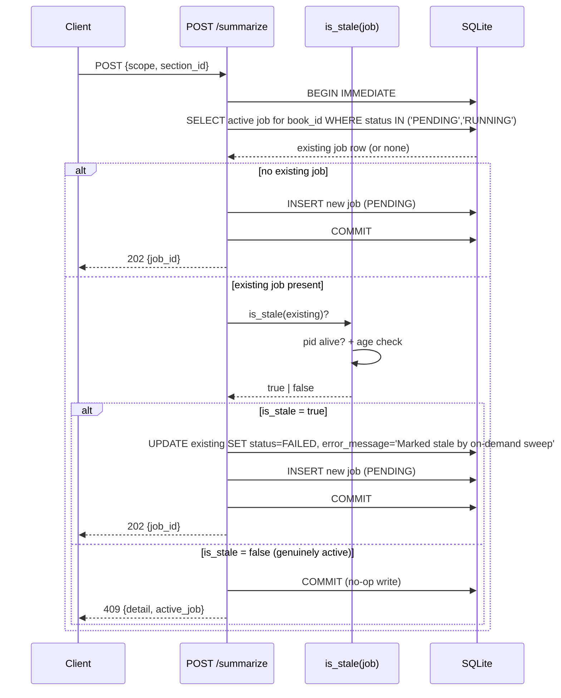

# Reader + Book Detail UX Fixes — Spec

**Date:** 2026-04-30
**Status:** Draft
**Tier:** 2 — Enhancement bundle
**Requirements:** [`docs/requirements/2026-04-30-reader-and-book-detail-ux-fixes.md`](../requirements/2026-04-30-reader-and-book-detail-ux-fixes.md)

## 1. Problem Statement

The post-summarization workflow on `/books/{id}` and `/books/{id}/sections/{sectionId}` accumulated 13 distinct UX problems — eight functional bugs (per-section retry blocked by stale job state, broken images in summaries, inactive tabs styled as disabled, tab choice not surviving reload, button hierarchy reading as accidental, duplicate progress counter, copy-to-clipboard failure, theme presets that look identical and partially no-op) and five gaps (no job deep-link, no book-summary CTA, sparse TOC, no font preview, no export feedback).

**Primary success metric:** every confirmed bug in the requirements doc's bug table is verifiably resolved (Phase 14 verification commands), and the action row + TOC + reader-settings surfaces pass a coherence review against the requirements doc's user journeys.

## 2. Goals

| # | Goal | Success Metric |
|---|------|---------------|
| G1 | All 8 confirmed bugs resolved | Each bug has a Phase 14 verification command that produces an unambiguous pass/fail signal. |
| G2 | Tab + job route state survives reload and prev/next | Reload preserves `?tab=summary\|original`; prev/next preserves the active tab; `/jobs/{id}` reload paints the same job state. |
| G3 | Book summary is reachable from book detail | "Read Summary" primary CTA on `/books/{id}` opens `/books/{id}/summary`. Disabled with tooltip when no summary exists. |
| G4 | TOC shows char count, summary status, compression ratio | One shared component renders the same data on book-detail and reader-TOC; both surfaces include all 6 columns where space allows. |
| G5 | Reader presets are visibly distinct in typography AND theme | Each of 6 system presets has a unique combination of font + size + line-height + theme. Every preset's theme has full CSS variable coverage so click is never a no-op. |
| G6 | Book detail action row reads as one designed group | Three primary actions (Read / Read Summary / Export) plus a single overflow menu. No more inline text-link buttons mixed with primaries. |

## 3. Non-Goals

- **NOT** building a fully-editable TOC component — read-with-metadata only. Edit lives in the structure-editor surface from the prior doc.
- **NOT** redesigning the reader chrome (margins, sidebar, top bar).
- **NOT** loading external webfonts at runtime from third-party CDNs (Google Fonts, etc.). Webfonts ARE bundled via `@fontsource/*` npm packages so the app works offline and matches the project's zero-external-service ethos.
- **NOT** adding a queue dashboard at `/jobs` — the new route is `/jobs/{id}` (single-job deep-link) only.
- **NOT** building artificial export delays — minimum-visible-duration of 250ms on a real loader, no fake waits.
- **NOT** re-summarizing existing books to fix legacy image refs — server-side text rewrite only.
- **NOT** removing the existing inline book-summary render from book detail — it stays as a quick-glance complement to the new CTA.
- **NOT** keeping "Copy as Markdown" as a top-level button — demoted to a menu item under Export.
- **NOT** dropping the `processing_jobs` partial UNIQUE index — the one-active-job-per-book invariant stays; #1 is fixed via on-demand stale-job sweep, not by allowing concurrent active jobs.

## 4. Decision Log

| # | Decision | Options Considered | Rationale |
|---|----------|-------------------|-----------|
| D1 | #1 fix: on-demand stale-job sweep at API guard time + retain startup sweep | (a) on-demand + startup; (b) startup-only with clearer error; (c) drop the unique index | (a) is user-recoverable without app restart and reuses existing orphan-sweep logic. The bug is almost always a stale RUNNING row from a prior crash; the freshness check (PID alive + age threshold) at guard time fixes the visible symptom without architectural change. |
| D2 | #6 fix: prompt-output rewriter handles legacy `image:N` scheme + one-shot Alembic data migration | (a) extend `from_placeholder` (or sibling) to handle `image:N` + Alembic data migration; (b) lazy rewrite at API serializer; (c) on-write only, leave existing summaries broken | (a) is symmetric with the existing `c9d0e1f2a3b4_v1_5a_summary_image_rewrite.py` pattern and runs once at next `init`/`serve`. Idempotent. Personal-scale library — milliseconds. |
| D3 | New route: `/jobs/{id}` paints from `GET /api/v1/processing/{job_id}` then SSE-subscribes for updates | (a) GET + SSE; (b) SSE-only with replay-on-connect; (c) compose from book-detail payload | (a) is the canonical REST + SSE pattern. Works for finished jobs (no SSE stream needed for terminal state). Existing SSE endpoint already at `/api/v1/processing/{job_id}/stream`. |
| D4 | Tab state in URL via `?tab=summary\|original`; prev/next preserves choice | (a) URL state + nav-preserves; (b) URL state, nav-resets; (c) localStorage | (a) — URL is shareable and reload-deterministic; nav-preserves matches user's reading flow ("I'm reading summaries; next means next summary"). |
| D5 | Tab styling: drop `:disabled` opacity rule on inactive; use accent for active, muted-but-clearly-clickable for inactive | (a) muted hover + cursor-pointer; (b) underline-only active; (c) status quo | (a) matches industry tab pattern (Linear, Notion). Inactive must read as available, not off. |
| D6 | Action row: 3 primaries (Read, Read Summary, Export ▾) + single overflow menu (⋯) | (a) 3 primaries + overflow; (b) all 5 same-tier; (c) Read primary, all others secondary | (a) — preserves user's three actual top intents and demotes power-user actions cleanly. |
| D7 | "Copy as Markdown" demoted to a menu item under Export ▾ split-button. Underlying clipboard.write failure verified-then-fixed: rely on D2 fixing it; if Copy still fails, add text-only fallback (drop image blobs, retry `writeText`) | (a) demote + verify-then-fix; (b) fix and keep top-level; (c) remove entirely | (a) addresses #9 button clutter AND likely fixes #9.3 incidentally. |
| D8 | Static "Summaries: X of Y (...)" header text removed; `SummarizationProgress` is single source of truth | (a) remove static; (b) remove dynamic; (c) keep both as complementary | (a) — dynamic component handles all states with live updates and animates. Static counter goes stale during a job. |
| D9 | Export loader: minimum visible duration ~250ms, no artificial delay | (a) honest loader + 250ms floor; (b) 1-2s artificial delay; (c) no loader (status quo) | (a) gives feedback during real latency without lying. 250ms floor avoids flash on instant exports. |
| D10 | Reader presets vary on three axes: font + size + line-height (in addition to theme) | (a) three axes; (b) two axes (size + line-height); (c) leave to /spec to skip | (a) gives each preset a deliberate identity. Concrete combinations in §11.3. |
| D11 | All 6 preset themes have fully-defined CSS variables in `theme.css` (light, sepia, dark, night, paper, contrast) | (a) define all six; (b) only those visibly broken; (c) consolidate to fewer themes | (a) makes D10 honest. The bug in #10 is partly that night/paper/contrast variables are missing from `theme.css`. |
| D12 | Font picker: custom Listbox popover replacing native `<select>` | (a) custom Listbox; (b) inline radio group; (c) native select + adjacent preview | (a) — only practical way to render per-option font preview in the browser. ~60-80 lines of Vue. Existing 6-font list stays. |
| D13 | Single shared TOC component used on book-detail (full layout) and reader TOC dropdown (compact mode) | (a) one component with `compact` prop; (b) two separate components; (c) merge with structure editor | (a) — addresses #4 with minimum scope. The structure editor (from prior doc) stays separate; different mental model. |
| D14 | TOC columns: # / Title / Type / Chars / Summary status / Compression. Compression = `summary_char_count / content_char_count` shown as percent of original | (a) 6 columns + percent; (b) 4 columns (drop Type, Compression); (c) ratio format | (a) — full data on book-detail; compact mode in dropdown hides Type + Compression for space. |
| D15 | "Read Summary" CTA always rendered; disabled-with-tooltip when no book summary exists | (a) disabled + tooltip; (b) hidden until exists; (c) visible, click opens empty-state | (a) — discoverability + standard pattern. |
| D16 | Persistent processing indicator at app bottom (existing) gets a "View details" link to `/jobs/{id}` for the running job (resolves OQ2) | (a) add link; (b) indicator stays self-contained | (a) gives users one canonical path to the deep view; the indicator stays the queue+control surface. |
| D17 | New `content_char_count` field on `SectionBrief` (already on `Section` data; add to API serializer for the list endpoint). Compression ratio computed on the frontend, not server-derived | (a) add char_count to brief, frontend-compute; (b) backend-compute compression ratio field; (c) approximate from token count | (a) keeps the calculation visible and avoids a stored field that drifts when summaries change. Char count is already cheap to compute from `len(content_md)`. |

## 5. User Journeys

The 4 primary journeys + 6 error journeys + 8 edge cases from [requirements §User Journeys](../requirements/2026-04-30-reader-and-book-detail-ux-fixes.md) are carried forward unchanged. This spec adds technical detail to each step but introduces no new flows.

## 6. Functional Requirements

### 6.1 Per-section retry (#1) — `processing.py` guard hardening

| ID | Requirement |
|----|-------------|
| FR-01 | Before returning 409 from `POST /api/v1/books/{id}/summarize`, the route MUST check the blocking job's freshness. A job is considered stale if (a) `pid IS NULL`, OR (b) `os.kill(pid, 0)` raises `ProcessLookupError`, OR (c) `started_at` is older than `STALE_JOB_AGE_SECONDS` (default 86400 = 24h). |
| FR-02 | When a stale blocking job is detected, the route MUST mark it `FAILED` (with `error_message="Marked stale by on-demand sweep"`), set `completed_at=now()`, then INSERT the new job — all within a single transaction opened with `BEGIN IMMEDIATE` (SQLite's write-lock mode, equivalent to `SELECT ... FOR UPDATE`). A concurrent second request hitting the same code path blocks on the write lock until the first transaction commits; it then re-evaluates and either sees the new active job (returns 409) or succeeds. Concretely: open the AsyncSession transaction with `await db.execute(text("BEGIN IMMEDIATE"))` at the start of the guard block, then proceed with the SELECT + UPDATE + INSERT. |
| FR-03 | If the freshness check finds the job genuinely active (live PID + recent `started_at`), the 409 response body MUST include the active job's id, scope, started_at, and current section index in `details`. |
| FR-04 | The freshness-check helper MUST be reused from `orphan_sweep.py` (extract a shared `is_stale(job)` predicate) — no duplicated logic. |

### 6.2 Image URL rewrite for legacy `image:N` scheme (#6)

| ID | Requirement |
|----|-------------|
| FR-05 | A new function `from_image_id_scheme(md: str, on_missing: OnMissing = "strip") -> str` (or extension to `from_placeholder`) MUST replace `` with `` where `NNN` is a positive integer. Strict regex; non-numeric ids are left untouched. |
| FR-06 | `SummarizerService._summarize_single_section` MUST call this function on the LLM output BEFORE persisting `summary_md`, immediately after the existing `from_placeholder` call. Same for the book-level summary path (`_summarize_book` at the equivalent line). |
| FR-07 | An Alembic data migration (new revision following `c9d0e1f2a3b4_v1_5a_summary_image_rewrite.py` shape) MUST: (a) query all rows in `summaries` where `summary_md LIKE '%](image:%'`, (b) apply `from_image_id_scheme(..., on_missing="strip")` to each, (c) UPDATE if the rewritten string differs. Idempotent — second run finds zero matches. |
| FR-08 | The summarization prompt template `summarize_section.txt` MUST be updated to instruct the LLM to emit `/api/v1/images/{{ img.image_id }}` directly, eliminating the legacy scheme at the source. The runtime rewriter (FR-05/FR-06) remains as a defense-in-depth fallback. |
| FR-09 | If `from_image_id_scheme` cannot resolve an `image:N` reference (image id doesn't exist for this book/section), `on_missing="strip"` MUST replace the markdown image with `[alt](#)` (preserve alt text as link text), log a structured warning (`event="legacy_image_ref_orphan"`, `section_id`, `image_id`), and continue. |

### 6.3 New `/jobs/{id}` deep-link route

| ID | Requirement |
|----|-------------|
| FR-10 | Backend MUST expose `GET /api/v1/processing/{job_id}` returning the full job state: `{id, book_id, book_title, status, scope, section_id, progress: {current, total, current_section_title, eta_seconds}, started_at, completed_at, error_message, last_event_at}`. 404 if not found. |
| FR-11 | Frontend MUST register a new route `/jobs/:id` → `JobProgressView.vue` (new view component). The view paints from `GET /api/v1/processing/{job_id}`, then for non-terminal statuses (`PENDING`, `RUNNING`) subscribes to the existing SSE stream `/api/v1/processing/{job_id}/stream`. |
| FR-11a | To prevent the REST→SSE seeding race (events arriving between GET response and SSE subscribe), JobProgressView MUST: (1) open the SSE stream FIRST and buffer all incoming events; (2) issue the GET in parallel; (3) on GET response, drain the buffer applying only events whose `last_event_at > GET response.last_event_at`; (4) thereafter switch the SSE handler from buffer-mode to live-apply mode. The same pattern MUST run on SSE reconnect (capture latest applied event's timestamp, re-fetch GET, re-drain). See §6 pseudocode for the canonical flow. |
| FR-11b | JobProgressView's SSE event→UI mapping MUST be: `section_started` → update `progress.current_section_title`; `section_completed` → increment `progress.current`; `section_failed` → increment failure counter and surface in UI; `section_retry` → show "retrying section N" indicator; `processing_completed` → transform view to terminal-success mode; `processing_failed` → transform to terminal-error mode; `job_cancelling` → show "cancelling…" state; `close` → unsubscribe and stop. Events `job_queued` and `job_promoted` are emitted but NOT consumed by this view (already-subscribed jobs are by definition past those phases). |
| FR-12 | The view MUST handle three render modes: (a) active (status `PENDING`/`RUNNING`) → progress bar, current section title, ETA, **[Open Book]** (router-link to `/books/{book_id}`), **[Cancel]** (invokes `DELETE /api/v1/processing/{job_id}`; transitions view to "cancelling…" state on click; backend best-effort per resolved OQ8 — current section finishes, then worker stops); (b) terminal (`COMPLETED`/`FAILED`) → completion card rendering: `book_title`, `total_sections_summarized` (= `progress.current` at completion), `total_failures` (count of `section_failed` events), `elapsed_time` (computed from `started_at` → `completed_at`), `error_message` (only if FAILED), and primary **[Open Book]** CTA. No SSE subscription. (c) 404 → "Job not found — it may have been deleted" with **[Back to Library]**. |
| FR-12a | While the initial `GET /api/v1/processing/{job_id}` is in flight (typical < 50ms per NFR-04), the view MUST render a skeleton state: book-title placeholder, indeterminate progress bar (animated), no Cancel button visible yet. SSE buffer fills concurrently per FR-11a. On GET response the skeleton swaps to the appropriate render mode (active / terminal / 404). |
| FR-13 | The Persistent Processing Indicator MUST add a "View details" link on the running-job row pointing at `/jobs/{job.id}`. Existing in-indicator controls (Cancel, Open Book) stay. |

### 6.4 Tab state in URL (#7) — section reader

| ID | Requirement |
|----|-------------|
| FR-14 | The section-detail route MUST accept an optional `?tab=summary\|original` query parameter. Unknown values fall back to the existing default-selection logic (summary if `has_summary`, else original). |
| FR-15 | `reader.ts` store MUST read the initial `contentMode` from `route.query.tab` on `loadSection()`. `toggleContent()` MUST `router.replace()` the URL with the updated `tab` param (replace, not push — avoids polluting back-history). |
| FR-16 | `navigateSection(direction)` MUST preserve the current `contentMode` in the destination URL's `tab` param. If the destination section lacks a summary and `tab=summary` was requested, the URL silently rewrites to `tab=original`. |
| FR-17 | If `route.query.tab` is `summary` but the section has no summary, the store MUST set `contentMode='original'` and `router.replace()` the URL to `?tab=original` so the URL doesn't lie about state. |

### 6.5 Tab styling (#5)

| ID | Requirement |
|----|-------------|
| FR-18 | `ContentToggle.vue` MUST remove the `.toggle-btn:disabled` opacity rule. Inactive tab styling MUST use a muted but clearly-clickable treatment: full opacity, color `var(--color-text-secondary)`, hover state with `var(--color-bg-muted)` background, cursor pointer. |
| FR-19 | Active tab styling unchanged (`background: var(--color-accent)`, `color: #fff`). |

### 6.6 Book detail action row (#9, #9.1, #9.2, #9.3)

| ID | Requirement |
|----|-------------|
| FR-20 | `BookOverviewView.vue` action row MUST render exactly three primary buttons + one overflow trigger, in this order: **[Read]** **[Read Summary]** **[Export ▾]** **[⋯]**. All four use the same height; `Export ▾` is a split-button (clicking the chevron opens a menu, clicking the body triggers the default action = Download .md). |
| FR-21 | The overflow menu (⋯) MUST contain: "Edit Structure" (router-link to existing route), "Customize Reader" (opens existing reader-settings popover). |
| FR-22 | The `Export ▾` menu MUST contain: "Download Markdown" (current `onExportClick` behavior), "Copy to Clipboard" (current `onCopyClick` behavior). The default click on the button body triggers Download. |
| FR-22a | The `Export ▾` button MUST be disabled when `book.summary_progress.summarized === 0` (no sections have summaries yet). Tooltip on disabled state: "No summaries to export yet — summarize sections first." Same disabled-with-tooltip pattern as FR-23 (Read Summary). Mirrors the user's existing mental model that export is meaningless without summary content. |
| FR-23 | The Read Summary CTA MUST be a router-link to `/books/{id}/summary`. When the book has no default summary (`book.default_summary IS NULL`), the button MUST be disabled with tooltip "No book summary yet — summarize sections first." |
| FR-24 | The static header counter line ("Summaries: X of Y (Z pending, W failed)") MUST be removed from `BookOverviewView.vue`. `SummarizationProgress.vue` (already mounted below the action row) is the single source of truth and remains. **Removal grep inventory:** before deleting, grep `frontend/src/views/__tests__/BookOverviewView.spec.ts`, any Vitest snapshot files (`__snapshots__/`), and Playwright e2e assertions for references to the static counter text — every hit MUST be updated or the test fails silently as a false negative. |
| FR-25 | `onExportClick` MUST set a local `exporting` ref to `true` before the fetch and to `false` after BOTH a minimum 250ms has elapsed AND the response has settled (resolved OR rejected). Implementation pattern: `await Promise.allSettled([exportPromise, new Promise(r => setTimeout(r, 250))])` — using `allSettled` (not `all`) ensures the 250ms floor applies on the error path too, so the loader never vanishes instantly on a fast 500. After settling, inspect the export result and either trigger the download (resolved) or surface the existing error toast (rejected). The Export button MUST show a spinner while `exporting === true`. |
| FR-26 | `onCopyClick` MUST first attempt the existing `clipboard.write` path. If it throws, the catch MUST invoke a text-only fallback that fetches the export, strips out image references, and calls `clipboard.writeText`. If both paths fail, surface the existing toast. (D2 should make this fallback rarely needed.) |

### 6.7 Shared TOC component (#4)

| ID | Requirement |
|----|-------------|
| FR-27 | A new component `SectionListTable.vue` (under `frontend/src/components/book/`) MUST render a table-shaped list of sections with columns: `# / Title / Type / Chars / Summary / Compression`. Props: `sections: Section[]`, `currentSectionId?: number`, `compact?: boolean`, `bookId: number`. |
| FR-28 | When `compact === true`, the component MUST hide the `Type` and `Compression` columns and render in a denser layout suitable for the reader's TOC dropdown (~360px width). |
| FR-29 | Each row MUST be clickable; click navigates to `/books/{bookId}/sections/{sectionId}`. When invoked from the reader's TOC dropdown, any current `?tab=` value MUST be preserved on the destination URL (so a user reading summaries navigates row-to-row without losing their tab choice). When invoked from book detail (no current tab context), no `?tab=` is appended; the destination view applies its default-mode logic. |
| FR-30 | Summary status column values: `✓` (done), `pending` (text), `failed` (red text), `stale` (yellow badge), `—` (never summarized). |
| FR-31 | Compression column values: percent of original to one decimal, e.g., "21.4%"; "—" when section has no summary or `content_char_count` is 0. Computed as `(summary.summary_char_count / section.content_char_count) * 100`. |
| FR-32 | `SectionBrief` MUST gain a `content_char_count: int` field served by the book-detail and section-list endpoints. Backend MUST compute it via SQL `LENGTH(content_md)` projected as a column in the SELECT (e.g., a SQLAlchemy `column_property` with `func.length(BookSection.content_md)`, or included in the explicit query) — NOT via Python `len()` on the loaded ORM string. This avoids fetching the full `content_md` payload (potentially 100KB+ per section) over the wire when only the length is needed for the TOC. NULL `content_md` produces 0. |
| FR-33 | `BookOverviewView.vue` MUST replace its existing inline section list with `<SectionListTable :sections :bookId :compact="false" />`. `TOCDropdown.vue` MUST replace its existing layout with `<SectionListTable :sections :currentSectionId :bookId :compact="true" />`. The component MUST render a thin visual separator row (1px border, no content) between consecutive sections of different `section_type` values when ordered by `order_index` — preserving the front-matter/body break that the existing `<details>` wrapper provided, without nesting. The Type column shows the section type explicitly; in `compact` mode the column is hidden but the separator row remains. |
| FR-33a | When mounted on `/books/{id}` (non-compact mode) AND a summarization job is RUNNING for that book, `SectionListTable` MUST subscribe to the existing SSE stream `/api/v1/processing/{job_id}/stream` and update affected rows on incoming events: `section_completed` flips Summary column from "pending" to "✓" and computes a new Compression value; `section_failed` flips Summary column to "failed"; `section_retry` shows a brief "retrying" indicator on the row. On `processing_completed`/`processing_failed`, the subscription closes. In `compact` mode (reader TOC dropdown), the table does NOT subscribe — the user is reading, not watching progress; live updates would be visual noise. |

### 6.8 Reader settings: presets & themes (#10, #8)

| ID | Requirement |
|----|-------------|
| FR-34 | An Alembic data migration MUST UPDATE the 6 system presets in the `reading_presets` table to the new typography combinations (D10): see §11.3 for exact values. Idempotent — UPDATE WHERE current values match the original (Georgia/16/1.6/720) for each preset. |
| FR-35 | `frontend/src/assets/theme.css` MUST add complete CSS variable definitions for `[data-theme='night']`, `[data-theme='paper']`, and `[data-theme='contrast']`. Each MUST cover the same 17 variables defined for light/dark/sepia. |
| FR-36 | `ThemeGrid.vue` MUST render each system preset tile with a typography preview (sample text "Aa" rendered in the preset's `font_family` at the preset's `font_size_px`) in addition to the existing color swatches. |
| FR-37 | A new component `FontListbox.vue` (under `frontend/src/components/settings/`) MUST replace the native `<select>` in `CustomEditor.vue`. Behavior: button trigger showing current font (rendered in that font), click opens a popover (~200px wide) with one row per font. Each row's label MUST be styled `font-family: '<font name>'`. Keyboard nav: `↑/↓` moves focus, `Enter` selects, `Esc` closes, click-outside closes. |
| FR-38 | The 6 fonts in the listbox stay the same: Georgia, Inter, Merriweather, Fira Code, Lora, Source Serif Pro. No new fonts shipped in this iteration. |
| FR-39 | Inter, Merriweather, Lora, Fira Code, and Source Serif Pro MUST be bundled via `@fontsource/*` npm packages (`@fontsource/inter`, `@fontsource/merriweather`, `@fontsource/lora`, `@fontsource/fira-code`, `@fontsource/source-serif-pro`). The packages MUST be imported in `frontend/src/main.ts` so the `@font-face` rules ship in the production bundle. Georgia is a system font and needs no bundling. |
| FR-39a | All bundled `@font-face` declarations MUST use `font-display: swap` so text renders immediately in the system fallback and re-renders when the webfont loads (no FOIT). Each preset's `font-family` declaration MUST include a system-font fallback chain: serif presets → `'Lora', 'Merriweather', Georgia, serif`; sans presets → `'Inter', 'Source Serif Pro', system-ui, -apple-system, sans-serif`; the exact chain per preset falls out of /plan but the rule is: bundled font first, related-style bundled font second, system fallback last. |
| FR-40 | The bundled font weights MUST cover the use cases: Inter 400 + 700 (HC preset uses bold-equivalent); Merriweather 400 + 700; Lora 400 + 600; Fira Code 400; Source Serif Pro 400 + 700. Default subset (latin) only — full multi-language subsets are out of scope. |

## 6.9 Non-Functional Requirements

| ID | Category | Requirement |
|----|----------|-------------|
| NFR-01 | Accessibility | `FontListbox` MUST follow the [W3C ARIA Listbox pattern](https://www.w3.org/WAI/ARIA/apg/patterns/listbox/): `role="listbox"` on the option container, `role="option"` and `aria-selected` on each row, `aria-activedescendant` on the listbox tracking keyboard focus. Esc closes the popover AND returns focus to the trigger button. Tab moves focus out of the listbox per the standard. |
| NFR-02 | Accessibility | The Export ▾ split-button menu (FR-22) and the overflow ⋯ menu (FR-21) MUST follow the [W3C ARIA Menu Button pattern](https://www.w3.org/WAI/ARIA/apg/patterns/menu-button/): trigger has `aria-haspopup="menu"`, menu has `role="menu"`, items have `role="menuitem"`, ↑/↓ navigate, Enter activates, Esc closes and returns focus. |
| NFR-03 | Performance | The on-demand stale-job sweep (FR-01/02) MUST add < 5ms to the median POST `/api/v1/books/{id}/summarize` response time when no stale job exists (single SELECT + predicate evaluation). When a stale job is detected, the additional UPDATE is acceptable up to 50ms. |
| NFR-04 | Performance | `GET /api/v1/processing/{job_id}` (FR-10) MUST respond in < 50ms median for any job state — single primary-key lookup, no joins required. |
| NFR-05 | Bundle size | Webfont bundling (FR-39/40) MUST add no more than 600KB to the frontend production bundle (the 5 fonts × 1-2 weights × latin-only subsets, woff2 only). |
| NFR-06 | Migration safety | Both new data migrations (FR-07 image-rewrite, FR-34 preset typography) MUST be idempotent — re-running produces zero UPDATEs. Verified by integration tests in §12.3. Migrations run inside Alembic's default transaction wrapping; on partial failure mid-iteration the migration rolls back fully and the next `init`/`serve` retries from scratch (no half-applied state). |
| NFR-07 | Accessibility | `SectionListTable` rows MUST be keyboard-navigable: ↑/↓ moves focus between rows, Enter activates the focused row's navigation, the focused row has a visible focus ring (`outline: 2px solid var(--color-accent)`). Each row has `role="link"` since clicking navigates to the section reader. Compact mode (reader TOC dropdown) inherits the same keyboard rules. |

## 7. API Changes

### 7.1 GET /api/v1/processing/{job_id} (NEW)

```
GET /api/v1/processing/{job_id}
```

**Request:** path param `job_id: int`. No body, no query params.

**Response (200):**
```json
{
  "id": 42,
  "book_id": 3,
  "book_title": "Playing to Win",
  "status": "RUNNING",
  "scope": "all",
  "section_id": null,
  "progress": {
    "current": 12,
    "total": 24,
    "current_section_title": "How Strategy Wins",
    "eta_seconds": 180
  },
  "started_at": "2026-04-30T14:22:01Z",
  "completed_at": null,
  "error_message": null,
  "last_event_at": "2026-04-30T14:25:43Z"
}
```

**Response (404):** `{"detail": "Job not found"}` when the job_id does not exist.

**Notes:**
- `scope` and `section_id` extracted from `request_params` JSON.
- `progress.current` / `progress.total` derived from the existing `progress` JSON column.
- `eta_seconds` may be `null` for `PENDING` jobs.

### 7.2 POST /api/v1/books/{book_id}/summarize (MODIFIED — guard hardening)

Request body unchanged. Response shapes:

**Response (202):** unchanged (job created).

**Response (409 — modified):**
```json
{
  "detail": "A summarization job is already running for this book.",
  "active_job": {
    "id": 41,
    "scope": "all",
    "started_at": "2026-04-30T14:22:01Z",
    "progress": { "current": 12, "total": 24 }
  }
}
```

**New behavior:** before returning 409, the route runs the freshness check (FR-01). If the blocking job is stale, it is transactionally marked FAILED and the create proceeds (returning 202 with the new job).

**Sequence diagram — on-demand stale-job sweep:**



A concurrent second request for the same book blocks at `BEGIN IMMEDIATE` until the first transaction commits, then re-evaluates the SELECT and either sees the new active job (returns 409) or — if both happened to target a different stale job — succeeds independently. The partial UNIQUE index `processing_jobs(book_id) WHERE status IN ('PENDING','RUNNING')` provides the ultimate safety net against the races the application logic might miss.

### 7.3 GET /api/v1/books/{id} (MODIFIED — `content_char_count` on sections)

The existing `BookDetail` schema's `sections: List[SectionBrief]` MUST include a new `content_char_count: int` field on each section. Default 0 if `content_md is None`.

## 8. Frontend Design

### 8.1 Component hierarchy (deltas from current)

```
BookOverviewView.vue
  ├── (header — title, author)
  ├── ActionRow                    [NEW layout]
  │     ├── ReadButton             (primary)
  │     ├── ReadSummaryButton      (primary, disabled if no summary)
  │     ├── ExportSplitButton      [NEW] — body=Download, ▾=menu
  │     └── OverflowMenu           [NEW] — ⋯ → Edit Structure / Customize Reader
  ├── (inline book summary render — PRESERVED)
  ├── SectionListTable             [NEW shared, replaces inline list]
  └── SummarizationProgress        (existing, single source of truth)

BookDetailView.vue (section reader)
  ├── ReaderHeader
  │     ├── TOCDropdown
  │     │     └── SectionListTable :compact=true   [NEW shared]
  │     └── ContentToggle           [STYLES MODIFIED]
  └── (content area — Original or Summary based on contentMode + URL tab)

JobProgressView.vue                 [NEW]
  ├── ProgressBar (existing pattern)
  ├── CurrentSection
  ├── ETACard
  └── ActionButtons (Open Book / Cancel)

CustomEditor.vue (reader settings)
  └── FontListbox                  [NEW, replaces native <select>]

ThemeGrid.vue
  └── PresetTile                   [MODIFIED — adds typography preview]

PersistentProcessingIndicator.vue
  └── (running-job row gains "View details" link to /jobs/{id})
```

### 8.2 State management

| State | Lives in | Notes |
|-------|---------|-------|
| `contentMode` | `reader.ts` Pinia store, **synced to URL `?tab`** | Read from URL on `loadSection`; `router.replace` on toggle. |
| Active job state | `summarizationJob.ts` store + URL `/jobs/:id` route param | View paints from `GET /api/v1/processing/{id}`, subscribes to SSE. |
| Export loading | Local ref in `BookOverviewView.vue` | `exporting: ref(false)` with min-duration logic. |
| Preset selection | `readerSettings.ts` store (existing) | No change. |
| Custom font | `readerSettings.ts` store (existing `currentSettings.font_family`) | `FontListbox` v-models against the store. |

### 8.3 Route changes

```ts
// frontend/src/router/index.ts
{ path: '/jobs/:id', name: 'job-progress', component: () => import('@/views/JobProgressView.vue'), props: true }
```

The section-detail route is unchanged structurally; query-param parsing happens in the view, not the route definition.

## 9. Edge Cases

| # | Scenario | Condition | Expected Behavior |
|---|----------|-----------|-------------------|
| E1 | Section retry while a full-book job is genuinely RUNNING | live PID, recent `started_at` | 409 returned with `active_job` payload. Frontend surfaces "Wait for the current full-book job to finish — N/M sections done." Retry button disabled with tooltip. |
| E2 | Section retry when the only blocking job is stale (PID dead OR > 24h) | freshness check fails | Stale job transactionally marked FAILED; new job created and returned with 202. No user-visible retry needed. |
| E3 | Image rewrite encounters orphan `image:N` (no matching image) | image_id not found in section's image map | Rewriter strips the image, preserves alt text as `[alt](#)`, logs structured warning. |
| E4 | `/jobs/{id}` for a finished job | status COMPLETED or FAILED | View paints completion card with summary stats (sections summarized, elapsed time, failure count, error message if FAILED) and "Open Book" CTA. No SSE subscription. |
| E5 | `/jobs/{id}` for a non-existent or deleted job | GET returns 404 | View shows "Job not found — it may have been deleted." with [Back to Library]. |
| E6 | URL has `?tab=summary` but section has no summary | `has_summary === false`, `route.query.tab === 'summary'` | Store sets `contentMode='original'`, `router.replace` to `?tab=original`. |
| E7 | Prev/next from a section with summary to a section without | nav direction valid; destination `has_summary === false`; current `contentMode='summary'` | Navigate to destination, set `contentMode='original'`, URL becomes `?tab=original`. |
| E8 | Compression ratio when summary is longer than original | `summary_char_count > content_char_count` | Display the percentage as-is (e.g., "104.2%"). Don't cap at 100%; the data point is real. |
| E9 | Section has no `content_md` (empty section) | `content_char_count === 0` | Compression shows "—" not "Infinity%" or "NaN%". |
| E10 | Theme preset clicked but its CSS variables are still missing | shouldn't occur post-fix, but if it does | Reader keeps current theme; log console warning. (Verification: §14 includes a check that all 6 themes have full variable coverage.) |
| E11 | Browser blocks clipboard.write (HTTP context, denied permission) | exception thrown | Catch invokes text-only `writeText` fallback (FR-26). If that also fails, toast: "Copy needs HTTPS or clipboard permission. Use Download instead." |
| E12 | Read Summary CTA on a book with no default summary | `book.default_summary === null` | Button disabled (greyed); tooltip "No book summary yet — summarize sections first." |
| E13 | Export response arrives before 250ms floor | fast export | Loader visible for the full 250ms before download triggers. No flash. |
| E14 | Page refresh during an active SSE subscription on `/jobs/{id}` | reload | View re-mounts → re-fetches `GET /api/v1/processing/{id}` → re-subscribes to SSE. Continuous experience for the user. |
| E15 | TOC dropdown on small viewport (mobile) | viewport < 640px | `compact` mode hides Type + Compression cols; the table fits. (Tier-2 may keep mobile out of scope; flag if needed.) |
| E16 | LLM emits a malformed `image:N` (e.g., `image:abc` or `image:`) | non-numeric or empty id | Regex requires `image:[0-9]+`; non-matching strings left untouched (no rewrite, no error). |

## 10. Configuration & Feature Flags

| Variable | Default | Purpose |
|----------|---------|---------|
| `BOOKCOMPANION_PROCESSING__STALE_JOB_AGE_SECONDS` | 86400 | Threshold beyond which a RUNNING job is considered stale (used by both startup orphan-sweep and on-demand guard sweep). |
| `BOOKCOMPANION_EXPORT__MIN_LOADER_MS` | 250 | Frontend-side minimum visible duration for the Export button loader. Read from settings if exposed; otherwise const. |

No feature flags needed — all changes are non-breaking polish on existing surfaces. The legacy-image-rewrite migration is a one-time data fix.

## 11. Concrete Values

### 11.1 Stale-job thresholds

`is_stale(job)` returns true when ANY of:
- `job.pid IS NULL`
- `os.kill(job.pid, 0)` raises `ProcessLookupError` (process not alive)
- `(now - job.started_at).total_seconds() > STALE_JOB_AGE_SECONDS` (default 24h)

This logic is already in `orphan_sweep.py`; spec mandates extracting it into a shared predicate (FR-04).

### 11.2 Image rewrite regex

```python
LEGACY_IMAGE_RE = re.compile(r"!\[([^\]]*)\]\(image:(\d+)\)")
```

Replacement template: `f""` — verifies the image_id exists in the section's image map; if not, replaces with `f"[{alt}](#)"` (preserve alt as link text).

### 11.2a Clipboard text-only fallback regex (FR-26)

```python
# JS-side; used to strip image refs from markdown before navigator.clipboard.writeText
const STRIP_IMG_RE = /!\[([^\]]*)\]\([^)]*\)/g;
const stripped = markdown.replace(STRIP_IMG_RE, '$1');
```

Replaces `` with just the alt text. Preserves caption / context as plain words; removes broken-image clipboard payload that was causing the original failure mode. Applied only on the fallback path — primary `clipboard.write` path keeps full markdown including image refs (which work post-D2 fix).

### 11.3 Reader preset values (D10) — Alembic UPDATE

| Name | font_family | font_size_px | line_spacing | content_width_px | theme |
|------|-------------|--------------|------------------|------------------|-------|
| Light | Georgia | 16 | 1.6 | 720 | light |
| Sepia | Georgia | 17 | 1.7 | 680 | sepia |
| Dark | Inter | 16 | 1.6 | 720 | dark |
| Night | Inter | 18 | 1.7 | 680 | night |
| Paper | Lora | 17 | 1.8 | 640 | paper |
| High Contrast | Inter | 18 | 1.7 | 700 | contrast |

Migration upgrade: per row, `UPDATE reading_presets SET font_family=..., font_size_px=..., line_spacing=..., content_width_px=... WHERE name=? AND font_family='Georgia' AND font_size_px=16 AND line_spacing=1.6 AND content_width_px=720` — guarded WHERE so the migration is idempotent and respects user overrides if any.

### 11.4 Theme CSS variable additions (FR-35)

For each of `[data-theme='night']`, `[data-theme='paper']`, `[data-theme='contrast']`, define the same 17 variables defined for light/dark/sepia in `theme.css:4-70`:

```css
[data-theme='night'] {
  --color-bg-primary: #0a0e1a;
  --color-bg-secondary: #111827;
  --color-bg-tertiary: #1f2937;
  --color-bg-muted: #1a2030;
  --color-bg-elevated: #1f2937;
  --color-text-primary: #e5e7eb;
  --color-text-secondary: #9ca3af;
  --color-text-tertiary: #6b7280;
  --color-text-inverted: #0a0e1a;
  --color-border: #374151;
  --color-border-strong: #4b5563;
  --color-accent: #818cf8;
  --color-success: #34d399;
  --color-warning: #fbbf24;
  --color-error: #f87171;
  --color-sidebar-bg: #0a0e1a;
  --color-highlight-bg: #fde68a40;
}
[data-theme='paper'] { /* warm cream + serif feel — concrete values fall out of /plan, but spec mandates all 17 vars defined */ }
[data-theme='contrast'] { /* pure black bg, pure white text, blue accent — concrete values from /plan */ }
```

The `night` palette is fully specified above. `paper` and `contrast` palettes left to `/plan` to derive (Tier-2 spec leaves room for engineering judgment on color values — the requirement is *complete* coverage, not specific hex codes).

## 12. Testing & Verification Strategy

### 12.1 Unit Tests (Backend)

| File | Asserts |
|------|---------|
| `backend/tests/unit/test_image_url_rewrite.py` | New cases: `image:42` → `/api/v1/images/42` when image exists; orphan `image:99` → `[alt](#)` when no image map entry; malformed `image:abc` left untouched; idempotent (re-applying produces same string). |
| `backend/tests/unit/test_orphan_sweep.py` (extend) | Test `is_stale(job)` predicate directly with: live PID + recent → False; dead PID → True; null PID → True; old `started_at` → True. |
| `backend/tests/unit/test_summarizer_image_rewrite.py` | Stub LLM emits ``; verify persisted `summary_md` contains `/api/v1/images/7`. |

### 12.2 Integration Tests (Backend)

| File | Asserts |
|------|---------|
| `backend/tests/integration/test_processing_stale_guard.py` | Seed a RUNNING job with `pid=99999` (dead); POST a new job → 202 (not 409); verify the stale job is marked FAILED. |
| `backend/tests/integration/test_processing_guard_active.py` | Seed a RUNNING job with current process's PID; POST new job → 409 with `active_job` payload. |
| `backend/tests/integration/test_processing_get_endpoint.py` | GET `/api/v1/processing/{id}` for PENDING/RUNNING/COMPLETED/FAILED/missing → 200 with correct shape × 4, 404 × 1. |
| `backend/tests/integration/test_book_detail_char_count.py` | GET `/api/v1/books/{id}` returns sections with `content_char_count` field; value matches `len(content_md)`. |

### 12.3 Migration Tests

| File | Asserts |
|------|---------|
| `backend/tests/integration/test_migration_image_rewrite.py` | Seed a summary with `summary_md='before  after'`; run migration; verify rewrite. Run a second time; verify no-op (idempotent). |
| `backend/tests/integration/test_migration_preset_typography.py` | Seed default presets; run migration; verify Light is `Georgia/16/1.6/720`, Night is `Inter/18/1.7/680`, etc. Re-run; verify idempotent (no UPDATE happens because the WHERE clause no longer matches the original tuple). |

### 12.4 Frontend Unit Tests (Vitest)

| File | Asserts |
|------|---------|
| `frontend/src/stores/__tests__/reader.tab.spec.ts` | `loadSection` reads `route.query.tab`; `toggleContent` calls `router.replace` with new `tab`; mismatched `tab=summary` on a no-summary section silently rewrites to `tab=original`. |
| `frontend/src/components/__tests__/ContentToggle.spec.ts` | Inactive button is NOT visually `disabled`-styled; both buttons are clickable; click emits the right event. |
| `frontend/src/components/__tests__/SectionListTable.spec.ts` | All 6 columns render in default mode; `compact=true` hides Type and Compression; compression formatting follows `21.4%` shape; `—` shown when no summary. |
| `frontend/src/components/__tests__/FontListbox.spec.ts` | Each option's label has `font-family` style applied; keyboard nav (↑↓ + Enter) works; click-outside closes. |
| `frontend/src/views/__tests__/BookOverviewView.spec.ts` | Action row renders [Read][Read Summary][Export ▾][⋯]; static "Summaries: X of Y" text is gone; Export click sets `exporting=true` for ≥250ms. |

### 12.5 End-to-End Verification (Playwright MCP)

A single Playwright session covering:

1. Boot a verification server per CLAUDE.md "Interactive verification" pattern (port 8765, `npm run build` + copy to `backend/app/static/`).
2. Seed at least one fully-summarized book.
3. Navigate to `/books/{id}` — assert action row shape (3 buttons + ⋯), no static counter text, "Read Summary" works, "Export ▾" menu has both items.
4. Open Export menu → click "Copy to Clipboard" → assert success toast; verify clipboard via `browser_evaluate(() => navigator.clipboard.readText())`.
5. Navigate to a section, click `Original`/`Summary` tabs, assert URL updates to `?tab=...`; reload page, assert tab choice survives.
6. Click prev/next, assert tab choice preserved.
7. Open a section that has an image-bearing summary; assert `` resolves (no broken-image icon).
8. Open reader settings → click each system preset → assert `data-theme` attribute changes AND visible bg color changes.
9. Open custom font dropdown → assert each option label is rendered in its own font.
10. Visit `/jobs/{any-completed-job-id}` → assert completion card renders with "Open Book" link.

### 12.6 Verification Commands

```bash
# Backend unit + integration
cd backend && uv run python -m pytest tests/unit/test_image_url_rewrite.py tests/unit/test_orphan_sweep.py tests/integration/test_processing_stale_guard.py tests/integration/test_processing_get_endpoint.py tests/integration/test_book_detail_char_count.py tests/integration/test_migration_image_rewrite.py tests/integration/test_migration_preset_typography.py -v

# Backend lint
cd backend && uv run ruff check .

# Migration sanity (against a fresh DB)
cd backend && rm -f /tmp/spec-test.db && BOOKCOMPANION_DATABASE__URL=sqlite+aiosqlite:////tmp/spec-test.db uv run alembic -c app/migrations/alembic.ini upgrade head

# Verify image rewrite migration on production DB (DRY)
sqlite3 ~/Library/Application\ Support/bookcompanion/library.db "SELECT count(*) FROM summaries WHERE summary_md LIKE '%](image:%';"
# After migration: must return 0

# Frontend type-check + unit tests
cd frontend && npm run type-check && npm run test:unit

# Frontend lint
cd frontend && npm run lint

# Theme CSS coverage check (every theme has all 17 vars)
cd frontend && grep -E "^\[data-theme='(light|sepia|dark|night|paper|contrast)'\]" src/assets/theme.css | sort -u | wc -l
# Must return 6
```

## 13. Open Questions

| # | Question | Owner | Needed By |
|---|----------|-------|-----------|
| OQ1 | Concrete color palettes for `paper` and `contrast` themes (FR-35). Spec gives a complete `night` palette as the worked example; `paper` and `contrast` need values before /execute. Should /plan derive them, or does Maneesh want to specify? | Maneesh | before /execute |
| OQ2 | Mobile/small-viewport behavior for `SectionListTable` in `compact` mode (E15). Is mobile in scope for this iteration? Reader is desktop-first today. | Maneesh | before /plan |
| OQ3 | Does the rewriter's "orphan image_id → strip with link fallback" (FR-09) ever happen in practice for real summaries? If so, a structured-warning telemetry counter would help; otherwise the log is enough. | Maneesh | during /execute |
| OQ4 | Should the `/jobs/{id}` view's "Cancel" button match the cancel-best-effort semantics resolved in OQ8 of the requirements doc, or surface a stronger "killing now" affordance? Both routes (this view + persistent indicator) should match. | Maneesh | before /plan |

## 14. Research Sources

| Source | Type | Key Takeaway |
|--------|------|-------------|
| `backend/app/api/routes/processing.py:113-127` | Existing code | Active-job guard query — scope-agnostic. |
| `backend/app/db/models.py:282-321` | Existing code | ProcessingJob model + partial UNIQUE index `sqlite_where="status IN ('PENDING','RUNNING')"`. |
| `backend/app/services/parser/image_url_rewrite.py:58-98` | Existing code | `from_placeholder()` rewriter — pattern to follow for `image:N` handler. |
| `backend/app/services/summarizer/prompts/base/summarize_section.txt:14-20` | Existing code | LLM is told to emit `image:ID` — root cause of legacy refs in summaries. |
| `backend/app/services/summarizer/orphan_sweep.py` | Existing code | Stale-job detection logic to reuse for on-demand sweep. |
| `backend/app/migrations/versions/c9d0e1f2a3b4_v1_5a_summary_image_rewrite.py` | Existing code | Pattern for one-shot summary-content migration. |
| `backend/app/migrations/versions/a5459240fea0_v1_5_1_collapse_reading_presets.py` | Existing code | Pattern for preset-row migration. |
| `frontend/src/assets/theme.css:4-70` | Existing code | Theme CSS variable coverage (light/dark/sepia complete; night/paper/contrast missing). |
| `frontend/src/stores/reader.ts:34, 85-97, 121-123` | Existing code | `contentMode` state to wire to URL. |
| `frontend/src/components/reader/ContentToggle.vue:51-54` | Existing code | The `:disabled` opacity rule causing the disabled-look bug. |
| `frontend/src/views/BookOverviewView.vue:51-104` | Existing code | Current action-row layout. |
| Linear / Notion / GitHub action rows | Industry pattern | Standard: 1-3 primary actions + overflow menu for power-user. |
| ARIA Listbox spec (W3C WAI) | Standard | Keyboard-nav requirements for `FontListbox`. |

## 15. Review Log

| Loop | Findings | Changes Made |
|------|----------|-------------|
| 1 | F1: on-demand stale-sweep race — two concurrent requests could both win | Disposition: `BEGIN IMMEDIATE` (SQLite write-lock). Updated FR-02 with explicit transaction-open pattern. |
| 1 | F2: TOCDropdown's existing `<details>` grouping conflicts with flat SectionListTable | Disposition: thin separator row between section_type changes. Updated FR-33 to mandate a 1px separator on type-change boundaries; Type column shows type in full mode, separator survives in compact mode. |
| 1 | F3: FR-26 fallback's "strip images" was unspecified | Disposition: pin regex to strip-to-alt-text. Added §11.2a with concrete JS regex. |
| 1 | F4: SectionBrief `content_char_count` derivation perf | Disposition: read-time derivation is fine. Tightened FR-32 wording with explicit scale rationale. |
| 1 (self-applied) | F5: FR-29 click-navigation didn't specify tab-preservation behavior across calling contexts (book-detail vs reader-TOC) | Updated FR-29 to distinguish: from reader-TOC, preserve `?tab=`; from book-detail, no tab param (destination applies default-mode logic). |
| 2 | F6: webfonts referenced by D10 / FR-37 (Inter, Lora, Merriweather, etc.) are NOT bundled by the app today — `grep` for `@font-face` / `@import` / `googleapis.*fonts` returned nothing. New presets would silently fall back to system fonts on machines without them installed. | Disposition: bundle via `@fontsource/*`. Updated Non-Goals; added FR-39 (`@fontsource/*` packages, imported in `main.ts`) and FR-40 (specific weights + latin subset only). Added NFR-05 capping bundle-size impact. |
| 2 | F7: no NFR for accessibility — FontListbox keyboard nav was inline in FR-37 but ARIA / SR concerns weren't captured | Disposition: add NFR section. Created §6.9 with NFR-01 (FontListbox = ARIA Listbox), NFR-02 (Export menu + overflow = ARIA Menu Button), plus performance + migration NFRs (NFR-03/04/05/06). |
| 2 | F8: stale-job-sweep flow is multi-actor with non-trivial transaction shape; FR text alone is dense | Disposition: add Mermaid sequence diagram. Added under §7.2 capturing the BEGIN IMMEDIATE → SELECT → is_stale branch → UPDATE/INSERT or 409 → COMMIT flow, including the concurrent-request blocking note. |
