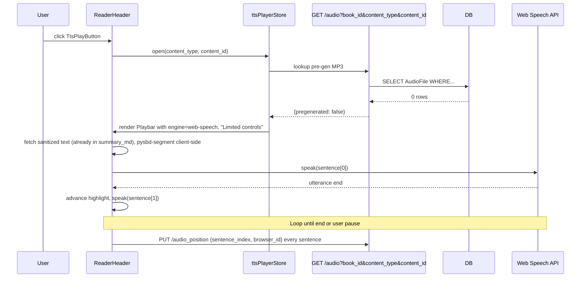
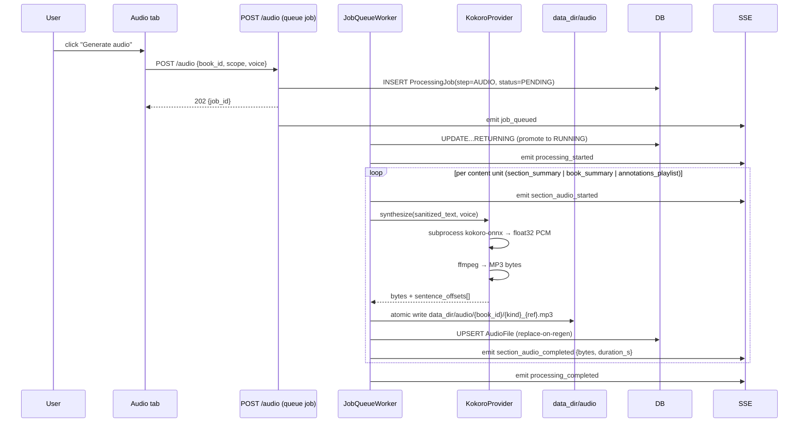
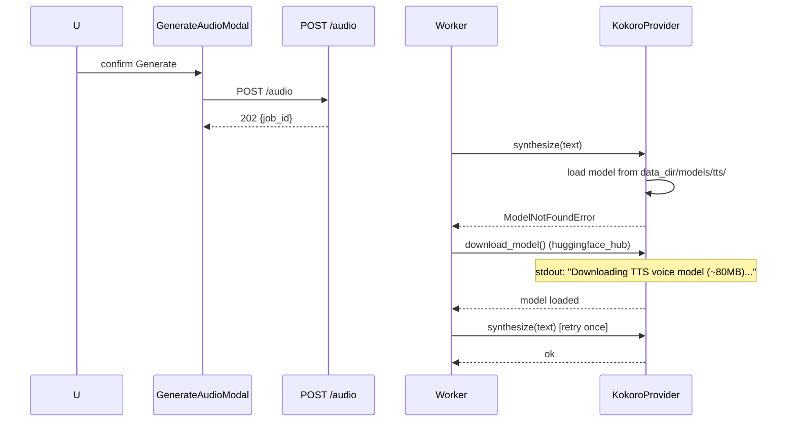

# Audiobook Mode — Spec

**Date:** 2026-05-02
**Status:** Draft
**Tier:** 3 — Feature
**Requirements:** `docs/requirements/2026-05-02-audiobook-mode-requirements.md`
**Wireframes:** `docs/wireframes/2026-05-02-audiobook-mode/`
**Prototype:** `docs/wireframes/2026-05-02-audiobook-mode/prototype/`

---

## 1. Problem Statement

Book Companion's library has reached the point where re-encountering past summaries is more valuable than generating new ones, but every artifact in the system is text-only. Audio is the largest unaddressed re-encounter channel. v1 ships a pluggable two-engine TTS subsystem (Web Speech for instant browser playback, Kokoro-82M as a local subprocess for MP3 output) with sentence-level highlight, resume-position persistence, ID3-tagged MP3 export, and CLI parity. **Primary success metric:** ≥5 books have generated audio and ≥3 listening sessions per week sustained at week 4.

---

## 2. Goals

| # | Goal | Success Metric |
|---|------|---------------|
| G1 | Press play on any section summary, book summary, or annotations playlist and hear it spoken | Click-to-audio latency ≤200ms on Web Speech; ≤2s on pre-generated MP3 |
| G2 | Pre-generate audio for a whole book in one explicit action with progress | Single click → SSE-tracked job → MP3s on disk per content unit |
| G3 | Download MP3s for use in any podcast / music app | Files have rich ID3v2.3 tags including embedded cover image |
| G4 | Resume from last sentence after tab close / browser restart | Position persists server-side; on return, "Resume from sentence X" affordance shows |
| G5 | CLI parity with web UI for generation | `bookcompanion listen --generate <book_id>` queues the same job |
| G6 | Engine choice is pluggable; adding a 3rd engine is a factory-line change | New engine = subclass `TTSProvider` + register in `create_tts_provider()`; no other code touched |
| G7 | Delete generated audio per book without losing summaries / annotations | "Delete audio for this book" CTA on Audio tab; type-to-confirm |
| G8 | Mandatory markdown→speech sanitizer prevents TTS reading literal markdown | Anti-pattern fixtures (footnote markers, code blocks, image refs, math, URLs, abbreviations) all produce speech-clean output |
| G9 | Spike-derived voice guidance surfaces in Settings UI | Settings TTS pane reads from `docs/spikes/2026-05-XX-tts-engine-spike.md` and shows ≥1 paragraph of user-facing comparison + a "Listen to comparison" sample button |
| G10 | User finishes the spike able to answer "is browser-native voice good enough" | `bookcompanion spike tts` emits a findings template; user fills it in |

---

## 3. Non-Goals

- **Cloud TTS APIs (OpenAI, ElevenLabs, Google) are out** — recurring spend conflicts with local-first identity.
- **TTS of full original `content_md` is out** — Book Companion's value is summaries, not narration.
- **Public-internet RSS podcast feed is out** — defer to v1.1 once listening behavior is sticky.
- **Word-level karaoke highlighting is out** — Web Speech `boundary` events are unreliable cross-browser; alignment for local engine adds heavy deps.
- **Voice cloning, multi-speaker, character voices are out** — don't serve the summary-listening job.
- **Background music / soundscapes are out** — UX complexity for a focused mode.
- **Engine plugin discovery / hot-swap UI is out** — installer adds engines via code, not UI.
- **True cross-device handoff (Audible-style) is out** — server stores per-browser positions; UI surfaces last-listened context but doesn't pretend to be device-aware.
- **Stream-on-demand from Kokoro is out** — 3–6s click-to-audio latency contradicts G1; eliminates the MP3 download surface anyway.

---

## 4. Decision Log

| # | Decision | Options Considered | Rationale |
|---|----------|-------------------|-----------|
| D1 | Two pluggable engines: Web Speech + Kokoro-82M (carried from req doc) | (a) Web Speech only; (b) Kokoro only; (c) Both; (d) Cloud | (c). Engines serve different journeys (instant browser stream vs. file output); cloud is cost-bound off the table. |
| D2 | Spike phase before /spec sets default-engine + Settings copy (carried) | (a) Spike before commit; (b) skip spike, ship both; (c) skip + ship one | (a). User asked for a POC. Both engines ship regardless; spike only sets defaults and informs documentation. |
| D3 | Sentence-level highlight only; no word-level (carried) | Word via `boundary` events / WhisperX alignment / sentence / none | Sentence. Cross-browser reliable; serves the "where am I" job adequately. |
| D4 | MP3 download only in v1; no RSS feed (carried) | MP3 / RSS via Funnel / RSS LAN-only | MP3. Validates listening before paying RSS+tunnel operational cost. |
| D5 | Manual generation trigger per book (carried) | Manual / auto-after-summarize / stream-on-demand / hybrid | Manual. User decides which books deserve TTS CPU/disk; mirrors summarize trigger. |
| D6 | Annotations as a separate playlist mode, not inline (carried) | Inline / separate / both / defer | Separate. Inline interrupts narrative; separate serves spaced-repetition cleaner. |
| D7 | TTS preferences in `~/.config/bookcompanion/settings.yaml`, not localStorage (carried) | localStorage / settings.yaml | settings.yaml. CLI must read engine + voice config to generate matching audio. |
| D8 | Media Session API integration in v1 (carried) | Defer / ship | Ship. "Walk away from the screen" job is core; ~50 LOC payoff. |
| D9 | Resume position is per-browser, server-side (carried) | localStorage / server global / server per-device | Per-browser server. Schema: `audio_position(content_type, content_id, browser_id, sentence_index, updated_at)`. |
| D10 | Mandatory shared markdown→speech sanitizer (carried) | Per-engine / shared | Shared. Sanitization needs are 100% identical regardless of engine. New module `app/services/tts/markdown_to_speech.py`. |
| D11 | MP3 files include rich ID3v2.3 tags (carried; pinned to v2.3 not v2.4 per industry research) | Bare / rich | Rich, v2.3. iOS Music / Apple Books / Pocket Casts have spotty v2.4 support in 2026 (mutagen recommendation). |
| D12 | MP3s stored on disk; replace-on-regen, delete-on-book-delete, explicit-user-delete (carried) | Disk / BLOB | Disk. ~2–5 MB per section bloats SQLite + slows backups. Mirrors fastembed model location. |
| D13 | Mid-listen summary regen does not interrupt audio (carried) | Modal / finish-section-then-offer / silently-switch (impossible) | Finish-section. Stale-audio window bounded to one section; banner offers regen at next pause / boundary. |
| D14 | Click-to-play in reader uses Web Speech if no pre-gen MP3 exists, regardless of default-engine setting (carried) | Silent Web Speech fallback / stream-on-demand / disable-unless-pregen | Web Speech fallback. Makes the engine split predictable per surface. |
| D15 | TTS engine = `kokoro-onnx` PyPI package with stock `onnxruntime` CPU wheels | `kokoro-onnx` / HF `kokoro` / Piper / Coqui | `kokoro-onnx`. macOS ARM64 wheels; quantized model ~80 MB; ~3–5x RTF on M-series CPU; Apache 2.0 weights, MIT package. Piper is documented as a fallback; ABC supports it. |
| D16 | MP3 encoding via `ffmpeg` subprocess; required at install when Kokoro is selected | ffmpeg subprocess / `lameenc` PyPI / `pyav` | ffmpeg. `bookcompanion init` and `serve` check `shutil.which('ffmpeg')` if Kokoro is the configured engine; clear "brew install ffmpeg" error if missing. Mirrors Calibre `ebook-convert` detection. Web Speech engine works without ffmpeg. |
| D17 | Sentence segmentation via `pysbd` | `pysbd` / `nltk.sent_tokenize` (needs data download) / `spaCy` (heavy) / regex | `pysbd`. No runtime data download; 97.92% Golden Rule Set accuracy; pure Python; handles abbreviations correctly. |
| D18 | Job queue: widen partial UNIQUE index to `(book_id, step)` so audio + summarize coexist per book | (a) widen `(book_id, step)`; (b) keep one-job-per-book | (a). Alembic migration drops `ix_processing_jobs_one_active_per_book` and creates `ix_processing_jobs_one_active_per_book_step` on `(book_id, step)`. The user's "pre-generate audio while I keep working" use case requires concurrency. |
| D19 | Worker queue stays single-RUNNING globally | (a) per-step; (b) status quo; (c) separate executor | Status quo. 20-min audio jobs queue behind summarize and vice versa; user accepts the tradeoff for v1. Revisit in v1.x. |
| D20 | MP3 routes have no auth, matching `routes/images.py` | (a) no auth; (b) HMAC token | No auth. Single-user local-first; LAN trust model. RSS work in v1.1 can introduce signed URLs without breaking v1. |
| D21 | `TTSProvider` is an independent narrower ABC, not a subclass of `LLMProvider` | (a) independent; (b) subclass | Independent. Different lifecycle (LLM = one-shot prompt; TTS = batch with potential mid-batch cancel). Keeps abstractions decoupled. |
| D22 | Annotations playlist resume position keyed via new `ContentType.ANNOTATIONS_PLAYLIST` enum value with `content_id = book_id` | (a) extend ContentType; (b) separate playlist position table | Extend. Single resume model serves all surfaces; one Alembic migration. |
| D23 | Fix `AnnotationRepository.list_by_book` in scope to include `book_summary`-typed annotations | (a) fix; (b) defer / scope-limit | Fix. Net ~30 LOC + tests. Otherwise the playlist silently drops book-summary annotations — a quiet gap that violates the named v1 goal. |
| D24 | Stale-audio detection by SHA-256 of post-sanitizer plaintext | (a) source hash; (b) updated_at; (c) source row id | Hash. Robust to formatting-only edits; `AudioFile.source_hash` updated at generation time, recomputed on page load for comparison. |
| D25 | Arrow-key keybindings: when `playerStore.isActive`, ArrowLeft / ArrowRight skip sentences; otherwise nav sections | (a) audio-active sentence; (b) `[`/`]` for sentence; (c) always sentence when player mounted | (a). Single source of truth (`isActive`); reverts cleanly when playbar dismissed. Documented in player chrome ("Arrow keys: sentence skip"). |
| D26 | Web Speech engine surfaces a "Limited controls" disclaimer on the player chrome | (a) disclaimer; (b) auto-pause on background; (c) document-only | (a). Sets expectations: iOS Safari stops `speechSynthesis` when screen locks AND Media Session won't show lock-screen Now Playing for non-`<audio>` sources. Tooltip explains the path to full controls (pre-generate). |
| D27 | Auto-advance to next section's summary defaults ON | (a) ON; (b) OFF | ON. Matches audiobook UX expectations; configurable in Settings TTS. Already declared in DESIGN.md `audio.autoAdvance: true`. |
| D28 | Annotations playlist content shape: just the highlighted span + attached note | (a) span+note; (b) sentence+span+note; (c) configurable | Span+note. Tight, predictable; user can jump to annotation card for visual context. |
| D29 | Library list does NOT expose a per-book Listen button in v1 | (a) Audio tab only; (b) Listen on library card | Audio tab only. Library card simplification rule from prototype-driven changes; "reader, not dashboard". |
| D30 | `bookcompanion spike tts` is a CLI command that emits a findings template | (a) CLI helper; (b) manual procedure | CLI helper. Generates `docs/spikes/2026-05-XX-tts-engine-spike.md` from a Jinja template, runs Kokoro on a chosen passage, plays the same passage in Web Speech via opening the browser; user fills adjectives. |
| D31 | Kokoro voice model download is implicit on first use, fastembed-style | (a) implicit + log line; (b) modal with progress bar | Implicit. Mirrors `init_cmd._download_embedding_model()`: console banner, lets `huggingface_hub` show its own progress; fail-soft. CLI parity via `bookcompanion init --tts-engine kokoro`. |
| D32 | Kokoro pre-warm on `bookcompanion serve` startup; failure logs and degrades | (a) log+degrade; (b) fail-loud; (c) opt-in | Log+degrade. Lifespan task tries to load model in a thread; on exception, logs warning, sets `app.state.tts_warm = False`. Server starts; first generation triggers lazy load. |
| D33 | Highlight implementation: pre-split sanitizer output into sentences client-side; one Web Speech utterance per sentence; advance highlight on utterance `end` event (not `boundary`) | (a) `boundary` events; (b) pre-split + per-sentence utterance | Pre-split. `boundary` events are unreliable cross-browser per industry research (Chrome rarely emits `type='sentence'`, Firefox sparse). Pre-split gives identical behavior across engines. For Kokoro MP3 mode, advance via `<audio>` `timeupdate` against pre-computed sentence offsets. |
| D34 | Media Session API enabled only when active source is `<audio>` (Kokoro MP3); not wired for Web Speech | — | Web Speech doesn't trigger lock-screen Now Playing on iOS; wiring it half-broken would mislead users. |

---

## 5. User Personas & Journeys

### 5.1 Personas (single user, three modes)

- **P1 — Power Reader (re-encounter):** owns a 47-book library; audio is the additive re-encounter channel during chores.
- **P2 — Setup-mode:** installing TTS for the first time; methodical or skeptical.
- **P3 — Library curator:** managing audio storage and freshness.

### 5.2 Journeys (canonical from req doc)

- **J1 — Listen to a section summary right now** (P1)
- **J2 — Pre-generate audio for a whole book** (P1+P3)
- **J3 — Listen to annotations from a book** (P1)
- **J4 — First-time setup → first audio generation → first listen** (P2)
- **JCLI — CLI generation** (`bookcompanion listen --generate <id>`)

Detailed flows are in the requirements doc §User Journeys; the spec inherits them. Sequence diagrams in §6.2 cover the complex multi-component interactions.

---

## 6. System Design

### 6.1 Architecture Overview

```
┌──────────────────────────────────────────────────────────────────┐
│  Vue 3 SPA                                                       │
│  ┌────────────────┐  ┌────────────────┐  ┌──────────────────┐   │
│  │ ReaderHeader   │  │ Playbar        │  │ Audio tab        │   │
│  │ + TtsPlayBtn   │  │ + EngineChip   │  │ + GenerateModal  │   │
│  └───────┬────────┘  └───────┬────────┘  └────────┬─────────┘   │
│          │                   │                    │             │
│          ▼                   ▼                    ▼             │
│  ┌─────────────────────────────────────────────────────────┐    │
│  │  ttsPlayerStore (Pinia)  +  audioJobStore  +  SSE bus   │    │
│  └───────────────────────────┬─────────────────────────────┘    │
└──────────────────────────────┼──────────────────────────────────┘
                               │ /api/v1/...
                               ▼
┌──────────────────────────────────────────────────────────────────┐
│  FastAPI                                                         │
│  routes/audio.py  routes/processing.py (extended)  sse.py        │
└──────────────────────────────┬──────────────────────────────────┘
                               ▼
┌──────────────────────────────────────────────────────────────────┐
│  Service layer                                                   │
│  ┌──────────────────────┐   ┌──────────────────────┐             │
│  │ AudioGenService      │──▶│ TTSProvider (ABC)    │             │
│  │ (queues + dispatches)│   │  ├ WebSpeechProvider │ (no-op svr) │
│  └──────────┬───────────┘   │  └ KokoroProvider    │             │
│             │               └──────────┬───────────┘             │
│             ▼                          ▼                         │
│  ┌──────────────────────┐   ┌──────────────────────┐             │
│  │ MarkdownToSpeech     │   │ subprocess: kokoro-  │             │
│  │ (sanitizer + pysbd)  │   │ onnx → numpy float32 │             │
│  └──────────────────────┘   │ → ffmpeg → MP3       │             │
│                             └──────────┬───────────┘             │
│                                        ▼                         │
│  ┌──────────────────────┐   ┌──────────────────────┐             │
│  │ ID3Tagger (mutagen)  │   │ AudioFileRepository  │             │
│  └──────────┬───────────┘   └──────────┬───────────┘             │
│             ▼                          │                         │
│   <data_dir>/audio/<book_id>/...mp3    ▼                         │
│                                ┌─────────────────────┐           │
│                                │ SQLite: AudioFile,  │           │
│                                │ AudioPosition       │           │
│                                └─────────────────────┘           │
└──────────────────────────────────────────────────────────────────┘
```

### 6.2 Sequence Diagrams

**6.2.1 — J1: Click play in reader (no pre-gen MP3 → Web Speech fallback per D14)**



**6.2.2 — J2: Pre-generate audio for a whole book (Kokoro engine)**



**6.2.3 — J1 happy path: section with pre-gen MP3 (Kokoro)**

```mermaid
sequenceDiagram
    participant U as User
    participant FE as ReaderHeader
    participant PS as ttsPlayerStore
    participant API
    participant AUD as <audio> element
    participant MS as Media Session

    U->>FE: click TtsPlayButton
    FE->>PS: open(...)
    PS->>API: GET /audio?book_id&content_type&content_id
    API-->>PS: {pregenerated: true, mp3_url, sentence_offsets[], duration_s, voice, source_hash}
    PS->>API: GET /summaries → recompute current source_hash, compare
    PS->>FE: if stale: show "Source updated since audio generated. Regenerate?" banner; still allow play
    FE->>AUD: src = mp3_url; play()
    FE->>MS: set metadata (title, artist, album, artwork), action handlers
    AUD->>FE: timeupdate (currentTime)
    FE->>FE: advance highlight when currentTime crosses next sentence_offset
    FE->>API: PUT /audio_position every sentence boundary
```

**6.2.4 — Error: Kokoro model not yet downloaded (J4 first-time)**



---

## 7. Functional Requirements

### 7.1 TTS provider abstraction

| ID | Requirement |
|----|-------------|
| FR-01 | New ABC `app/services/tts/provider.py:TTSProvider` with abstract methods: `synthesize(text: str, voice: str, speed: float) -> SynthesisResult` (returns `bytes`, `sample_rate`, `sentence_offsets: list[float]`), `list_voices() -> list[VoiceInfo]`, `name: str` (class attribute). Optional `terminate()` for cancellation. |
| FR-02 | Web Speech has NO server-side provider stub (per FR-04 / D-rev1). Engine routing in the frontend treats `engine === "web-speech"` as a pure client-side path that uses the browser's `speechSynthesis` API directly. |
| FR-03 | New `app/services/tts/kokoro_provider.py:KokoroProvider` implements `synthesize()` as a **per-sentence loop**: iterate the sanitizer's segmented sentences (FR-10), invoke `kokoro_onnx.Kokoro.create(sentence, voice, speed)` once per sentence to obtain a float32 PCM buffer + per-sentence duration, accumulate cumulative second-offsets into `sentence_offsets[]`, concatenate buffers (numpy `concatenate`), then encode the joined buffer to MP3 in a single `ffmpeg` subprocess (D16) reading raw PCM from stdin. Returns `SynthesisResult(bytes, sample_rate=24000, sentence_offsets)`. Per-sentence iteration adds ~10–20% overhead vs. one big call but yields exact offsets. Supports `terminate()` via subprocess kill. **ffmpeg failure handling:** non-zero exit code OR broken-pipe (`BrokenPipeError`) on the ffmpeg stdin pipe raises `FfmpegEncodeError(stderr_tail: str)`. The provider captures the last 2 KB of ffmpeg stderr into the exception. Worker treats this as a **per-unit failure only** (not whole-job): emits `section_audio_failed{reason: "encode_failed", section_id, kind, ref}` and continues to the next unit. Any partial `*.tmp` files written by FR-22 are cleaned up in the worker's `try/finally`. Job is marked FAILED only if ALL units fail (existing pattern from `summarize_book` per CLAUDE.md gotcha #5). The last 2 KB of stderr from the most recent ffmpeg failure is appended to `ProcessingJob.error_message` for debugging. |
| FR-04 | New `app/services/tts/__init__.py` exports `detect_tts_provider() -> str | None` returning `"kokoro"` (if `kokoro-onnx` importable AND `shutil.which("ffmpeg")`) or `None`. Web Speech is browser-only and is NOT enumerated server-side. Frontend independently detects Web Speech via `speechSynthesis.getVoices()`. The Settings UI merges both signals into the engine picker. Also exports `create_tts_provider(name: str | None, settings) -> TTSProvider | None`. Mirrors `services/summarizer/__init__.py:8-27`. |
| FR-05 | Kokoro model files live at `<data_dir>/models/tts/{kokoro-v1.0.onnx, voices-v1.0.bin}`. Download is implicit on first `synthesize()` call (D31); `huggingface_hub.hf_hub_download(...)` with `cache_dir=<data_dir>/models/tts`. Console banner: `"Downloading TTS voice model (first time only, ~80MB)..."`. **Download-failure handling:** `KokoroProvider.synthesize()` catches `HfHubHTTPError`, `ConnectionError`, and any `OSError` from `hf_hub_download`, re-raises as `KokoroModelDownloadError(retry_after_seconds: int | None)`. Worker maps this to `section_audio_failed{reason: "model_download_failed", retry_after_seconds}` and the WHOLE job is marked FAILED with `error_message="model_download_failed"` (not per-unit — all subsequent units would fail the same way). `POST /audio/sample` returns `503` with `Retry-After` header populated. Settings TTS pane Kokoro warm-status indicator (FR-47) shows a third state `"download_failed"` with a Retry button that re-triggers `hf_hub_download`. |
| FR-06 | `bookcompanion init --tts-engine kokoro` triggers eager model download. Without the flag, init no-ops on TTS. |
| FR-07 | Pre-warm: `app/api/main.py` lifespan adds an async task that, when `settings.tts.engine == "kokoro"`, attempts to load the model in a worker thread. On exception, logs warning + sets `app.state.tts_warm = False`. Server start does NOT block on warm. (D32) |

### 7.2 Markdown→speech sanitizer

| ID | Requirement |
|----|-------------|
| FR-08 | New `app/services/tts/markdown_to_speech.py` exports `sanitize(md: str) -> SanitizedText` returning `{text: str, sentence_offsets: list[int]}` (char offsets per sentence start). |
| FR-09 | Sanitizer parses markdown via `markdown_it` (already a dep), walks AST, applies these passes (mirrors anti-pattern table from req doc): |
| FR-09a | Strip code blocks (`fenced_code`, `code_block`, inline `code`): replace fenced with `"code block, N lines, skipped."`; strip inline. |
| FR-09b | Strip footnote markers: `[N]` and `^N` patterns via regex `r'\[\d+\]|\^\d+'`. |
| FR-09c | Replace markdown images `` with `"figure: " + alt` if `alt` non-empty, else omit. Same for HTML `` tags via the `_HTML_IMG_RE` pattern from `export_service.py:52-71`. |
| FR-09d | Replace markdown links `[text](url)` with `text` only; bare URLs (regex `r'https?://\S+'`) omitted. |
| FR-09e | Detect and omit math: `$...$`, `$$...$$`, `\[...\]`, `\(...\)` → `"equation, omitted"`. |
| FR-09f | Expand abbreviations from a static dict: `e.g.→for example`, `i.e.→that is`, `etc.→et cetera`, `vs.→versus`, `St.→Saint`, `Mr.→Mister`, `Dr.→Doctor`, `Prof.→Professor`, `Fig.→Figure`. Word-boundary regex (case-sensitive). |
| FR-10 | Sentence-segment the sanitized text via `pysbd.Segmenter(language="en", clean=False).segment(text)` (D17). Compute char-offsets per sentence start as the second return value. **Empty-input handling:** if the sanitized text has 0 non-whitespace chars OR pysbd returns 0 sentences (e.g., section was entirely code blocks / images / math), the sanitizer raises `EmptySanitizedTextError`. The worker (FR-19) maps this to `section_audio_failed{reason: "empty_after_sanitize"}` and **skips this unit only** (does NOT fail the whole job). The Audio tab AudioFiles list surfaces an "(no narratable content)" placeholder row in lieu of Play/Download buttons for that unit. |
| FR-11 | Sanitizer has no engine-specific code paths; output feeds both `KokoroProvider.synthesize()` and the frontend Web Speech utterance loop (FR-30). |
| FR-12 | Source-hash for stale detection: `source_hash = sha256(sanitized.text).hexdigest()`. Stored on `AudioFile` (D24). |
| FR-12a | **Sanitizer version invariant:** declare a module-level constant `SANITIZER_VERSION = "1.0"` in `app/services/tts/markdown_to_speech.py`; bump on any change to the sanitizer's anti-pattern dict, regex set, or pysbd config. AudioFile gains a `sanitizer_version TEXT NOT NULL DEFAULT '1.0'` column (schema in §10.1). Lookup `stale` flag (§9.6) computes as `stale = (source_hash != stored_source_hash) OR (SANITIZER_VERSION != stored_sanitizer_version) OR (current_sentence_count != stored_sentence_count)`. The stale-source banner (FR-62) reads from a new field `stale_reason: "source_changed" \| "sanitizer_upgraded" \| "segmenter_drift"` and uses distinct copy per reason: source_changed → "Source updated since audio generated. Regenerate?"; sanitizer_upgraded → "Audio engine updated — narration may sound different in updated portions."; segmenter_drift → "Sentence boundaries shifted — highlights may not align with audio." |
| FR-12b | **pysbd version pinning + regression guard:** `pysbd` is pinned to an exact version in `pyproject.toml` (e.g., `pysbd==0.3.4`). New regression test `tests/unit/services/tts/test_pysbd_segmentation_stable.py` runs pysbd against a fixed 20-sentence corpus (committed at `tests/fixtures/tts/segmentation_corpus.txt`) and asserts the segmentation matches a checked-in expected JSON. CI failure on dep bump forces an explicit migration path (regenerate stale audio for affected books). |

### 7.3 Sentence-level highlight (frontend rendering)

| ID | Requirement |
|----|-------------|
| FR-13 | `MarkdownRenderer.vue` gains a `data-sentence-index="N"` attribute on every `<span class="bc-sentence">` produced from a sanitized sentence. The wrap pass uses the `sentence_offsets` array returned by the API (or computed client-side by a tiny `pysbd`-equivalent JS — see FR-30). |
| FR-14 | Sentence wrappers MUST be inserted per-block-element (per learnings: a single wrapper across `<p>...</p><p>...</p>` produces invalid HTML). Each block-level child gets its own per-sentence span; the data attribute carries the global sentence index. |
| FR-15 | When `ttsPlayerStore.sentenceIndex` changes, a CSS class `bc-sentence-active` is applied to the matching span. Auto-scroll: `el.scrollIntoView({block: "center", behavior: "smooth"})` with debouncing (300ms). |

### 7.4 Background job & SSE

| ID | Requirement |
|----|-------------|
| FR-16 | `ProcessingStep` enum gains `AUDIO = "audio"`. Alembic migration adds the value (SQLite stores enums as strings; just an `op.execute` is sufficient). |
| FR-17 | `ix_processing_jobs_one_active_per_book` index is dropped and replaced with `ix_processing_jobs_one_active_per_book_step` on `(book_id, step)` partial UNIQUE `WHERE status IN ('PENDING','RUNNING')`. (D18) Alembic migration with `render_as_batch=True`. |
| FR-18 | `POST /api/v1/books/{id}/audio` (NEW) queues a `step=AUDIO` job. Request: `{scope: "book"|"sections"|"annotations"|"all", section_ids?: int[], voice: str, engine: "kokoro"}`. Scope semantics: `book` = the book-level summary only; `sections` = the listed `section_ids`; `annotations` = the annotations playlist; `all` = book summary + every section summary + annotations playlist (matches the Generate-Audio modal's three-checkbox default-on shape). Response: 202 `{job_id, scope, total_units}`. **409 with self-healing payload** if a `step=AUDIO` job is already PENDING/RUNNING for this book: `{error: "audio_job_in_progress", existing_job_id: <int>, scope, started_at}`. The Generate-Audio modal MUST handle 409 by transparently joining the in-flight job's progress card (no error toast); double-submit and post-timeout retries both land the user on the job they intended to start. |
| FR-19 | `JobQueueWorker._process_job()` dispatches by `step`: existing branch for SUMMARIZE; new branch for AUDIO that calls `AudioGenService.run(job)`. Worker still promotes one job globally (D19). |
| FR-20 | New SSE events for audio jobs (extend the literal-union in `useBufferedJobStream.ts:29-38`): `section_audio_started {section_id, kind, index, total}`, `section_audio_completed {section_id, kind, index, total, duration_seconds, file_size_bytes}`, `section_audio_failed {section_id, kind, index, total, reason}`. Existing `processing_started` / `processing_completed` / `processing_failed` reused. |
| FR-21 | Per-content-unit progress also written to `ProcessingJob.progress` JSON dict: `{completed, total, current_kind, current_ref, last_event_at}` so reconnecting clients see latest state. |
| FR-21a | **SSE reconnect-recovery contract** (closes the subscribe-then-fetch / fetch-then-subscribe race per pipeline learnings): on every SSE connect AND reconnect, the frontend MUST execute the 5-step sequence — (1) subscribe to `/api/v1/jobs/stream`, (2) buffer incoming events in memory, (3) fetch `GET /api/v1/jobs/{id}` to read latest `ProcessingJob.progress` snapshot (the truth), (4) reconcile UI state from that snapshot then drain the buffered events filtering by `last_event_at > snapshot.last_event_at` to avoid double-applying, (5) transition to live consumption. Backend stamps every SSE event with monotonic `last_event_at` (already done by `EventBus.publish` per recon B.1); de-dup key is `(job_id, last_event_at)`. Apply identically on initial connect and any reconnect. |
| FR-21b | **Worker-restart orphan-job recovery for `step=AUDIO`:** lifespan task on `bookcompanion serve` startup scans `processing_jobs WHERE status='RUNNING' AND step='audio'` and for each row checks the recorded `pid`: if NULL or `os.kill(pid, 0)` fails (process gone), mark FAILED with `error_message="server_restart"`. Partial `AudioFile` rows persist (atomic per-unit per FR-22) — user sees them in the Audio tab. Audio tab surfaces the failed job's partial state: `"Job interrupted by restart — X of Y completed. [Resume] [Discard]"`. Resume queues a new job scoped to remaining units. Inherits the existing summarization orphan-detection pattern. |

### 7.5 AudioFile lifecycle

| ID | Requirement |
|----|-------------|
| FR-22 | New `AudioFile` table (schema in §10.1). One row per `(book_id, content_type, content_id, voice)`. Atomic regeneration: write to `*.tmp`, fsync, rename, then UPSERT row by `(book_id, content_type, content_id, voice)` UNIQUE. Old MP3 file is unlinked AFTER successful UPSERT to prevent orphan-on-crash. |
| FR-23 | Files stored at `<data_dir>/audio/<book_id>/{section_summary_<section_id>|book_summary|annotations_playlist}__<voice>.mp3`. |
| FR-24 | `DELETE /api/v1/books/{id}/audio` (NEW): delete all `AudioFile` rows + unlink files for the book. Type-to-confirm in UI per `x-interaction.destructiveActions`. **Delete-vs-in-flight-job:** if a `step=AUDIO` job is currently PENDING/RUNNING for this book, the route first calls the existing job-cancel pathway (`POST /api/v1/jobs/{id}/cancel`), awaits the worker termination ack (with a 5s timeout, then SIGKILL), then proceeds to unlink + delete transactionally. Returns 200 only after both the cancel and the cleanup complete. |
| FR-25 | `DELETE /api/v1/books/{id}/audio/{content_type}/{content_id}` (NEW): per-row delete (per MSF N1). UI: trash icon on Audio tab + Sections tab rows. **Returns 409** if the named unit is currently being written by a RUNNING audio job (`ProcessingJob.progress.current_kind == content_type AND current_ref == content_id`); response body suggests "Wait or cancel job {id}". |
| FR-25a | **Cancel-audio-job UI:** Audio tab `generating` state and Sections tab generating-row both expose a `Cancel` button calling existing `POST /api/v1/jobs/{id}/cancel`. Worker handles cancel by calling `TTSProvider.terminate()` (kills Kokoro subprocess + ffmpeg subprocess), aborts the per-sentence loop, lets the per-unit `try/finally` clean partial `*.tmp` files (FR-22). Already-completed `AudioFile` rows persist atomically. SSE emits `processing_failed{reason: "cancelled"}` (existing event). |
| FR-26 | Book-delete cascade: existing book-deletion hook unlinks `<data_dir>/audio/<book_id>/` recursively and deletes AudioFile rows (FK ON DELETE CASCADE). |
| FR-26b | **`audio_positions` cleanup on book delete** (no FK enforced — SQLite poly-FK limitation): the book-delete service runs `DELETE FROM audio_positions WHERE (content_type='annotations_playlist' AND content_id=:book_id) OR (content_type IN ('section_summary','section_content') AND content_id IN (SELECT id FROM book_sections WHERE book_id=:book_id)) OR (content_type='book_summary' AND content_id IN (SELECT id FROM summaries WHERE book_id=:book_id))` inside the same transaction as the AudioFile cascade. A weekly maintenance job (`bookcompanion maintenance audio-positions-sweep`) deletes any audio_positions rows whose content_id no longer resolves, defending against missed cleanups from interrupted deletes. |
| FR-26a | **Re-import audio reconciliation:** the existing `_re_import_book` flow (CLAUDE.md gotcha #13 preserves section IDs by order_index) runs an audio cleanup pass at the end: (a) for every AudioFile with `content_type IN ('section_summary','section_content')`, verify `content_id` still references an existing BookSection — if not, delete the row + unlink the MP3 file; (b) for every surviving AudioFile, recompute `source_hash` against the freshly-sanitized current source text; if differs, leave the row in place but the next lookup returns `stale=true` (banner appears). Re-import never silently re-uses old MP3s for changed content; logs `audio_reconciled {book_id, deleted_count, marked_stale_count}`. |
| FR-27 | ID3 tagging via `mutagen` (D11), v2.3, embedded JPEG cover from `Book.cover_image`, applied immediately after MP3 encoding. Helper at `app/services/tts/id3_tagger.py`. |

### 7.6 Audio playback (browser)

| ID | Requirement |
|----|-------------|
| FR-28 | New `frontend/src/stores/ttsPlayer.ts` Pinia store: `{isActive, contentType, contentId, sentenceIndex, totalSentences, status: 'idle'|'loading'|'playing'|'paused'|'error', engine, voice, mp3Url|null, sentenceOffsets[], stale: bool, mediaSessionEnabled: bool, errorKind: 'mp3_fetch_failed'|'utterance_failed'|'sample_failed'|'engine_unavailable'|null}`. |
| FR-28a | **Player error handling:** any of (a) `<audio>` `error` event during MP3 load/playback, (b) `SpeechSynthesisUtterance` `error` event, (c) `POST /audio/sample` non-2xx response, (d) Web Speech `getVoices()` returning empty after `voiceschanged` (E2/E11 path), transitions the store to `status='error'` with the corresponding `errorKind`. Playbar renders an inline error banner (`bc-banner--warning` per DESIGN.md) with copy mapped from `errorKind` and a `Retry` button that re-invokes the engine from the current `sentenceIndex`. Auto-advance (FR-34) is paused during error state until user retries or closes the player. |
| FR-29 | New component `frontend/src/components/audio/Playbar.vue` (sticky bottom on both desktop and mobile, per DESIGN.md `bc-playbar` and wireframes 01/02/06; resolves req-doc OQ-4). Controls: play/pause, prev/next sentence, speed selector (0.75/1/1.25/1.5/2x), close, EngineChip, sentence index ("17 of 47"), elapsed/total ("2:14 / 6:08") (per MSF N3). Mobile uses the same shape with mobile-tuned padding + larger tap targets per DESIGN.md min-height rules. |
| FR-30 | New composable `frontend/src/composables/useTtsEngine.ts`: switches between `WebSpeechEngine` and `Mp3Engine`. The frontend NEVER sanitizes or segments text; it consumes `sanitized_text` and `sentence_offsets_chars` (Web Speech) or `sentence_offsets` (Kokoro MP3) returned by `GET /audio/lookup` (§9.6). WebSpeechEngine slices `sanitized_text` by `sentence_offsets_chars` into a list of sentences, iterates `SpeechSynthesisUtterance` per sentence, advances highlight + position on the utterance `end` event (D33). Mp3Engine uses `<audio>` + `timeupdate` against `sentence_offsets` (seconds). |
| FR-31 | Web Speech engine: when `getVoices()` returns 0 voices after `voiceschanged` fires, emit `no-voices` state; player chrome shows error journey row 2 banner with one-click switch to Kokoro (if available). |
| FR-32 | The Playbar EngineChip ALWAYS shows the **active** engine (what's currently producing audio), not the user's default-engine setting. When `active !== default` (e.g. Kokoro is the default but Web Speech is fallback-active per D14), the chip carries an info-tooltip: `"Default is {default}; using {active} for this section because {reason}"` where reason ∈ `{ "no_pregen", "model_not_downloaded", "model_loading", "engine_unavailable" }`. When `engine === "web-speech"`, the chip ALSO shows a "Limited controls" pill (D26) — tooltip: "Lock-screen controls and offline playback require pre-generating audio. Generate from the Audio tab." Engine + reason copy lives in `frontend/src/composables/useEngineCopy.ts`. |
| FR-33 | Media Session integration is enabled ONLY when `engine === "kokoro"` (Mp3Engine path). Sets `metadata` (title, artist=Book.author, album=Book.title, artwork from `cover_image`), `playbackState`, action handlers `play|pause|seekto|nexttrack|previoustrack`, calls `setPositionState({duration, position, playbackRate})` per `timeupdate`. Implements `chapterInfo` for book-summary playback enumerating sections. (D34) |
| FR-34 | Auto-advance default ON (D27). When current section ends, if `settings.tts.auto_advance && next_section.has_pre_gen_audio`, load next; if next section has no MP3 and engine is Kokoro, fall back to Web Speech for that section per D14. |
| FR-35 | Single playing source per browser: opening playback in tab B sends a `BroadcastChannel` message that pauses tab A. |
| FR-36 | Keybindings (D25): when `playerStore.isActive`, `ArrowLeft`/`ArrowRight` skip sentences (intercept before `ReadingArea.vue:21-23` section nav). When player is closed, arrows revert to section nav. `Space` toggles play/pause. `?` opens shortcuts modal. |

### 7.7 Resume position

| ID | Requirement |
|----|-------------|
| FR-37 | New `audio_position` table per D9. Schema in §10.1. Browser identity: a UUID generated client-side, persisted in localStorage as `bc.browser_id`, sent on every PUT. |
| FR-38 | `PUT /api/v1/audio_position` (NEW): `{content_type, content_id, browser_id, sentence_index}`. Server `INSERT OR REPLACE` (UPSERT on PK = `(content_type, content_id, browser_id)`). Updates `updated_at`. |
| FR-39 | `GET /api/v1/audio_position?content_type&content_id&browser_id` returns the row or 404. ALSO returns `{has_other_browser: bool, other_browser_updated_at: ts}` so UI can show "last listened on a different browser 2 hours ago" (per req-doc Journey 1 step 7). |
| FR-40 | Resume affordance shows on default load when `audio_status === 'complete' && audio_position exists` (per prototype-finding #3, MSF). Player shows: "Resume from sentence 16 of 47" / "Start from beginning". |
| FR-41 | Position is written on EVERY sentence boundary; debounced server-side (500ms) to avoid write floods. |

### 7.8 Settings

| ID | Requirement |
|----|-------------|
| FR-42 | New `TTSConfig(BaseModel)` in `app/config.py`: `engine: Literal["web-speech","kokoro"] = "web-speech"`, `voice: str = ""` (empty → frontend picks default), `default_speed: float = 1.0`, `auto_advance: bool = True`, `prewarm_on_startup: bool = True`, `annotation_context: Literal["span"] = "span"` (placeholder for OQ-7 future). Mounted on `Settings.tts`. |
| FR-43 | `GET/PUT /api/v1/settings/tts` (NEW; or extends existing `/api/v1/settings` PATCH). Settings UI (file `07_settings-tts_*.html`) reads via `SettingsService`, writes via validated `update_settings()`. **Voice validation at write time:** PUT validates `voice` against the active engine's available voice list (Kokoro: read voices from `voices-v1.0.bin` index; Web Speech: client-side enumeration before submit). Unknown voice → 422 with `{error: "unknown_voice", available: [...]}`. Prevents footgun where a typo in `settings.yaml` silently fails at first synthesize. |
| FR-44 | Settings TTS pane MUST surface a **2-3 sentence spike-derived comparison** read from the latest matching `docs/spikes/*-tts-engine-spike.md` file (newest by mtime; G9 / req-doc M1). New endpoint `GET /api/v1/spikes/tts` globs `docs/spikes/*tts-engine-spike.md`, picks the newest, returns `{available: true, path, content_md}`; if no match, returns `{available: false}` and the UI shows a generic "Spike not yet run; run `bookcompanion spike tts`" message. |
| FR-45 | Settings TTS pane has voice-sample buttons for BOTH Web Speech AND Kokoro voice rows (S1). The Web Speech sample uses `speechSynthesis.speak()` directly; Kokoro sample hits new `POST /api/v1/audio/sample` endpoint (FR-46). |
| FR-46 | `POST /api/v1/audio/sample` (NEW): `{voice: str, text: str}` → 200 `audio/mpeg` bytes. Uses `KokoroProvider.synthesize()` on a fixed sample passage if `text` is omitted. Rate-limited to 5 reqs/min/IP. |
| FR-47 | Settings TTS pane shows Kokoro warm status: "Kokoro: warm" (green dot) | "cold" (grey dot) | "model not downloaded" (warning + Download button). Polled from `GET /api/v1/settings/tts/status`. (S3 / FR-07) |

### 7.9 CLI

| ID | Requirement |
|----|-------------|
| FR-48 | New CLI command `bookcompanion listen <book_id>` (registered in `cli/main.py`). Without flags: plays book summary out of the local audio device using `KokoroProvider` + a `sounddevice` or `simpleaudio` backend; keybindings space=pause, n=next, p=prev sentence. |
| FR-49 | `bookcompanion listen --generate <book_id> [--scope sections|book|annotations] [--voice <name>]`: queues the same `step=AUDIO` job as the UI button (FR-18). Streams the same SSE events with Rich progress bar. On completion, prints per-MP3 paths + total disk usage. |
| FR-50 | `bookcompanion spike tts [--book-id N --section-id M]` (D30): generates the named passage with `KokoroProvider`, writes MP3 to `docs/spikes/clip-kokoro.mp3`; opens Web Speech in the user's default browser via a one-page localhost helper that plays the same passage; emits `docs/spikes/<YYYY-MM-DD>-tts-engine-spike.md` (today's date in ISO format) from a Jinja template with placeholders for the user's adjectives + recommended default. The mtime-newest match is what `GET /api/v1/spikes/tts` (FR-44 / §9.9) returns. |
| FR-51 | `bookcompanion init` checks `shutil.which("ffmpeg")` if `settings.tts.engine == "kokoro"`. Missing ffmpeg → clear error: `"ffmpeg required for Kokoro engine. Install: brew install ffmpeg (macOS) / apt-get install ffmpeg (Linux)."`. Web Speech engine works without ffmpeg. |

### 7.10 Annotations playlist

| ID | Requirement |
|----|-------------|
| FR-52 | `ContentType` enum gains `ANNOTATIONS_PLAYLIST = "annotations_playlist"`. (D22) |
| FR-53 | `AnnotationRepository.list_by_book(book_id)` is fixed to UNION across `BookSection`-joined annotations AND book-summary annotations (`content_type = book_summary AND content_id IN (SELECT id FROM summaries WHERE book_id = ?)`). Section annotations ordered by `(section.order_index, annotation.text_offset)`; book-summary annotations appended after. (D23) |
| FR-54 | Annotations playlist content per node: read `selected_text`, half-second pause, then `note` if present (D28). For Kokoro: synthesize each highlight + note as separate sentences; concatenate with a 0.5s silence segment (generated via `numpy.zeros(int(0.5*24000))`) between highlight and note. Visual cue (♪ pause divider, MSF N4) rendered in the annotations card. |
| FR-55 | Annotations playlist supports runtime Web Speech streaming when no pre-gen MP3 exists, mirroring D14 (per OQ-10 confirmed). |
| FR-56 | Resume position keyed `(content_type=ANNOTATIONS_PLAYLIST, content_id=book_id, browser_id)`; sentence_index counts across all highlights+notes in playlist order. |

### 7.11 UI surfaces

| ID | Requirement |
|----|-------------|
| FR-57 | `BookOverviewView.vue` (NOT BookDetailView) tab strip extended from 3 to 5 tabs: `Overview | Summary | Sections | Audio | Annotations`. Wireframes 03 (Audio) + 06 (Annotations) define the tab content. |
| FR-58 | Audio tab states: `no-audio` (single CTA "Generate audio for this book"), `partial`, `full`, `generating` (SSE-driven progress). Per-row delete (trash icon) on each AudioFile row. (FR-25, MSF N1) |
| FR-59 | Sections tab gains audio-status pill ("none" | "ready" | "stale" | "generating") + per-row play / regenerate / delete actions inline (per req-doc prototype changes; matches wireframe 08). |
| FR-60 | Generate audio modal (wireframe 04): checkboxes default to summary=ON, book summary=ON, **annotations=ON** (S2 from MSF, recommended pill); voice picker with sample button; cost estimate inline ("~12 min · ~140 MB for 47 sections", per req-doc F1) computed via shared helper `estimateGenerateCost(sections, hasBook, hasAnnotations)` returning `{minutes, megabytes}` based on the formula `minutes = total_units × 0.20` (assumes ~12s per section average at ~5x RTF on M-series CPU) and `megabytes = total_units × 3.0` (96kbps mono × ~250s avg). Constants live in `frontend/src/composables/useGenerateCost.ts` for tuning. Filter: voices visible per active engine; if Web Speech, show inline note "Web Speech can't be pre-generated — sample voices in Settings" (prototype-finding #D9). |
| FR-60a | Annotations tab "Play as audio" CTA shows inline duration estimate (req-doc F2): `"~N min · M highlights"` where `N = ceil((M * 30s + notes_count * 30s) / 60)`. Helper `estimatePlaylistMinutes(highlights, notes)` shared with prototype-finding M10 to avoid divergence. |
| FR-60b | Annotations playlist engine chip carries an info-tooltip when `engine === "web-speech"` (req-doc F4): "This playlist is using browser TTS. Pre-generate from the Audio tab for offline + lock-screen support." Reuses the FR-32 tooltip mechanism. |
| FR-61 | TtsPlayButton component slots into `ReaderHeader.vue:60` (`<slot name="actions">`). Disabled with tooltip "Audio is only generated for summaries in v1. Generate this section's summary first." when section has no summary. |
| FR-62 | Stale-source banner: when current page's source_hash differs from any related AudioFile.source_hash, show inline banner "Source updated since audio generated. Regenerate?" with one-click action. Stale audio remains playable (req-doc Empty States row 4). |
| FR-63 | Mid-listen summary regen banner (D13): if backend SSE indicates a summary regen completed for currently-playing content, banner appears at next section boundary or pause; player completes current section on stale audio without interruption. |
| FR-64 | Status pills + info banners use indigo or neutral grey only (DESIGN.md anti-pattern; prototype-finding #4). NO secondary blue palette. |
| FR-65 | Library list page UNCHANGED — no audio coverage indicator, no Listen button, no "Has audio" filter (D29; req-doc S4 rejected). |

### 7.12 Bulk operations

| ID | Requirement |
|----|-------------|
| FR-66 | Library-level "Regenerate stale audio" action (MSF N2): when `≥2 books` have stale audio, render an indigo info banner inline at the top of the library list (above the book grid), copy: `"3 books have stale audio."` + actions `[Regenerate all]` `[Dismiss]`. On click, queues one `step=AUDIO` job per stale book in sequence. Banner re-appears on next visit until all stale audio resolved or until the user clicks Dismiss (24-hour cookie). |

---

## 8. Non-Functional Requirements

| ID | Category | Requirement |
|----|----------|-------------|
| NFR-01 | Performance — Web Speech click-to-audio | ≤200ms from click to first sentence speaking on Chrome/Safari macOS |
| NFR-02 | Performance — Kokoro click-to-audio (pre-gen) | ≤2s from click to first audible playback |
| NFR-03 | Performance — Kokoro generation | ≥3x realtime on M-series CPU; quantized model (FR-05) |
| NFR-04 | Performance — sanitizer | ≤50ms for 5,000-char input |
| NFR-05 | Reliability — sanitizer | 100% pass on anti-pattern fixture set (footnotes, code, math, URLs, abbreviations) — see §14.1 |
| NFR-06 | Disk — MP3 size | ≤2MB per minute audio at 96kbps mono |
| NFR-07 | A11y — WCAG 2.1 AA | All player controls have visible focus + accurate aria-labels; every aria-labeled control has a real handler OR `aria-disabled="true"` (prototype-finding #1) |
| NFR-08 | A11y — keyboard | Full operate-by-keyboard for player (Space, arrows, Esc, Tab) |
| NFR-09 | Cross-browser — playback | Chrome/Safari macOS desktop + Safari iOS supported (both engines for tab-active playback; lock-screen requires Kokoro+`<audio>` per D34/FR-33). Firefox desktop is **best-effort** — Web Speech voices may not be available out of the box, Kokoro `<audio>` MP3 path works; not a blocking compat target for v1. |
| NFR-10 | Privacy | No audio data leaves the device. All generation local. |
| NFR-11 | Compat — settings.yaml schema | Adding `tts` section MUST NOT break existing `Settings()` parse. `extra="ignore"` on root + `Optional` defaults guarantee backward compat. |
| NFR-12 | Logging + metrics | Audio job events logged via `structlog` with `book_id, job_id, kind, ref, voice, engine` keys. Counters: `audio_jobs_started_total{step,scope}`, `audio_jobs_completed_total{outcome=succeeded\|failed\|cancelled}`, `audio_units_failed_total{reason}`, histograms: `audio_synthesis_duration_seconds{voice}`, `audio_unit_size_bytes`. Exposed via existing `/metrics` if/when Prometheus is wired; minimal v1 = log lines only. |
| NFR-13 | Per-AudioFile size cap | A single AudioFile MUST be ≤ 100 MB (e.g., the annotations playlist for a heavily-annotated book). KokoroProvider rejects synthesis of inputs that would exceed (~50,000 chars sanitized = ~50 min audio = ~36 MB at 96kbps); job emits `section_audio_failed{reason: "too_large"}` and the unit is skipped. UI surfaces "(too long for one audio file — split into sections)". |

---

## 9. API Contracts

### 9.1 `POST /api/v1/books/{book_id}/audio`

**Request:**
```json
{
  "scope": "book" | "sections" | "annotations" | "all",
  "section_ids": [12, 13, 14],          // required when scope=sections
  "voice": "af_sarah",
  "engine": "kokoro"                    // only "kokoro" valid for pre-gen
}
```
**Response 202:**
```json
{ "job_id": 187, "scope": "all", "total_units": 49, "estimated_minutes": 12 }
```
**Concurrency-safety:** the route handler MUST wrap the duplicate-job check + INSERT in a `BEGIN IMMEDIATE` transaction (mirrors `routes/processing.py:33-194` per recon B.1) so the partial UNIQUE index `ix_processing_jobs_one_active_per_book_step` (FR-17) provides race-free 409 semantics under simultaneous requests.

**Response 409 (self-healing):**
```json
{ "error": "audio_job_in_progress", "existing_job_id": 187, "scope": "all", "started_at": "2026-05-02T14:11:00Z" }
```
**Errors:** `400` invalid scope/voice/engine (engine="web-speech" not allowed for pre-gen); `404` book not found; `409` shape above (UI joins in-flight job per FR-18); `503` ffmpeg missing or Kokoro model not downloadable.

### 9.2 `GET /api/v1/books/{book_id}/audio`

Returns full audio inventory for the book.
**Response 200:**
```json
{
  "book_id": 7,
  "files": [
    {
      "id": 901,
      "content_type": "section_summary",
      "content_id": 42,
      "voice": "af_sarah",
      "url": "/api/v1/books/7/audio/section_summary/42.mp3",
      "duration_seconds": 367.4,
      "file_size_bytes": 4_410_000,
      "generated_at": "2026-05-02T14:11:22Z",
      "source_hash": "ab3c...",
      "stale": false
    }
  ],
  "coverage": { "total": 47, "generated": 12, "stale": 1 }
}
```

### 9.3 `GET /api/v1/books/{book_id}/audio/{content_type}/{content_id}.mp3`

Returns the MP3 bytes via `FileResponse` (mirrors `routes/backup.py:51-64`). No auth (D20). `Cache-Control: public, max-age=86400`. Range requests supported via FastAPI's default `FileResponse` behavior.

### 9.4 `DELETE /api/v1/books/{book_id}/audio[/{content_type}/{content_id}]`

204 on success. Unlinks files + deletes rows transactionally. Type-to-confirm enforced on the UI side.

### 9.5 `POST /api/v1/audio/sample`

**Request:** `{ "voice": "af_sarah", "text": "optional override" }`
**Response 200:** `audio/mpeg` bytes (~10s sample).
**Errors:** `429` rate limit, `503` Kokoro unavailable.

### 9.6 `GET /api/v1/audio/lookup`

Single-content lookup used at click-play time. Backend is the single source of truth for sanitized text, sentence segmentation, and stale-detection — the frontend never sanitizes or hashes.

**Query:** `book_id, content_type, content_id`
**Response 200 (always returns text + segmentation; pre-gen fields populated when an MP3 exists):**
```json
{
  "pregenerated": true,
  "sanitized_text": "Anchoring is the tendency to rely on...",
  "sentence_offsets_chars": [0, 86, 154, ...],
  "url": "/api/v1/books/7/audio/section_summary/42.mp3",
  "duration_seconds": 367.4,
  "voice": "af_sarah",
  "sentence_offsets_seconds": [0.0, 4.2, 9.7, ...],
  "source_hash_stored": "ab3c...",
  "source_hash_current": "ab3c...",
  "sanitizer_version_stored": "1.0",
  "sanitizer_version_current": "1.0",
  "stale": false,
  "stale_reason": null
}
```
When `pregenerated == false`, the response omits `url`, `duration_seconds`, `voice`, `sentence_offsets_seconds`, `source_hash_stored`, `sanitizer_version_stored`, `stale`, and `stale_reason`; the frontend uses `sanitized_text` + `sentence_offsets_chars` to drive the Web Speech path.

Backend logic for `stale` (per FR-12a): sanitize current source → SHA-256 → segment via pysbd to get fresh `sentence_count`. `stale=true` if ANY of (source_hash differs, sanitizer_version differs, sentence_count differs). `stale_reason` is set to the first triggering condition: `"source_changed" | "sanitizer_upgraded" | "segmenter_drift"`. Implemented in `AudioGenService.lookup()`.

### 9.7 `GET /api/v1/audio_position`

**Query:** `content_type, content_id, browser_id`
**Response 200:** `{ sentence_index: 16, updated_at: "2026-05-02T13:44:00Z", has_other_browser: true, other_browser_updated_at: "2026-05-01T22:10:00Z" }`
**Response 404:** no row.

### 9.8 `PUT /api/v1/audio_position`

**Request:** `{ content_type, content_id, browser_id, sentence_index }`
**Response 204.** Server debounces writes per `(content_type, content_id, browser_id)` to ≤2/sec.

### 9.9 `GET /api/v1/spikes/tts`

**Response 200:** Globs `docs/spikes/*tts-engine-spike.md`, selects the newest by mtime. `{ available: true, path: "docs/spikes/2026-05-15-tts-engine-spike.md", content_md: "..." }` when at least one match exists; else `{ available: false }`.

### 9.10 SSE event additions (existing `/api/v1/jobs/stream`)

```
section_audio_started      { job_id, section_id|null, kind, ref, index, total }
section_audio_completed    { job_id, section_id|null, kind, ref, index, total, duration_seconds, file_size_bytes }
section_audio_failed       { job_id, section_id|null, kind, ref, index, total, reason }
section_audio_already_stale{ job_id, section_id|null, kind, ref }
```
`section_audio_already_stale` fires when a summary regen completes while the audio gen job is still in flight for the same `(section_id, kind)`; the job continues but the worker increments a counter exposed in `ProcessingJob.progress.already_stale` so the UI can surface `"X of Y sections already stale at gen time"` in the progress card.
Existing `processing_started`, `processing_completed`, `processing_failed`, `job_queued`, `job_promoted`, `job_cancelling` are reused.

---

## 10. Database Design

### 10.1 Schema changes

```sql
-- Migration: 2026-05-02-audiobook-mode

-- Extend ContentType enum (SQLite stores as TEXT — no DDL needed beyond app code)
-- New value: 'annotations_playlist'

-- Extend ProcessingStep enum (no DDL)
-- New value: 'audio'

CREATE TABLE audio_files (
    id              INTEGER PRIMARY KEY AUTOINCREMENT,
    book_id         INTEGER NOT NULL REFERENCES books(id) ON DELETE CASCADE,
    content_type    TEXT NOT NULL CHECK (content_type IN ('section_content','section_summary','book_summary','annotations_playlist')),
    content_id      INTEGER NOT NULL,           -- section_id | summary_id | book_id (for annotations playlist & book_summary semantically)
    voice           TEXT NOT NULL,
    engine          TEXT NOT NULL DEFAULT 'kokoro',
    file_path       TEXT NOT NULL,              -- relative to data_dir
    file_size_bytes INTEGER NOT NULL,
    duration_seconds REAL NOT NULL,
    sentence_count  INTEGER NOT NULL,
    sentence_offsets_json TEXT NOT NULL,        -- JSON array of float seconds
    source_hash     TEXT NOT NULL,              -- sha256 of sanitized text (D24)
    sanitizer_version TEXT NOT NULL DEFAULT '1.0',  -- bumped on sanitizer rule changes (FR-12a)
    job_id          INTEGER REFERENCES processing_jobs(id) ON DELETE SET NULL,  -- traceback to producing job (debug only; nullable)
    generated_at    TEXT NOT NULL DEFAULT (datetime('now'))
);
CREATE UNIQUE INDEX ux_audio_files_unit ON audio_files(book_id, content_type, content_id, voice);
CREATE INDEX ix_audio_files_book ON audio_files(book_id);

CREATE TABLE audio_positions (
    content_type    TEXT NOT NULL CHECK (content_type IN ('section_content','section_summary','book_summary','annotations_playlist')),
    content_id      INTEGER NOT NULL,
    browser_id      TEXT NOT NULL,              -- UUID generated client-side
    sentence_index  INTEGER NOT NULL DEFAULT 0,
    updated_at      TEXT NOT NULL DEFAULT (datetime('now')),
    PRIMARY KEY (content_type, content_id, browser_id)
);
CREATE INDEX ix_audio_positions_lookup ON audio_positions(content_type, content_id);

-- Replace processing_jobs index (D18)
DROP INDEX IF EXISTS ix_processing_jobs_one_active_per_book;
CREATE UNIQUE INDEX ix_processing_jobs_one_active_per_book_step
    ON processing_jobs(book_id, step)
    WHERE status IN ('PENDING','RUNNING');
```

### 10.2 Migration notes

- All schema changes are forward-compatible. Backward = drop new tables, restore old index.
- ContentType / ProcessingStep enum extensions: SQLite stores as TEXT, so no DDL migration needed for the enum itself; just app code adds the value. The CHECK constraint above defends against typos.
- No data backfill required — `audio_files` and `audio_positions` start empty.
- **Migration ordering:** within the single Alembic revision, operations execute in this order: (1) CREATE TABLE `audio_files`, (2) CREATE TABLE `audio_positions`, (3) DROP INDEX `ix_processing_jobs_one_active_per_book`, (4) CREATE UNIQUE INDEX `ix_processing_jobs_one_active_per_book_step`. The processing_jobs index swap is wrapped in `op.batch_alter_table(...)` per CLAUDE.md gotcha #8 (`render_as_batch=True`) to ensure SQLite ALTER atomicity. The whole revision runs in one transaction; a partial-application crash leaves the DB at the prior schema version per Alembic semantics.
- Rollback: provided as `downgrade()` in the Alembic revision (recreate old index, drop new tables) in reverse order.

### 10.3 Indexes & query patterns

| Query | Index used |
|-------|-----------|
| `SELECT * FROM audio_files WHERE book_id=?` (Audio tab listing) | `ix_audio_files_book` |
| `SELECT * FROM audio_files WHERE book_id=? AND content_type=? AND content_id=? AND voice=?` (lookup) | `ux_audio_files_unit` |
| `SELECT * FROM audio_positions WHERE content_type=? AND content_id=? AND browser_id=?` | PK |
| `SELECT * FROM audio_positions WHERE content_type=? AND content_id=? ORDER BY updated_at DESC LIMIT 1` (other-browser hint) | `ix_audio_positions_lookup` |
| Concurrent audio + summarize INSERT into `processing_jobs` for same book | `ix_processing_jobs_one_active_per_book_step` allows; same-step blocks |

---

## 11. Frontend Design

### 11.1 Component hierarchy

```
AppShell
├── BookOverviewView                       (5 tabs now)
│   ├── OverviewTab                         (existing)
│   ├── SummaryTab                          (existing)
│   ├── SectionsTab                         (existing + audio-status pill + per-row actions)
│   ├── AudioTab                            (NEW: file 03)
│   │   ├── AudioCoverageCard
│   │   ├── GenerateAudioButton
│   │   ├── GenerateAudioModal              (NEW: file 04)
│   │   ├── AudioFilesList
│   │   │   └── AudioFileRow                (Play | Download | Delete)
│   │   └── DeleteAllAudioButton            (type-to-confirm)
│   └── AnnotationsTab                      (NEW: file 06; wraps existing /annotations view + Play-as-audio)
│       ├── AnnotationPlaylistButton
│       └── AnnotationCardList
├── BookDetailView (reader)
│   ├── ReaderHeader
│   │   └── <slot name="actions">
│   │       └── TtsPlayButton               (NEW; FR-61)
│   ├── ReadingArea
│   │   └── MarkdownRenderer                (sentence-wrap pass; FR-13/14/15)
│   └── Playbar                             (NEW; mounted at AppShell level when isActive)
└── SettingsTtsPanel                        (NEW: file 07)
    ├── EngineRadioGroup (with Sample buttons on BOTH rows; S1)
    ├── SpikeFindingsBlock                  (M1; reads spike doc)
    ├── VoiceSelector                       (with per-voice Sample)
    ├── SpeedSelect
    ├── AutoAdvanceToggle
    └── KokoroStatusIndicator               (warm/cold/not-downloaded)
```

### 11.1.1 Generic API error mapping

All audio-route 5xx and unexpected non-2xx responses (e.g. lookup, position PUT, list, delete, settings, sample) flow through a single `frontend/src/composables/useAudioApiError.ts` mapper that emits a toast (existing `ToastContainer` per COMPONENTS.md) with copy keyed by status code: `503 → "{Engine} is temporarily unavailable. Retry?"`, `5xx → "Audio service error. Try again."`, network error → `"Connection lost. Reconnecting..."`. Error toast actions provide a `Retry` link that re-issues the original request. Avoids per-call ad-hoc error UI scattered across components.

### 11.2 State management

| State | Lives in |
|-------|----------|
| Active player (sentenceIndex, isActive, etc.) | `ttsPlayer.ts` Pinia store (FR-28) |
| Audio job progress | extends existing `useBufferedJobStream` + new `audioJob.ts` store |
| TTS settings (engine, voice, speed, autoAdvance) | server (`settings.yaml`) via `useTtsSettings` composable; **NOT** localStorage (D7) |
| `browser_id` UUID | localStorage `bc.browser_id`; transient |
| Reader chrome (theme, highlights visible) | localStorage (existing pattern, unchanged) |

### 11.3 UI specifications

Per wireframes:
- `01_reader-section-player_*` — 7 states (default · playing-with-highlight · paused-with-resume · loading-voice · no-summary-disabled · stale-source-banner · mid-listen-regen-banner)
- `02_book-summary-player_*` — 3 states
- `03_book-detail-audio_*` — 4 states (no-audio · partial · full · generating)
- `04_generate-audio-modal_*` — 3 states
- `06_annotations-player_*` — 3 states
- `07_settings-tts_*` — 4 states
- `08_sections-tab-audio_*` — 3 states

Component shapes from `frontend/COMPONENTS.md`:
- New: `EngineChip`, `CoverageBar`, `Playbar`, `GenerateAudioModal`, `AnnotationPlaylistRow`, `TtsPlayButton`, `KokoroStatusIndicator`, `SpikeFindingsBlock`, `VoiceSampleButton`.

Anti-patterns to defend (DESIGN.md §171-181, FR-64):
- No second accent color: status pills use indigo or neutral grey only
- No auto-pause on tab switch (DESIGN.md `audio.autoAdvance` semantics)
- No emoji in copy

Loading state for "Loading voice…" uses skeleton block, not spinner pill (prototype-finding M5).

---

## 12. Edge Cases

| # | Scenario | Condition | Expected Behavior |
|---|----------|-----------|-------------------|
| E1 | Local engine model not downloaded | First click play in reader, engine=kokoro selected | Modal: "Download voice model? (~80 MB, one-time)" → on confirm, `huggingface_hub` download with stdout banner; on cancel, fall back to Web Speech if available |
| E2 | Web Speech voice unavailable | `getVoices().length===0` after `voiceschanged` | Player chrome shows inline warning + one-click switch to Kokoro (if available); otherwise disables play with explanatory tooltip |
| E3 | Audio generation job fails mid-book | Worker exception during loop | Job marked FAILED; partial AudioFile rows persist (atomic per-unit writes per FR-22); `Retry failed sections` UI button re-queues only the failed `(content_type, content_id)` set |
| E4 | Concurrent playback in another tab | User clicks play in tab B while tab A plays | BroadcastChannel pauses tab A; tab B's source becomes active (FR-35) |
| E5 | Sanitizer fails on malformed section | Markdown parse exception | Audio for that section generated from un-sanitized text + warning logged; section gets a `sanitizer_warning=true` flag on AudioFile; player banner: "Audio quality may be poor for this section" |
| E6 | Disk full during generation | OSError on write | Job FAILED with reason="disk_full"; partial MP3s preserved; UI shows actionable "Free space or delete other audio" message |
| E7 | Source edited mid-listen | Summary regen while audio playing | Player completes current section on stale audio; banner at section boundary or pause: "Summary updated since this audio was generated. Regenerate?" (D13 / FR-63) |
| E8 | Cross-browser resume mismatch | User opened on browser A previously; now on B | UI shows resume from B's position; tooltip: "last listened on a different browser 2h ago" using `has_other_browser` field (FR-39) |
| E9 | Empty annotations playlist | Book has zero highlights | Annotations tab Play button hidden; deep-link route shows EmptyState "No highlights yet — select text in reader to add" |
| E10 | Section has no summary | Reader on a section with `summary_md is None` | TtsPlayButton disabled with tooltip (FR-61) |
| E11 | Both Web Speech AND Kokoro unavailable | Linux Firefox no voices, no Kokoro download | Player shows "No voice available — open Settings TTS to install" |
| E12 | Large book pre-gen mid-progress, user closes tab | SSE disconnects | Worker continues; on tab return, SSE reconnect pulls latest `ProcessingJob.progress` JSON (FR-21); UI restores progress card |
| E13 | iOS Safari backgrounded mid-Web-Speech | screen lock or app switch | `speechSynthesis` stops (browser limit); on return, player shows paused state with "Resume from sentence X" |
| E14 | iOS Safari mid-Kokoro-MP3, screen locks | `<audio>` continues | Audio plays via Media Session; lock-screen Now Playing shows; controls work (FR-33) |
| E15 | ffmpeg uninstalled after Kokoro selected | Generation attempts subprocess | `KokoroProvider.synthesize()` raises FfmpegMissingError; job FAILED with actionable error: "Install ffmpeg: brew install ffmpeg"; UI surfaces in Settings TTS as red status |
| E16 | Spike doc absent | First `GET /api/v1/spikes/tts` returns `{available:false}` | Settings shows "Spike not yet run; run `bookcompanion spike tts`" message instead of comparison block (FR-44) |
| E17 | Annotations playlist mixes section + book-summary annotations | After D23 fix | Section annotations play in `(section.order_index, text_offset)` order; book-summary annotations follow |
| E18 | Voice switched mid-session | User changes voice in Settings while listening | Setting saves immediately; current playback continues uninterrupted on old voice. Player chrome shows a transient toast: "Voice updated. Applies on next section." For Web Speech the new voice takes effect on the next utterance (next sentence); for Kokoro it takes effect on the next section auto-advance (or replay), since mid-section regen would take 30+ seconds. No mid-section regen. |
| E20 | localStorage `bc.browser_id` cleared mid-session | User clears site data in another tab; subsequent `PUT /audio_position` arrives with a fresh UUID | Server treats new browser_id as a new device. Previous position rows remain (they expose via `has_other_browser` on lookup). Frontend regenerates UUID seamlessly via `crypto.randomUUID()`; user sees no error, just an "other browser" hint on next return. No recovery logic needed beyond the UUID regen. |
| E19 | Mid-listen regen requested AND auto-advance triggers | Edge case overlap | Banner respects D13: complete section, surface banner, then regen. Auto-advance is paused while banner is shown. |

---

## 13. Configuration & Feature Flags

| Variable / Setting | Default | Purpose |
|--------------------|---------|---------|
| `settings.tts.engine` | `"web-speech"` | Default engine. Spike outcome (G9) updates this. |
| `settings.tts.voice` | `""` | Empty → frontend picks first available. |
| `settings.tts.default_speed` | `1.0` | 0.5–2.0 range. |
| `settings.tts.auto_advance` | `true` | (D27) |
| `settings.tts.prewarm_on_startup` | `true` | (D32 / FR-07) |
| `settings.tts.annotation_context` | `"span"` | (D28; placeholder for future expansion) |
| `BOOKCOMPANION_TTS__ENGINE` | (env override) | Env-var path mirrors existing `BOOKCOMPANION_DATABASE__URL` pattern |

No feature flag — feature ships as soon as user picks an engine. Web Speech is universally available; Kokoro requires the model + ffmpeg install.

---

## 14. Testing & Verification Strategy

### 14.1 Unit tests

**Sanitizer (`tests/unit/services/tts/test_markdown_to_speech.py`)** — fixture-driven, one test per anti-pattern:

```python
@pytest.mark.parametrize("input_md, expected_substrings, forbidden_substrings", [
    ("Smith argued[3] that...", ["Smith argued that"], ["[3]", "3"]),
    ("```python\nx=1\n```", ["code block, 1 lines, skipped"], ["python", "x=1"]),
    ("", ["figure: diagram"], ["/api/v1/images", "42"]),
    ("e.g. apples, i.e. fruit, etc.", ["for example", "that is", "et cetera"], ["e.g.", "i.e.", "etc."]),
    ("Mass is $E=mc^2$ here.", ["equation, omitted"], ["E=mc^2"]),
    ("Dr. Mr. St. all caps", ["Doctor", "Mister", "Saint"], ["Dr.", "Mr.", "St."]),
    ("See https://example.com here", [], ["https://", "example.com"]),
])
def test_sanitizer_anti_patterns(input_md, expected_substrings, forbidden_substrings): ...
```

**pysbd integration (`test_markdown_to_speech.py::test_sentence_boundaries`)** — verifies abbreviations don't split sentences mid-flow.

**TTSProvider ABC contract (`test_provider_abc.py`)** — fakes return deterministic bytes; verifies `synthesize()` returns `(bytes, sample_rate, sentence_offsets)` shape.

**KokoroProvider (`test_kokoro_provider.py`, `@pytest.mark.kokoro` opt-in)** — only runs when `KOKORO_INTEGRATION=1` env var set; downloads model once via fixture; synthesizes a 5-word passage; asserts MP3 bytes parse + duration > 0.

**ID3 tagger (`test_id3_tagger.py`)** — round-trip: tag a synthesized MP3, reload via mutagen, assert TIT2/TPE1/TALB/TRCK/APIC present + values match.

**AudioFile lifecycle (`tests/unit/repositories/test_audio_file_repo.py`)** — UPSERT replaces row + unlinks old file atomically.

**audio_position UPSERT + debounce (`test_audio_position_repo.py`)**.

**ContentType / ProcessingStep enum extension (`test_models.py::test_content_type_annotations_playlist`)**.

### 14.2 Integration tests

**Audio job end-to-end (`tests/integration/test_audio_job_e2e.py`)** — uses a `FakeTTSProvider` that returns a 1-second synthesized buffer:
1. Seed book + sections + summaries
2. POST `/api/v1/books/{id}/audio` with scope=all
3. Wait for `processing_completed` SSE event
4. Assert AudioFile rows present for each unit
5. Assert MP3 files exist on disk
6. GET `/api/v1/books/{id}/audio` returns full inventory
7. DELETE `/api/v1/books/{id}/audio` removes rows + files

**Concurrency (`test_audio_concurrency.py`)** — verify D18: queue summarize on book 1, queue audio on book 1 → both 202; queue 2nd audio on book 1 → 409.

**Settings round-trip (`test_settings_tts_round_trip.py`)** — PUT engine=kokoro, GET shows persisted; CLI re-reads same value.

**SSE event names (`test_sse_audio_events.py`)** — frontend `useBufferedJobStream` literal-union matches backend emissions, regression-grep all `event_bus.publish` calls in audio path.

**Annotations playlist enumeration (`test_annotation_playlist.py`)** — book with 5 section-summary highlights + 2 book-summary highlights → playlist returns all 7 in expected order (D23 fix).

**Sentence-offset accuracy (`test_kokoro_offsets.py`, `@pytest.mark.kokoro` opt-in)** — synthesize 5 known sentences via KokoroProvider; parse MP3 duration via `mutagen`; assert `sentence_offsets[0] == 0.0`, `sentence_offsets` is strictly monotone increasing, `sentence_offsets[-1] < total_duration`, and `len(sentence_offsets) == 5`. Catches regressions in the per-sentence loop (FR-03).

**Migration round-trip (`test_audio_migration.py`)** — apply audiobook migration on a seeded DB; assert (1) `ix_processing_jobs_one_active_per_book` is dropped; (2) `ix_processing_jobs_one_active_per_book_step` exists on `(book_id, step)` partial UNIQUE WHERE status IN ('PENDING','RUNNING'); (3) inserting two RUNNING jobs on the same `book_id` with different `step` values succeeds; (4) inserting two RUNNING jobs on the same `(book_id, step)` raises IntegrityError; (5) `audio_files` and `audio_positions` tables exist with correct columns; (6) `downgrade()` restores the old index and drops new tables cleanly. Regression gate for D18 / FR-17.

### 14.3 End-to-end tests (Playwright)

**E2E_J2 — Generate audio for a book** (`frontend/e2e/audiobook-generate.spec.ts`):
- Navigate to book detail Audio tab
- Click "Generate audio" → modal
- Confirm with annotations checkbox ON
- Assert SSE-driven progress card appears
- Wait for completion
- Assert AudioFiles list shows all units with Play | Download | Delete
- Click Delete on one row, confirm; row removed.

**E2E_J1 — Click-play with Web Speech fallback** (`audiobook-reader-play.spec.ts`):
- Open a section with NO pre-gen MP3
- Click TtsPlayButton
- Assert Playbar mounts with engine=web-speech, "Limited controls" pill visible
- Assert sentence highlight advances within 1s
- Press space → paused
- Reload page → resume affordance visible

**E2E_J3 — Annotations playlist** (`audiobook-annotations.spec.ts`):
- Book with 3 highlights pre-gen
- Click "Play as audio"
- Assert playlist mode active; 3 highlight cards advance sequentially.

**E2E_settings — TTS settings** (`audiobook-settings.spec.ts`):
- Open `/settings/tts`
- Click Sample on Web Speech voice → audio plays via `speechSynthesis`
- Spike findings block visible if `docs/spikes/...` exists; else "run spike" message.

### 14.4 Verification commands

```bash
# Sanitizer correctness
cd backend && uv run python -m pytest tests/unit/services/tts/test_markdown_to_speech.py -v

# Full audio test suite
cd backend && uv run python -m pytest tests/ -k "audio or tts" -v

# Migration round-trip
cd backend && uv run alembic -c app/migrations/alembic.ini upgrade head
cd backend && uv run alembic -c app/migrations/alembic.ini downgrade -1
cd backend && uv run alembic -c app/migrations/alembic.ini upgrade head

# Lint + format
cd backend && uv run ruff check app/services/tts app/api/routes/audio.py
cd backend && uv run ruff format --check .

# CLI smoke
cd backend && uv run bookcompanion listen --help
cd backend && uv run bookcompanion spike tts --help

# Frontend type-check + unit
cd frontend && npm run type-check && npm run test:unit -- audio

# Playwright
cd frontend && npm run test:e2e -- audiobook
```

### 14.5 Manual / Playwright MCP spot checks (Phase 4 of `/verify`)

- Run `bookcompanion serve --port 8765`; build frontend into backend static dir per CLAUDE.md `Interactive verification` workflow.
- Drive: Generate Audio → wait → Play in reader → switch tabs → resume; verify lock-screen Now Playing on macOS Safari (Kokoro path); verify Web Speech "Limited controls" tooltip.
- Voice sample on both engine rows in Settings.
- Cross-engine: section with pre-gen plays Kokoro; switch to a non-pre-gen section → instant Web Speech.
- Verify console-error-free across all interactions (`browser_console_messages(level: 'error')`).

---

## 15. Rollout Strategy

### 15.1 Phasing

1. **Phase A — Backend foundation:** sanitizer, TTSProvider ABC, KokoroProvider, AudioFile + audio_position tables, migration. No UI yet. Verifiable via integration tests.
2. **Phase B — Job + API wiring:** `routes/audio.py`, ProcessingStep.AUDIO branch in worker, SSE events. Verifiable via curl + SSE inspector.
3. **Phase C — Frontend reader playback:** `ttsPlayer` store, Playbar, TtsPlayButton, MarkdownRenderer sentence-wrap, Web Speech engine. Verifiable via Playwright J1.
4. **Phase D — Audio tab + Generate modal:** BookOverviewView 5-tab strip, AudioTab, GenerateAudioModal. Verifiable via Playwright J2.
5. **Phase E — Annotations playlist + Sections tab audio columns + AnnotationRepo fix.**
6. **Phase F — Settings TTS + spike CLI + Kokoro pre-warm.** Spike doc emitted at Phase F start.
7. **Phase G — CLI: `listen`, `listen --generate`, `init` ffmpeg check.**
8. **Phase H — Polish: Media Session integration, BroadcastChannel single-source, library-level "Regenerate stale audio" banner.**

Each phase merges independently. No feature flag — Settings TTS engine default = `"web-speech"` so the feature is silently usable but not pushed until phase F lands the spike-derived guidance.

### 15.2 Migration order

`alembic upgrade head` adds: `audio_files`, `audio_positions` tables; replaces `ix_processing_jobs_one_active_per_book` with `ix_processing_jobs_one_active_per_book_step`. ContentType + ProcessingStep enum extensions are app-code-only (TEXT storage); CHECK constraints in the migration enforce the union.

### 15.3 Rollback

`alembic downgrade -1` recreates the old single-job-per-book index, drops new tables. AudioFile rows + on-disk MP3s become orphans that the user can manually `rm -rf <data_dir>/audio/` to clean.

### 15.4 Graceful degradation

- No Kokoro install + no ffmpeg → Web Speech only; Settings TTS panel shows install instructions for Kokoro.
- Linux Firefox no Web Speech voices → install Kokoro path is the only option; Settings TTS panel surfaces this.
- All API routes return `503` with clear error messages when their backing engine is unavailable; UI maps to actionable banners (E11, E15).

---

## 16. Research Sources

| Source | Type | Key Takeaway |
|--------|------|-------------|
| `frontend/src/views/BookOverviewView.vue:87-100` (NOT BookDetailView per recon) | Existing code | 3-tab strip → 5-tab strip lives here |
| `frontend/src/components/reader/ReaderHeader.vue:24-60` | Existing code | `<slot name="actions">` is the play-button insertion point |
| `frontend/src/components/reader/ReadingArea.vue:21-23,30-37` | Existing code | Arrow-key handlers + `MarkdownRenderer` mount |
| `backend/app/services/summarizer/llm_provider.py:20-67` | Existing code | LLMProvider ABC shape; `TTSProvider` follows similar contract minus the cancellation machinery (D21) |
| `backend/app/services/summarizer/__init__.py:8-27` | Existing code | `detect_*` / `create_*` factory pattern |
| `backend/app/services/job_queue_worker.py:42-148, 241-417` | Existing code | Single-RUNNING promote (D19); event names emitted; `_track_active` cancel pattern |
| `backend/app/api/sse.py:15-55` | Existing code | EventBus + `last_event_at` stamping |
| `backend/app/api/routes/processing.py:33-194` | Existing code | Job-queue route pattern (validation, preflight, BEGIN IMMEDIATE, INSERT, SSE emit) |
| `backend/app/services/settings_service.py:55-149` | Existing code | YAML round-trip + validated PATCH path |
| `backend/app/services/export_service.py:44-71` | Existing code | `_sanitize_image_urls` regex pattern reused for sanitizer |
| `backend/app/api/routes/images.py:11-27` | Existing code | No-auth binary-blob pattern (D20) |
| `backend/app/api/routes/backup.py:51-64` | Existing code | `FileResponse` template for MP3 routes |
| `backend/app/db/models.py:48-56, 81-84, 295-331, 436-466` | Existing code | ProcessingStep + ContentType enums (extend); ProcessingJob index; Annotation polymorphic shape |
| `backend/app/db/repositories/annotation_repo.py:24-60` | Existing code | `list_by_book` JOIN drops book_summary annotations (D23 fix scope) |
| `backend/app/cli/commands/init_cmd.py:81-91` | Existing code | Fastembed model-download UX template (D31) |
| `backend/app/cli/commands/summarize_cmd.py:1-220` | Existing code | CLI pattern for `bookcompanion listen` |
| `frontend/src/composables/useBufferedJobStream.ts:29-121` | Existing code | SSE event consumer; literal-union to extend |
| `frontend/DESIGN.md`, `frontend/COMPONENTS.md` | Existing docs | Tokens, anti-patterns, component inventory; new components flagged |
| `kokoro-onnx` https://github.com/thewh1teagle/kokoro-onnx | External | macOS ARM64 wheels; quantized ~80 MB; Apache 2.0 weights; sync API; recommended local engine (D15) |
| `pysbd` https://github.com/nipunsadvilkar/pySBD | External | 97.92% sentence-segmentation accuracy; pure-Python; no data download (D17) |
| `mutagen` https://mutagen.readthedocs.io | External | ID3v2.3 tagging API; `v2_version=3` for iOS Music compat (D11) |
| MDN MediaSession + dbushell PWA Media Session | External | iOS lock-screen requires `<audio>` element; Web Speech can't integrate (D34) |
| MDN SpeechSynthesisUtterance + caniuse `boundary_event` | External | Cross-browser `boundary` events unreliable; pre-split is correct (D33) |
| `huggingface_hub` `hf_hub_download` | External | Mirrors fastembed download UX (D31) |
| Speechify SDK (industry pattern) | External | Pre-computed sentence offsets is the correct highlight-sync approach |
| DAISY KB issue / BDA writing for TTS | External | Anti-pattern source for sanitizer requirements |
| `docs/wireframes/2026-05-02-audiobook-mode/` | Spec input | All UI states + tab strip + modal copy |
| `docs/wireframes/2026-05-02-audiobook-mode/prototype/prototype-findings.md` | Spec input | A11y dead-control rule (NFR-07); sentence-index binding (FR-15); 2nd-blue anti-pattern (FR-64) |
| `docs/wireframes/2026-05-02-audiobook-mode/msf-findings.md` | Spec input | M1 spike-derived guidance (FR-44); S1 sample on both engines (FR-45); S2 annotations default ON (FR-60); S3 pre-warm (FR-07); N1-N4 polish |

---

## 17. Open Questions

| # | Question | Owner | Needed By |
|---|----------|-------|-----------|
| OQ-1 | Spike outcome — Kokoro voice quality vs. Web Speech on user's actual content; updates `settings.tts.engine` default + Settings UI copy | Spike | Before Phase F merge |
| OQ-2 | Spike success criterion text wording | Maneesh | Before spike runs |
| OQ-5 | If both engines installed, what's the "default-engine" rule for click-play? | Spike outcome | Before Phase C merge |
| OQ-6.1 | Is current single-RUNNING worker (D19) acceptable in practice for 20-min audio jobs blocking summarize? | Phase B testing | Post-Phase-B observation |
| NEW-OQ-1 | How should mid-session voice change be handled? Spec defaults to "banner-then-confirm regen" (E18). Confirm acceptable. | Maneesh | Before Phase C |
| NEW-OQ-2 | Should `spike tts` CLI auto-open the browser localhost helper, or print a URL? | Maneesh | Phase F |
| NEW-OQ-3 | For Kokoro engine on Linux: any concern about `onnxruntime` CPU wheels? Spec assumes universal2/manylinux wheels resolve cleanly. | Spike | Before Phase A |

---

## Review Log

| Loop | Findings | Changes Made |
|------|----------|-------------|
| 1 | (a) FR-30 referenced fictional `pysbd.js` for client-side segmentation; (b) stale-audio comparison location was unspecified; (c) KokoroProvider synthesis pipeline silent on per-sentence vs single-call shape; (d) E18 mid-session voice change demanded mid-section regen (impractical); (e) `detect_tts_provider` returning 'web-speech' was misleading (browser-only); (f) spike doc filename glob mismatched between FR-44 (hardcoded date) and §9.9 (glob); (g) library-level stale-regen banner placement (FR-66) ambiguous; (h) localStorage browser_id cleared mid-session was undocumented; (i) no test for D18 index migration | (a) FR-30 rewritten: backend is sole source of sanitized text + offsets via /audio/lookup; no client-side segmentation; (b) §9.6 expanded to always return both stored + current source hashes + `stale: bool`, computed server-side; (c) FR-03 spelled out per-sentence loop → concatenate → single ffmpeg encode; (d) E18 changed to "applies on next section/utterance, no mid-section regen"; (e) FR-04 now returns 'kokoro' or None; FR-02 reframed as "no server-side stub"; (f) FR-44 + §9.9 unified on glob with newest-by-mtime; (g) FR-66 specified inline indigo banner above book grid with 24-hr Dismiss cookie; (h) added E20 covering browser_id clearing; (i) added `test_audio_migration.py` regression test in §14.2 |
| 2 | (a) FR-50 referenced literal `2026-05-XX-tts-engine-spike.md` while FR-44 + §9.9 used a glob; (b) FR-18 listed `book\|sections\|annotations` while §9.1 added `all` — canonical set unclear; (c) §14 had no test for sentence-offset accuracy through the Kokoro pipeline | (a) FR-50 now writes `<YYYY-MM-DD>-tts-engine-spike.md` (today's ISO date) and explicitly references the mtime-newest glob in FR-44; (b) FR-18 expanded to canonical `book\|sections\|annotations\|all` with semantics spelled out; (c) Added `test_kokoro_offsets.py` opt-in integration test asserting strict-monotone offsets that fit within total MP3 duration |
| Final | (a) Req-doc F2 (annotations playlist duration estimate) and F4 (annotations engine chip explanatory tooltip) not explicit in FRs; (b) OQ-4 (playbar placement) was implicitly resolved by wireframes but still listed open | (a) Added FR-60a (playlist duration estimate via shared `estimatePlaylistMinutes` helper) and FR-60b (annotations engine chip info-tooltip mirroring FR-32); (b) FR-29 explicitly resolves OQ-4 — sticky bottom desktop + mobile per wireframes 01/02/06; OQ-4 removed from §17 |
| Sim-1 | `/simulate-spec` 40-scenario pass identified 26 gaps across 5 categories. Significant: HF download failure handling (FR-05), ffmpeg subprocess failure (FR-03), worker-restart orphan recovery, SSE reconnect race, 409 self-healing payload, delete-vs-in-flight-job, cancel-job UX, player error state, re-import audio reconciliation, empty sanitized text, sanitizer-version invariant, pysbd version pin. Minor: cost-estimator formula, BEGIN IMMEDIATE pattern, single-AudioFile size cap (NFR-13), voice validation at write, migration ordering, AudioFile.job_id traceback, Firefox best-effort, metrics counters, generic API-error mapping, audio_positions cleanup on book delete, active-vs-default engine chip copy. | All 26 gaps applied as inline patches: FR-03/FR-05 expanded; new FR-21a (SSE reconnect contract), FR-21b (orphan recovery), FR-25a (cancel UI), FR-26a (re-import reconcile), FR-26b (audio_positions cleanup), FR-12a (sanitizer version), FR-12b (pysbd pin), FR-28a (player error state); §9.6 lookup adds sanitizer_version_*  + stale_reason; §10.1 schema adds sanitizer_version + job_id columns; §10.2 documents migration ordering; §11.1.1 adds generic error-mapping composable; NFR-09 Firefox stance, NFR-12 metrics, NFR-13 size cap. See `docs/simulations/2026-05-02-audiobook-mode-simulation.md` for full Gap Register + 3 pseudocode flows. |
