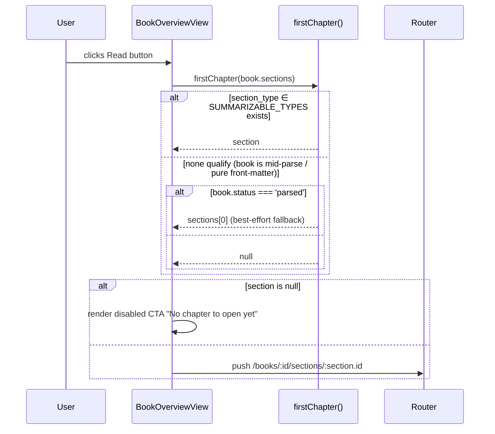
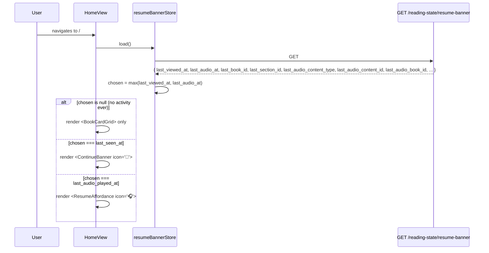
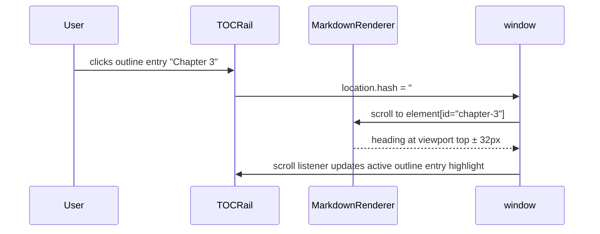

# Design-Crit Followups (Library, Book, Section, Audio) — Spec

## 1. Problem Statement

A 2026-05-08 live design crit produced 26 findings across Library, BookSummaryPage (Overview / Summary / Sections / Audio), SectionDetail, and the global audio Playbar. Five high-severity defects either block accessibility (dark-mode chip contrast ≈ 1.1 : 1), deliver anti-value at the dominant CTA (Read → Copyright), or break the document outline (two `<h1>` per page). Twenty-one medium/low findings cluster into information-architecture and dark-mode-token gaps that together make the app feel unfinished even though the backend functionality works. This spec defines the technical implementation of the 6-cluster bundle that fixes them.

**Primary success metric:** dark-mode WCAG AA contrast violations on `/`, `/books/:id`, `/books/:id/sections/:id`, `/concepts`, `/annotations` drop to **0** (axe-core sweep), and the **Read** CTA on every surface routes to a `SUMMARIZABLE_TYPES` section — never to copyright/front-matter — verified by Vitest unit + Playwright e2e.

---

## 2. Goals

| #  | Goal | Success Metric |
|----|------|----------------|
| G1 | Overview tab renders a complete, scannable 4-tile dashboard within the fold on first load. | Playwright snapshot diff vs the design-crit Overview screenshot; tile presence assertion (4 tiles, each with non-empty content or its empty-state CTA). |
| G2 | Read / Continue CTAs land on the first `SUMMARIZABLE_TYPES` section, never on copyright/front-matter/back-matter. | Vitest unit on `firstChapter()` covering all `SectionType` values + Playwright e2e against a seeded book whose `sections[0].section_type === 'copyright'`. |
| G3 | Every chip/badge on `/`, `/books/:id`, `/books/:id/sections/:id`, `/concepts`, `/annotations` passes WCAG AA in light **and** dark themes. | Playwright + axe-core sweep (added to `/verify`); zero violations in `color-contrast` rule for chip/badge selectors. |
| G4 | Summary tab has a sticky outline + anchor IDs on every H2/H3; clicking an entry scrolls heading within ±32 px of viewport top. | Vitest assertion on rendered anchor IDs; Playwright click-each-outline-entry test asserts heading bounding box within tolerance. |
| G5 | Sections tab shows decision-anchored columns only (`# | Title | Read time | Summary status`), with type as leading icon and Front matter / Chapters / Back matter grouping (front+back collapsed by default). | DOM-structural Vitest assertion against `SectionListTable` rendered output. |
| G6 | Each `/books/:id` and `/books/:id/sections/:id` page has exactly one `<h1>`. | Playwright `page.locator('h1').count() === 1` assertion on both routes; axe `landmark-one-main` & `heading-order` clean. |
| G7 | Read time uses `ceil(content_char_count / 1100)` minutes; aggregated as `Nh Mm` for the Sections tile. | Vitest snapshot of formatter covering [0, 1, 1100, 1101, 6600, 60001] chars and aggregation across 17 sections. |
| G8 | Audio Playbar shows real time on Kokoro and **no** dead `0:00/0:00` on Web Speech; sentence-progress bar renders on both engines. | Vitest on render branches; Playwright on a Web Speech book asserts the timestamp element is absent. |
| G9 | `ResumeAffordance` is mounted on `/`, `/books/:id`, `/books/:id/sections/:id` and renders only when an audio position exists. | Playwright: navigate after a paused playback → assert dock visible; navigate to `/concepts`/`/annotations` → assert dock not rendered. |
| G10 | On `/`, a single resume banner renders; modality (book vs headphones) reflects the more recent of last-read vs last-listened. | Vitest on the banner store's resolver function across both timestamps null / one null / both present. |

---

## 3. Non-Goals

Carried verbatim from requirements §Non-Goals. Most consequential exclusions:

- **NOT** rebuilding the audio engine or fixing the silent-Play bug — owned by `docs/specs/2026-05-08-audio-playback-fix-spec.md`.
- **NOT** redesigning the audio synthesis pipeline — owned by `docs/specs/2026-05-02-audiobook-mode-spec.md`.
- **NOT** redesigning the Concepts or Annotations pages beyond chip-token fixes.
- **NOT** adding new summarization presets or eval assertions.
- **NOT** introducing real-time collaborative features, offline-first PWA, or cloud sync.
- **NOT** cleaning up the stale `SectionType` enum in `backend/app/db/models.py` (tracked as a hygiene chore).
- **NOT** redesigning the global navigation sidebar (BC wordmark + emoji icons).
- **NOT** building saved-views or extending bulk-select beyond gating its UI behind explicit intent.

---

## 4. Decision Log

D1–D16 are carried from the requirements doc with spec-level clarifications. D17–D22 resolve the open questions / spec-time gaps.

| #   | Decision | Options Considered | Rationale |
|-----|----------|--------------------|-----------|
| D1  | Full chip/badge dark-mode audit, not piecemeal. New Playwright + axe sweep gate added to `/verify`. | (a) fix 3 named chips; (b) +token snapshot; (c) audit all chip/badge components + sweep gate. | (c) — root cause is missing `dark:` variant on the chip token; sweep gate prevents regression. Carry from req D1. |
| D2  | `firstChapter(sections)` helper picks first section whose `section_type ∈ SUMMARIZABLE_TYPES`; falls back to `sections[0]` only when none qualify and book status is `parsed`. Used by `BookOverviewView`, `BookSummaryTab`, `ContinueBanner`, and home-page resume banner. | (a) hard-code `chapter`; (b) SUMMARIZABLE_TYPES; (c) NOT-FRONT_MATTER. | (b) — the set is contract-tested and includes introduction/preface/foreword/epilogue/conclusion. Skipping back-matter avoids the symmetric "Read → About the Author" failure. Carry from req D2. |
| D3  | Demote the AppShell wordmark from `<h1>` to a `<span class="wordmark">` wrapped in the existing home `<router-link>`. | (a) `aria-hidden` the brand h1; (b) demote to span; (c) drop entirely. | (b) — preserves wordmark + home-link affordance; resolves duplicate-h1 cleanly. Bug site: `frontend/src/components/layout/TopBar.vue:46–48`. Carry from req D3. |
| D4  | Overview tab = 4 tiles: Continue, Book summary, Top concepts, Sections meta. No metadata strip on Overview (lives on Summary tab only). | (a) 5+ tiles; (b) 4 tiles; (c) 3 tiles; (d) redirect to Summary. | (b) — each tile answers a distinct user decision. Carry from req D4. |
| D5  | Sections columns = `# | Title | Read time | Summary`. Type as leading icon. Group rows under Front matter / Chapters / Back matter (front + back collapsed by default). | (a) keep + Type; (b) Read+Summary+Audio; (c) Title+chips; (d) Read+Summary, grouped. | (d) — carry from req D5. |
| D6  | Section row = `<RouterLink>` styled as button (default route = read summary), with hover bg + cursor-pointer + inline ▶ Listen + 📖 Read + ⋯ More icons revealed on hover, trailing chevron. Inline buttons are nested `<button>` elements with `@click.stop`. | (a) row-as-button; (b) title-link only; (c) always-visible. | (a) — carry from req D6. |
| D7  | Summary tab = sticky right-rail TOC (h2 + h3) + anchor IDs on every heading + back-to-top FAB after first-viewport scroll. Anchor IDs derive from heading text via slugify with collision-safe `-1`/`-2` suffixes. Metadata strip above the markdown shows preset, generated-at, eval pass-rate. | (a) top tab strip; (b) right-rail; (c) left accordion; (d) back-to-top only. | (b) — carry from req D7. |
| D8  | SectionDetail toolbar = 3 visually grouped clusters (`nav | mode | actions`). Drop the ☰ drawer; the breadcrumb dropdown (`TOCDropdown.vue`) becomes the canonical sections picker, enriched with per-row read-mode/summary-status/audio-status chips. | (a) flat + dividers; (b) drawer in actions; (c) drawer in left rail; (d) drawer merges into breadcrumb; (e) drawer dropped, breadcrumb canonical. | (e) — single source of truth for section navigation. Carry from req D8. |
| D9  | Audio empty state = engine chip + estimated synthesis time + content scope + "What's the difference?" link. **Supersedes** the empty-state spec in `docs/specs/2026-05-02-audiobook-mode-spec.md` (audiobook-mode spec status header should reference this doc). | (a) status quo; (b) chip only; (c) full framing. | (c) — carry from req D9. |
| D10 | Limited-controls badge = tooltip + link. Hover/focus reveals: "Web Speech can't seek/scrub. Install Kokoro for full controls →" linking to `/settings`. | (a) static; (b) inline; (c) tooltip. | (c) — carry from req D10. |
| D11 | Hide `0:00/0:00` timestamp when engine is `web-speech`; show real time when engine is `kokoro`. | (a) hide; (b) qualitative; (c) keep. | (a) — carry from req D11. |
| D12 | `ResumeAffordance.vue` already has functional `resume()` / `startFromBeginning()` (recon contradicts requirements claim of empty bodies). Treat the gap as **wiring**: mount the component on `/`, `/books/:id`, `/books/:id/sections/:id`. Do NOT mount on `/concepts` or `/annotations`. | (a) keep dormant + new component; (b) finish + mount; (c) mount on all 5. | (b) revised — mount existing component on the 3 reading-context routes. See §11.5. |
| D13 | Library view-toggle = labelled icon buttons (Tabler/Lucide grid / list / compact) with `aria-label` and persisted selection in localStorage key `bc.library.view`. | (a) aria-label only; (b) icons + label; (c) drop. | (b) — carry from req D13. |
| D14 | Library bulk-select checkboxes hidden until user enters "Select" mode via toolbar button. When active, show sticky bulk-action bar. | (a) always-visible; (b) hidden + toggle; (c) drop. | (b) — carry from req D14. |
| D15 | Sentence-progress bar = thin segmented strip above the Playbar. N segments (one per sentence), completed-state shaded, current-state outlined. Renders on both engines. | (a) drop; (b) continuous %; (c) segmented. | (c) — carry from req D15. |
| D16 | Single resume banner on `/` chosen by max(`reader_position.last_seen_at`, `audio_position.last_played_at`). Banner shows leading icon (📖 reading vs 🎧 listening) for unambiguous modality. | (a) stack; (b) reading only; (c) listening only; (d) most-recent-wins. | (d) — carry from req D16. See §9.1 for the API extension that exposes both timestamps. |
| D17 | Top concepts Overview tile shows concepts whose `Concept.book_id == :bookId` only (own-concepts). Cross-book linked concepts via `concept_book_links` are out of scope for this tile. | (a) own; (b) linked; (c) both. | (a) — chosen by user. Matches the user mental model ("this book's ideas"); simpler query; tile is a 3–5 chip surface where richer info is overkill. |
| D18 | Sections-tab front/back-matter expand state persists per-book in localStorage key `bc.sections.expand.{bookId}` (object: `{front: bool, back: bool}`). Defaults to `{front: false, back: false}`. | (a) persist per-book; (b) reset on every visit; (c) global. | (a) — chosen by user. Matches the reader-settings persistence pattern (browser-local for UI chrome). Per-book scope avoids surprising the user across different books. |
| D19 | Audio empty-state "What's the difference?" link opens an inline popover anchored to the link, with a 2-paragraph explanation of Web Speech vs Kokoro and a CTA button "Open audio settings →" routing to `/settings#audio` (the existing engine field on the settings page). No new docs route. | (a) inline popover; (b) anchor to /settings#audio-engines; (c) modal. | (a) — chosen by user. No new route, no settings page modification beyond ensuring an `id="audio"` anchor on the relevant section. Heavier modals reserved for confirms/destructive flows. |
| D20 | Stale "Copyright" continue-reading rows fixed **server-side at read time** in BOTH `/continue` (cross-device) and the new `/resume-banner` (most-recent-overall). Filter: `section_type NOT IN FRONT_MATTER_TYPES`. No alembic migration. Self-heals across CLI / API / future clients. | (a) server-side filter; (b) migration purge; (c) client-side filter. | (a) — chosen by user. No migration debt; correct end state. See §9.1, §9.2. |
| D21 | The home-page resume banner data source is a **NEW** endpoint `GET /api/v1/reading-state/resume-banner` (NOT an extension of `/continue`, which is cross-device-scoped only). The new endpoint returns the most-recent reading + audio across ALL browsers. Field naming aligns with existing `ReadingStateResponse` (`last_book_id`, `last_section_id`, `last_viewed_at`); audio fields use `last_audio_*` prefix and reference `audio_positions.updated_at` (the actual column — there is no `last_played_at`). | (a) extend `/continue`; (b) new `/resume-banner` endpoint; (c) two stores compared client-side. | (b) — extending `/continue` would conflate cross-device-sync semantics with most-recent-overall semantics. Discovered during /simulate-spec recon: existing `/continue` calls `repo.get_latest_other_device(user_agent)`; reusing it would make the home banner empty for single-device users. See §9.1. |
| D22 | The contract test enforcing parity between `FRONT_MATTER_TYPES` / `SUMMARIZABLE_TYPES` on backend and frontend remains the source of truth. The new `firstChapter` helper imports from `@/stores/reader` (FE) — no parallel constant declaration. | (a) duplicate constant; (b) import existing. | (b) — preserve the contract-test guarantee. |

---

## 5. User Personas & Journeys

### 5.1 Persona — "The Builder-Reader" (sole persona)

The single user of this personal tool. Non-fiction reader running Book Companion locally. Enters warm: books exist, summaries exist, intent is high ("resume reading", "look up a concept", "listen on the move"). No second persona, no onboarding, no support burden.

### 5.2 Journeys

User journeys are carried verbatim from requirements §User Journeys (Continue reading; Open a book; Browse summary by heading; Listen to a section; Empty audio tab; Empty Overview state; Continue tile when no SUMMARIZABLE section exists; Section[0] is a chapter). One spec-level clarification:

- **Resume coordination on `/`:** the home-page resume banner store fetches `/reading-state/continue` once on mount, computes `chosen = lastAudioPlayedAt > lastSeenAt ? 'listening' : 'reading'`, and renders one of two slots (`ContinueBanner` for reading, `ResumeAffordance` for listening). The unchosen affordance is `v-if`'d out — only one banner DOM element is mounted.

---

## 6. System Design

### 6.1 Architecture Overview

```
┌──────────────────────────────────────────────────────────────────────────────┐
│ Frontend (Vue 3 SPA)                                                         │
│                                                                              │
│  ┌── AppShell.vue (1× <h1> -> <span class="wordmark">) ─────────────────┐    │
│  │  ┌── HomeView ──┐    ┌── BookSummaryPage ──┐   ┌── SectionDetail ──┐ │    │
│  │  │ ContinueBan- │    │ Overview (4 tiles)  │   │ ReaderHeader      │ │    │
│  │  │  ner|Resume- │    │ Summary (TOC+FAB)   │   │  3-cluster toolbar│ │    │
│  │  │  Affordance  │    │ Sections (grouped)  │   │ TOCDropdown       │ │    │
│  │  │  (one of)    │    │ Audio (empty state) │   │  (canonical picker)│ │   │
│  │  └──────────────┘    └─────────────────────┘   └───────────────────┘ │    │
│  │                                                                       │    │
│  │  Global mounts (always rendered or v-show):                          │    │
│  │   • Playbar (timestamp gated by engine; sentence-progress bar)       │    │
│  │   • ResumeAffordance dock (mounted on 3 reading-context routes only) │    │
│  └───────────────────────────────────────────────────────────────────────┘   │
│                                                                              │
│  Shared:                                                                     │
│   • firstChapter(sections) helper  — frontend/src/stores/reader.ts (extend)  │
│   • formatReadTime(chars) helper   — frontend/src/utils/readTime.ts (NEW)    │
│   • Chip token CSS — assets/main.css .chip-* with dark-mode variants         │
│                                                                              │
└──────────────────────────────────────────────────────────────────────────────┘
                          │  HTTP/SSE
                          ▼
┌──────────────────────────────────────────────────────────────────────────────┐
│ Backend (FastAPI)                                                            │
│                                                                              │
│  GET /api/v1/reading-state/continue  ── EXTENDED (D20, D21):                 │
│    • Skip rows whose target section.section_type ∈ FRONT_MATTER_TYPES        │
│    • Add last_audio_played_at, last_audio_content_type, last_audio_content_id│
│                                                                              │
│  No DB schema changes. No new tables. No migrations.                         │
│  FRONT_MATTER_TYPES is read from app.services.parser.section_classifier.     │
└──────────────────────────────────────────────────────────────────────────────┘
```

### 6.2 Data Flow Trace — Resume coordination on `/`

The home-banner is a write→read pipeline (audio_position write at engine-stop time; reader_position write at section unload; both read at home-mount time). Trace:

| Step | Site | Verified |
|------|------|----------|
| Audio write entry | `AudioPositionService.update()` (called by `mp3Engine`/`webSpeechEngine` on pause/stop) writes `audio_positions.updated_at` (NOT `last_played_at` — column does not exist; recon-confirmed) | ✅ exists |
| Reading write entry | `reader.ts` route guard / page unload calls `PUT /api/v1/reading-state` writing `reader_position.updated_at` | ✅ exists |
| Storage | `reader_position` and `audio_positions` tables (both keyed on `browser_id`; `audio_positions` PK = `(content_type, content_id, browser_id)`) | ✅ exists |
| Read entry | `GET /api/v1/reading-state/continue` returns OTHER-device reading-state row (`get_latest_other_device(user_agent)`) | ⚠️ wrong semantic for home banner — only useful for cross-device sync |
| FE consumer | New `useResumeBannerStore` on `HomeView` mount calling new `/resume-banner` endpoint | ❌ to build |

**Gap to implement:** new `GET /api/v1/reading-state/resume-banner` endpoint (FR-B05) + front-matter filter on existing `/continue` (FR-B05a) + frontend store + banner-resolver computed (FR-B06–FR-B07).

### 6.3 Sequence Diagrams

#### 6.3.1 Read CTA → first chapter (G2, D2)



#### 6.3.2 Home-page resume coordination (D16, D21)



#### 6.3.3 Summary tab outline click (G4, D7)



---

## 7. Functional Requirements

### 7.1 Cluster A — Dark-mode chip & token audit (G3)

| ID | Requirement |
|----|-------------|
| FR-A01 | Add `.chip` / `.chip--accent` / `.chip--info` / `.chip--warn` / `.chip--neutral` token classes to `frontend/src/assets/main.css` with explicit `dark:` variants. Each variant must satisfy WCAG AA contrast (≥ 4.5 : 1 for text). Baseline shown in §11.1. |
| FR-A02 | `TagChip.vue` is rewritten to consume the chip tokens via class binding (drop hardcoded rgba/hex from `<style scoped>`). Light + dark variants come from CSS, not inline styles. |
| FR-A03 | `EngineChip.vue` is rewritten to use `.chip--info` (Kokoro) / `.chip--neutral` (Web Speech). Drop the `bg-indigo-100`/`bg-slate-100` Tailwind classes. |
| FR-A04 | The "Limited controls" badge in `Playbar.vue:119–123` becomes `.chip--warn` (drop `bg-amber-100 text-amber-800`). |
| FR-A05 | Sweep the following 20 text-bearing chip/badge sites to use the chip tokens from FR-A01. Each site is touched once, drops its current ad-hoc background/text classes, and gains a `dark:` variant via the token: |
| | • `TagChip.vue:51` — tag pill — covered by FR-A02. |
| | • `EngineChip.vue:32` — Kokoro/Web Speech indicator — covered by FR-A03. |
| | • `Playbar.vue:120` — "Limited controls" — covered by FR-A04. |
| | • `EvalBadge.vue:29` — eval pass/total score badge. |
| | • `ContrastBadge.vue:35` — contrast ratio badge. |
| | • `ChatScopeSelector.vue:50` — pill-shaped scope toggle. |
| | • `GenerateAudioModal.vue:127` — "Recommended" amber badge. |
| | • `LlmSettings.vue:212` — provider status badge (detected/version/error). |
| | • `SectionsAudioRow.vue:63` — audio status pill (Ready/Stale/Generating/None). |
| | • `AnnotationCard.vue:67` — annotation type badge. |
| | • `BookCard.vue:33` — book status badge. |
| | • `BookList.vue:36` — book list status badge. |
| | • `BookTable.vue:77` — book table status badge. |
| | • `DatabaseSettings.vue:48` — migration status (Current/Behind). |
| | • `PresetSettings.vue:176` — system preset badge. |
| | • `ReadingSettings.vue:148` — active badge. |
| | • `ConceptList.vue:46` — concept edited badge. |
| | • `ConceptDetail.vue:39` — User Edited badge. |
| | • `ConceptDetail.vue:79` — related concept chips. |
| | • `StructureReview.vue:39` — section type badge. |
| FR-A05a | Decorative dot/pill sites are **out of scope for the text-contrast sweep** (they bear no text) but MUST satisfy WCAG 2.2 SC 1.4.11 non-text contrast (≥ 3 : 1) against their background in both themes: `KokoroStatusIndicator.vue:60,65,70` (3 status dots), `PersistentProcessingIndicator.vue:62` (pulse dot), `SummarizationProgress.vue:55,59` (check/fail badges), `BottomSheet.vue:121` (drag handle). Audit at /plan time; if any fails 3 : 1, swap to a token that does. |
| FR-A06 | Add a Playwright + axe-core suite at `frontend/tests/e2e/dark-mode-contrast.spec.ts` that navigates to `/`, `/books/1`, `/books/1/sections/1`, `/concepts`, `/annotations` in dark theme and asserts axe `color-contrast` returns zero violations. Also asserted in light mode for parity. |
| FR-A07 | The `/verify` ladder gains a new gate: `frontend/tests/e2e/dark-mode-contrast.spec.ts` must pass. Add to the verify script (path TBD via codebase recon at /plan time). |

### 7.2 Cluster B — Read-position correctness (G2, G6, G10)

| ID | Requirement |
|----|-------------|
| FR-B01 | Add `firstChapter(sections: Section[], bookStatus: BookStatus): Section \| null` to `frontend/src/stores/reader.ts`. Returns: (1) the first section whose `section_type ∈ SUMMARIZABLE_TYPES`; or (2) `sections[0]` when none qualify AND `bookStatus === 'PARSED'`; or (3) `null` otherwise. Empty/undefined `sections` returns `null`. |
| FR-B02 | Replace `BookOverviewView.vue:199` (`firstSection = sections[0]`) with `firstChapter(book.value?.sections, book.value?.status)`. The Read button is `:disabled` and shows tooltip "No chapter to open yet" when the helper returns `null`. |
| FR-B03 | Replace `BookSummaryTab.vue:165–170` (`readSectionSummaries`) with the same helper; route to `/books/:id/sections/:firstChapter.id?tab=summary` if non-null, else show toast "No chapter to open yet". |
| FR-B04 | `ContinueBanner.vue` route resolution: if the API-returned `section_id` is null OR points to a `FRONT_MATTER_TYPES` section, fall back to `firstChapter(book.sections, book.status)` and call the banner "Start reading" instead of "Continue reading". (The server-side filter from FR-B05 makes the latter case rare, but FE defends against any bypass.) |
| FR-B05 | A **new** backend endpoint `GET /api/v1/reading-state/resume-banner` is added. (Rationale: the existing `/continue` returns rows from OTHER devices only, which is wrong semantic for a home-page banner that should reflect the user's most-recent activity regardless of device.) Behaviour: (a) returns the most-recent `reader_position` row across ALL browser_ids whose target section's `section_type ∉ FRONT_MATTER_TYPES`; (b) returns the most-recent `audio_positions` row across ALL browser_ids (no front-matter filter — audio rarely targets front-matter); (c) joins to populate book/section titles for the banner. The existing `/continue` endpoint is **left unchanged** to preserve cross-device sync semantics. |
| FR-B05a | Server-side front-matter filter is also applied to the existing `/continue` endpoint as a defense-in-depth fix for D20: the repo method `get_latest_other_device` SQL gains `WHERE bs.section_type NOT IN (FRONT_MATTER_TYPES)` so cross-device continue-reading also skips stale Copyright rows. Backwards-compatible (only removes invalid rows from the response). |
| FR-B06 | `frontend/src/stores/resumeBanner.ts` (NEW) — exposes `chosen: 'reading' \| 'listening' \| null`, computed as `max(last_viewed_at, last_audio_at)` with null-handling: both null → `null`; one null → the other wins; both present → max. **Tie-break:** when timestamps are equal at millisecond precision, `chosen = 'reading'` (reading is the dominant modality and the safer default). Hydrates once on `HomeView` mount via `GET /api/v1/reading-state/resume-banner`. |
| FR-B07 | `HomeView.vue` renders exactly one of `<ContinueBanner>` (reading; leading icon 📖) or `<ResumeAffordance>` (listening; leading icon 🎧) based on `resumeBannerStore.chosen`. Both null → render neither. |
| FR-B07a | If `GET /reading-state/continue` errors (network failure, 5xx, timeout), `resumeBannerStore.chosen` resolves to `null` and HomeView renders no banner. The error is logged to console via `logger.warn('resume-banner-fetch-failed', err)` but is **not** surfaced to the user (no toast, no error banner). Matches the silent-degradation pattern of the rest of the home view. |
| FR-B08 | `frontend/src/components/layout/TopBar.vue:46–48` — change the wrapping `<h1 class="top-bar-title">` to `<span class="top-bar-title">` (still wrapped by `<router-link to="/">`). The `top-bar-title` CSS class continues to apply visually-equivalent styling. |
| FR-B09 | `frontend/src/components/reader/ReaderHeader.vue` — promote the section title from breadcrumb-only to a real `<h1 class="reader-h1">` element rendered above (or in place of) the breadcrumb dropdown trigger. The breadcrumb context (Library / Book) becomes a sibling element with no heading semantics. Result: SectionDetail has exactly one `<h1>` = section title. |
| FR-B10 | `BookSummaryPage` already has the book title as an `<h1>` (verify in plan); ensure no other `<h1>` exists on that route after FR-B08. |

### 7.3 Cluster C — BookSummaryPage IA (G1, G4, G5, G7)

#### 7.3.1 Overview tab (G1, D4)

| ID | Requirement |
|----|-------------|
| FR-C01 | New `frontend/src/components/book/OverviewDashboard.vue` rendering 4 tiles in a CSS Grid (2×2 on `md+`, stacked on mobile): Continue, Book summary, Top concepts, Sections. Each tile is a `<RouterLink>` (or button when CTA is generative) wrapper, hover bg, focus ring. Existing one-sentence filler text in the Overview tab is removed. |
| FR-C01a | Each tile renders a CSS skeleton placeholder (3 lines of `bg-slate-200 dark:bg-slate-700` blocks at varying widths, `animate-pulse`) while its underlying data is loading. Continue + Sections + Book summary skeletons gate on `book.value === null`; Top concepts gates on its own `concepts === null` fetch state. Skeletons collapse to populated content once data resolves; no layout shift between skeleton and final state (skeleton heights match final). |
| FR-C02 | **Continue tile** content: title "Continue reading" / "Start reading" based on whether `reader_position` exists for this book + this user; subtitle is `§ {order_index} · {section.title}` for the resolved chapter via FR-B01. Empty/disabled when `firstChapter` returns null: "Waiting for the first chapter to parse." |
| FR-C03 | **Book summary tile** content: title "Book summary"; subtitle either "Available · last generated {relativeTime(generated_at)}" + CTA "Open Summary tab" (routes to `?tab=summary`) or empty state "No book summary — Generate" wired to the existing summary-trigger flow. |
| FR-C04 | **Top concepts tile** content: title "Top concepts"; body is 3–5 chip-rendered concept names sorted by `Concept.created_at ASC` (concepts mined first are typically the more important ones extracted from earlier chapters; the `Concept` model has no `score` column — verified in recon) where `Concept.book_id == :bookId` (D17 — own-concepts only). Each chip routes to `/concepts?book={id}&concept={term}`. Empty state: "No concepts mined yet — Run extraction" (CTA disabled if extraction not yet supported by backend; verify at plan time). |
| FR-C05 | **Sections tile** content: title "Sections"; subtitle `{count} sections · ≈ {Nh Mm} read · See all` routing to `?tab=sections`. The `Nh Mm` aggregates `formatReadTime(sum(content_char_count))`. Always populated (no empty state). |

#### 7.3.2 Summary tab (G4, D7)

| ID | Requirement |
|----|-------------|
| FR-C06 | `BookSummaryTab.vue` template is reorganized: a 2-column grid on `lg+` (markdown column + sticky right rail TOC). Below `lg`, TOC collapses into a top "Outline" expander above the markdown. |
| FR-C07 | The markdown renderer is configured to emit `id="<slug>"` on every `<h2>` and `<h3>`. Slug rules: lowercase, kebab-case, alphanum + hyphens; collisions get `-1`, `-2` suffixes (track within the render call). Implementation seam: `markdown-it` `headerAnchor` plugin OR a render-rule override. |
| FR-C08 | New `frontend/src/components/book/SummaryTOCRail.vue` extracts every H2/H3 from the rendered HTML (post-render DOM walk OR pre-render token walk) and emits a sticky `<nav>` with anchored links. Active entry highlights as the user scrolls (IntersectionObserver). |
| FR-C09 | Anchor click scrolls to within ±32 px of viewport top via `el.scrollIntoView({ behavior: 'smooth', block: 'start' })` and a CSS `scroll-margin-top: 32px` on the heading targets. |
| FR-C10 | New `frontend/src/components/book/BackToTopFab.vue` mounted in `BookSummaryTab`. Visible only when `window.scrollY > window.innerHeight`. Click scrolls to `#top` (a sentinel div at the tab top). Uses `.chip--accent` styling for dark-mode parity. **Positioning:** `position: fixed; right: 1.5rem; bottom: calc(var(--playbar-height, 0px) + 1.5rem);` where `--playbar-height` is a CSS custom property set on `:root` by AppShell whenever the global Playbar mounts (84px) and unset when it unmounts (0px). Avoids the FAB stacking on top of the Playbar. |
| FR-C11 | Empty-outline behaviour: if 0 H2 elements are present, the rail renders a single "Top" entry; the FAB still appears once scrolled. |
| FR-C12 | A metadata strip is rendered above the markdown body: `Preset: {preset_name} · Generated: {relativeTime(generated_at)} · Eval: {pass}/{total} ({percent}%)`. Pulled from `Summary.preset_name`, `Summary.created_at`, and the wrapped `eval_json.passed` / `eval_json.total`. |

#### 7.3.3 Sections tab (G5, G7, D5, D6, D18)

| ID | Requirement |
|----|-------------|
| FR-C13 | `SectionListTable.vue` columns become exactly: `# (order_index) | Title (with leading section-type icon) | Read time | Summary`. Drop chars/compression columns. The Summary column shows ✓ when `default_summary_id != null`, ✕ otherwise. |
| FR-C14 | `formatReadTime(content_char_count: number): string` lives in `frontend/src/utils/readTime.ts` (NEW). Returns `'<1 min'` if 0, otherwise `'{n} min'` where `n = ceil(chars / 1100)`. Aggregation helper `formatReadTimeSum(chars[]): string` returns `'{H}h {M}m'` when total ≥ 60min, otherwise `'{n} min'`. |
| FR-C15 | Rows are grouped under three `<thead>`-style separators: "Front matter" (`section_type ∈ FRONT_MATTER_TYPES`), "Chapters" (`section_type ∈ SUMMARIZABLE_TYPES`), "Back matter" (everything else — set difference). No new `BACK_MATTER_TYPES` constant is introduced; the grouping is computed as `if t ∈ FRONT_MATTER: 'front' elif t ∈ SUMMARIZABLE: 'chapters' else: 'back'`. The "back matter" bucket therefore captures the section_classifier's known back-matter types (`glossary`, `notes`, `appendix`, `bibliography`, `index`, `about_author`) plus any future or unknown type. The chapters group is always expanded; front + back collapsed by default. |
| FR-C16 | Group expand state persists per-book in localStorage key `bc.sections.expand.{bookId}` (object: `{front: bool, back: bool}`). Read on mount (default `{false, false}`); writes on toggle, wrapped in try/catch (per the localStorage durability constraint — 2026-04-25 sim learning). |
| FR-C17 | Each row is a `<div role="button" tabindex="0">` wrapper (NOT a `<RouterLink>` — see §11.7 for why) with `@click` + `@keydown.enter` + `@keydown.space.prevent` handlers calling `router.push('/books/:bookId/sections/:section.id?tab=summary')`. `aria-label="Open summary of {section.title}"`. Hover applies `bg-slate-100 dark:bg-slate-800` (or token equivalent), cursor-pointer, focus ring on `:focus-visible`. |
| FR-C18 | Each row contains nested action `<button>` elements revealed on hover (`opacity-0 group-hover:opacity-100`): ▶ Listen (calls existing TtsPlayButton flow), 📖 Read (routes to `/books/:bookId/sections/:section.id` with no tab/mode query param — reader store opens in default `contentMode === 'original'`; distinct from the row's default which navigates to `?tab=summary`), ⋯ More (opens `OverflowMenu.vue` with section-level actions: Edit, Re-summarize, etc.). Each handler calls `event.stopPropagation()` so the row click doesn't fire. Buttons are HTML-valid (no `<a>`/`<button>` nesting since the wrapper is a `<div role="button">`). |
| FR-C19 | A trailing chevron (`›`) is always visible on every row, right-aligned. |
| FR-C20 | Listen action is disabled when `default_summary_id == null` AND no MP3 exists for the section. To avoid an N-request thundering herd at table mount (17+ sections), use a **batch lookup**: call `GET /api/v1/audio/sections/by-book/:bookId` (NEW backend endpoint — see §9.4) once on Sections-tab mount, returning a map `{section_id: {has_mp3: bool}}`. The map is consumed by the row component's disabled gate. Fallback if the endpoint returns 404 or errors: render rows with Listen enabled and let the per-click `audio/lookup` reveal availability (degraded UX but functional). |

### 7.4 Cluster D — SectionDetail toolbar (D8)

| ID | Requirement |
|----|-------------|
| FR-D01 | `ReaderHeader.vue` toolbar is reorganized into 3 visually grouped clusters separated by 1px `bg-slate-200 dark:bg-slate-700` vertical dividers: Nav (← Prev / Next →), Mode (Original ↔ Summary segmented toggle from existing `ContentToggle`), Actions (Listen, ⚙ Reader settings). |
| FR-D02 | Prev/Next buttons have hit-area ≥ 40×40 px (CSS `min-width: 40px; min-height: 40px;`) and `aria-label="Previous section: {title}"` / `aria-label="Next section: {title}"`. Disabled when at the bounds. |
| FR-D03 | The ☰ drawer button is **removed** from `ReaderHeader.vue`. The `TOCDropdown.vue` (already wired via the breadcrumb trigger) becomes the canonical sections picker. |
| FR-D04 | `TOCDropdown.vue` rows are enriched: each row shows the section title + 3 status chips: read mode (`📖 Original`/`📋 Summary` based on the `BookSection.has_summary`), summary status (✓/✕), audio status (🎧 if MP3 exists for this section, else ∅). Chips use the new chip tokens from FR-A01. |
| FR-D05 | `Listen` button in the actions cluster carries `aria-label="Listen to this section"` and `title="Play audio"`. Reader settings ⚙ already labelled — verify and keep. |

### 7.5 Cluster E — Audio polish (G8, G9)

| ID | Requirement |
|----|-------------|
| FR-E01 | `Playbar.vue:128–129` timestamp template: wrap in `v-if="engineKind === 'kokoro'"` so the `0:00 / 0:00` element is **absent** from the DOM on Web Speech. The sentence counter (already present) is the canonical progress indicator on Web Speech. |
| FR-E02 | New `frontend/src/components/audio/SentenceProgressBar.vue` mounted just above the Playbar's primary controls row. Renders a horizontal flex container of N segments where N = `totalSentences`. Each segment: width `flex: 1 1 0`, `min-width: 2px`, height 3px, gap 1px. Completed segments use `bg-indigo-500 dark:bg-indigo-400`; current segment uses `border border-indigo-500 bg-transparent`; pending use `bg-slate-200 dark:bg-slate-700`. Renders on both engines. |
| FR-E03 | The "Limited controls" badge in `Playbar.vue` is wrapped in a tooltip-on-hover/focus showing: "Web Speech can't seek/scrub. Install Kokoro for full controls →" with the arrow being a `<router-link to="/settings#audio">`. Reuse the existing tooltip pattern from `TtsPlayButton.vue` (per the 2026-05-03 spec D6). |
| FR-E04 | Audio empty state in `AudioTab.vue` is rewritten. Replaces the current "No audio yet for this book." with: |
|  | ```
|  | <EngineChip :engine="defaultEngine" />
|  | <p>Generate audio for this book.</p>
|  | <p>Engine: {engine label} · Estimate: {≈ X min on Kokoro / ≈ instant on Web Speech} · Scope: {N chapter summaries}</p>
|  | <button class="btn-primary">Generate</button>
|  | <button class="link-button" @click="showDiff = true">What's the difference?</button>
|  | <DifferencePopover v-model="showDiff" />
|  | ``` |
| FR-E05 | New `frontend/src/components/audio/DifferencePopover.vue`: an inline anchored popover (NOT a modal) using `@floating-ui/vue` (verify availability at plan time; if not present, use a simple absolutely-positioned div with manual placement logic). Content: 2 paragraphs comparing Web Speech (offline, ~0 install, default) vs Kokoro (~338 MB model + ffmpeg + espeak-ng, higher quality). CTA button "Open audio settings →" routes to `/settings#audio`. Closes on outside click + Esc. **Focus management:** on open, focus moves to the first focusable element inside the popover (the heading or the CTA button); on close (outside click, Esc, or CTA click that navigates away), focus returns to the trigger link. Trap focus within the popover while open via `Tab` / `Shift+Tab` cycling. Implement via `useFocusTrap` from VueUse if available, else minimal inline trap. |
| FR-E06 | `frontend/src/views/SettingsView.vue` (or wherever the audio engine field lives) gets `id="audio"` on its container so `/settings#audio` anchors correctly. No other settings changes. |
| FR-E06a | `frontend/src/router/index.ts` `scrollBehavior` is verified or extended to honor `to.hash`: when `to.hash` is present, return `{ el: to.hash, behavior: 'smooth', top: 32 }`. If existing config already does this, no change; otherwise add it. Verify at /plan time and add if missing. |
| FR-E07 | `ResumeAffordance.vue` is verified functional (D12) — its existing `resume()` and `startFromBeginning()` are preserved. The dock is **mounted** in: `HomeView.vue` (gated by `resumeBannerStore.chosen === 'listening'` per FR-B07), `BookSummaryPage.vue` (gated by FR-E07a query), and `SectionDetailView.vue` (gated by per-section query). NOT mounted on `/concepts`, `/annotations`, `/settings`. |
| FR-E07a | "Audio position exists for this book" detection requires a join because `audio_positions` has no `book_id` column (PK is `content_type, content_id, browser_id`). New backend endpoint `GET /api/v1/audio/positions/by-book/:bookId` (see §9.4) returns the most-recent audio position whose effective book matches: for `content_type ∈ {'section_summary', 'section_content'}` join `book_sections.id = audio_positions.content_id WHERE book_sections.book_id = :bookId`; for `content_type = 'book_summary'` match `audio_positions.content_id = :bookId`; for `content_type = 'annotations_playlist'` skip. Returns 404 if none. `BookSummaryPage` calls this on mount; presence dictates dock render. |
| FR-E07b | "Audio position exists for this section" detection (`SectionDetailView`) uses the existing `GET /api/v1/audio/positions/lookup?content_type=section_summary&content_id=:sectionId` (or whichever is the established route — verify at /plan time and adapt). Returns the position or 404. |
| FR-E08 | The dock gracefully hides itself when the active Playbar is open for the same content (no double-affordance). Detection: `ttsPlayer.isActive && ttsPlayer.contentId === audioPosition.contentId && ttsPlayer.contentType === audioPosition.contentType`. |
| FR-E09 | Keyboard shortcuts: existing space-toggle preserved. Add a `?` overlay (`<KeyboardShortcutsOverlay>`) listing Space (play/pause), → (next sentence), ← (prev sentence), Esc (close). Toggle on `?` keypress when no input is focused. Tooltip shortcuts on each Playbar control button (`title="Play (Space)"` etc.). |

### 7.6 Cluster F — Library polish (D13, D14)

| ID | Requirement |
|----|-------------|
| FR-F01 | Replace the `▦ ☰ ▤` glyphs in `frontend/src/components/library/FilterRow.vue:53–77` with Lucide icon components (`<LayoutGrid>`, `<List>`, `<Rows3>` — names per the Lucide library; verify at plan time and pick equivalents). Each button has `aria-label="{Grid|List|Compact} view"` and a visible label at viewport ≥ `md`. |
| FR-F02 | View selection persists in localStorage key `bc.library.view` (values: `grid` / `list` / `compact`). Hydrated on mount; default `grid`. localStorage write wrapped in try/catch with a one-shot toast on quota exceeded. |
| FR-F03 | Add a `Select` toolbar button to `FilterRow.vue` (right-aligned). Clicking enters bulk-select mode (`store.bulkSelectMode = true`); per-card checkboxes appear. The existing `BulkToolbar.vue` slides up sticky when `selectedIds.length > 0`. |
| FR-F04 | When NOT in bulk-select mode, per-card checkboxes are **not rendered** (drop the DOM, not just `display: none`). Exiting bulk-select mode clears `selectedIds`. |

---

## 8. Non-Functional Requirements

| ID | Category | Requirement |
|----|----------|-------------|
| NFR-01 | Accessibility | All chip/badge tokens (FR-A01) satisfy WCAG 2.2 SC 1.4.3 (≥ 4.5 : 1 contrast for text < 18pt) in light + dark themes. |
| NFR-02 | Accessibility | `/books/:id` and `/books/:id/sections/:id` have exactly one `<h1>` per WCAG 2.2 SC 1.3.1 / 2.4.6. |
| NFR-03 | Accessibility | All interactive controls have visible focus rings (`focus-visible:ring-2 ring-indigo-500`) — confirmed for new components in FR-A05–FR-F03. |
| NFR-04 | Performance | Summary-tab outline render adds < 50 ms to `BookSummaryTab` mount on a 12-H2 markdown (measured by Vitest performance assertion or Playwright trace). |
| NFR-05 | Performance | Sections-tab grouping + read-time aggregation is O(N) where N = section count; no re-render storms when toggling expand state. |
| NFR-06 | Robustness | Every `localStorage.getItem` / `setItem` for the new keys (`bc.library.view`, `bc.sections.expand.{bookId}`) is wrapped in try/catch and validated against an expected schema; corrupt values → reset to default + console.warn (per the 2026-04-25 sim learning). |
| NFR-07 | Backwards compatibility | The `/reading-state/continue` extension (FR-B05) adds nullable fields only; no field is removed or renamed. Existing callers (CLI, future) continue to work. |

---

## 9. API Contracts

### 9.1 `GET /api/v1/reading-state/resume-banner` (NEW — FR-B05)

A new endpoint that returns the user's most-recent reading + listening positions across ALL browsers, suitable for the home-page resume banner.

**Why a new endpoint, not extending `/continue`:** the existing `GET /reading-state/continue` is implemented via `repo.get_latest_other_device(user_agent)` and explicitly excludes the current device — a cross-device-sync feature. The home banner needs the most-recent action regardless of device. Two distinct semantics → two endpoints.

**Request:** no body; reads `User-Agent` header (used only for parity with `/continue`, not for filtering on this endpoint).

**Response (200):**
```json
{
  "last_book_id": 1,
  "last_section_id": 5,
  "last_book_title": "The Lean Startup",
  "last_section_title": "Chapter 3: Vision",
  "last_viewed_at": "2026-05-08T10:30:00Z",
  "last_audio_content_type": "section_summary",
  "last_audio_content_id": 5,
  "last_audio_book_id": 1,
  "last_audio_book_title": "The Lean Startup",
  "last_audio_section_title": "Chapter 3: Vision",
  "last_audio_at": "2026-05-08T11:15:00Z"
}
```

**Behaviour:**
- **Reading fields** are populated from the most-recent `reader_position` row across all `browser_id` values whose target section's `section_type ∉ FRONT_MATTER_TYPES`. If no valid row exists, all `last_*` reading fields are null.
- **Audio fields** are populated from the most-recent `audio_positions` row across all `browser_id` values, ordered by `audio_positions.updated_at DESC` (the actual column name — there is no `last_played_at` column). Audio rows never carry book_id directly (the `audio_positions` table is keyed on `content_type, content_id, browser_id`); join logic:
  - When `content_type ∈ {'section_summary', 'section_content'}`: `book_sections.id = audio_positions.content_id`, then `books.id = book_sections.book_id`.
  - When `content_type = 'book_summary'`: `books.id = audio_positions.content_id` directly.
  - When `content_type = 'annotations_playlist'`: skip — never surfaced on the resume banner. Filter at SQL level.
- All fields are independently nullable. Both can be present, only one, or neither.
- Field naming aligns with existing `ReadingStateResponse` (`last_book_id`, `last_section_id`, `last_viewed_at`); audio fields use `last_audio_*` prefix.

**Error responses:**
- 200 with all-null fields when no reader_position or audio_positions rows exist for the user (i.e., empty library or no playback yet). Never 404.
- 500 on DB error (existing FastAPI default handler).

**Verification:**
- Unit test: seed `reader_position` pointing at `copyright` section → response returns the next valid row's section, or all-null if no other row.
- Unit test: seed `audio_positions` with `content_type='annotations_playlist'` + a `section_summary` row → response returns the section_summary row's data, ignoring the playlist row.
- Unit test: seed both a reading row and an audio row, with the audio more recent by 1ms → response carries both, frontend resolver picks `'listening'`.
- Integration: hit the endpoint with empty DB; assert all-null response, 200.

### 9.2 `GET /api/v1/reading-state/continue` (existing — extended per FR-B05a)

The existing endpoint gains a server-side front-matter filter (D20). No request shape change. Response shape unchanged.

**Behaviour change:** `repo.get_latest_other_device(user_agent)` SQL adds `JOIN book_sections bs ON bs.id = reader_position.section_id WHERE bs.section_type NOT IN (FRONT_MATTER_TYPES)` so stale Copyright rows are skipped at read time.

**Error responses:** unchanged.

**Verification:**
- Unit test: cross-device row pointing at `copyright` section → response returns the next valid row, or empty (`ReadingStateResponse()` with all defaults) when no other valid row exists.

### 9.3 Other audio / summarization routes — UNCHANGED

No changes to audio synthesis, eval, or summarization routes.

### 9.4 New batch-lookup endpoints (FR-C20, FR-E07a)

#### `GET /api/v1/audio/sections/by-book/{book_id}` (NEW — FR-C20)

Returns audio availability for every section in a book, in one round-trip, to avoid the N-request thundering herd when the Sections tab mounts.

**Request:** path param `book_id: int`. No body.

**Response (200):**
```json
{
  "book_id": 1,
  "sections": [
    {"section_id": 11, "has_mp3": true,  "engine": "kokoro"},
    {"section_id": 12, "has_mp3": false, "engine": null}
  ]
}
```

`has_mp3` is true iff a row exists in `audio_files` with `book_id = :bookId AND content_type IN ('section_summary', 'section_content') AND content_id = :section_id AND status = 'ready'`. `engine` echoes the row's engine when present, null otherwise.

**Errors:** 404 if book not found; 500 on DB error.

**Verification:** integration test seeds 3 sections, 1 with an audio_file row → endpoint returns 3 entries, 1 with `has_mp3=true`.

#### `GET /api/v1/audio/positions/by-book/{book_id}` (NEW — FR-E07a)

Returns the most-recent audio position whose effective book matches the provided book_id.

**Request:** path param `book_id: int`.

**Response (200):**
```json
{
  "content_type": "section_summary",
  "content_id": 11,
  "sentence_index": 5,
  "updated_at": "2026-05-08T11:15:00Z"
}
```

**Response (404):** no matching audio position. The 404 is the FE signal that the `ResumeAffordance` should NOT mount.

**Behaviour:** SQL ordering by `audio_positions.updated_at DESC` across all browser_ids; join logic per FR-E07a (section join for section types, direct match for book_summary, exclude annotations_playlist).

**Verification:** unit test with mixed positions → returns the most-recent matching the book; with only annotations_playlist for the book → 404; with no positions → 404.

---

## 10. Database Design

**No schema changes.** Front-matter filtering (FR-B05) is a read-time query change. No new tables, no new columns, no migrations.

**Query change for `/reading-state/continue`:**

```sql
-- Conceptually (the actual ORM expression will use SQLAlchemy):
SELECT rp.*, bs.section_type
FROM reader_position rp
JOIN book_sections bs ON bs.id = rp.section_id
WHERE bs.section_type NOT IN (
    'copyright','acknowledgments','dedication','title_page',
    'table_of_contents','colophon','cover','part_header','license'
)
ORDER BY rp.last_seen_at DESC
LIMIT 1;
```

The set is sourced from `app.services.parser.section_classifier.FRONT_MATTER_TYPES` — do NOT hardcode the values in the route handler; import the constant.

**Indexes:** existing indexes on `reader_position(last_seen_at)` and `book_sections(id)` are sufficient. No new indexes needed for personal-library scale.

---

## 11. Frontend Design

### 11.1 Chip token CSS (FR-A01)

Add to `frontend/src/assets/main.css`:

```css
.chip {
  display: inline-flex;
  align-items: center;
  gap: 0.25rem;
  padding: 0.125rem 0.5rem;
  border-radius: 9999px;
  font-size: 0.75rem;  /* 12px */
  font-weight: 500;
  line-height: 1rem;
  border: 1px solid transparent;
  white-space: nowrap;
}

.chip--accent  { background: rgb(224 231 255); color: rgb(55 48 163); }   /* indigo */
.chip--info    { background: rgb(219 234 254); color: rgb(30 64 175); }   /* blue */
.chip--warn    { background: rgb(254 243 199); color: rgb(120 53 15); }   /* amber */
.chip--neutral { background: rgb(241 245 249); color: rgb(30 41 59); }    /* slate */

.dark .chip--accent  { background: rgb(67 56 202); color: rgb(238 242 255); }
.dark .chip--info    { background: rgb(30 64 175); color: rgb(219 234 254); }
.dark .chip--warn    { background: rgb(146 64 14); color: rgb(254 243 199); }
.dark .chip--neutral { background: rgb(51 65 85); color: rgb(241 245 249); }
```

All values verified ≥ 4.5 : 1 in both themes (axe sweep gates regression).

### 11.2 Component Hierarchy (deltas)

```
AppShell.vue
├── TopBar.vue                       ← FR-B08: <h1> → <span>
└── <RouterView>
    ├── HomeView.vue                 ← FR-B07: one of ContinueBanner / ResumeAffordance
    │   ├── ContinueBanner.vue       ← FR-B04: front-matter fallback
    │   └── ResumeAffordance.vue     ← FR-E07: mounted (existing component)
    ├── BookSummaryPage.vue
    │   ├── OverviewDashboard.vue    ← NEW (FR-C01–FR-C05)
    │   ├── BookSummaryTab.vue       ← FR-C06–FR-C12
    │   │   ├── SummaryTOCRail.vue   ← NEW
    │   │   ├── BackToTopFab.vue     ← NEW
    │   │   └── SummaryMetadataStrip.vue ← NEW
    │   ├── SectionListTable.vue     ← FR-C13–FR-C20 rewrite
    │   └── AudioTab.vue             ← FR-E04 empty-state rewrite
    │       └── DifferencePopover.vue ← NEW
    ├── SectionDetailView.vue
    │   ├── ReaderHeader.vue         ← FR-D01–FR-D05 toolbar rebuild + FR-B09 h1
    │   └── ResumeAffordance.vue     ← FR-E07 mount
    └── (Concepts/Annotations/Settings) ← chip token sweep only

Global mounts (always):
├── Playbar.vue                      ← FR-E01–FR-E03 + FR-A04
│   └── SentenceProgressBar.vue      ← NEW
└── KeyboardShortcutsOverlay.vue     ← NEW (FR-E09)
```

### 11.3 State Management

| State | Where | Persistence |
|-------|-------|-------------|
| `resumeBannerStore.chosen` | New Pinia store | Memory (re-fetched on `/` mount) |
| Sections-tab expand state | Component-local ref hydrated from localStorage | `bc.sections.expand.{bookId}` |
| Library view selection | `useUiStore.libraryView` | `bc.library.view` |
| Bulk-select mode | `useUiStore.bulkSelectMode` | Memory |
| TOC active heading | Component-local ref | Memory |
| Back-to-top FAB visibility | Component-local computed off scroll | Memory |
| Difference popover open | Component-local ref | Memory |

### 11.4 Read-time formatter (FR-C14)

```ts
// frontend/src/utils/readTime.ts
const CHARS_PER_MINUTE = 1100  // ≈ 250 wpm × 4.5 chars/word

export function formatReadTime(chars: number): string {
  if (!chars || chars <= 0) return '<1 min'
  const minutes = Math.ceil(chars / CHARS_PER_MINUTE)
  return `${minutes} min`
}

export function formatReadTimeSum(charsList: number[]): string {
  const total = charsList.reduce((acc, c) => acc + (c > 0 ? c : 0), 0)
  if (total <= 0) return '<1 min'
  const minutes = Math.ceil(total / CHARS_PER_MINUTE)
  if (minutes < 60) return `${minutes} min`
  const h = Math.floor(minutes / 60)
  const m = minutes % 60
  return m === 0 ? `${h}h` : `${h}h ${m}m`
}
```

### 11.5 ResumeAffordance mount semantics (FR-E07)

The existing component is unchanged. Its `props.contentType` / `props.contentId` / `props.totalSentences` come from `audioPosition` lookup. The change is purely about *where* it is rendered:

| Route | Mount condition |
|-------|-----------------|
| `/` | `resumeBannerStore.chosen === 'listening'` (else `<ContinueBanner>` renders, or nothing) |
| `/books/:id` | An `audio_position` row exists for any section in this book AND Playbar is not active for the same content |
| `/books/:id/sections/:sectionId` | An `audio_position` row exists for *this* section AND Playbar is not active for the same content |
| `/concepts`, `/annotations`, `/settings`, etc. | Never mounted |

### 11.6 Section row element choice (FR-C17, FR-C18)

The naive design — wrap the row in a `<RouterLink>` with nested `<button>` action icons — produces invalid HTML5: an `<a>` element cannot contain interactive descendants. Browsers will accept it, screen readers will misreport it, and the keyboard tab order becomes nondeterministic.

The chosen pattern: `<div role="button" tabindex="0">` wrapper handles row-level navigation; nested `<button>` elements handle inline actions. Trade-offs:

- **Lost:** automatic right-click "Open in new tab" / cmd-click "Open in new window" semantics that `<RouterLink>` provides for free.
- **Acceptable:** personal-tool single-user; the deep-link primary pattern is cmd-K / search palette, not row right-click.
- **Mitigation:** wrapper still binds `@click.middle` to `window.open(url, '_blank')` for users who reach for middle-click. Documented in FR-C17a below.

| ID | Requirement |
|----|-------------|
| FR-C17a | Section-row wrapper handles middle-click via `@click.middle.prevent` calling `window.open(routeUrl, '_blank', 'noopener')`. cmd/ctrl-click is handled identically by checking `event.metaKey || event.ctrlKey` in the primary `@click` handler. Nested action buttons (FR-C18) call `event.stopPropagation()` on `@click`, `@click.middle`, AND `@auxclick` to ensure middle-clicking an action button does NOT bubble to the row's middle-click handler (which would erroneously open the section in a new tab). |

### 11.7 Slug generator (FR-C07)

```ts
function slugify(text: string, taken: Set<string>, fallbackOrdinal: number): string {
  let base = text.toLowerCase()
    .replace(/[^a-z0-9]+/g, '-')
    .replace(/^-+|-+$/g, '')
    .slice(0, 60)
  // Empty after stripping (heading was emoji-only, non-ASCII-only, etc.)
  if (!base) base = `section-${fallbackOrdinal}`
  if (!taken.has(base)) { taken.add(base); return base }
  let n = 1
  while (taken.has(`${base}-${n}`)) n++
  const final = `${base}-${n}`
  taken.add(final)
  return final
}
```

The `taken` set is initialized empty per-render and threaded through the markdown-it ruler. `fallbackOrdinal` is the heading's index in document order, ensuring stable IDs across re-renders even when heading text changes.

---

## 12. Edge Cases

| #  | Scenario | Condition | Expected Behavior |
|----|----------|-----------|-------------------|
| E1 | Book with no chapters yet | All `sections[*].section_type ∈ FRONT_MATTER_TYPES ∪ {other}` | `firstChapter` returns `null`; Read CTA disabled with "No chapter to open yet"; Continue tile shows the same disabled copy. |
| E2 | Book mid-parse | `book.status === 'PARSING'` | Same as E1; Sections tile shows "Parsing — N of M sections ready" if `sections.length > 0`. |
| E3 | Tag chip in light theme | n/a | Existing token applied; verify ≥ 4.5 : 1 via axe sweep. |
| E4 | Tag chip in dark theme | n/a | New `dark:` variant active; same axe sweep. |
| E5 | Section with no summary | `default_summary_id` is null | Sections tab summary-status column shows ✕; row's inline Listen button is disabled (no MP3 cache hit). |
| E6 | Audio Playbar on Web Speech | `engine === 'web-speech'` | `0:00 / 0:00` element absent from DOM (FR-E01); sentence counter + sentence-progress bar shown. |
| E7 | Audio Playbar on Kokoro | `engine === 'kokoro'` | Real time + sentence counter + sentence-progress bar shown. |
| E8 | User has scrolled past first viewport on Summary tab | `window.scrollY > window.innerHeight` | Back-to-top FAB visible (bottom-right, `.chip--accent` styling). |
| E9 | User has not yet entered Library bulk-select mode | Default | Per-card checkboxes not rendered. |
| E10 | Markdown summary has no H2s | n/a | TOC rail shows a single "Top" entry; FAB still appears once scrolled. |
| E11 | Stale Copyright continue-reading row | `reader_position` row points at a front-matter section | Server filters at read time; banner shows the next valid section OR "Start reading" if none. |
| E12 | Section[0] is a chapter | `firstChapter` filter passes on first try | Behaviour identical to today. |
| E13 | Continue-reading and audio-position both null | No prior activity | Home renders neither banner; just `<BookCardGrid>`. |
| E14 | Continue-reading and audio-position both present, audio more recent | `last_audio_at > last_viewed_at` | Render `<ResumeAffordance>` only; suppress reading banner. |
| E14a | Reading row exists but ALL reader_position rows point at front-matter sections | Filter excludes every row | `/resume-banner` returns reading fields all null; if audio fields also null → no banner; if audio present → banner shows listening only. |
| E14b | Audio position is for `annotations_playlist` only (no section/book audio) | content_type filter | `/resume-banner` returns audio fields all null (annotations_playlist is excluded at SQL level). |
| E15 | localStorage write throws (private browsing / quota) | `setItem` raises | Try/catch swallows; one-shot toast surfaces "Could not save view selection." |
| E16 | Heading text duplicates after slugify | Two H2 "Overview" in the markdown | First → `#overview`, second → `#overview-1`. |
| E17 | Difference popover opened, user navigates away | Route changes | Popover unmounts cleanly; no detached listeners. |
| E18 | ResumeAffordance content matches active Playbar | Same content_type + content_id | Dock hidden to avoid double affordance (FR-E08). |

---

## 13. Configuration & Feature Flags

**None.** This is a presentation-layer bundle for a single-user local tool. No new env vars, no feature flags, no rollout staging. Changes ship together on next merge.

---

## 14. Testing & Verification Strategy

### 14.1 Unit tests (Vitest)

| Test file | Asserts |
|-----------|---------|
| `frontend/src/stores/__tests__/firstChapter.spec.ts` (NEW) | `firstChapter` covers: empty array → null; only `copyright` → null when status `PARSING`; only `copyright` + status `PARSED` → `sections[0]`; mixed → first SUMMARIZABLE; `introduction` qualifies; `glossary` does NOT qualify. |
| `frontend/src/utils/__tests__/readTime.spec.ts` (NEW) | `formatReadTime`: 0 → '<1 min'; 1 → '1 min'; 1100 → '1 min'; 1101 → '2 min'; 6600 → '6 min'. `formatReadTimeSum`: [60001 chars] → '1h'; [60001, 60001] → '1h 50m' (sum-then-ceil; verify exact); empty → '<1 min'. |
| `frontend/src/stores/__tests__/resumeBanner.spec.ts` (NEW) | Resolver: both null → null; reading only → 'reading'; audio only → 'listening'; reading more recent → 'reading'; audio more recent → 'listening'; equal timestamps → 'reading' (deterministic tie-break). |
| `frontend/src/components/book/__tests__/SectionListTable.spec.ts` | DOM-structural: column headers in order ['#', 'Title', 'Read time', 'Summary']; three group separators present; chapter group expanded by default; front + back collapsed; clicking a group toggles (and persists to localStorage mock). |
| `frontend/src/components/book/__tests__/SummaryTOCRail.spec.ts` (NEW) | Anchor IDs: every H2/H3 in input markdown emits an `id`; collisions → `-1`/`-2`; empty markdown → single "Top" entry. |
| `frontend/src/components/book/__tests__/OverviewDashboard.spec.ts` (NEW) | 4 tiles render; Continue tile uses `firstChapter`; Top concepts tile shows ≤ 5 chips; Sections tile aggregates read time correctly. |
| `frontend/src/components/audio/__tests__/Playbar.spec.ts` | `engine === 'web-speech'` → no `0:00 / 0:00` element; `engine === 'kokoro'` → element present. SentenceProgressBar renders N segments where N = totalSentences. |
| `backend/tests/unit/api/test_reading_state.py` | `/reading-state/continue` skips front-matter rows; returns next valid row; returns nulls when only front-matter exists; new audio fields populate from `audio_positions`. |

### 14.2 Integration tests

| Test | Asserts |
|------|---------|
| `backend/tests/integration/test_reading_state_continue.py` | Seed reader_position pointing at a `copyright` section; call endpoint; assert response returns the next valid chapter or null. Seed audio_position; assert audio fields present. |
| `frontend/src/components/__tests__/h1Count.spec.ts` (component-level) | Mount `BookSummaryPage` + `SectionDetailView` with stubbed routes; assert `wrapper.findAll('h1').length === 1` on each. |

### 14.3 End-to-End tests (Playwright)

| Test file | Asserts |
|-----------|---------|
| `frontend/tests/e2e/dark-mode-contrast.spec.ts` (NEW) | Visit `/`, `/books/1`, `/books/1/sections/1`, `/concepts`, `/annotations` in light + dark themes; axe-core `color-contrast` returns zero violations. |
| `frontend/tests/e2e/read-cta-routes-to-chapter.spec.ts` (NEW) | Seed a book whose `sections[0].section_type === 'copyright'` and `sections[1].section_type === 'chapter'`; click Read on `/`, on `/books/:id` Overview tile, on Summary tab "Read section summaries"; all three land on `/books/:id/sections/{chapter.id}`. |
| `frontend/tests/e2e/summary-toc-anchors.spec.ts` (NEW) | Navigate to a Summary tab with ≥ 3 H2 headings; for each outline entry, click and assert the heading's bounding-box top is within ±32 px of viewport top. |
| `frontend/tests/e2e/h1-singleton.spec.ts` (NEW) | Visit `/books/1` and `/books/1/sections/1`; assert `page.locator('h1').count() === 1` on each. |
| `frontend/tests/e2e/sections-grouping.spec.ts` (NEW) | Visit Sections tab; front + back groups collapsed; chapters group expanded; toggle front-matter; refresh page; assert state restored from localStorage. |
| `frontend/tests/e2e/audio-empty-state.spec.ts` (NEW) | Book with no audio: empty state shows engine chip + estimate + scope + "What's the difference?" link; click link → popover renders; click outside → popover closes. |
| `frontend/tests/e2e/playbar-timestamp.spec.ts` (NEW) | Force `engine='web-speech'`; assert `0:00 / 0:00` element NOT in DOM. Force `engine='kokoro'`; assert element present. |
| `frontend/tests/e2e/resume-coordination.spec.ts` (NEW) | Seed reader_position + audio_position (audio more recent); visit `/`; assert `<ResumeAffordance>` rendered, `<ContinueBanner>` not. |

### 14.4 Verification Commands

```bash
# Backend unit tests covering the API extension:
cd backend && uv run python -m pytest tests/unit/api/test_reading_state.py tests/integration/test_reading_state_continue.py -v

# Frontend unit + component tests:
cd frontend && npm run test:unit -- src/stores/__tests__/firstChapter.spec.ts \
                                    src/utils/__tests__/readTime.spec.ts \
                                    src/stores/__tests__/resumeBanner.spec.ts \
                                    src/components/book/__tests__/SectionListTable.spec.ts \
                                    src/components/book/__tests__/SummaryTOCRail.spec.ts \
                                    src/components/book/__tests__/OverviewDashboard.spec.ts \
                                    src/components/audio/__tests__/Playbar.spec.ts

# E2E:
cd frontend && npm run test:e2e -- tests/e2e/dark-mode-contrast.spec.ts \
                                  tests/e2e/read-cta-routes-to-chapter.spec.ts \
                                  tests/e2e/summary-toc-anchors.spec.ts \
                                  tests/e2e/h1-singleton.spec.ts \
                                  tests/e2e/sections-grouping.spec.ts \
                                  tests/e2e/audio-empty-state.spec.ts \
                                  tests/e2e/playbar-timestamp.spec.ts \
                                  tests/e2e/resume-coordination.spec.ts

# Lint / type-check / build:
cd frontend && npm run lint && npm run type-check && npm run build
cd backend  && uv run ruff check . && uv run ruff format --check .

# Regression grep — no chip with hardcoded color in <style scoped>:
cd frontend && grep -rn 'rounded-full' src/components src/views | grep -E 'bg-(indigo|amber|slate|blue|green|red|yellow)-(100|200)' && echo "FAIL: chip with hardcoded color found" || echo "PASS"

# Manual /verify ladder spot-check (per CLAUDE.md "Interactive verification"):
#   - cd backend && uv run bookcompanion serve --port 8765 &
#   - cd frontend && npm run build && rm -rf ../backend/app/static && cp -R dist ../backend/app/static
#   - Open http://localhost:8765/books/1 in light + dark theme; tab through Overview/Summary/Sections/Audio
#   - Click Read CTA on a book whose sections[0] is copyright → should land on a real chapter
#   - Toggle dark mode → tag chips legible
#   - Resize to mobile viewport → TOC collapses to expander
```

---

## 15. Rollout Strategy

**No staged rollout.** Single-user local tool; the changes ship together on next merge. No feature flags, no canaries, no migration order to manage (no DB changes per §10).

**Rollback:** standard `git revert` of the feature branch. The `/reading-state/continue` API extension is purely additive (NFR-07), so reverting the frontend without reverting the backend is safe (frontend tolerates missing nullable fields). Reverting the backend without the frontend is also safe (frontend code paths default to null when fields absent).

**Pre-merge verification:** the verification ladder in §14 must pass; the manual /verify spot-check in CLAUDE.md is mandatory for chip-token + Read-CTA + dark-mode contrast.

---

## 16. Research Sources

| Source | Type | Key Takeaway |
|--------|------|-------------|
| `docs/requirements/2026-05-08-design-crit-followups.md` | Internal — requirements | 26 findings, 16 decisions, 7 goals, full edge-case enumeration. |
| `docs/2026-05-08_design_crit/design-crit.md` | Internal — design crit | Anchor for the bundle. |
| `docs/2026-05-08_design_crit/eval-findings.json` | Internal — rubric findings | Per-finding rubric IDs + suggested fix. |
| `backend/app/services/parser/section_classifier.py` | Existing code | Authoritative `FRONT_MATTER_TYPES` / `SUMMARIZABLE_TYPES` sets; mirrored on FE; contract-tested. |
| `frontend/src/stores/reader.ts:8-29` | Existing code | FE mirror of section-type sets. |
| `frontend/src/views/BookOverviewView.vue:199` | Existing code | `firstSection = sections[0]` bug site. |
| `frontend/src/components/book/BookSummaryTab.vue:165-173` | Existing code | `readSectionSummaries` bug site (same bug). |
| `frontend/src/components/audio/ResumeAffordance.vue` | Existing code | Verified functional (resume() and startFromBeginning() implemented at lines 39–54) — D12 scope is wiring only. |
| `frontend/src/components/reader/TOCDropdown.vue` | Existing code | Becomes canonical sections picker (D8). Props: `sections`, `currentSectionId`, `bookId`. |
| `frontend/src/components/audio/EngineChip.vue:32-36` | Existing code | Single-file dark-variant change (FR-A03). |
| `frontend/src/components/audio/Playbar.vue:117-130` | Existing code | Timestamp render site (FR-E01); engine chip placement; "Limited controls" badge (FR-A04, FR-E03). |
| `frontend/src/components/library/FilterRow.vue:53-77` | Existing code | View-toggle glyphs to replace (FR-F01). |
| `frontend/src/components/library/BulkToolbar.vue` | Existing code | Existing component to gate behind bulk-select mode (FR-F03). |
| `frontend/src/components/layout/TopBar.vue:46-48` | Existing code | Wordmark `<h1>` to demote (FR-B08). |
| `frontend/src/components/reader/ReaderHeader.vue` | Existing code | Toolbar to rebuild (FR-D01); section h1 to promote (FR-B09). |
| `backend/app/api/routes/reading_state.py:36-55` | Existing code | `/reading-state/continue` to extend (FR-B05). |
| `docs/specs/2026-05-03-summary-and-audio-ux-fixes-spec.md` | Adjacent spec | Established `.btn-primary`/`.btn-secondary` global token pattern; reuse for chip tokens (FR-A01). |
| `docs/specs/2026-05-08-audio-playback-fix-spec.md` | Adjacent spec | Owns silent-Play wiring; this spec only addresses chrome polish. |
| `docs/specs/2026-05-02-audiobook-mode-spec.md` | Adjacent spec | Audio-tab empty-state spec **superseded** by D9 of this doc. |
| Notion / GitBook right-rail TOC pattern | External | Sticky right-rail TOC for long-form reading. |
| WCAG 2.2 SC 1.4.3, 2.4.6, 2.4.10 | External | Contrast, heading hierarchy, section landmarks. |
| Lucide icon library | External | Source of grid/list/compact icons (FR-F01). |
| `@floating-ui/vue` | External | Anchored popover for Difference popover (FR-E05). |

---

## 17. Open Questions

All 4 requirements-doc open questions resolved during spec interview:

| # | Question | Resolution |
|---|----------|------------|
| Q1 | Top concepts Overview tile filter | Own-concepts only (D17). |
| Q2 | Sections-tab grouping persistence | Per-book localStorage (D18). |
| Q3 | Audio empty-state diff link target | Inline popover + CTA to `/settings#audio` (D19). |
| Q6 | Stale "Copyright" continue-reading rows | Server-side filter at read time (D20). |

Additional spec-time questions resolved:

| # | Question | Resolution |
|---|----------|------------|
| Q7 | Last-action timestamp source for D16 | Backend exposes both `last_seen_at` + `last_audio_played_at` on `/reading-state/continue` (D21). |
| Q8 | ResumeAffordance scope | Component is functional; spec scope is mounting it on the 3 reading-context routes only (D12 revised). |

Three open questions deferred from /simulate-spec to /plan time:

| # | Question | Owner | Needed By |
|---|----------|-------|-----------|
| Q9 | Where exactly does the new `dark-mode-contrast.spec.ts` slot into the `/verify` ladder? Identify the precise script + line. | /plan recon | /plan time |
| Q10 | Confirm the existing audio-position lookup route name + signature for FR-E07b (likely `GET /api/v1/audio/positions/lookup` or similar). | /plan recon | /plan time |
| Q11 | Confirm `/api/v1/concepts` supports `?book_id=` filter and a sort parameter. If not, FR-C04 needs a new query path or in-memory sort. | /plan recon | /plan time |

---

## 18. Review Log

| Loop | Findings | Changes Made |
|------|----------|--------------|
| 1 | (a) FR-C18 nests `<button>` inside `<RouterLink>` — invalid HTML5; (b) Overview-tile loading state unspecified; (c) `/reading-state/continue` failure path silent; (d) `/settings#audio` hash scroll requires explicit router config. | (a) FR-C17 rewritten to `<div role="button" tabindex="0">` wrapper; FR-C17a added for middle-click parity; new §11.6 documents trade-offs. (b) FR-C01a added — per-tile skeleton placeholders. (c) FR-B07a added — silent degradation on API failure. (d) FR-E06a added — verify/configure `scrollBehavior` for hash navigation. |
| 2 | (a) FR-C18 'Read' icon routed to non-existent `?tab=read` — wrong route convention; (b) FR-B06 max-timestamp resolver had no tie-break rule but unit test asserted one; (c) FR-A05 was a vague process requirement instead of a concrete site list. | (a) FR-C18 corrected to bare section URL (default `contentMode = 'original'`). (b) FR-B06 augmented with explicit "tie → reading" rule. (c) FR-A05 rewritten as an enumerated list of 20 text-bearing chip sites with file:line; FR-A05a added for the 7 decorative dot/pill sites under non-text-contrast (SC 1.4.11). |
| 3 (/simulate-spec) | (a) `audio_positions.last_played_at` referenced — column does not exist (actual: `updated_at`); (b) `audio_positions` keyed on `(content_type, content_id, browser_id)` — multi-device semantics not addressed; (c) existing `/reading-state/continue` returns OTHER-device only — wrong for home banner; (d) `Concept.score` referenced — column does not exist; (e) `BACK_MATTER_TYPES` referenced — constant does not exist; (f) `audio_positions` has no `book_id` — "audio for this book" detection needs join; (g) FR-C20 N-request thundering herd at table mount; (h) FAB collides with global Playbar; (i) slugify produces empty for emoji-only headings; (j) middle-click on action button bubbles to row middle-click; (k) Difference popover has no focus trap. | (a) all refs renamed to `updated_at`; (b) D21 + FR-B05 explicitly handle multi-browser via "across all browser_ids" SQL; (c) NEW endpoint `GET /resume-banner` introduced; existing `/continue` patched separately (FR-B05a). (d) FR-C04 sort changed to `created_at ASC`; (e) FR-C15 computes back-matter as set difference; (f) FR-E07a + new `/audio/positions/by-book/:id` endpoint with explicit join logic; (g) NEW `/audio/sections/by-book/:id` batch endpoint (FR-C20 + §9.4); (h) FR-C10 positions FAB above Playbar via CSS custom property; (i) slugify gains `fallbackOrdinal` for empty results; (j) FR-C17a adds `@click.middle.stop` and `@auxclick.stop` on nested buttons; (k) FR-E05 adds focus-trap + return-focus-to-trigger. Edge cases E14a + E14b added. |
